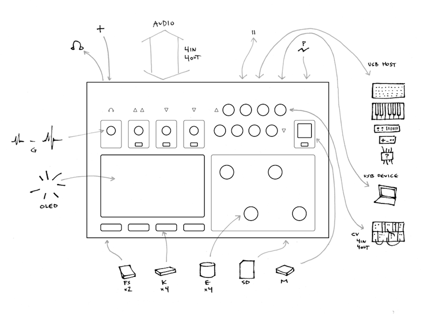
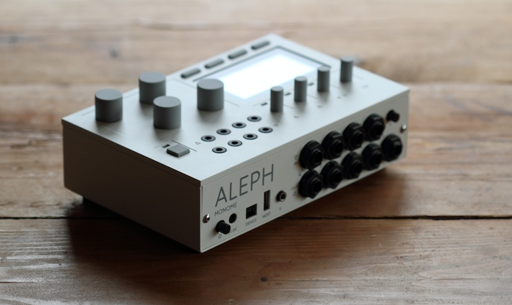
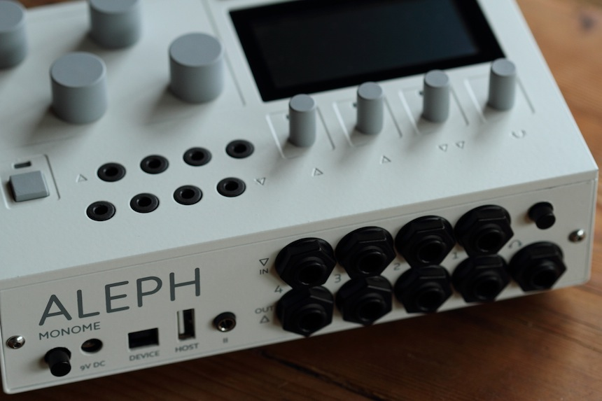
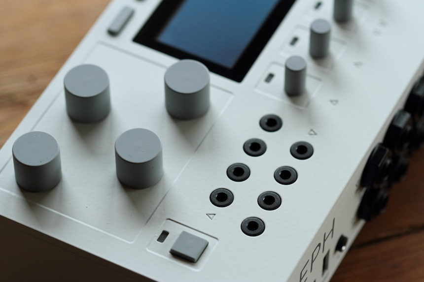

<iframe src="http://player.vimeo.com/video/75520925?title=0&amp;byline=0&amp;portrait=0" height="474" width="860" allowfullscreen="" frameborder="0"></iframe>

# aleph
{: .no_toc }

Designed and engineered by [Ezra Buchla](http://catfact.net) and [Brian Crabtree](https://nnnnnnnn.co).  
Made by monome in upstate New York.

### soundcomputer.
{: .no_toc }
Powerful audio processor, synthesizer, noise machine, rapidly modifiable instrument. A platform for experimental practice and organic discovery.

### attachments.
{: .no_toc }
Connect grid controllers, modular synths, MIDI keys, stomp boxes, gamepads, hand-made circuits. For more direct control and uncommon pairings.

### topography.
{: .no_toc }
Dynamically arrange control mappings with unprecedented flexibility. Create software control sources such as modulators, logical operators, aleatoric processes, sequencers. All quickly storable and recallable.

### open source.
{: .no_toc }
Designed for community engagement, a benefit for musicians and developers alike. An exceptional educational tool. The library of uses and possibilities can only grow.

  

    sections
  

  {: .text-delta }
- TOC
{:toc}

## specifications

|         |                                                                              |        |                                                       |              |                                                                                                                         |
| -------:| ---------------------------------------------------------------------------- | ------:| ----------------------------------------------------- | ------------:| ----------------------------------------------------------------------------------------------------------------------- |
| `audio` | 4 input, 4 output. 48k 24bit.                                            | `OLED` | bright, fast, grayscale, beautifully low-res display. | `USB host`   | monome,  midi,  gamepad,  arduino.                                                                          |
|         | headphone driver.                                                            | `K`    | key switches. assignable.                             |              |                                                                                                                         |
| `+`     | line/instrument gain switch for input 1/2.                               | `E`    | encoders, optical, very high resolution. assignable.  | `USB device` | talk to computers.                                                                                                      |
| `G`     | analog gain stages with LED monitoring and clip indicator on inputs. | `M`    | mode switch and LED.                                  | `CV`         | 4 input, 4 output. 3.5mm jacks, high resolution converters. 0-10V, euro ready. fully programmable function. |
| `P`     | 9-12V DC.                                                                    | `FS`   | jacks, 1/4″ footswitch. assignable                    | `ii`         | high speed digital bus. 3.5mm stereo jack.                                                                          |
|         |                                                                              | `SD`   | memory card.                                          |              |                                                                                                                         |

## use

***what does this thing do?***

Aleph is an adaptable soundcomputer where synthesis, drum machines, samplers, loopers, and various other possibilities can be implemented with creative mapping and numerous external control methods– attach via USB (grid controllers, knob boxes, MIDI keyboards, gamepads), CV (control voltage for modular synths, foot switches, etc) and computers.

Simply put, aleph is a small audio input/output device with a screen, bank of buttons, and series of encoders/knobs. It has the ability to host and run a variety of programs created by both monome and the user based community surrounding. New applications will be developed, documented and shared over time. Elaborate mappings can be created without writing code by way of an easy menu driven environment and a thorough preset system.

***what do the knobs/keypads/footswitches do?***

They have no strictly defined purpose. Custom mapping is determined by the individual application being used.
 
***will documentation be available?***

Yes! All documentation will be hosted on our website as new software and capabilities rapidly evolve. Community contribution is always welcome and encouraged. We will be posting tutorials, application guides and recipes for outlandish configurations and maybe cake too.

***what programs will be ready when the aleph ships?***

There will be several applications preloaded on the SD card that ships with aleph. Expect a complex layered looper, a peculiar monosynth, and a sharp-enveloped drum synth to start, and our highly-flexible patchable control environment called Bees.

***what is Bees?***

Bees is a modular control environment that can host various audio programs– parameters can be mapped and hardware control (knobs, foot-switches, external USB controllers, etc) and software control (algorithmic sequencers, noise generators, complex LFOs, etc) can be combined to create countless sound instruments and noise machines. A thorough scene and preset system allows for a dynamic and performative system.

Bees is an open source application specifically designed to be modified and extended. Users can rely on basic tutorials and programmers can build upon it’s existing framework.

***do i need to be a programmer to use it?***

No. Even without programming the device is highly modifiable. We aim to design applications which are intuitive and accessible, even if they are somewhat unusual.

***how do i connect to a computer?***

Aleph will speak to computers using the OSC protocol through a router application like serialosc.

Everything in Bees will be controllable with OSC via the USB connection to a computer. A browser-based editor will facilitate the patching process in a more visual manner. Additionally it will be possible to map Bees parameters to functions in your chosen software environment with MIDI or OSC.

***where are the MIDI jacks?***

USB MIDI is supported. For old MIDI gear, single-cable usb-to-midi converters are cheaply available these days.

***what is CV?***

Control voltage is an analog method for changing parameters, such as pitch, for various synthesizers. On the top panel are 3.5mm jacks, 4 input and 4 output which use 0-10V. These are compatible with the widely popular eurorack format.

The provided jacks can also be used to attach analog controls such as potentiometers or expression pedals. For other modular formats banana and 1/4″ adaptor cables are widely available or easily assembled.

***what is the jack marked `ii`?***

ii is a digital communication protocol. We plan on co-designing with anyone interested. It is a 3.5mm stereo jack (for easy cabling) that uses the i2c bus. The bus is addressable (multiple devices on a chain), fast (400k), and easy to implement on various platforms (ie, an Arduino).

In the immediate future we will use ii for inter-aleph communication while continuing to develop a simple kit and framework for creating hardware extensions.

***are the encoders amazing?***

Yes. They are very high resolution and optical, hence noiseless and capable of detecting very tiny movements.

***can i plug in a guitar or contact mic into aleph?***

Yes. A gain switch and analog input gain stage allow the aleph to be easily inserted in various audio paths– for example a stomp box chain. Given the 4 inputs and 4 outputs, various feedback paths and mixing schemes can be achieved readily.

***can i load samples into it?***

Yes. The SD card stores applications and presets but also completely arbitrary data. Some applications will handle sample imports. A few minutes of samples can be loaded in RAM so applications might typically deal with drumkits and short phrases.

## development

***more detailed specs?***

aleph contains separate DSP and control processors:

DSP:
 · 32bit BF533 Blackfin running at 533mhz
 · 64MB SDRAM
control:
 · 32bit AVR32 running at 66mhz
 · 1MB SRAM
audio codec:
 · 4 channels in, 4 channels out
 · up to 192k 24 bit

***i’m aspiring to learn programming for aleph.***

We’ll be thoroughly documenting the journey of learning to program the aleph by someone (our good friend Trent!) with no prior C programming experience.

We’ve already implemented a slew of filters, oscillators, envelopes, buffer manipulation tools, unit conversion tools, and much more. These can be used as is, connected together and controlled in various ways – so there is a strong foundation to rely upon when developing new work.

***what is involved in creating new programs for the aleph?***

New Bees modules and DSP extensions can be created. Both systems are programmed in C.

We use the standard gnu toolchain, which should be easily integrated into your chosen development environment. We’re developing in Linux exclusively, and will have a disk image available so that no toolchain setup is required. This image will be able to run under an emulator on Mac or Windows as well.

We’re in the process of creating development documentation for easy entry into developing your own modules.

***how customizable is the OLED display?***

Bees has a menu system as a well as a ‘play mode’ where graphic display is more customizable, including pixel-level drawing, graphics primitives and arbitrary text. Complete drawing capability is available to developers. 

***do i need a hardware programmer?***

No. The control processor ships with a versatile bootloader which can load new control programs from the card.

***how can i participate?***

We’ll be hosting the code on GitHub and implementing a system for integrating additions. New DSP programs, control programs, and additional Bees modules will be available through frequent updates.

We aim to foster a community which can build on these foundations, where developers can get ample support and feedback from users with testing and documentation.

## and

***how many are you making?***

Our initial batch is 100 units. If demand merits we will follow with another production cycle.

***how does shipping work?***

We ship via UPS with tracking and insurance. Rates are calculated by the shipper. Delivery times vary but are often only a few days.

We ship internationally. Note that international buyers must pay VAT and duty upon package arrival. This is often up to 20%.

***will i be able to see the aleph in person?***

We plan on touring with aleph in both performative and academic contexts.

***what is included?***

The unit itself, the power supply, and a pre-loaded SD card.

***what is the power supply?***

- 9V 2A (18W)
- 2.1mm center positiv

***will it work with power outside the US?***

Yes. Simply use a different IEC cable.

***what devices are compatible with the aleph?***

Currently we’re focused on supporting monome devices, MIDI over usb, and HID. We’ll also be working on support for the soundplane and the shnth.

***details about the physical construction?***

- very sturdy: laser cut and CNC welded sheet steel, CNC milled 6061 aluminum with a custom mixed matte off-white powder coating
- custom tooled hard silicone key caps and knobs
- lead-free circuitry
- 2 lbs. 4 oz.
- 7″ x 4.5″ x 1.7″
 
***where do the different parts come from?***

We use manufacturers in upstate new york and central pennsylvania.

All units are hand-assembled, programmed, and tested here in our workshop in upstate New York then shipped directly to you.

***why not just use a laptop?***

We wanted a device that could provide a focused and customized dynamic control system for a complex live audio set-up; a way to integrate and manipulate devices quickly and dynamically without the hazards of an overburdened laptop running many software applications often at the mercy of a greedy operating system.

The aleph powers up almost instantly and is ready to play. Switching configurations is easy. Designing new configurations can go immensely deep, or stay simple. Presets allow for multiple and quick exchanges. The aleph plays the role of both processor and instrument.

All of this said, the aleph is absolutely not a laptop replacement. It’s not fit to run full Ableton-style dj sets (the screen/interface is less than ideal for this), run tons of simultaneous plugins (laptops remain more powerful in terms of computation), or serve as a super-multi-tasker (it will be good at doing only a few things at once, whereas it’s no trouble for a laptop to also record to disk, run visuals, and check e-mail during a live set.) we’ll continue posting videos and clarifying best intended uses.

  
