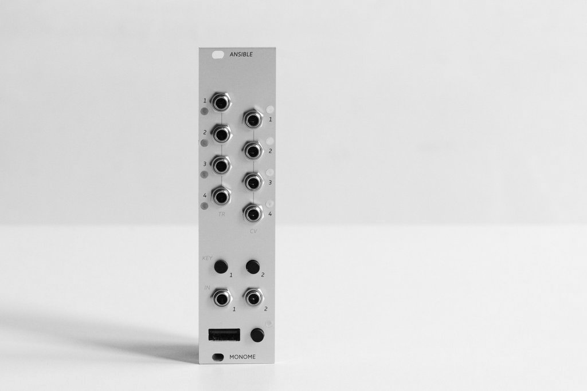
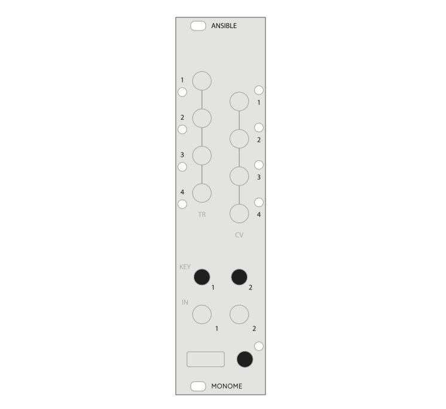

<iframe src="https://player.vimeo.com/video/182119406?color=ff7700&title=0&byline=0&portrait=0" style="position:absolute;top:0;left:0;width:100%;height:100%;" frameborder="0" allow="autoplay; fullscreen" allowfullscreen></iframe>

# Ansible

*Far communicator, speaks openly.*

Connects to Grids, Arcs, and MIDI devices, integrating external controllers into the modular environment. Also extends Teletype. Many modes are available, activated by connecting different USB devices and a preset key:

* [Kria](/docs/ansible/kria) (Grid) live step sequencer, polyphasic parameters, emergent patterns.
* [Meadowphysics](/docs/ansible/meadowphysics) (Grid) rhizomatic cascading counter.
* [Earthsea](/docs/ansible/earthsea) (Grid) polyphonic pattern instrument.
* [Levels](/docs/ansible/levels) (Arc) rotational pattern instrument.
* [Cycles](/docs/ansible/cycles) (Arc) physically manipulated waves.
* [(Teletype)](/docs/ansible/teletype) further ecosystem output and input, and remote control of other apps.
* [(MIDI)](/docs/ansible/midi) device voice allocation and various arpeggiation.

**Grid, Arc, MIDI device, or Teletype required.**

* Eurorack
* 6hp width
* 39mm depth

## Installation

Align the 10-pin ribbon cable so the red stripe corresponds to the white indicator on the rear of the module's circuit board. This is toward the lower edge of the module.

Be careful not to misalign the connector left-to-right either - while Ansible is protected against incorrect connection, doing so may damage other modules in your Eurorack case.

If you wish Ansible to communicate with Teletype you will need to attach the [ii](/docs/modular/ii) ribbon cable behind the panel. Be sure to align the red stripe on the cable with the white line on the board.

Secure the module with the two included screws.

*Power consumption:*

These are maximums. Power consumption varies greatly based on which USB controller is attached and how many LEDs are being lit. You can drastically lower your +12V consumption by using a [Switch](/docs/switch/) (discontinued), [Offworld](https://github.com/monome/offworld-1) (DIY), or some commercial adapter cables (see [here](https://llllllll.co/t/usb-power-ground-management/20386)) with your USB controller.

- 200mA @ +12V
- 19ma @ -12V
- No +5v required

## Panel details

- 4 Trigger outputs (TR 1-4, voltage range, slew rate, sample rate, bit rate?)
- 4 continuous CV outputs (CV 1-4, voltage range, slew rate, sample rate, bit rate)
- 2 KEY buttons
- 2 CV inputs (IN 1-2, voltage range, sample rate, bit rate)
- 1 USB-A port
- 1 MODE button

## Firmware Updates

Ansible ships with a strange USB A-A cable. This is used for firmware updates. We expect to be adding features from time to time, and the Ansible is a good candidate for community hacking. It's suggested to update your firmware to ensure you're running the newest version-- so the following documentation will be applicable rather than confusing.

Firmware update information [instructions are available](/docs/modular/update/). Be warned that updating your firmware will erase all presets from the module's internal storage! To preserve your work, you can back up Ansible's presets to a USB disk and restore this file after reflashing the module's firmware.

## Firmware Version

This documentation documents firmware version **3.0.0**. Changelogs and binaries for previous releases can be found [here](https://github.com/monome/ansible/releases). For versions 2.0.0 and up, you can determine the firmware version of your module by performing a USB disk backup. The created `ansible-preset.json` file will list the `"version":` at the beginning of the file.

## Basics

Output and input functionality vary according to which application is running.

Applications are determined by which USB device is plugged in. For example, when you plug in a Grid after a firmware update, it will be running Kria. Hold the MODE key (next to the USB port) to switch to Meadowphysics; push it again to switch to Earthsea. Ansible will remember which application you were last running between power-ups. NOTE: USB hubs do not work with Ansible.

Unplugging the Grid and plugging an Arc will change to Levels.

With nothing plugged in the Ansible works as a Teletype input/output extender.

Modes are indicated with a white or orange LED near the mode key. Earthsea is indicated with both LEDs on, giving a "whitish-orange" colour.

For more usage details, see the individual app pages linked above, or read about [advanced settings](/docs/ansible/advanced).

## Contributions

Diagrams by [Piotr Szyhalski / Laborcamp](http://laborcamp.org)

MIDI design and code by [Greg Wuller / @ngwese](https://github.com/ngwese)

Additional code by [@csboling](https://github.com/csboling) and [@scanner-darkly](https://github.com/scanner-darkly)
