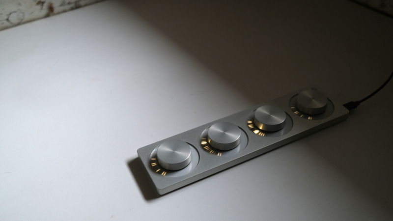
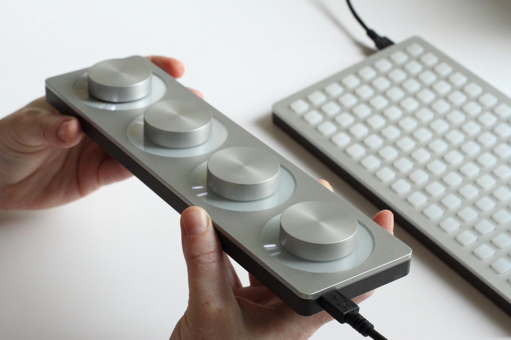

arc is a tactile instrument with dynamic visual feedback. Applications determine the interaction between movement, sound, and light. Some applications are shared here and we've built [studies](#studies) to help you create your own.

arc is a USB device. It sends serial data when knobs are turned, and changes lights according to incoming serial data.

## specifications

- high resolution knobs, 1024 ticks per revolution.
- each knob is encircled by a sixty-four segment light ring, sixteen-step brightness per LED.
- 2025 edition has a single pushbutton (see [editions](editions) for more details).

## mode switching

New edition arcs have support for [iii](https://monome.org/docs/iii), turning the device into a MIDI and serial device which can host its own scripts.

Most use cases (computers with serialosc, norns, ansible) require the arc to be in serialosc mode. Switch modes by holding down the key while powering up.

## with computers

[First install serialosc](/docs/serialosc/setup). serialosc runs in the background and converts USB serial communication into Open Sound Control (OSC). Applications query serialosc to connect to a grid or arc.

### applications

[VCV Rack](/docs/grid/computer/vcv-rack) is a virtual modular synth. The Ansible module communicates with arc.

[Max](http://cycling74.com/products/max) is a patching environment created by Cycling '74. A free runtime is available. Max for Live is a part of Ableton Live Suite. The following work with Max or Max for Live:

* [Max package](/docs/grid/app/package) -- several patchers and tools for use within Max
* [returns](https://github.com/monome-community/returns) -- simple yet versatile cc output with LFOs and sensitivity control
* [capstarc](https://github.com/mhetrick/capstarc) -- tactile sample scrubbing for arc
* [cascades](https://l.llllllll.co/cascades/) -- 65,536 combinations of 16th note patterns across seven tracks
* [pear](https://llllllll.co/t/32699) -- dual manual tape player
* [arc4live](https://github.com/robbielyman/arc4live/tree/main) -- simplified arc-as-four-knobs Max for Live patch featuring trimmers on modulation range
* more patches can be found at the library of [llllllll.co](https://llllllll.co/tag/max), the [monome-community github](https://github.com/orgs/monome-community/) and the [collected repository](https://github.com/monome-community/collected)
 
### studies

- [norns](/docs/norns/study-4b) -- monome's sound computer
- [SuperCollider](/docs/arc/studies/sc) -- synthesis engine and programming environment

monome libraries for other environments:

* [libmonome](https://github.com/monome/libmonome) -- C
* [monome Max package](https://github.com/monome/monome-max-package) -- Max
* [monomehost](https://github.com/monome/MonomeHost) -- Arduino Due
* [monome-processing](https://github.com/monome/monome-processing) -- Processing
* [monomeSC](https://github.com/monome/monomeSC/) -- SuperCollider
* [pymonome](https://github.com/artfwo/pymonome) -- Python

Note: the [grid studies](https://monome.org/docs/grid/grid-computer/#studies) broadly apply to arc but the OSC patterns differ.

## iii

[iii](/docs/iii) allows scripts to be stored on the device itself and interfacing uses USB-MIDI.

- [cycles](/docs/iii/library/cycles) -- rotating MIDI CC with friction
- [erosion](/docs/iii/library/erosion) -- four by four meta CC with interpolation and scene recall
- [snows](/docs/iii/library/snows) -- very slow asynchronous arpeggiator

## with norns

<iframe src="https://player.vimeo.com/video/312196152?color=ffffff&title=0&byline=0&portrait=0" width="860" height="484" frameborder="0" webkitallowfullscreen mozallowfullscreen allowfullscreen></iframe>

[angl](https://llllllll.co/t/ash-a-small-collection/21349) is the script used in this video. It is part of the `ash` collection from monome, which can be installed via [maiden](/docs/norns/maiden).

Selection of community contributed scripts that support arc:

- [4 Big Knobs](https://llllllll.co/t/4-big-knobs/42190): send control voltages out of [crow](/docs/crow)
- [arcify](https://llllllll.co/t/arcify/22133): map arc to norns parameters
- [easygrain](https://llllllll.co/t/easygrain/21047): granulator with arc support
- [larc](https://llllllll.co/t/larc/39790): three play-heads, one rec-head

## with modular

<iframe src="https://player.vimeo.com/video/182119406?color=ffffff&title=0&byline=0&portrait=0" width="860" height="484" frameborder="0" webkitallowfullscreen mozallowfullscreen allowfullscreen></iframe>

[Ansible](/docs/ansible) (discontinued) connects an arc to the eurorack ecosystem. Note: be sure to get the latest firmware for complete arc support.

See [VCV Rack](/docs/grid/computer/vcv-rack) to use a virtual version on your computer, which can then be interfaced to your modular synth in various ways.

## further information

- [editions](editions) - information about different device generations
- [disassembly](disassembly) - guides for disassembling the hardware
- [2025 edition knob tuning howto](/docs/arc/tuning) - reset friction per knob
- [2015-2019 edition knob reconditioning howto](https://vimeo.com/449444177)
