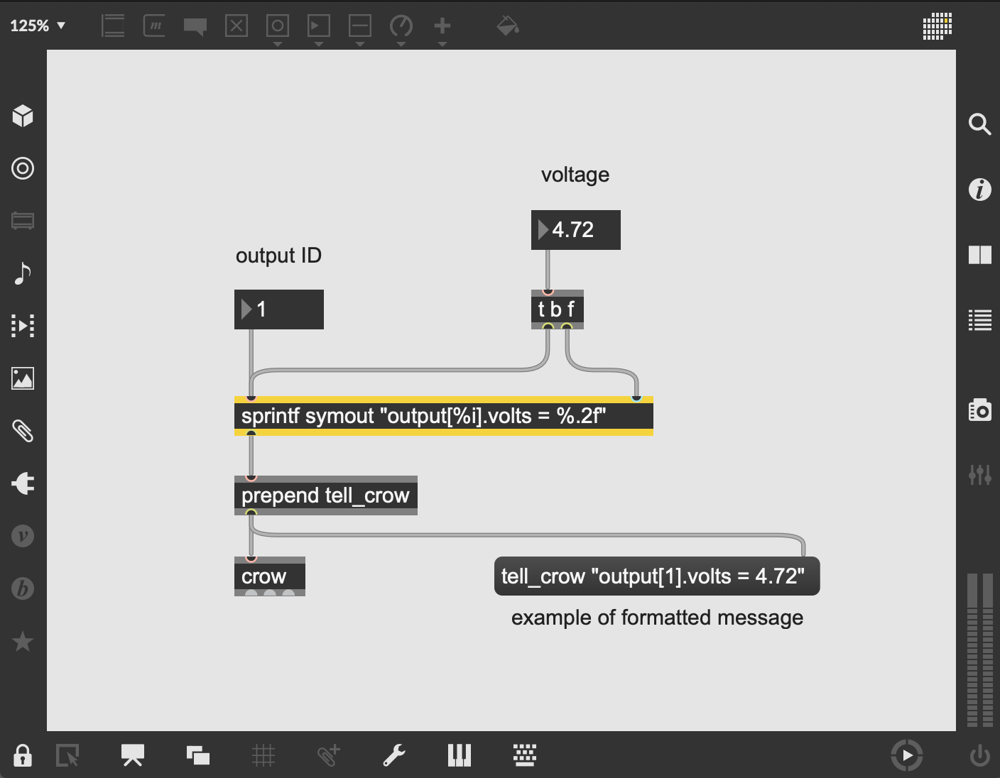

# crow questions


- [dictionary](#dictionary)
- [scripting](#scripting)
- [hardware](#hardware)
- [i2c](#i2c-head)

## a short story from Sam

Every day when a crow wakes up, it likes to follow the same daily routine, which may involve flying along complex paths, communicating with other creatures, solving problems, responding to external environmental stimuli, and more.

*When crow turns on, it runs a script saved in its flash memory. That script may involve generating control voltage, responding to control voltage/Lua code, acting as a CV expander for Norns, controlling other devices over the I2C bus, and more.*

Typically, the crow follows its innate biological daily routine.

*Typically, crow runs the default script, First.lua, aka First.*

However, your crow is quite smart, and it can learn a new daily routine to follow whenever you want.

*You can upload a User Script onto crow via druid, Max, or even a Max4Live device in Ableton. Norns scripts will also redefine how crow behaves.*

Your crow can return to its innate biological daily routine at anytime by telling it to forget the special routine which you delivered to it.

*crow can be restored to run the default script with the First command.*

Some crows may desire to wake with a clear mind and no responsibilities.

*crow can be set to turn on without any running script with the Clear Script command.*

Your crow is also highly adaptable and can communicate with you via telephone wires in real-time over the course of a day. This allows it to temporarily deviate from its daily routine. You can request reports about how it feels and what it sees, explore a new path which you radio in to it, change how it responds to environmental stimuli, communicate with other creatures for you, and more! The next day however, it will return to its daily routine, whether that is its biological routine or one which you previously gave it.

*You can send your crow new code to execute on the fly (pun intended) in real-time. This is done by sending Lua code to it over a USB cable. The code may be composed and sent via druid, Max, Max for Live devices in Ableton, or Norns. That code might redefine how it responds to and generates voltage, it might directly change the state of its inputs or outputs, it might return information to you about its internal state or externally received voltages, it might relay messages to other devices over I2C and more! When you restart crow, it will return to the behavior defined by the script in flash memory, whether that is First.lua or a User Script.*

## dictionary of crow terms<a name="dictionary"></a>

### i2c

i2c is a communication bus - it’s a way for devices to talk to each other, similar to MIDI or USB. In the monome ecosystem, an i2c protocol called "ii" provides a convenient way to send commands & data between modules. In some situations reducing what could be many patch-cable connections down to a single i2c cable hidden behind the module. For example, crow can send unique synthesis commands to Just Friends, accessible only with the ii protocol.

### druid

[druid](https://github.com/monome/druid) is a utility for communicating with crow, both for realtime interaction and the uploading of full scripts. It requires Python3+ to be installed on your computer.

### Lua

Lua is a programming language known for its flexibility to be embedded in applications. [norns](https://monome.org/norns/) uses Lua to allow the creation of scripts to express musical + artistic ideas. crow also speaks Lua, so it extends the norns ecosystem. Using druid, you could upload a Lua script to crow -- in turn, crow would save this and perform the script without a computer attached.

### asl (think a/s/l)

A Slope Language -- the unique syntax developed for crow to describe voltage control events over time. For example, a sawtooth ramp could be described as starting at 5.0 V and falling to 0.0 V over a period of a second, then looping:

```lua
output[1].action =
    loop{ to( 5.0, 0.0 )
        , to( 0.0, 1.0 )
        }
```

[Learn more here](https://github.com/monome/crow#output-library--asl).

### "event-based"

crow is a blank slate, so it requires instructions to know what you’d like it to do at any given moment. Let's say you want to send voltage from crow's first output to a filter's cutoff frequency. You can automate this instruction by telling crow “please emit 3.33 volts from your first output.” crow is designed to listen to a specific scripting syntax.

Messages to crow must fit a format that crow expects, e.g.:

```lua
output[1].volts = 3.33
```

Or on norns: `crow.output[1].volts = 3.33`

This command tells crow “please emit 3.33 volts from your first output”. There are currently a few things that know how to talk to crow (norns, druid, and the Max/M4L toolkit), but this list will hopefully grow.

[Documentation of this syntax](../reference).

Using one of these tools, you could:

- live-code through druid, typing instructions to crow in real time
- create a Max patch that sends instructions to crow on demand / as a sequence of events (a version of live-coding without the command line)
- write a norns app that tells crow to wait for triggers at its inputs to create different types of envelopes
- you can upload a full script to crow so that it knows what it’s meant to do when it's not connected to a computer or norns, and it would just await external triggers or control voltage at its inputs

## scripting<a name="scripting"></a>

### norns

#### finding community scripts

Search `tags:crow+norns` at llllllll.co (or [click here](https://llllllll.co/search?expanded=true&q=tags%3Acrow%2Bnorns%20order%3Alatest)) to view the scripts on norns which are tagged as having crow integration.

#### writing norns + crow scripts

Visit [crow studies](../norns) to learn how to integrate crow within scripts on norns.

### druid

#### finding community scripts

Visit *stage one* of the [scripting tutorial](../scripting) to learn how to upload scripts; to find new scripts to upload, visit [bowery](https://github.com/monome/bowery), a collection of druid scripts which hosts community contributions.

#### writing crow scripts in druid

Visit *stage two* and *stage three* of the [scripting tutorial](../scripting) to learn how to use Lua to livecode and create standalone scripts for crow.  The [scripting reference](../reference) provides additional documentation of the scripting language.

#### how large a script can I run or store on crow in standalone?

Currently, 8kB = ~400 lines of Lua.

From Trent:
>I’ve found most scripts I’ve created so far are <100 lines. Lua may be less terse than Teletype, but it has far greater capacity for abstraction. The crow library leverages this to provide many complex features with terse syntax.

eg. 3 lines that create an ADSR envelope triggered by input 1 and sent to output 1:

```lua
output[1].action = adsr()
input[1].change = function(s) output[1](s) end
input[1].mode = 'change'
```

### Max

#### what are the formatting differences between druid + Max syntax?

In Max, you use the exact same commands as you would in druid -- the only difference is you need to wrap them in quotes to make sure they are a single chunk, and prepend that chunk with `tell_crow`.

In druid:
`output[1].volts = 3`

In Max:
`tell_crow “output[1].volts = 3”`

The quotes are crucial because they make sure the Lua command is treated a single chunk.

#### best practices

The `[sprintf]` object is the easiest way to format messages to crow. Using the `symout` argument, the `[sprintf]` object outputs a string as a single symbol -- ideal for sending to crow as a Lua chunk.

*Example: control the voltage of an assignable output*



- `[sprintf symout "output[%i].volts = %.2f"]` creates a string that accepts an integer (output ID) through its first inlet and a 2-decimal float (voltage) through its second inlet
- since `[sprintf]`'s second inlet is *cold*, we use `[t b f]` to send a bang to `[sprintf]`'s first inlet to force the output whenever the float (voltage) changes
- we send the string to `[prepend tell_crow]` to format the instruction
- and finally, we send that formatted message to `[crow]`!

## hardware<a name="hardware"></a>

### one of crow's inputs doesn't seem to respond to triggers

If you are running a script or device that uses crow's inputs (perhaps for clocking), but crow doesn't seem to be receiving the triggers, try executing the following commands in druid/maiden/max: `crow.reset()` and `crow.clear()` (or `^^r` and `^^c`).

### can I use [x thing] to control crow?

Since crow uses a specific communication syntax, it requires some sort of layer between the thing you want to use to control crow and crow itself. Right now, you can use any of these to have immediate fun with crow:

- norns
- druid
- Max
- Max for Live

For example, if you like to use a specific app on your laptop for live-coding, plugging crow into your laptop while running the app will not suddenly translate MIDI to CV. crow won't even show up as a "MIDI device." However, you *could* use the [crow] Max object's help file to package a translator between them. Or you could route the MIDI from your live-coding app into Ableton Live 9/10 Suite and use the Max for Live toolkit to perform this translation.


### can I control two or more crows at the same time from norns?

Not currently, though it is being actively explored.

### can crow make sound on its own?

Not currently. You *can* tell it to run very fast LFO's from its outlets, into audio rate, but this creates instability. For the best experience with crow, consider its outputs to be control-rate generators.

### what is crow's sample rate?

crow internally generates signals at 48kHz (though the user doesn’t have direct access to these samples). crow reads inputs at 1.5kHz.

### what are the differences between crow and Teletype?

| Aspect       | crow | Teletype |
| ---          | ---  | ---      |
| panel hardware     | 2 CV inputs (1.5 kHz sample rate), 4 CV outputs (48 kHz sample rate), mini USB | 8 trigger inputs, 4 trigger outputs, 1 CV input, 4 CV outputs, potentiometer, USB-A port, button, screen |
| events       | focused on sending and receiving bits of text from something else, and manipulating and reacting to things happening elsewhere in your setup – CV crossing some threshold, receiving an I2C message | focused on running small bits of code in reaction to triggers. These can be any of the 8 trigger inputs patched from elsewhere in your modular, or an internal “metro” (metronome) script that’s triggered at a fixed rate |
| scripting | runs Lua scripts, a general purpose programming language with a higher abstraction level (also used on Norns) | runs scripts written in a specialized, stack-based language (sometimes called “TT-script”) designed for Teletype |
| storage | has larger (8kb) user storage space for scripts | deliberately has a limited amount of code and data that can be in use at any given time |
| USB | is **not** a USB host - it does not supply USB power and is not programmed to talk to USB devices. Other devices (a computer, Norns, etc) have to initiate communication with it and supply USB power | is a USB host, so it can support USB devices and supply power to them. Currently the supported devices are a keyboard, a USB disk so you can make backups of your work, and a Grid (external power required) |
| UI | requires some other device, typically a computer, to send scripts or instructions to it. This can be really convenient, since you can use whatever editor / other tools you like on your computer, and paste chunks of code or whole scripts to crow as needed. [druid](https://github.com/monome/druid) can be used on any computer to interact with crow over the serial port. Norns, Max, and Max4Live can also send bits of code to crow. | has a screen and directly connects to a keyboard so you can write code right on the module with nothing else |
| CV output | very flexible at producing gates and CV. LFOs and envelopes can be arbitrarily specified using the [ASL](https://github.com/monome/crow#output-library--asl) mini-lanugage | can produce both gates and CV. CV can slew on its way to a new value, but can't loop on its own - a script has to initiate each change |

## i2c<a name="i2c-head"></a>

### what the heck are pull-ups + i2c and what do I need to know about them in order to use crow?

Pull-ups are resistors on [i2c-enabled](https://llllllll.co/t/a-users-guide-to-i2c/19219) (or, ii) devices (like crow, Teletype, Ansible, Just Friends, W/). They are required to ensure integrity of the data on the i2c bus. A "bus" requires only one device to have its pull-ups enabled in order for data and power to flow correctly. As of firmware v1.0.2, crow's pull-ups are on by default.

Since *crow v1.0.2* crow's pullups are enabled by default - that's what you want! If for some specific reason you need to turn them off, crow provides the function `ii.pullup(state)` where you can turn them on (`true`) or off (`false`).

### is crow's status as an [i2c leader or follower](https://github.com/monome/crow#leading-the-i2c-bus) automatic or configurable?

It’s automatic, but only because leading and following isn't a property of a single device -- it's a property of communication. crow is very flexible, designed to be agnostic to who/what it's speaking with.

Basically, crow is always listening to other devices (ie following), until it's told to execute a leader-command, at which point it attempts to lead the bus. Once that command / query is complete, it returns to follower mode.
