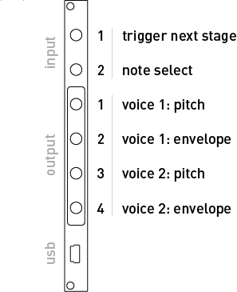

# First

*First* is the default script that runs on a new crow. It's a phasing rhythm & harmony sequencer. Each crow generates its own unique set of musical content to be scanned and played with voltage control.

It requires an oscillator, VCA, and some sort of control voltage generator (for clocks, LFOs, random voltage, etc) as company.

Start by patching crow's outputs into your synthesizer. Outputs 1+2 and 3+4 are pitch+volume pairs, each representing one voice of the sequence. Outputs 1+3 are volt-per-octave melodies, and outputs 2+4 are attack-release envelope outputs.

Example patch:
- Output 1+2 -> Mangrove v8 & air
- Output 3+4 -> VCO frequency & VCA level

Start the sequence by patching a clock or LFO into input 1. Each time the voltage rises above 1V *First* will take a step forward. As the patch comes alive, slow the clock down to hear long gentle swells, then ramp it up into snappy arpeggios.

To influence the melodic content, attach a control voltage to input 2. As voltages rise up from 0V, the melodies will spread out to take up more harmonic space. Positive voltages play a pentatonic scale, while below 0V two notes are added to enter the ionian mode, similarly widening the melody toward -5V.

For the code-curious, see the implementation [on GitHub](https://github.com/monome/crow/blob/main/lua/First.lua).

## Next steps

While *First* is a compelling instrument on its own, crow collects all manner of objects: other Eurorack synthesizer modules, computers, and norns.

We have trained crow to navigate the following landscapes:

- [norns](../norns)
- [computer terminal](../druid)
- [Max 8 + Max for Live](../max-m4l)

If you wish for crow to return to First, you can simply execute `^^First` or `^^F` in any of the aforementioned environments.
