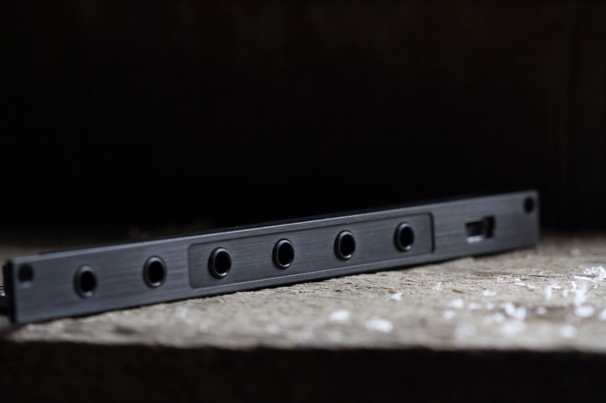

# crow

crow speaks and listens and remembers bits of text. A scriptable USB-CV-ii machine.

crow connects to norns and computers running Max, Max for Live, and other serial-enabled applications. We've created various norns scripts and Max for Live devices which require no programming, and we've also created tutorials and studies to get you started quickly programming your own ideas into this tiny, powerful module.

crow also stores a complete script, so that without a USB connection it can continue to run, responding to CV input and ii messages.

A collaboration by [Whimsical Raps](https://www.whimsicalraps.com) and monome.

## Specifications

- Eurorack, 2hp width, 41mm depth
- Power consumption: 60mA @ +12v, -15mA @ -12V, no 5V
- 2 input, 4 output, 16bit [-5V,10V] range
- Rear panel digital communication bus (ii)
- full Lua scripting environment

## Installation

Align the 10-pin ribbon cable so the red stripe corresponds to the white indicator on the rear of the module’s circuit board. This is toward the lower edge of the module.

If you would like to use the [ii](/docs/modular/ii) functionality, be sure to observe the orientation of the connector. The white stripe indicates GND.

## Environments

### norns

On October 1st 2019, we released a norns [update](../norns/#update) which allows crow to integrate seamlessly as a CV and [ii](/docs/modular/ii) interface. [Many scripts have already been updated to utilize crow](https://llllllll.co/search?expanded=true&q=tags%3Acrow%2Bnorns%20order%3Alatest).

Want to script on your own? See the full [crow studies](norns) for a complete guide

### computer + druid

You can use your terminal to access [druid](druid), a small utility for communicating with crow. druid helps you engage crow in realtime interaction and also upload full scripts (coded in Lua), providing an interactive platform for designing new patterns in a modular synth.

Want to see what others have scripted? Visit [bowery](https://github.com/monome/bowery), the druid script collection, and complete *stage one* of the [scripting tutorial](scripting) to learn how to upload scripts.

Learn to map your own flight paths with *stage two* and *stage three* of the [scripting tutorial](scripting).

### computer + Max 8 / Max for (Ableton) Live

[Max](https://cycling74.com) is a powerful visual coding language that has integrations with [Ableton Live](https://www.ableton.com/en/live/max-for-live/).

We have created Max for Live devices to integrate crow with Live, including: Live-synced clocks, MIDI-to-v/8, CC-to-Voltage, LFO's, executing Lua code directly in Live, parameter mapping your crow scripts, and triggering Lua chunks with MIDI.

Using the custom `[crow]` object in Max 8, create your own Live-controllable devices or standalone utilities.

Visit the [Max and Max for Live repo on GitHub](https://github.com/monome/crow-max)

### birdsong (scripting reference)

If you are writing or modifying norns apps, standalone scripts, or Max patches, you will want to become fluent in the language of the birds. Visit the [scripting reference](reference) to become a crow whisperer

## Updates

We are working all the time. Check out the [newest firmware version](https://github.com/monome/crow/releases/latest).

To update, visit the step by step [bootloader instructions](update).

## Help

Answers to frequently asked questions can be found in [crow questions](faq).

Community discussion happens at [llllllll.co](https://llllllll.co). Come say hello!

Contact *help@monome.org* with further questions.

## Calibration

There are also a subset of commands for managing the state of the device and contents of flash memory. crow ships pre-calibrated, but it is possible to re-run the automatic calibration.
See the [technical](technical) page for further details.

## Development

crow continues to evolve and you can follow development on github:

[https://github.com/monome/crow](https://github.com/monome/crow)

crow is open-source and is built on the efforts of other open source projects. Contributions are welcome.
