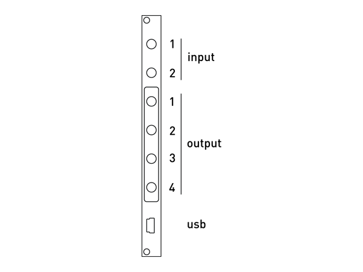
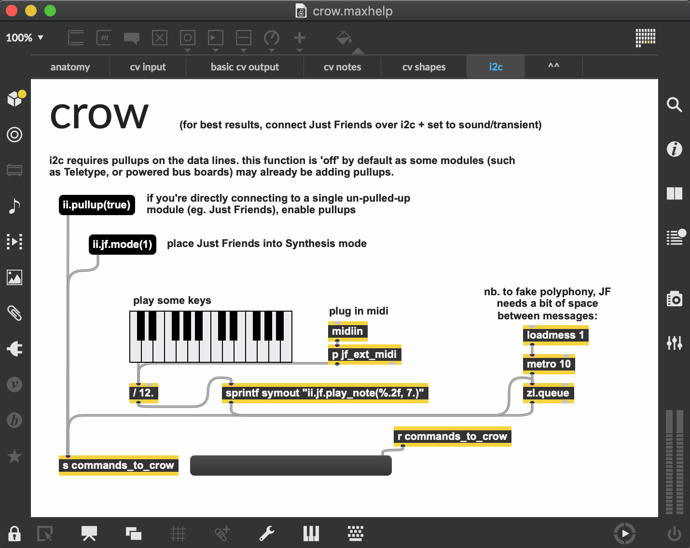
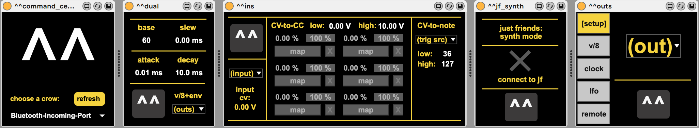

# Crow

Crow speaks and listens and remembers bits of text. A scriptable USB-CV-II machine.

Crow connects to norns and computers running Max, Max for Live, and other serial-enabled applications. We've created various norns scripts and Max for Live devices which require no programming, and we've also created tutorials and studies to get you started quickly programming your own ideas into this tiny, powerful module.

Crow communicates Lua via USB in clear text:

```
to crow >     print("caw!")
crow says >   caw!
```

Which allows the weaving of musical structure:

```
to crow >     x = math.random(12)
              print(x)
crow says >   3
to crow >     output[1].slew = 0.9
              output[1].volts = x

(CV output 1 ramps to 3 volts over 0.9 seconds)
```

Crow also stores a complete script, so that without a USB connection it can continue to run, responding to CV input and II messages.

A collaboration by Whimsical Raps and monome.


## Specifications

- Eurorack, 2hp width, 41mm depth
- Power consumption: 60mA @ +12v, -15mA @ -12V, no 5V
- 2 input, 4 output, 16bit [-5V,10V] range
- Rear II connector with software-switchable pullups
- full Lua scripting environment


## Installation

Align the 10-pin ribbon cable so the red stripe corresponds to the white indicator on the rear of the module’s circuit board. This is toward the lower edge of the module.

If you would like to use the II functionality, be sure to observe the orientation of the connector. The white stripe indicates GND.


## First



**@trentgill** (brief details of the default script)


## Norns

Crow integrates seamlessly with norns as a CV and II interface.

First, be sure to [update](https://monome.org/docs/norns/#update) your norns software and then get the newest version of [awake](https://llllllll.co/t/awake/21022) and [ash](https://llllllll.co/t/ash-a-small-collection/21349). These scripts have new crow integration, and watch the [Library](https://llllllll.co/c/library) for more.

Scripting for crow is simple:

```
crow.output[1].volts = 3.3      -- set output 1 to 3.3V

crow.ii.jf.mode(1)              -- via ii, enable JF mode 1
crow.ii.jf.play_note(1.0,5.0)   -- via ii, play JF note 1V at 5V amplitude
```

See the full [crow studies](norns) for a complete guide.


## Max + Max for Live

Please visit crow's [Max and Max for Live repo](https://github.com/monome/crow-max). Press 'Download' to save a `crow-max-and-m4l-master` zip file to your device, which when unzipped will reveal two folders: `crow_max` and `crow_m4l`.

### Max

Place `crow_max` into your User Library.

(Max > Options > File Preferences > (highlight) User Library > the rightmost icon in the bottom bar should illuminate. Clicking this icon will open the User Library folder, where you can drop the `crow_max` folder.)

If you are performing an update of an existing installation, you can simply allow the system to replace the existing files. If you somehow have previous crow files in your User Library (or anywhere along your Max search path), please delete them and start fresh.

Restart Max and you should be able to instantiate the `crow` object! Right-click it and select 'Open crow Help' to view a full tutorial:




### Max for Live

After unzipping the `crow_m4l` folder, place it wherever you'd prefer it living longterm on your hard drive. Open Ableton Live 9 or 10 and drag the folder into Live's browser, under PLACES.

If you are updating a previous installation, just replace the previous `crow_m4l` folder's contents with the new files.

For a complete walkthrough of the Max for Live devices, visit the [crow-max-and-m4l repo](https://github.com/monome/crow-max).




## Druid

("livecoding" and script uploading)

(how to install, example usage)

(image of editor+druid)


## Scripting

Short (standalone) lua example.

[scripting](scripting) - standalone examples (mirror "rising")

[reference](reference) - standalone functions and tables

- [programming in lua (first edition)](https://www.lua.org/pil/contents.html)
- [lua 5.3 reference manual](https://www.lua.org/manual/5.3/)
- [lua-users tutorials](http://lua-users.org/wiki/TutorialDirectory)
- [lua in 15 mins](http://tylerneylon.com/a/learn-lua/)


## Updates

You can check the version of the firmware on a crow several ways:

- Norns: open maiden and type `crow.version()` into the command prompt REPL.
- Druid: type `^^version`.
- Max/M4l: either open `^^bootloader.maxpat` from the `crow_max` folder **or** instantiate a `^^bootloader` object in a new patcher (lock and double click the object) and select `^^v`

Check this against the [newest firmware version](https://github.com/monome/crow/releases).

To update, see the step by step [bootloader instructions](update) to update the crow firmware.


## Technical

Crow ships pre-calibrated, but it is possible to re-run the automatic calibration. There are also a subset of commands for managing the state of the device and contents of flash memory.

See the [technical](technical) page for further details.


## Help

Community discussion happens at [llllllll.co](https://llllllll.co). Come say hello!

Contact *help@monome.org* with further questions.


## Development

Crow continues to evolve and you can follow development on github:

[https://github.com/monome/crow](https://github.com/monome/crow)

Crow is open-source and is built on the efforts of other open source projects. Contributions are welcome.
