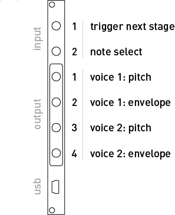

# crow

crow speaks and listens and remembers bits of text. A scriptable USB-CV-ii machine.

crow connects to norns and computers running Max, Max for Live, and other serial-enabled applications. We've created various norns scripts and Max for Live devices which require no programming, and we've also created tutorials and studies to get you started quickly programming your own ideas into this tiny, powerful module.

crow also stores a complete script, so that without a USB connection it can continue to run, responding to CV input and ii messages.

A collaboration by [Whimsical Raps](https://www.whimsicalraps.com) and monome.

## Specifications

- Eurorack, 2hp width, 41mm depth
- Power consumption: 60mA @ +12v, -15mA @ -12V, no 5V
- 2 input, 4 output, 16bit [-5V,10V] range
- Rear panel digital communication bus (ii)
- full Lua scripting environment

## Installation

Align the 10-pin ribbon cable so the red stripe corresponds to the white indicator on the rear of the module’s circuit board. This is toward the lower edge of the module.

If you would like to use the [ii](/docs/modular/ii) functionality, be sure to observe the orientation of the connector. The white stripe indicates GND.

## First

*First* is the default script that runs on a new crow. It's a phasing rhythm & harmony sequencer. Each crow generates its own unique set of musical content to be scanned and played with voltage control.

It requires an oscillator, VCA, and some sort of control voltage generator (for clocks, LFOs, random voltage, etc) as company.

Start by patching crow's outputs into your synthesizer. Outputs 1+2 and 3+4 are pitch+volume pairs, each representing one voice of the sequence. Outputs 1+3 are volt-per-octave melodies, and outputs 2+4 are attack-release envelope outputs.

Example patch:  
- Output 1+2 -> Mangrove v8 & air  
- Output 3+4 -> VCO frequency & VCA level

Start the sequence by patching a clock or LFO into input 1. Each time the voltage rises above 1V *First* will take a step forward. As the patch comes alive, slow the clock down to hear long gentle swells, then ramp it up into snappy arpeggios.

To influence the melodic content, attach a control voltage to input 2. As voltages rise up from 0V, the melodies will spread out to take up more harmonic space. Positive voltages play a pentatonic scale, while below 0V two notes are added to enter the ionian mode, similarly widening the melody toward -5V.

For the code-curious, see the implementation [on github](https://github.com/monome/crow/blob/master/lua/default.lua).

## Next steps

While *First* is a compelling instrument on its own, crow collects all manner of objects: other Eurorack synthesizer modules, computers, and norns.

We don't want to box in your creativity, but here are a few (second, third, fourth) ways to approach crow:

- If you have a **norns**, crow integrates seamlessly as a CV and [ii](/docs/modular/ii) interface. On October 1st 2019, we released an [update](https://monome.org/docs/norns/#update) that allows scripts to communicate with crow. See the full [crow studies](norns) for a complete guide.

- If you have a **computer**, you can use your terminal to access [Druid](https://github.com/monome/druid), a small utility for communicating with crow. Druid helps you engage crow in realtime interaction and also upload full scripts (coded in Lua), providing an interactive platform for designing new patterns in a modular synth.

- If you have a **computer** with **Max 8** or **Ableton Live 9 or 10 Suite (w/ Max for Live)**, we've built a toolkit that helps crow interact deeply with these programs. Please visit the [Max and Max for Live repo](https://github.com/monome/crow-max) to download the tools and learn more.

## Coming home to roost

Here are some possible configurations for crow to settle in happily among your other modular synth modules:

- link crow to Just Friends (Whimsical Raps) through an i2c cable (or powered bus) and use the `^^jf_synth` Max for Live device to play Just Friends as a 6-voice polysynth

- use the updated Awake script on norns to send CV and triggers to a VCO/VCA combo

- connect crow to your computer through USB and fire up Druid in a terminal to live code triggers, random voltages, or even full-fledged interactions which will save directly on the crow module -- then leave the house and play your script outside!

Though it is still in progress, please feel free to peruse our [scripting tutorial](https://monome.org/docs/crow/scripting/).

## Updates

We are working all the time. Check out the [newest firmware version](https://github.com/monome/crow/releases).

To update, see the step by step [bootloader instructions](update) to update the crow firmware.

## Technical

crow ships pre-calibrated, but it is possible to re-run the automatic calibration. There are also a subset of commands for managing the state of the device and contents of flash memory.

See the [technical](technical) page for further details.

## Help

Community discussion happens at [llllllll.co](https://llllllll.co). Come say hello!

Contact *help@monome.org* with further questions.

## Development

crow continues to evolve and you can follow development on github:

[https://github.com/monome/crow](https://github.com/monome/crow)

crow is open-source and is built on the efforts of other open source projects. Contributions are welcome.