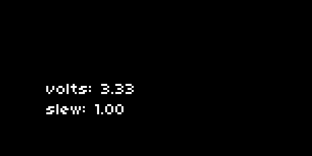

(image: norns + eurorack)

# Rising: Crow Studies

Crow serves as a CV and ii interface for norns.

It may be helpful to first explore the [norns studies](https://monome.org/docs/norns/study-1/) to provide context for how to integrate crow's new functionality.

Download: [github.com/monome/crow-studies](https://github.com/monome/crow-studies)

(Note: be sure your norns is [updated](https://monome.org/docs/norns/#update) to version 190920 or later.)

Crow will automatically be detected and interfaced upon connection to norns. Presently only a single crow is supported.

## 1. Output



Run `1-output.lua`. Connect crow output 1 to an oscillator pitch or similar.

This sets up a knob and screen interface for two very simple commands:

```
crow.output[1].volts = 3.33
crow.output[1].slew = 0.1
```

This sets output 1 to 3.33v, slewing over 0.1 seconds.

Crow's voltage range is -5.0 to 10.0 for outputs 1 to 4.

## 2. Input


Run `2-input.lua`.

- Connect an LFO output to crow input 1. K1 will capture the current value. K2 will toggle `stream` mode on and off.
- Connect the same cable to input 2 which is set up to trigger a `change` function on each transition.

Inputs have several modes:

- `stream`: the input is reported at a fixed interval.
- `change`: configurable low/high transitions are reported.
- `none`: inputs are read only with a manual query.

### Stream

First we set the function for incoming data, and then set the mode:

```
function process_stream(v)
  print("input stream: "..v)
end

crow.input[1].stream = process_stream
crow.input[1].mode("stream", 0.25)
```

`process_stream` will be called every 0.25 seconds, printing the value of crow input 1.

### Change

Again we create a function to handle the input change, and set the mode:

```
function process_change(v)
  print("input change: "..v)
end

crow.input[1].change = process_change
crow.input[1].mode("change", 2.0, 0.25, "both")
```

`process_change` will be called whenever input 1 crosses 2.0 volts with a hysteresis of 0.25.

If the input is rising, the value reported will be 1. If falling, it will be 0.

The last parameter when setting the mode can have three values: `"rising"`, `"falling"`, or "`both"`.

### None

We can still manually query the input with mode set to `"none"`.

```
function process_stream(v)
  print("input stream: "..v)
end

crow.input[1].stream = process_stream
crow.input[1].mode("none")

crow.input[1].query()
```

`process_stream` will be called each time `crow.input[1].query()` is called, returning the value of crow input 1.


## 3. ii


Run `3-ii.lua`.

Attach a Just Friends via ii. Be sure to align the GND pins. K2 will play an ascending note, K3 plays a random note.

The ii bus requires pullup resistance, which can be toggled by crow:

```
crow.ii.pullup(true)
```

If your ii bus is already pulled up (by Teletype or a powered bus board, for example) disable this:

```
crow.ii.pullup(true)
```

To change JF's mode and play a note:

```
crow.ii.jf.mode(1)
crow.ii.jf.play_note(3)
```

Crow can also query values from the ii bus. If you have an Ansible connected running Kria, you can query the current preset like this:

```
crow.ii.kria.event = function(i,v)
  print("kria event:",i,v)
end

crow.ii.kria.get("preset")
```

See the [reference](#reference) section for a full table of supported ii devices and commands.


## 4. shapes


Run `4-shapes.lua`. Crow output 1 is an LFO, output 2 is an envelope. K2 will randomize the LFO speed. K3 will trigger the envelope. Voltage output is displayed as meters on the left.

Crow can generate and loop multipoint envelopes:

```
-- start at 0, rise to 5V over 0.1 seconds, fall to 1V over 2 seconds
output[1].action = "{ to(0,0}, to{5,0.1}, to{1,2} }"
```

To start (and restart) this action:

```
output[1].execute()
```

Shapes can be repeated:

```
output[1].action = "times( 4, { to(0,0), to(5,0.1), to(1,2) } )"
```

And also looped:

```
output[1].action = "loop( { to(0,0), to(5,0.1), to(1,2) } )"
```

Actions can be interrupted at any time by setting a fixed voltage, for example:

```
output[1].volts = 0
```

There are a few predefined shapes, such as LFO:

```
-- LFO rate of 1, amplitude of 5V
output[1].action = "lfo(1,5)"
```

### Query

It is possible to read the current value of an output using a query:

```
function out(v)
  print("crow output: "..v)
end

crow.output[1].receive = out

crow.output[1].query()
```

Each time `query` is called, crow will send a value to the function `receive`. The script uses this technique to create a realtime scope of the outputs on the norns screen.


## Reference

### Output

```
output[x].volts = y         -- set output x (1 to 4) to y (-5.0 to 10.0) volts
output[x].slew = y          -- set output x slew time to y

output[x].action =
  "{ to(volt,time), ... , to(volt,time) }"    -- series of segments
  "times( x, { ... } )"           -- repeat segments x times
  "loop( { ... } )"               -- loop segments indefinitely
  "lfo(rate,amplitude)"
  "pulse(time,level,polarity)"
  "ar(attack,release)"

output[x].query()           -- query current output x value
output[x].receive           -- function called by query x
```

### Input

