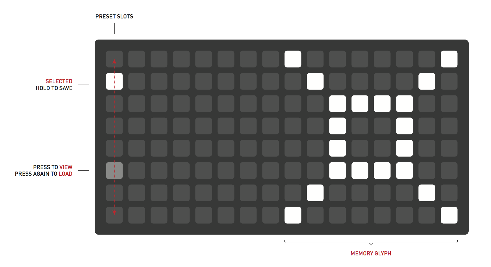
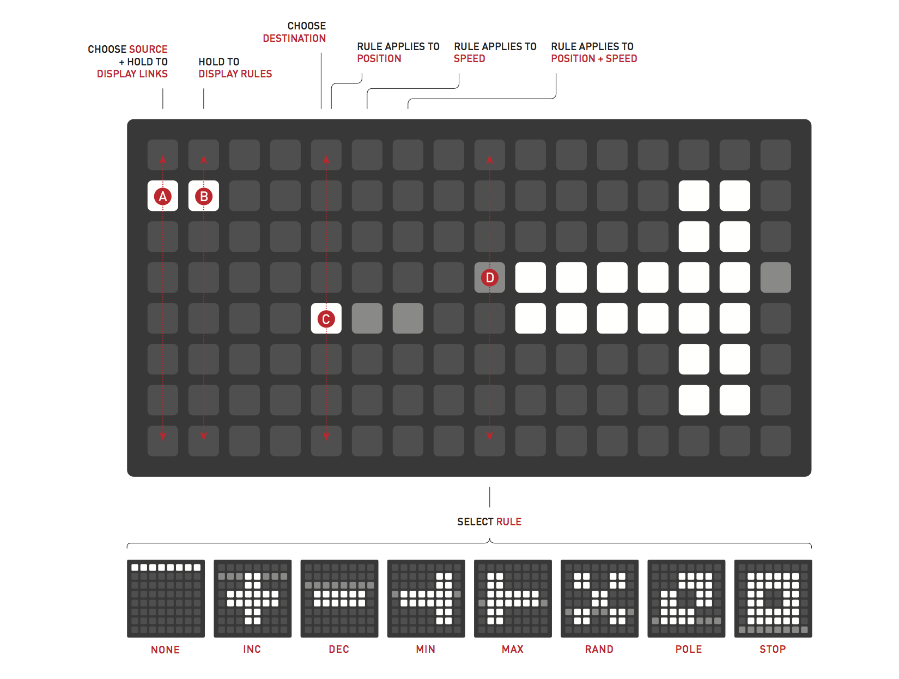
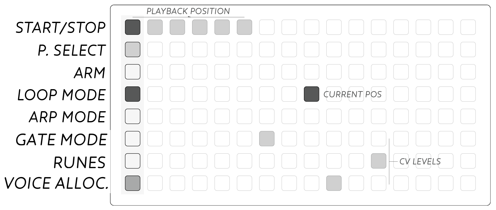
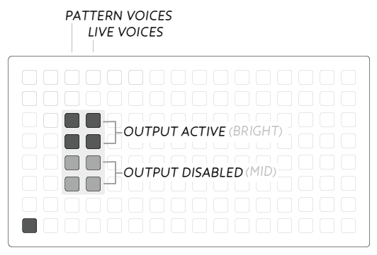

<div class="vid"><iframe src="https://player.vimeo.com/video/182119406?color=ff7700&title=0&byline=0&portrait=0" width="860" height="483" frameborder="0" webkitallowfullscreen mozallowfullscreen allowfullscreen></iframe></div>


# Ansible

*Far communicator, speaks openly.*

Connects to Grids, Arcs, and MIDI devices, integrating external controllers into the modular environment. Also extends Teletype. Many modes are available, activated by connecting different USB devices and a preset key:

* Kria (Grid) live step sequencer, polyphasic parameters, emergent patterns.
* Meadowphysics (Grid) rhizomatic cascading counter.
* Earthsea (grid) polyphonic pattern instrument
* Levels (Arc) rotational pattern instrument.
* Cycles (Arc) physically manipulated waves.
* Reach (Teletype) further ecosystem output and input.
* Traffic (MIDI) device voice allocation and various arpeggiation.

**Grid, Arc, MIDI device, or Teletype required.**

* Eurorack
* 6hp width
* 39mm depth


## Installation

Align the 10-pin ribbon cable so the red stripe corresponds to the white indicator on the rear of the module’s circuit board. This is toward the lower edge of the module.

Be careful not to misalign the connector left-to-right either – while Ansible is protected against incorrect connection, doing so may damage other modules in your Eurorack case.

If you wish Ansible to communicate with Teletype you will need to attach the II ribbon cable behind the panel. Be sure to align the red stripe on the cable with the white line on the board.

Secure the module with the two included screws.

*Power consumption:*

These are maximums. Power consumption varies greatly based on which USB controller is attached and how many LEDs are being lit. You can drastically lower your +12V consumption by using a [Switch](/docs/modular/switch/) with your USB controller.

- 200mA @ +12V
- 19ma @ -12V
- No +5v required

## Firmware Updates

Ansible ships with a strange USB A-A cable. This is used for firmware updates. We expect to be adding features from time to time, and the Ansible is a good candidate for community hacking. It's suggested to update your firmware to ensure you're running the newest version-- so the following documentation will be applicable rather than confusing.

Firmware update information [instructions are available](http://monome.org/docs/modular/update/).

## Basics


Output and input functionality vary according to which application is running.

Applications are determined by which USB device is plugged in. For example, when you plug in a Grid it will be running Kria. Hold the preset key (next to the USB port) to switch to Meadowphysics; push it again to switch to Earthsea. Ansible will remember which application you were last running between power-ups.

Unplugging the Grid and plugging an Arc will change to Levels.

With nothing plugged in the Ansible works as a Teletype input/output extender.

Modes are indicated with a white or orange LED near the mode key. (Earthsea is indicated with a "whitish-orange" colour)

## Levels (Arc)

Levels allows Arc encoders to assign voltages to CV outputs and create patterns which can be clocked.

The mode LED will show orange when running.

### Basics


Each Arc ring is its own output unit and all encoders have the same capabilities. The leftmost ring (ring 1) uses CV/TR 1, ring 2 use CV/TR 2, and so on.

Turning the ring will change its value, and affect its output CV/TR. By default each ring is in VOLT mode, which is a continuous CV output from 0-10v. In VOLT mode the TR output is a pulse whose period relates to the ring position-- leftwards is slower, rightwards is faster.

This can be changed to NOTE mode which maps the ring to a semitones, with octave markers. CV output is volt per octave, and TR is used for indicating PATTERN changes (more on this later).


### Config

Enter the CONFIG "view" by pushing and holding `KEY 2` on the panel. The Arc display will change-- the first CONFIG view is *mode*, which allows toggling between VOLT and NOTE mode. Each setting is per-ring for every screen, so each ring can have a different configuration.

Pushing `Key 1` while holding `Key 2` will change the CONFIG parameter, as shown in the following diagram:


**Mode** - VOLT vs EDIT mode, also enable/disable ALL-EDIT mode.

**Range/Scale** - in VOLT mode we set Range, which specifies either full (0-10v), half (0-5v), or quarter (0-2.5v). In NOTE mode we set Scale, which lets you select various scale modes to confine values within.

**Offset/Octave** - in VOLT mode we set Offset, which adds a fixed voltage to ring values. 5v is marked at the north position. In NOTE mode we set Octave from 0-5 which similarly adds octaves to ring values.

**Slew** - for both modes, Slew is the transition time to new values on pattern change.

### Patterns

Levels has 16 patterns to work with-- pattern is the set of four values assigned to rings.

We can cycle to the next pattern with a short press of `Key 1`. On the next pattern we can set new values for the rings. `Key 2` will reset us back to the start pattern.

We can set the pattern start and length by holding `Key 1` to get into PATTERN mode.


Ring 1 and 2 provide read/write functions. The current pattern is shown dimly. If we rotate ring 1 to a new position and release `Key 1` we move to that position. Similarly for ring 2, we move to the given position but overwrite that pattern with whatever our current values are set at. It's a way of copying values between patterns.

Ring 3 lets you move the pattern start position.

Ring 4 lets you change the pattern length. The length can be reverse, which will make patterns move in the other direction when clocked.

Parameters within CONFIG are fixed across patterns, but can differ between PRESETS.

### Clocking

When a cable is present in `In 1` we can clock Levels to change patterns with a low-to-high pulse. A pulse to `In 2` will reset the pattern position to start.

When clocking externally editing is a little different. `Key 1` and `Key 2` still navigate edit position just the same, but the outputs of all CV/TR reflect the current *play* position dictated by the external clock. The play position is reflected in the PATTERN view.

You can dynamically change the PATTERN start and length while externally clocking pattern changes. I recommend trying this out.


### Presets


A short press to the `preset` key (next to the USB port) will enter PRESET mode.

The current preset will be shown dimly. Rotate to one of the other slots press either `Key 1` or `Key 2` to read and write respectively. Or press `preset` again to cancel.

Presets are written to flash, and the most recently used preset will be loaded upon power-up.


## Cycles (Arc)

Cycles converts Arc gestures into rotational energy mapped to CV and TR outputs, with control for friction and force.

The mode LED will show white when running.

### Basics


Each ring has its own rotational momentum: turn the ring to accelerate in either direction. Each ring's current position is mapped to its respective CV and TR output.

The CV value is determined by the ring's Shape which is either Triangle (default) or Saw. A Tri shape has the CV output high towards to north side of a ring, and low towards the south side. A Saw shape is a gradual increase from low to high when rotating clockwise from north.

The TR value is a phase indicator. On the right side of a ring TR is low, on the left it is high.


Friction can be introduced by pushing and holding `Key 1`.

A short press to `Key 2` will reset all positions to 0 (north).

### Config

Enter CONFIG mode by holding down `Key 2`.


 * Ring 1 - Mode: Unsync/Sync
 * Ring 2 - Shape: Tri/Saw
 * Ring 3 - Force: ring sensitivity
 * Ring 4 - Friction: constant friction amount

### Sync mode

By default Cycles is in Unsync mode, where each ring is independent.

In Sync mode Ring 1 determines the base speed, and the remaining rings follow by a given multiple. Touching ring 2-4 in Unsync mode changes this multiple.


### Presets


A short press to the `preset` key (next to the USB port) will enter PRESET mode.

The current preset will be shown dimly. Rotate to one of the other slots press either `Key 1` or `Key 2` to read and write respectively. Or press `preset` again to cancel.

Presets are written to flash, and the most recently used preset will be loaded upon power-up.


## Kria (Grid)

This is an updated version of Kria which began as a White Whale alt-firmware. While some functionality has changed, a general overview could be understood by viewing the [alt-WW Kria tutorial video](https://vimeo.com/153923660). The mode LED will show orange whilst Kria is running.

### Interface


 * `Key 1`: Time View
 * `Key 2`: Config View

 * `In 1`: Clock (rising edge)
 * `In 2`: Reset (rising edge)

### Basic

Four tracks of sequencers. Each track outputs to its respective CV/TR pair as pitch and gate.

The main grid view uses the bottom row for navigation, which are dimly lit into blocks and highlight the current setting:

 * 1-4: Track
 * 5-9: Trigger, Note, Octave, Duration
 * 11-13: MODIFIERS: Loop, Time, Probability
 * 15: Scale
 * 16: Pattern


### Parameters

Each *track* has four parameters *Trigger, Note, Octave,* and *Duration*. These parameters work together to form the sequence loop.

A *note* will occur only when a *trigger* is set. This note will be the pitch specified by *note* in *octave* of a specified *duration*.

The *trigger* view shows all four tracks at once, whereas all other parameter views display the track selected.

The *duration* view has downward sliders (lower is longer) and a master duration multiplier at the top.

#### Parameter extensions

Many of the parameter views have sub pages that extend or augment their functionality. To enter into each sub page, switch to the parameter using buttons 5-8, then tap the parameter button again. When you are in the parameter extension page, the parameter button will blink, to assist with navigation.

All of the subpages have their own probability, clock division and loop controls, allowing for some very complex phrasing to be built.

* *Trigger* view becomes *Trigger Ratcheting*
* *Note* view becomes *Alternate Note*
* *Octave* view becomes *Glide*
* *Duration* does not currently have a sub page


##### Trigger Ratcheting
The *trigger* view sub page is where you can control the amount of ratcheting per trigger.

To enter the ratcheting page, press the trigger parameter button a second time when you are in the trigger view.

Ratcheting uses rows 3-6 to determine the number of sub triggers that will fire for each trigger column. Selecting row 6 will cause no extra triggers to fire for that step. Selecting row 5 causes 1 extra trigger to fire, effectively turning an 8th note into two 16th notes. Row 4 will cause 2 extra triggers, for a total of 3, turning the single trigger into a triplet. Finally row 3 will cause 3 extra triggers to fire, turning an 8th note into 4 32nd notes.


##### Alternate Note
The *note* view sub page allows you to effectively create a second note sequence for the track.

Entering the alternate note page works the same as the ratcheting page. In the main note page press the note button a second time to enter the note page.

The alternate note parameter screen is functionally identical to the main note screen, with its own probability, clock, division, and loop. Both note pages are additive. When 2 notes land on top of each other their notes are added and then mapped to the current scale. Changing the modifiers on these screens can allow for very complex interaction between set notes.

##### Glide
The *octave* views sub page supports up to 120 milliseconds of glide time between trigged notes.

Like the other parameter extensions, you enter the glide page by tapping the octave button a second time, while in the main octave view.

The glide view screen allows the user to slew the currently playing note into the next triggered note, this is controlled by setting a slider on each step column. Row 7 has a slew of 0ms, effectively a pass through. from here up each row increases the slew time to the note in the current column. Row 6 is 20ms row 5 is 40ms all the way to 120ms in row 1.


### Modifiers

Change the loop position by holding the *loop* modifier and pressing a new position. Change the loop length by pushing and holding a start position while selecting an end position. Press and release the start position to set the loop length to 1.

The *time* view shows the current clock divider.

The *probability* view is a per-step probability for each parameter. There are four levels which specify likelihood of execution by percentage: 100, 75, 50, and 0. By default all are at 100%. 0% serves as a step mute of the specified parameter.

Loops and time dividers are per parameter, per track, and so the phasing of parameters a fundamental feature of Kria.

### Scale

All tracks get their note values from this one scale.

The lower portion of the left side is the scale selector. 16 scales slots are available, with preset scale modes loaded by default. The scale editor occupies the right side.

Scales are constructed from the bottom row up. (In this case, the bottom row is the row above the navigation row). The bottom row is the root note. Add overall transposition by changing this bottom row to the right, where each point corresponds to a semitone.

Moving upwards through the rows, each row specifies a number of semitones to be added to the previous scale note, building an ascending scale.

For example, a whole tone scale (2 semitones per note) would be constructed by setting all rows to the second position. (The *zero* position is indicated dimly. Scale notes set to zero will be identical to the previous scale step).

Scales are shared between Kria and Meadowphysics, and are saved to flash whenever a preset of either is saved.

### Patterns

Patterns are shown along the top row, with 16 available total. Push a pattern key momentarily to load that pattern. *Hold* a pattern key to store the current pattern into it; it will pulse when the pattern is stored. Remember that loading an 'empty' pattern will effectively clear the current pattern.

#### Pattern Cueing
Pattern cueing allows the user to select the next pattern to be played, based off of pattern clock timing. To cue a pattern hold the *Pattern* button while pushing the next pattern to play. The top row will indicate which pattern is cued to play next

The second row on the pattern pages represents the *Cue* clock. Pushing a key in this row to set the number of steps for the cue clock.

A cued pattern is activated when the cue clock returns to zero. This clock represents a global quantize for pattern cueing.

This clock setting can be modified by the *Time* modifier, allowing you to get extremely long pattern cue time quantization.


#### Meta Patterns
The *Meta-Pattern* mode allows you to create sequences of patterns, with control over the number of times a pattern loops before moving on to the next one.

To enter the *Meta-Pattern* mode, hold down the pattern button and select any button on row 7.

When *Meta-Pattern* is activated the rows on your grid are:

|Row|Function|
|---|---|
|1| This is your normal pattern row|
|2| Is a clock divider that determines the length between each step of the *meta-sequencer*. Think of it like a clock for row 7. This is a global setting|
|3| Pattern steps 1 - 16|
|4| Pattern steps 17 - 32|
|5| Pattern steps 33 - 48|
|6| Pattern steps 49 - 64|
|7| The *meta-sequencer* row. This hold the duration for your selected pattern|
|8|Normal navigation row|

Rows 3 through 6 are where you store your patterns. Each button in this row can have 2 pieces of data associated with it, a pattern and a duration.

To edit the data just select the pattern step button you want. It will glow at the maximum brightness. Selecting a pattern from row 1 will now change the pattern in the currently selected step.

You can also change the duration the pattern is played by selecting the end step of the *meta-sequencer* on row 7. Visually the *meta-sequencer* will show you the sequence length for the current step **and** the end point of the selected patterns duration at maximum brightness.

The *meta-sequencer* is clocked by the divider in row 2. Row 2 itself is clocked by the current tempo (either internal or external), however if you hold the *Duration* modifier you can subdivide the current tempo driving the row 2 clock divider.

The *meta-sequencer* controls how long the current pattern will play before it moves on to the next pattern, and is stored per pattern step in rows 3-6.

The *loop* modifier can effect the length and start position of the pattern sequence in rows 3-6. The same multi touch gestures while holding the *loop* modifier work in these rows. This loop can wrap around the end. And like other views, you can push the same position twice to create a single-slot loop.

If you hold the *pattern* button down and select a sequence step in row 3-6 the meta-pattern will jump to that position the next time the pattern advances.

Last, but not least you can edit your patterns live while the *meta-pattern* is running. This can be slightly off putting with quickly changing patterns, but is a great way to live edit your patterns within the context of a larger sequence.


For an even more comprehensive overview, grids user n-SO has created an excellent video fully detailing the *Meta-Pattern* mode.

<div class="vid"><iframe src="https://www.youtube.com/watch?v=ZWBXLsbxWlw" width="860" height="483" frameborder="0" webkitallowfullscreen mozallowfullscreen allowfullscreen></iframe></div>


### Time

Hold `Key 1` to change the timing.

With nothing present in `In 1` the device is internally clocked. A pulse indicator is shown in the top row. Row 2 is *rough* and row 3 is *fine*, for jumping time intervals. The four keys in the middle are for incremental time movement, right and leftwards by fine and rough intervals.


With a cable present in `In 1` the device is externally clocked. The time view now shows a clock division multiplier in row 2.


### Config

Kria has two parameters, represented on the left and right quadrants of the grid when `Key 2` is held down.

**Note Sync** can be toggled on or off on the left side by touching any key-- the square icon will be lit bright when Note Sync is on.

When Note Sync is on, *Note* and *Trigger* editing is linked. In Note view, you can now press on a step's current note value to toggle off the Trigger at that step, and this is reflected in the interface. This way you can edit note sequences intuitively with rests without switching between two views.

Note Sync requires that Loop Sync is in Track or All mode, as the sync interface does not make sense if loops are desynchronized between Note and Trigger.

**Loop Sync** is shown on the right quadrant of the grid. There are three modes:

* None (nothing lit): all tracks and parameters can have independent loop points
* Track (top single block lit): all parameters within tracks have the same loop, but tracks can differ in their looping
* All (bottom row of 4 lit): all tracks and parameters have a synchronized loop

By default Note Sync is on and Loop Sync is set to Track.

### Presets



A short press of the `preset` key will enter preset mode.

There are 8 preset slots available, indicated in the first column of the grid. The current preset is lit.

To read a preset, press the position to select, and then press again to read.

To write a preset, press and hold the position to write to.

A "glyph" can be drawn in the right 8x8 quadrant as a visual cue as to what the preset is all about. This will be displayed when presets are selected for reading.


## Meadowphysics (Grid)

*Rhizomatic cascading counter*

The version for Ansible has a few changes from the [version 2](https://vimeo.com/146731772) (which is an update from [version 1](http://monome.org/docs/modular/meadowphysics/))-- primarily in that this new version can map a scale of notes to the individual row triggers. Those linked docs will give some additional insight (though perhaps also some confusion) prior to the completion of the material below. The mode LED will show white whil Meadowphysics is running

### Interface


 * `Key 1`: Time View
 * `Key 2`: Config View

 * `In 1`: Clock (rising edge)
 * `In 2`: Reset (rising edge)

### Basic


Per row, each position counts down from right to left.

An *event* happens when position falls off left edge, whereupon:

 * the count resets
 * a note or trigger is generated (see *Config* further on)
 * a *rule* is applied

Set the *count* by pressing a key in the respective row, from 2-16 intervals.

The *count* can also be a range:

 * press and hold one position while pressing another position on the same row to specify a range.
 * by default the count will increment per event and wrap when a range is specified (the *increment* rule is default).

### Reset, Output, and Speeds


Press and hold the left column to configure that row:

```
col 3: STOP/START
col 4: RESET
    by default, self is toggled on. toggle on other rows for this row to reset those rows
    way to make one-shots
col 5: PLAY MODE
    toggles on/off for all rows. send trigger when new count is chosen ("play" trigger on key press)
col 6-7: RESET ACTION
    col 6: GATE. toggle state on reset
    col 7: TRIGGER. pulse output on reset. pulse length is one full clock period.
    one row can gate/trigger other rows, not just itself. or no rows.
right half of grid: speeds
    rightwards is slower, as clock division. number of ticks to wait per countdown
        can specify range of speeds, also by default incrementing
```

### Rules



Hold the left two keys to access rules screen. Parameters are similarly per row:

```
col 5-7 triple: RULE SEND
    choose vertical position to specify the destination row that rule will be applied to
    left: rule applies to position
    middle: rule applies to speed
    right: rule applies to both position and speed
right half: top to bottom select
    none, inc, dec, min, max, rand, pole, stop
```

### Time

Hold `Key 1` to change the timing.

With nothing present in `In 1` the device is internally clocked. A pulse indicator is shown in the top row. Row 2 is *rough* and row 3 is *fine*, for jumping time intervals. The four keys in the middle are for incremental time movement, right and leftwards by fine and rough intervals.


With a cable present in `In 1` the device is externally clocked. The time view now shows a clock division multiplier in row 2.


### Config


The left selection of shapes specifies the voice mode. They are (from left to right)

 * 8 TR outputs
 * 4 CV/TR voices
 * 2 CV/TR voices
 * 1 CV/TR voice

In 8 TR mode each row's *event* is a pulse or gate. The other voice modes map a note to each row. When the row's *event* occurs this note is sent to a CV/TR pair.

In the 1,2,4 voice modes the scale selector is also shown.

The lower portion of the left side is the scale selector. 16 scales slots are available, with preset scale modes loaded by default. The scale editor occupies the right side.

Scales are constructed from the bottom row up. The bottom row is the root note. Add overall transposition by changing this bottom row to the right, where each point corresponds to a semitone.

Moving upwards through the rows, each row specifies a number of semitones to be added to the previous scale note, building an ascending scale.

For example, a whole tone scale (2 semitones per note) would be constructed by setting all rows to the second position. (The *zero* position is indicated dimly. Scale notes set to zero will be identical to the previous scale step).

Scales are shared between Kria and Meadowphysics, and are saved to flash whenever a preset of either is saved.

### Clocking and Reset

Use `In 1` to externally clock. `In 2` will reset all rows back to their *count*.

### Presets


A short press of the `preset` key will enter preset mode.

There are 8 preset slots available, indicated in the first column of the grid. The current preset is lit.

To read a preset, press the position to select, and then press again to read.

To write a preset, press and hold the position to write to.

A "glyph" can be drawn in the right 8x8 quadrant as a visual cue as to what the preset is all about. This will be displayed when presets are selected for reading.

## Earthsea (Grid)

*Polyphonic pattern instrument*

Earthsea is a new, polyphonic version of the [the original Earthsea module](https://monome.org/docs/modular/earthsea/). It now supports polyphony across up to four CV and gate outputs. However, it no longer supports the two- and three-finger shape memories of the original module. The mode LED will show whitish-orange whilst Earthsea is running.

### Interface


* `Key 1` previous pattern
* `Key 2` next pattern
* `In 1` Clock (rising edge)
* `In 2` Start/reset pattern (rising edge)

### Clocking Earthsea 

Earthsea does not require an external clock; it will play back recorded patterns in the manner you played them without one. However, it can be clocked external. If a clock source is connected to `In 1`, Earthsea will be synchronised to that clock. Note that if a jack is connected at `In 1`, Earthsea will not play _without_ a clock source.

### Basic

The far left column of the grid is reserved for special functions:



* START/STOP playback
* PATTERN select
* ARM record
* LOOP mode
* ARP mode
* GATE mode
* RUNES
* Voice allocation

The remainder of the grid is referred to in Earthsea as the *keymap*. Press keys to change the CV at the outputs of Ansible. Each press of a key on the keymap will output a voltage at a trigger output of ansible according to the settings of the _Gate mode_ page. The specific CV and trigger outputs used will depend on voice allocation settings.

### Keymap

The CV output of Earthsea is controlled by playing notes on the grid as a sort of extended keyboard. The CV output is calibrated, 1Volt per octave, and designed to be attached to an oscillator to play melodies. 

The ‘pitch’ output by *Pos* is lowest at the lower-left of the grid, and higher at the upper-right corner. The current output value is displayed on the grid as a bright led.

- Horizontal: Semitone increase from left to right
- Vertical: Fourths (5 semitones) from bottom to top.

For those familiar with guitar or bass these intervals should feel familiar and common harmonic shapes will reveal themselves.

### Voice allocation

Earthsea can be used polyphonically, for up to four simultaneous outputs. It offers fine control over voice allocation. Holding the bottom-left function key - _voice allocation_ - offers configuration options.

The left column represents voices used by the recorded pattern. The right column represents voices used by playing the keymap live.



Focus on the right, 'live' column. When all four keys are lit, Earthsea is in four-voice polyphony mode. Each key pressed will output a control voltage from the first available CV output on Ansible. If you press buttons in a staccato manner - with a slight gap between them - corresponding voltages will all be output of CV output 1, with corresponding gate outputs output from Gate output 1. 

However, if you hold more than one button at a time, voltage will be output from the *next available* CV output. For instance, if you play a succession of three-note chords, with gaps between each chord, they will always be output from CV outputs 1-3. If you release one note, CV output 3 would drop to 0V; re-holding that same note would emit voltage from CV output 3 again.

Voices are allocated via what is known as _voice stealing_: you can hold up to four keys at one time; if you try to hold a fifth, the earliest button you pushed will stop being lit, the new button you've pressed will light, and the CV of the new - fifth - button will come out of the  CV output previously used for the first.

One obvious application of this feature is playing chords on multiple identically tuned VCOs.

Note that if you don't have every CV output connected, playing legato notes on the keygrid may have the effect of "skipping" outputs. To avoid this, set "voice allocation" to match the number of CV outputs connected. For instance, to control a single voice and ensure there are no missed notes, connect a single CV and trigger out to the appropriate inputs in your synthesizer, and select only that CV and trigger out on the _voice allocation_ page of Earthsea.

It is possible to use different outputs for playback of recorded patterns and 'live' keypresses of the keygrid. The first column of lights on the *voice allocation* page represents outputs for the recorded pattern; the second column represents outputs for live playing of the keygrid. If both are lit for a row, this means that notes from the playing pattern will be played out of that CV output, as will notes played into the keygrid - the most recent information taking priority. 

This feature makes It is possible to configure Earthsea such that one or more CV/trigger output will play back previously recorded information, whilst further live playback will come out of a different CV and trigger output. This is useful to 'reserve' a channel for live playback - for instance, so that you can record a pattern of three-note chords, and play another melody over the top on the fourth output - or to output recorded notes to one module, but live playback to another.

### Pattern recording

Performances across the keymap can be recorded live. There are 16 available pattern slots (per *Preset*, see below).

Once recorded, patterns can be manipulated: looped, transposed & time modulated. Each pattern can include up to 64 notes or shapes, with no limit on length in time.


### Record

To make a pattern, press the ARM key (left column, third row down). The recording will begin at the first press of your performance. Play your pattern and press ARM again to end recording.

The START/STOP key (top left) will be lit to show that a pattern is present. Press START/STOP to begin playback, and again to stop the pattern midway. The pattern will play through to the end and then stop.

### Loop Mode

Each pattern can be set to loop by pressing the LOOP MODE key (left column, fourth row down) which will light. Now playback will start again when reaching the end of the recording.

### Auto-Loop Record


If you wish to loop a pattern directly, end your recording by pressing START/STOP rather than ARM. The pattern will instantly begin playback and the LOOP MODE toggle (left column, fourth row down) will be set.

### Retrigger


Patterns can be restarted while already playing, by holding ARM then pressing START/STOP.

### Pattern Select


To access all 16 patterns, hold the PATTERN SELECT button and pick a pattern from the lit 4×4 grid. The current pattern is displayed at full-brightness, existing patterns are mid-brightness, and empty slots are low-brightness.

### Pattern Bank Performance

The pattern bank itself can be performed directly, juggling between different patterns.

To enter, hold P.SELECT, then press START/STOP to lock onto the pattern bank. Now when you press a pattern slot it will playback instantly. Note that you can also set the LOOP mode for the selected pattern from within this mode.

### Switch patterns from front panel

KEY 1 and KEY 2 on the front of Ansible can be used to move to the next or previous pattern in the group. They do not "loop" around - you cannot go to a previous pattern from pattern 1, or to a next pattern from pattern 16.

### Arp Mode

In addition to playback and looping, patterns can also be transposed on the grid using Arpeggio, or ARP, mode. This functionality is greatly inspired by Stretta’s [polygomé](https://github.com/stretta/BEAP) max patch.


After recording a pattern, activate the ARP MODE button from the left column (left column, fifth key down). You will see a lit key showing the pattern’s ‘root’ position. Press this key to playback the pattern as normal (including looping if set).

Pressing elsewhere in the keymap will transpose and playback the pattern, restarting the playback on press. This transposition is ‘destructive’ so leaving ARP mode will retain the last selected transposition.

> Note: It is recommended to record patterns in the middle of the grid so they can be transposed in all directions. When a pattern tries to go ‘outside’ of the playing grid, it is clamped to the maximum value for that row or column.


### Gate mode

The default behaviour of the gate outputs is a traditional **HOLD** output. When holding a note down, gate is high and stays high throughout a legato phrase, until all keys are lifted.

Using the GATE MODE key (left column, 3rd from bottom) this behaviour can be changed to **FIXED** and **DRONE** modes. Hold GATE MODE and press within the 4×4 glyphs to select the different modes. The current selection will be brighter than the rest.


**FIXED** mode creates a fixed length gate at the appropriate Gate output. After selecting **FIXED** mode the bottom row will be activated displaying the *gate time*. Press a key in the bottom row to choose a gate time. When performing rapid presses in **FIXED** mode the timer is restarted at each new press, so legato phrases are still possible. Length can be very long for extended gates, particularly well matched to long-attack envelope generators.

**DRONE** mode allows easy latching of the appropriate Gate output. Pressing any key will cause the appropriate gate output to go high, and it will remain high until that same position is pressed again, toggling off the lit key. **DRONE** is an 'infinite legato' mode where phrases can be performed in a smooth gesture without worrying about press/release technique.

### Runes

The RUNES page offers several large icons that can be selected by pushing anywhere within them. From left to right:

* *Linearize*: This rune destructively edits the current pattern’s timing, particularly useful for making arpeggio patterns and riffs.

  The time between each note and shape is set to the same time interval as the first two notes or shapes. A pattern of 7 notes will thus become a rigid 7-beat sequence.

* *Reverse playback, Regular playback*
  These runes control the direction of playback: the right rune represents the order the pattern was recorded in; the left rune represents reverse playback.

* *Double speed, half speed*
  These runes destructively edit the playback speed of a pattern, even while it is currently playing. Press double-speed a couple times to make rapid arpeggios, or even Gameboy-esque chords when taken to the limit. Half speed opens up the possibility for long evolving chord sequences, especially when applied to a linearized pattern.

### Presets

Presets for Earthsea work like the other grid modes of Ansible.

A short press of the `preset` key will enter preset mode.

There are 8 preset slots available, indicated in the first column of the grid. The current preset is lit.

To read a preset, press the position to select, and then press again to read.

To write a preset, press and hold the position to write to.

A “glyph” can be drawn in the right 8x8 quadrant as a visual cue as to what the preset is all about. This will be displayed when presets are selected for reading.


## MIDI/voice

Various MIDI-to-CV tools.

The mode LED will show white when running.

### Interface

  * `Key 1`: Panic (clear all tr/cv)
  * `In 1`: Panic

  * `Key 2`: Change allocation style
  * `In 2`: (nothing currently)

### Allocation style 1: POLY

CV/TR output pitch and gate respectively for incoming MIDI notes. CV/TR pairs rotated per MIDI note as a shift register, allowing polyphonic voice mapping.

MIDI sustain and +/- 1 octave pitch bend supported.

### Allocation style 2: MONO

One voice, monophonic. With extra parameter mappings:

```
CV 1: Pitch
CV 2: Velocity
CV 3: Aftertouch/channel pressure
CV 4: Mod
TR 1: Gate
TR 2: Damper/sustain (cc64)
TR 3: Generic (cc80)
TR 4: MIDI clock (16th note timing as of firmware 1.4)
```

+/- 1 octave pitch bend supported.

### Allocation style 3: MULTI

4 pairs of CV/TR mapped in simple MONO pitch/gate outputs responding to MIDI channels 1-4.

### Allocation style 4: FIXED

TR mapped to notes C4, D4, E4, F4 (60,62,64,65).

CV mapped to CC 16,17,18,19

Enter learning mode by holding `Key 1` and pressing `preset` (all CV/TR will clear). As unique notes and/or CC messages are received they are mapped to the next available CV/TR output respectively. Once all outputs are mapped all LEDs will go out. Press `Key 1` (panic) to cancel learning.

### Preset

_as of Ansible firmware 1.4_

Holding `Key 2` and a short press on `preset` saves the current value for the following to flash as the default (mode light blinks once):

  * selected voice allocation mode
  * pitch slew (set via teletype)
  * pitch offset (set via teletype)
  * fixed mapping

Holding `Key 2` and a long press on `preset` will clear the stored configuration and reset back to default vaules (mode light blinks twice).

The default pitch offset is -2 octaves which is the equivalent of issuing the following Teletype command `MID.SHIFT N -24`.


## MIDI/arp

The mode LED will show orange when running.

### Interface

  * `Key 1`: tap tempo / force internal clock (press twice)
  * `In 1`: sync / ext clock

  * `Key 2`: arp style:
     * as played       _(as of firmware 1.4)_
     * up
     * down
     * up/down (tri)
     * up and down (repeat high/low note)
     * converge
     * diverge
     * random

  * `In 2`: reset

Each CR/TR pair is a voice playing the arpeggio at a different divisions of the clock, initially divisions of `1,2,3,4` respectively.

Additional parameters can be controlled via CC input:

  * CC 16: Internal tempo (when not clocked by in 1 or MIDI clock)
  * CC 17: Gate length (course divisions sync'd to the clock)
  * CC 18: Scale clock division for voices 2-4:
      * `1,2,3,4`
      * `1,4,6,8`
      * `1,6,9,12`
      * `1,8,12,16`

 If MIDI clock is received it will be used as the clock source when no external clock is present.

### Preset

_as of Ansible firmware 1.4_

Holding `Key 2` and a short press on `preset` saves the current value for the following to flash as the default (mode light blinks once):

  * clock period
  * selected arp style
  * hold mode (on/off)
  * pitch slew values
  * pitch shift values
  * pattern repeat values
  * euclidean rhythm parameters

Holding `Key 2` and a long press on `preset` will clear the stored configuration and reset back to default vaules (the mode light blinks twice).

## Teletype

Teletype firmware 1.3 or newer is required for Ansible support.

With no USB device plugged in Ansible continues to run the most recently used application. For example, Kria can continue playing.

By hitting the `preset` key (next to the USB port) with no device plugged, Ansible will toggle into Teletype mode. In this mode the Ansible's outputs and inputs function as an extender, fitting naturally into the Teletype system.

This requires the Ansible to be on the internal *II* bus, a 6 conductor ribbon behind the panel. This ribbon ships with the Ansible. Be sure to align the red stripe when connecting.

### Output

By default Ansible's 4 TR outputs and 4 CV outputs are mapped as TR 5-8 and CV 5-8. All Teletype output commands are available:

```
TR 5 1          // set Ansible TR 1 to 1
TR 5            // read Ansible TR 1
TR.TOG 6        // toggle Ansible TR 2
TR.POL 7 0      // reverse polarity for Ansible TR 3 pulse
TR.TIME 7 250   // set Ansible TR 3 pulse time to 250 ms
TR.PULSE 7      // pulse Ansible TR 3
TR.TIME 7       // read Ansible TR 3 pulse time

CV.SLEW 5 100   // set Ansible CV 1 slew to 100 ms
CV 5 V 10       // set Ansible CV 1 to 10 volts
CV 5            // read Ansible CV 1
CV.SET 5 0      // set Ansible CV 1 to 0, no slew
CV.SLEW 5       // read Ansible CV 1 slew
CV.OFF 6 V 1    // set Ansible CV 2 offset to 1 volt
CV.OFF 6        // read Ansible CV 2 offset
```

### Input

Ansible's `In 1`, `In 2`, `Key 1`, and `Key 2` are mapped to `STATE` 9-12 respectively.

```
STATE 9         // read Ansible In 1
STATE 10        // read Ansible In 2
STATE 11        // read Ansible Key 1
STATE 12        // read Ansible Key 1
```

### II Address for Multiple Ansible

If using more than one Ansible connected to Teletype, the II address can be set by holding the `preset` key in combination with `Key 1` and `Key 2`. There is no visual confirmation, simply hold the combination for 2 seconds. The set address is saved to flash and will persist with power cycling.

The address is according to the following:

```
Address         Key 1   Key 2
0               off     off
1               on      off
2               off     on
3               on      on
```

Mappings for input and output are shifted for each address:

```
Address         Out     In
0               5-8     9-12
1               9-12    13-16
2               13-16   17-20
3               17-20   21-24
```

## Parameter control via Teletype

Teletype can control various parameters for Kria, Meadowphysics, Levels, and Cycles.

### Kria

```
KR.PRE x        read preset x
KR.PRE          return current preset number
KR.PERIOD x     set internal clock period to x
KR.PERIOD       return current internal clock period
KR.PAT x        set pattern to x
KR.PAT          return current pattern
KR.SCALE x      set scale to x
KR.SCALE        return current scale
KR.POS x y z    set position to z for track x parameter y
                a value of 0 for x means all tracks
                a value of 0 for y means all parameters
                parameters: 0 = all, 1 = trigger, 2 = note, 3 = octave, 4 = length
KR.POS x y      return position of track x parameter y
KR.L.ST x y z   set loop start to z for track x parameter y
KR.L.ST x y     return loop start of track x parameter y
KR.L.LEN x y z  set length to z for track x parameter y
KR.L.LEN x y    return loop length of track x parameter y
KR.RES x y      set position to loop start for track x parameter y
```

### Meadowphysics

```
MP.PRE x        read preset x
MP.PRE          return current preset number
MP.SCALE x      set scale to x
MP.SCALE        return current scale
MP.PERIOD x     set internal clock period to x
MP.PERIOD       return current internal clock period
MP.OFF x        stop channel x (0 = all)
MP.RES x        reset channel x (0 = all) (also used as "start")
```

### Levels

```
LV.PRE x        read preset x
LV.PRE          return current preset number
LV.RES x        reset. x = 0 for soft reset (will reset on next ext clock), 1 for hard reset
LV.POS x        set current position
LV.POS          return current position
LV.L.ST x       set loop start
LV.L.ST         return current loop start
LV.L.LEN x      set loop length
LV.L.LEN        return current loop length
LV.L.DIR x      set loop direction
LV.L.DIR        return current loop direction
```

### Cycles

```
CY.PRE x        read preset x
CY.PRE          return current preset number
CY.RES x        reset channel x (0 = all)
CY.POS x y      set position of channel x to y (scaled 0-255) (x = 0 means all)
CY.POS x        return position of channel x (scaled 0-255)
CY.REV x        reverse direction of channel x (0 = all)
```

### MIDI

_Supported as of Teletype firmware 1.4 and Ansible firmware 1.4._

```
MID.SLEW t      set pitch slew time in ms (applies to all allocation styles expect FIXED)
MID.SHIFT o     shift pitch cv by standard tt pitch value (e.g. N 6, V -1, etc)


ARP.HLD h       0 disables key hold mode, other values enable
ARP.STY y       set base arp style [0-7] (see above for style list)
ARP.GT v g      set voice gate length [0-127], scaled/synced to course divisions of voice clock
ARP.SLEW v t    set voice slew time in ms

ARP.RPT v n s   set voice pattern repeat, n times [0-8], shifted by s semitones [-24, 24]

ARP.DIV v d     set voice clock divisor (euclidean length), range [1-32]
ARP.FIL v f     set voice euclidean fill, use 1 for straight clock division, range [1-32]
ARP.ROT v r     set voice euclidean rotation, range [-32, 32]
ARP.ER v f d r  set all euclidean rhythm

ARP.RES v       reset voice clock/pattern on next base clock tick

ARP.SHIFT v o   shift voice cv by standard tt pitch value (e.g. N 6, V -1, etc)
```

## Contributions

Diagrams by [Piotr Szyhalski / Laborcamp](http://laborcamp.org)

MIDI design and code by [Greg Wuller / ngwese](https://github.com/ngwese)
