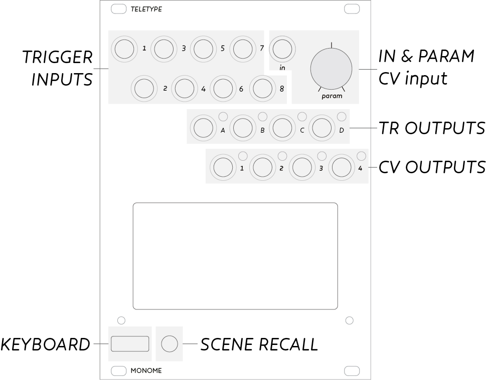

<iframe src="https://player.vimeo.com/video/129271731?color=ff7700&title=0&byline=0&portrait=0" width="860" height="483" frameborder="0" webkitallowfullscreen mozallowfullscreen allowfullscreen></iframe>

# Teletype

*Algorithmic ecosystem.*

## Installation

Align the 10-pin ribbon cable so the red stripe corresponds to the white indicator on the rear of the module’s circuit board. This is toward the lower edge of the module.

Be careful not to misalign the connector left-to-right either – while Teletype is protected against incorrect connection, doing so may damage other modules in your Eurorack case.

If you wish Teletype to communicate with monome trilogy modules (eg. Meadowphysics) you will need to attach the II ribbon cable as outlined in the [II Communication Upgrade page](http://monome.org/docs/modular/iiheader/).

Secure the module with the four included screws, hiding under the tape in the box lid.

*Power consumption:*

- 72mA @ +12V
- 12ma @ -12V
- No +5v required

**Teletype v1.1 firmware is available! See addendum at the bottom.**

## Introduction

Teletype is a dynamic, musical event triggering platform.

* [Teletype Studies](/docs/modular/teletype/studies-1) - guided series of tutorials

* [PDF command reference](TT_commands_card_1.3.pdf)
* [PDF key reference](TT_keys_card_1.3.pdf)
* [PDF scene recall sheet](TT_scene_RECALL_sheet.pdf)

* [Scenes shipped with version 1.0](http://monome.org/docs/modular/teletype/scenes-1.0/)

## Panel

The keyboard is attached to the front panel, for typing commands. The commands can be executed immediately in *LIVE mode* or assigned to one of the eight trigger inputs in *EDIT mode*. The knob and in jack can be used to set and replace values.

## LIVE mode

Teletype starts up in LIVE mode. You'll see a friendly **>** prompt, where commands are entered. The command:

    TR.TOG A

will toggle trigger A after pressing enter. Consider:

    CV 1 V 5
    CV 2 N 7
    CV 1 0

Here the first command sets CV 1 to 5 volts. The second command sets CV 2 to note 7 (which is 7 semitones up). The last command sets CV 1 back to 0.

Data flows from right to left, so it becomes possible to do this:

    CV 1 N RAND 12

Here a random note between 0 and 12 is set to CV 1.

We can change the behavior of a command with a *PRE* such as `DEL`:

    DEL 500 : TR.TOG A

`TR.TOG A` will be delayed by 500ms upon execution.

A helpful display line appears above the command line in dim font. Here any entered commands will return their numerical value if they have one.

*SCRIPTS*, or several lines of commands, can be assigned to trigger inputs. This is when things get musically interesting. To edit each script, we shift into EDIT mode.

### LIVE mode icons

Four small icons are displayed in LIVE mode to give some important feedback about the state of Teletype. These icons will be brightly lit when the above is true, else will remain dim. They are, from left to right:

* Slew: CV outputs are currently slewing to a new destination.
* Delay: Commands are in the delay queue to be executed in the future.
* Stack: Commands are presently on the stack waiting for execution.
* Metro: Metro is currently active and the Metro script is not empty.

## EDIT mode

Toggle between EDIT and LIVE modes by pushing **TAB**.

The prompt now indicates the script you're currently editing:

* `1`-`8` indicates the script associated with corresponding trigger
* `M` is for the internal metronome
* `I` is the init script, which is executed upon scene recall

Script 1 will be executed when trigger input 1 (top left jack on the panel) receives a low-to-high voltage transition (trigger, or front edge of a gate). Consider the following as script 1:

1:

    TR.TOG A

Now when input 1 receives a trigger, `TR.TOG A` is executed, which toggles the state of output trigger A.

Scripts can have multiple lines:

1:

    TR.TOG A
    CV 1 V RAND 4

Now each time input 1 receives a trigger, CV 1 is set to a random volt between 0 and 4, in addition to output trigger A being toggled.

### Metronome

The `M` script is driven by an internal metronome, so no external trigger is required. By default the metronome interval is 1000ms. You can change this readily (for example, in LIVE mode):

    M 500

The metronome interval is now 500ms. You can disable/enable the metronome entirely with `M.ACT`:

    M.ACT 0

Now the metronome is off, and the `M` script will not be executed. Set `M.ACT` to 1 to re-enable.

## Patterns

Patterns facilitate musical data manipulation-- lists of numbers that can be used as sequences, chord sets, rhythms, or whatever you choose. Pattern memory consists four banks of 64 steps. Functions are provided for a variety of pattern creation, transformation, and playback. The most basic method of creating a pattern is by directly adding numbers to the sequence:

    P.PUSH 5
    P.PUSH 11
    P.PUSH 9
    P.PUSH 3

`P.PUSH` adds the provided value to the end of the list-- patterns keep track of their length, which can be read or modified with `P.L`. Now the pattern length is 4, and the list looks something like:

    5, 11, 9, 3

Patterns also have an index `P.I`, which could be considered a playhead. `P.NEXT` will advance the index by one, and return the value stored at the new index. If the playhead hits the end of the list, it will either wrap to the beginning (if `P.WRAP` is set to 1, which it is by default) or simply continue reading at the final position.

So, this script on input 1 would work well:

1:

    CV 1 N P.NEXT

Each time input 1 is triggered, the pattern moves forward one then CV 1 is set to the note value of the pattern at the new index. This is a basic looped sequence. We could add further control on script 2:

2:

    P.I 0

Since `P.I` is the playhead, trigger input 2 will reset the playhead back to zero. It won't change the CV, as that only happens when script 1 is triggered.

We can change a value within the pattern directly:

    P 0 12

This changes index 0 to 12 (it was previously 5), so now we have *12, 11, 9, 3.*

We've been working with pattern `0` up to this point. There are four pattern banks, and we can switch banks this way:

    P.N 1

Now we're on pattern bank 1. `P.NEXT`, `P.PUSH`, `P`, (and several more commands) all reference the current pattern bank. Each pattern maintains its own play index, wrap parameter, length, etc.

We can directly access and change *any* pattern value with the command `PN`:

    PN 3 0 22

Here the first argument (3) is the *bank*, second (0) is the *index*, and last is the new value (22). You could do this by doing `P.N 3` then `P 0 22` but there are cases where a direct read/write is needed in your patch.

Check the *Command Set* section below for more pattern commands.

Patterns are stored in flash with each scene!

### TRACKER mode

Editing patterns with scripts or from the command line isn't always ergonomic. When you'd like to visually edit patterns, TRACKER mode is the way.

The `~` (tilde) key, above `TAB`, toggles into TRACKER mode.

The current pattern memory is displayed in columns. Use the arrow keys to navigate. Holding ALT will jump by pages.

The edit position is indicated by the brightest number. Very dim numbers indicate they are outside the pattern length.

Use the square bracket keys `[` and `]` to decrease/increase the values. Backspace sets the value to 0. Entering numbers will overwrite a new value. You can cut/copy/paste with ALT-X-C-V.

## Scenes

A *SCENE* is a complete set of scripts and patterns. Stored in flash, scenes can be saved between sessions. Many scenes ship as examples. On startup, the last used scene is loaded by Teletype.

Access the SCENE menu using `ESCAPE`. The bracket keys (`[` and `]`) navigate between the scenes. Use the up/down arrow keys to read the scene *text*. This text will/should describe what the scene does generally along with input/output functions. `ENTER` will load the selected scene, or `ESCAPE` to abort.

To save a scene, hold `ALT` while pushing `ESCAPE`. Use the brackets to select the destination save position. Edit the text section as usual-- you can scroll down for many lines. The top line is the name of the scene. `ALT-ENTER` will save the scene to flash.

### Keyboard-less Scene Recall

To facilitate performance without the need for the keyboard, scenes can be recalled directly from the module's front panel.

* Press the `SCENE RECALL` button next to the USB jack on the panel.
* Use the `PARAM` knob to highlight your desired preset.
* Hold the `SCENE RECALL` button for 1 second to load the selected scene.

### Init Script

The *INIT* script (represented as `I`) is executed when a preset is recalled. This is a good place to set initial values of variables if needed, like metro time `M` or time enable `TIME.ACT` for example.

## Command Set

In this section we'll present the complete command set.

### Nomenclature

* SCRIPT -- multiple *commands*
* COMMAND -- a series (one line) of *words*
* WORD -- a text string separated by a space: *value*, *operator*, *variable*, *pre*
* VALUE -- a number
* OPERATOR -- a function, may need value(s) as argument(s), may return value
* VARIABLE -- named memory storage
* PRE -- condition/rule that applies to rest of the *command*, ie del, prob, if, s

### Syntax

Teletype uses prefix notation. Evaluation happens from right to left.

The left value gets assignment (*set*). Here, temp variable `X` is assigned zero:

    X 0

Temp variable `Y` is assigned to the value of `X`:

    Y X

`X` is being *read* (*get* `X`), and this value is being used to *set* `Y`.

Instead of numbers or variables, we can use operators to perform more complex behavior:

    X TOSS

`TOSS` returns a random state, either 0 or 1 on each call.

Some operators require several arguments:

    X ADD 1 2

Here `ADD` needs two arguments, and gets 1 and 2. `X` is assigned the result of `ADD`, so `X` is now 3.

If a value is returned at the end of a command, it is printed as a MESSAGE. This is visible in LIVE mode just above the command prompt.

    8           // prints 8
    X 4
    X           // prints 4
    ADD 8 32    // prints 40

Many parameters are indexed, such as CV and TR. This means that CV and TR have multiple values (in this case, each has four.) We pass an extra argument to specify which index we want to read or write.

    CV 1 0

Here CV 1 is set to 0. You can leave off the 0 to print the value.

    CV 1        // prints value of CV 1

Or, this works too:

    X CV 1      // set X to current value of CV 1

Here is an example of using an operator `RAND` to set a random voltage:

    CV 1 V RAND 4

First a random value between 0 and 3 is generated. The result is turned into a volt with a table lookup, and the final value is assigned to CV 1.

The order of the arguments is important, of course. Consider:

    CV RRAND 1 4 0

`RRAND` uses two arguments, 1 and 4, returning a value between these two. This command, then, chooses a random CV output (1-4) to set to 0. This might seem confusing, so it's possible to clarify it by pulling it apart:

    X RRAND 1 4
    CV X 0

Here we use `X` as a temp step before setting the final CV.

With some practice it becomes easier to combine many functions into the same command.

### Variables

General purpose temp vars: `X`, `Y`, `Z`, and `T`. 

`T` typically used for time values, but can be used freely.

`A`-`D` are assigned 1-4 by default (as a convenience for TR labeling, but TR can be addressed with simply 1-4). All may be overwritten and used freely. 

#### Special variables

Special use: `I`, `O`, `DRUNK`, and `Q`.

`I` gets overwritten by the `L` (loop) PRE, but can be used as general purpose otherwise.

`O` auto-increments on each read.

    O       // prints 0
    O       // prints 1
    X O
    X       // prints 2
    O 0
    O       // prints 0

`DRUNK` changes by -1, 0, or 1 upon each read, saving its state. Setting `DRUNK` will give it a new value for the next read, and drunkedness will continue on from there with subsequent reads.

`Q` implements a queue or shift register. Data written to `Q` will shift through a small array. `Q.N` sets the read position. Finally, reading `Q.AVG` will return the average of the entire queue for N values (effectively serving as a smoother.) Setting `Q.AVG` will set the entire queue to the specified value.

    Q.N 4   // queue length 4
    Q 10
    Q 15
    Q 20
    Q 100
    Q       // returns 10
    Q 200
    Q       // returns 15
    Q.AVG   // returns 83
    Q.AVG 0
    Q       // returns 0

Note: `Q` initializes with Q.N of 1 meaning it functions as a general purpose variable until Q.N is set to a larger number.

### Parameters

Parameters are like variables, but tied to functionality of the software or hardware. Some of these (CV/TR) are arrays, and require an extra index argument.

IN and PARAM provide CV and physical input into a script. Their state can be read with the listed parameters.

Reading and writing is similar to variables-- assignment happens when the parameter is leftmost in the command (and requires an additional argument: the value to take).

~~~
TR A-D                  set TR value (0-1)
TR.TIME A-D             time for TR.PULSE
CV 1-4                  CV target value
CV.SLEW 1-4             CV slew time in ms (how long to reach the target)
CV.SET 1-4              set CV value directly, ignoring slew time
CV.OFF 1-4              CV offset (added to CV value at final stage)
    
IN                      get value of IN jack (0-16383)
PARAM                   get value of PARAM knob (0-16383)
    
M                       metro time in ms, the M script is executed at this interval
M.ACT                   [0/1] enable/disable metro
M.RESET                 hard reset metro count without triggering
    
TIME                    timer value (counts up in ms. wraps after 32 seconds)
TIME.ACT                [0/1] enable/disable timer counting
    
SCENE                  read/recall scene
~~~

### Data and Tables

All parameters have internal range limiting, but the working range is signed 16 bit:

    -32768 to 32767

Several built-in constant tables allow for easy data transformation:

    N 0-127         equal temp semi (negatives accepted as well)
    V 0-10          volt lookup
    VV 0-1000       volt lookup with decimal precision (100 represents 1V)

These are typically used with CV output, since CV has a fine granularity (14 bit), full range which is 0-16383.

So `V 10` (ten volts) is 16383. `V 1` is 1638. `N 1` is 137, for a semitone. This way we can use readable (small) numbers and then translate them to CV easily. Think of it as MIDI to frequency. So:

    CV 1 N 1

is the same as:

    CV 1 137

But we'll typically want to play with note values, so this sort of thing ends up making a lot of sense:

    X RAND 24
    CV 1 N X

### Operators

Operators take a variable number of parameters (including none) and typically return one value.

Arguments are indicated with *a*, *b*, *c*, etc.

~~~
RAND a                      generate random number 0-(a)
RRAND a b                   generate random number from (a) to (b)
TOSS                        return random: 0 or 1
AVG a b                     return average of two arguments (a) and (b)
MIN/MAX a b                 choose lesser/greater of two inputs (a) and (b)
ADD/SUB/MUL/DIV/MOD a b     arithmetic
EQ/NE/GT/LT a b             logic: equals, not equals, greater than, less than
EZ/NZ a                     logic: equals zero, not zero
RSH/LSH a b                 shift (a) by (b), equivalent to multiply/divide by powers of two
LIM a b c                   limit for arbitrary range defining: (a) input (b) min (c) max
WRAP a b c                  wrapped range defining: (a) input (b) min (c) max
QT a b                      round (a) to closest multiple of (b): quantize
~~~

#### Special case operators

These operators do not return a value. They only act upon the hardware.

~~~
TR.TOG a                toggle TR (a)
TR.PULSE a              pulse TR (a) using TR.TIME as an interval
~~~

Note: `TR.PULSE` inverts the current state of the `TR` output, so if the trigger is high when a pulse arrives, it will be an inverted pulse. Multiple overlapping pulses will create further inversions, creating somewhat unpredictable results.

### Modified commands: PRE

A *PRE* is a short command that modifies the remainder of a command. A PRE needs a separator (colon) to indicate the command it will act upon. For example:

    PROB 80 : TR.PULSE A

Prior to the separator we have `PROB 80`, which creates a condition for the remainder of the command `TR.PULSE A`. Output trigger A is pulsed with an 80% probability.

Some of the commands included here are actually operators (those that don't have separators) but are functionally closely tied to PRE operations, so we've included them here.

~~~
PROB a : ..         potential to execute with (a) probability [0-100]

DEL a : ..          delay (postpone) command by (a) ms
DEL.CLR             kill all delays

S : ..              put command on the stack
S.CLR               clear the stack
S.ALL               execute every command on the stack
S.POP               execute most recent command (pop)
S.L                 length of queue (read only)

IF a : ..           if (a) is not zero, execute command
ELIF a : ..         execute on failed IF/ELIF, and (a) is not zero
ELSE ..             execute on failed IF/ELIF

L a b : ...         LOOP. execute command sequentially with `I` values (a) to (b)
~~~

`L` can be used for repetitive commands:

    L 1 4 : CV I 0

is equivalent to:

    CV 1 0
    CV 2 0
    CV 3 0
    CV 4 0

`L` executes the specified command in the range defined, with `I` being set on each iteration. `I` does not need to be used, however. This is perfectly valid:

    L 1 64 : P.PUSH TOSS

This command fills an entire pattern with random 0s and 1s. `TOSS` is called 64 times.

### Patterns

    P a             get value at index (a)
    P a b           set value at index (a) to (b)
    P.N a           select bank (a)
    PN a b          get pattern (a) index (b)
    PN a b c        set pattern (a) index (b) to (c)

Note: For `P` and `PN`, negative index values index from the end (backwards) rather than beginning.

#### Pattern manipulation

These commands change pattern length:

    P.INS a b       insert value (b) at index (a), shift later values down
    P.RM a          delete value at (a), shift later values up
    P.PUSH a        add value (a) to end of pattern (like a stack)
    P.POP           remove and return value from end of pattern (like a stack)

pattern attributes: get current values by omiting a value

    P.L a           get/set length, nondestructive to data
    P.WRAP a        enable/disable (or get) wrapping [0/1], which changes behavior of prev/next
    P.START a       get/set start location
    P.END a         get/set end location

patterns have a "read head" pointer that can be manipulated

    P.I a               get/set index position
    P.HERE              read value at index
    P.NEXT              increment index then read
    P.PREV              decrement index then read

Note: an argument to P.HERE, P.NEXT or P.PREV will set the "read head" pointer and then set that index to the input value.

### Remote

If a monome trilogy module (WW/MP/ES) is attached via the internal ribbon cable, you can remotely control many parameters using the `II` command.

    II WW.POS 5

Sets position to 5 on the white whale.

All of these commands require one parameter. `SYNC`, `RESET`, and `CLOCK` commands need a non-zero parameter to execute.

Trilogy modules require an additional header to be soldered on to the circuit board in order to be connected with teletype. See [these instructions](http://monome.org/docs/modular/iiheader/) here for details on how to attach this header.

~~~~
WW.PRESET       recall preset
WW.POS          cut to position
WW.SYNC         cut to position, hard sync clock (if clocked internally)
WW.START        set loop start
WW.END          set loop end
WW.PMODE        set play mode (0 = normal, 1 = reverse, 2 = drunk, 3 = random)
WW.PATTERN      change pattern
WW.QPATTERN     change pattern (queued) after current pattern ends
WW.MUTE1        mute trigger 1 (0 = on, 1 = mute)
WW.MUTE2        mute trigger 2 (0 = on, 1 = mute)
WW.MUTE3        mute trigger 3 (0 = on, 1 = mute)
WW.MUTE4        mute trigger 4 (0 = on, 1 = mute)
WW.MUTEA        mute cv A (0 = on, 1 = mute)
WW.MUTEB        mute cv B (0 = on, 1 = mute)

MP.PRESET       recall preset
MP.RESET        reset positions
MP.SYNC         reset positions, hard sync clock (if clocked internally)
MP.MUTE         mutes the output of a channel (1 - 8)
MP.UNMUTE       unmutes (enables) the output (1 - 8)
MP.FREEZE       freezes the advancement of a channel (1 - 8)
MP.UNFREEZE     unfreezes (enables) advancement of the channel (1 - 8)

ES.PRESET       recall preset
ES.MODE         set pattern clock mode (0 = normal, 1 = clocked via II)
ES.CLOCK        (if II clocked) next pattern event
ES.RESET        reset pattern to start (and start playing)
ES.PATTERN      set playing pattern
ES.TRANS        set transposition
ES.STOP         stop pattern playback
ES.TRIPLE       recall triple shape (1-4)
ES.MAGIC        magic shape (1 = halfspeed, 2 = doublespeed, 3 = linearize)
~~~~

One of each module (WW/MP/ES) can be connected on the same cable to one Teletype unit at the same time.

## Reference

### Keys

~~~
TAB             toggle between LIVE and EDIT mode 
~ (tilde)       toggle between LIVE and TRACKER mode
ESC             toggle into SCENE load
ALT-ESC         SCENE write
~~~

#### LIVE mode

~~~
ENTER           execute command 
UP              previous command in history 
ALT-X           cut command 
ALT-C           copy command 
ALT-V           paste command 
SHIFT-BACKSPACE clear command 
~~~

#### EDIT mode

~~~
]               next script 
[               previous script 
ENTER           add/overwrite command 
SHIFT-ENTER     insert command 
ALT-X           cut command (move subsequent lines up)
ALT-C           copy command 
ALT-V           paste command
SHIFT-BACKSPACE clear command 
~~~

#### TRACKER mode

~~~
arrows          navigate edit position 
ALT-up/down     jump page position up/down 
ALT-left/right  jump to top/bottom 
ALT-L           jump to position of current pattern length (last edited value)
0-9             numeric entry
-               flip sign
BACKSPACE       divide by 10 (remove least significant digit, really, it makes sense) until zero
SPACE           toggle non-zero to zero, and zero to one (for trigger sequences)
]               increment value at edit position 
[               decrement value at edit position
ALT-X           cut value at index, shift remaining pattern up
ALT-C           copy value at index
ALT-V           paste value at index
SHIFT-ALT-V     insert paste value at index, shift remaining pattern down
SHIFT-BACKSPACE delete index, shift remaining pattern up
SHIFT-ENTER     duplicate current value and shift pattern downwards
ENTER           (only if editing index succeeding current length) move to next index and increase length
SHIFT-L         set pattern length to current position
CTRL            set value to current param knob value in notes (N, 0-32)
CTRL-SHIFT      set value to current param knob value in decimal volts (VV, 0-1000)
~~~

#### SCENE mode (read)

~~~~
]               next scene
[               previous scene
ENTER           read currently selected scene    
arrows          scroll through text
~~~~

#### SCENE mode (write)

~~~~
arrows          navigation
(text)          edit text description
]               scroll forward scene write destination
[               scroll back scene write destination
ALT+ENTER       write scene
~~~~

#### Global

~~~~
WIN-(1-8)      manually execute scripts 1 through 8
WIN-M          manually execute METRO script
WIN-I          manually execute INIT script
~~~~

## Teletype 1.1 Addendum

Firmware update version 1.1 introduces new features and fixes-- all scenes written in 1.0 are compatible. See the [modular firmware updates](http://monome.org/docs/modular/update/) page for more information.

**CAUTION** your scenes will be erased on update. If you type out your scenes first into a text editor, you'll be able to re-import them via USB flash drive.

For the full list of fixes and improvements, see the [changelog on GitHub][changelog].

### USB flash drive scene read/write

Requires a FAT32 formatted flash drive.

Insert prior to power-up, then power-on the module. All scenes in flash will be written `TT??S.TXT` to the root, where `??` is the scene number (00-31). Any files labelled `TT??.TXT` will be read to flash at the scene position `??`.

The file format is text and human readable. I wouldn't suggest doing complicated editing offline (on a computer) as the USB read doesn't report syntax errors-- it just aborts on a non-validating script. This feature is primarily intended for sharing scenes on the internet and backup.

See [TT00.TXT](tt00.txt) for an example of the file format. It's quite straightforward. Towards the end in the pattern section, there are four rows of numbers prior to the pattern data. The rows are LENGTH, WRAP, START, and END per pattern.

### New Commands

~~~
SCRIPT x            execute script (1-8), has infinite loop detection
                    this allows you to chain multiple scripts together!
STATE x             read the current state of a script trigger input (0/1 for low/high)
MUTE x              disable external script inputs (1-8), turns off input jack
UNMUTE x            re-enable external script inputs (1-8)
TR.POL x y          polarity for TR.PULSE (1-4)
                    no more unexpected pulse inversions.
SCALE a b x y i     scale number i from range a-b to range x-y : (i * (y-x)/(b-a))
JI x y              just intonation helper, precision ratio divider normalized to 1v
KILL                clears stack, clears delays, cancels pulses, cancels slews
ABS x               returns the absolute value of x
FLIP                special variable returns inverted state on each read (also settable)
AND x y             logical operation AND
OR x y              logical operation OR
XOR x y             logical operation XOR
EXP x               exponentiation table lookup. 0-16383 range (V 0-10)

O.MIN, O.MAX, O.WRAP, O.INC - range control for special var O
DRUNK.MIN, DRUNK.MAX, DRUNK.WRAP - range control for special var DRUNK
~~~~

### New Keys

~~~
META-SHIFT-(1-8)    toggle MUTE/UNMUTE for trigger inputs
META+ALT+ESC        KILL (cancel delays, clear stack, stop slews)

numeric keypad keys 1-8 immediately execute numbered scripts.
~~~

### New II Commands

~~~
MP.STOP x           (MP v2) STOP row x (0 for all)

OR.TRK              Orca (WW alt firmware) commands
OR.CLK              see https://github.com/scanner-darkly/monome-mods/wiki/Orca
OR.DIV
OR.PHASE
OR.RST
OR.WGT
OR.MUTE
OR.SCALE
OR.BANK
OR.PRESET
OR.RELOAD
OR.ROTS
OR.ROTW
OR.GRST
OR.CVA
OR.CVB
~~~

## Teletype 1.2 Addendum

Firmware update version 1.2 adds support for [Ansible][ansible-docs], a new Euclidean rhythm op (`ER`), as well as several bug fixes and improvements.

### Ansible support

The following ops: `CV`, `CV.OFF`, `CV.SET`, `CV.SLEW`, `STATE`, `TR`, `TR.POL`, `TR.PULSE`, `TR.TIME`, `TR.TOG` now support the Teletype mode on Ansible, see the [Ansible docs][ansible-docs] for more information.

[ansible-docs]: /docs/modular/ansible/

### Euclidean rhythms

A new op `ER` has been added to help generate Euclidean rhythms.

~~~
ER f l s            Euclidean rhythm helper, f: fill (1-32),
                    l: length (1-32), s: step (any value),
                    returns a 0 or 1
~~~

See [this write up][euclidean] for more information on Euclidean rhythms and their usage on the Teletype.

[euclidean]: http://samdoshi.com/post/2016/03/teletype-euclidean/

### Other fixes

- `O.DIR` renamed to `O.INC`, it is the value by which `O` is _incremented_ when it is accessed
- `P.RM` now returns the value removed
- `TR.TIME 0` will disable the pulse
- Improved key repeat support

For the full list of fixes and improvements, see the [changelog on GitHub][changelog].

[changelog]: https://github.com/monome/teletype/blob/master/CHANGELOG.md
