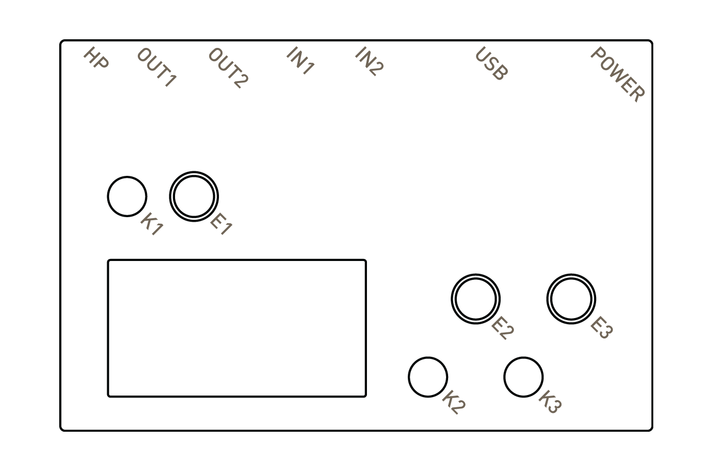
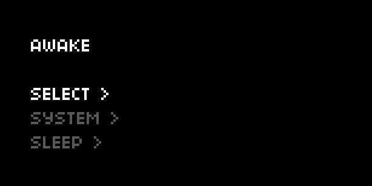
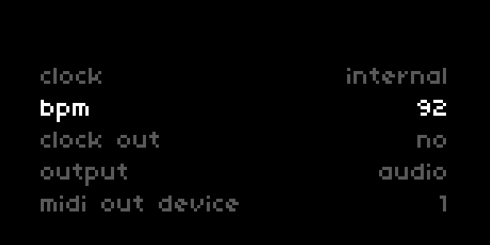
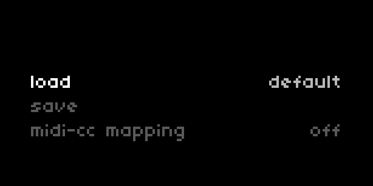
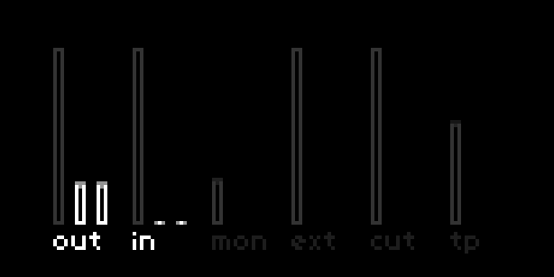
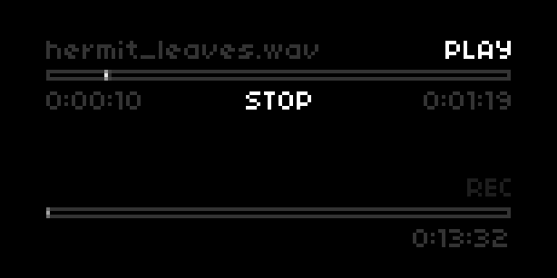
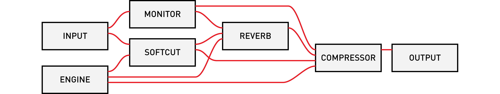

# norns

**current version: [190404](https://github.com/monome/norns/releases)**

- [first](norns-legend.pdf) see this quick introduction.
- [studies](/docs/norns/study-1/) is a series of tutorials for creating scripts.

quick links: [begin](#begin) &mdash; [awake](#awake) &mdash; [edit](#edit)

## LEGEND

## BEGIN

The mini-USB plug provides power and charges the internal battery. Use the cable and power supply provided. (The included supply supplies 2A via USB connector).

Hold **K1** for three seconds.

Be still, and norns will awaken.

There's a small light near the power plug.  ORANGE means power.  WHITE means disk access.

On the bottom of the norns there is a tiny push switch will hard power-off the device. For general shut down use the _sleep_ menu function. This fully turns off the norns with a proper software shutdown. Use the bottom switch only if something in software went wrong.

## AWAKE

A changing melody will play.

E1 changes the mode. K1+? means hold K1 then push ?

### STEP

- E2 navigates position, E3 changes position.
- K2 toggles the sequence to edit. K1+K2 clears all steps.
- K3 morphs the current sequence. K1+K3 randomizes.

### LOOP
- E2/E3 set loop length. K1+E2/E3 set loop start.
- K2 resets to play to zero. K3 jumps to random position.

### SOUND

- E2/E3 adjust selected parameter. K2/K3 move selector.

### OPTION

- E2 adjusts BPM. K1+E2 change division.
- E3 selects scale. K1+E3 changes root note.
- K2 holds playback. K3 toggles playback.

(bonus: try plugging in a grid.)

## OTHER

Tap K1 quickly to toggle between **PLAY** and **OTHER**.

You are now at **HOME**.

In **OTHER** mode:

- E1 moves between pages.
- E2 scrolls up/down.
- K2/K3 move back/forward.

Page layout:

At **HOME** press K2 to toggle additional system information display.

### SELECT

Explore the collection of scripts.  Selecting a script will show a description.  Forward again will run the script.  The play screen will return upon running.  Tap KEY1 to toggle between PLAY and MENU.

### SYSTEM

- AUDIO - Like the parameter list, but for the global audio settings. Includes output and input levels, headphone gain, aux send (reverb), and insert (compression). See the REFERENCE section below for details on the parameters available.
- DEVICES - This is a list of connected USB hardware (currently MIDI and grids) with their associated port number. Most scripts address port 1. See [norns study 4](https://monome.org/docs/norns/study-4/) for a scripting guide to multiple ports. This menu lets you re-assign connected devices to specific ports.
- WIFI -
- UPDATE - Checks for updates. Internet connection required.
- RESET - Quickly resets the audio system.
- SLEEP - Powers down.

### PARAMETERS

Scripts can define their own parameters. Note that some scripts may have no parameters.

- E2 scrolls.
- E3 changes values. Hold K3 for fine tuning.

HOLD K1 to access parameter set saving and loading:

- E3 scrolls set number (0 is default, with 1-99 available)
- K2 loads the selected set
- K3 saves the set to the selected position

Enable MIDI-mapping with E3 while the MIDI-map item is selected. Release K1 to return to the Parameter list, but now you see MIDI CC assignments. Push K3 to enable MIDI-learn, whereupon the next incoming MIDI CC will be mapped to this value.

Get out of MIDI-mapping mode by holding K1 and toggling off.

### LEVELS

Mixing and VU display happens here.

- K2/K3 to change selection, which is highlighted.
- E2/E3 modify the respective highlighted levels.

### TAPE

On this page you can record and play directly to and from disk.

K2 toggles focus between REC and PLAY.

REC

- K3 to arm recording.
- K3 again to start.
- K3 again to stop.

PLAY

- K3 loads file.
- K3 again to start.
- K3 again to stop.

## AUDIO

Audio routing is shown below:

### AUDIO PARAMETERS

Control of various audio parameters happens in **SYSTEM > AUDIO**. Note that the topmost levels are also controlled via the **LEVELS** page.

param |range |description
---|---|---
output            |[-inf, 0] db     |output level
input             |[-inf, 0] db     |input level
monitor           |[-inf, 0] db     |monitor level (input mix to ouput)
ext               |[-inf, 0] db     |external application level (ie, supercollider)
softcut           |[-inf, 0] db     |multivoice sampler level
tape              |[-inf, 0] db     |tape playback level
monitor mode      |[MONO, STEREO]   |MONO = mix input 1 and 2 to both channels
headphone         |[0, 60]          |headphone gain
reverb            |[ON, OFF]        |reverb state
rev ext input     |[-inf, 12] db    |external input to reverb
rev cut input     |[-inf, 12] db    |softcut input to reverb
rev monitor input |[-inf, 12] db    |monitor input to reverb
rev return level  |[-inf, 12] db    |reverb return level
rev pre delay     |[20, 100] ms     |delay before reverberation
rev lf fc         |[50, 1000] hz    |crossover frequency between low and middle bands
rev low time      |[1, 32] s        |time to decay by 60dB in low band
rev mid time      |[1, 32] s        |time to decay by 60dB in mid band
rev hf damping    |[1500, nyq] hz   |frequency at which high band decay time is 1/2 of mid band decay time
compressor        |[ON, OFF]        |compressor state
comp mix          |[0, 1.0]         |dry/wet mix. 0 = dry, 1 = wet
comp ratio        |[1, 20]          |compression ratio: for each N dB increase in input level above threashold, output level increases by 1dB
comp threshold    |[-100, 10] dB    |amplitutde above which the signal is compressed
comp attack       |[1, 1000] ms     |time constant (1/e smoothing time) for compression gain to exponentially approach a new _lower_ target level
comp release      |[1, 1000] ms     |time constant (1/e smoothing time) for compression gain to exponentially approach a new _higher_ target level
comp pre gain     |[-inf, 30] db    |gain pre compression
comp post gain    |[-inf, 30] db    |gain post compression

## CONNECT

Scripts can be created and edited using a web browser when norns is connected to a network. These scripts will appear in the **SELECT** list for later play.

The WIFI nub must be inserted before starting.

To connect to your local network router:

- Navigate to **SYSTEM > WIFI**.
- Select **ADD**.
- Choose your network from the list displayed.
- Enter the password. E2 toggle between top and bottom row, E3 scrolls character, K3 selects character. Select **OK** when complete.
- With success, you should be assigned an IP address shortly after.

If you do not have access to a router, you can turn the norns into a WIFI hotspot. This will create a new network which you can then connect to with your computer:

- SSID: `norns`
- password: `nnnnnnnn`

Point your web browser at `norns.local` to see the maiden interface. If the site is not found, try connecting directly to the IP address shown on the norns screen, for example: `192.168.1.30`.

## MAIDEN

_maiden_ is the web-based editor for norns.

-- TODO

## FILE MANAGEMENT

File management is best achieved via SFTP, so you'll need to first connect norns to your laptop via wifi (see above).

See [this guide](./sftp) for further details.

-- TODO file system layout

## OTHER ACCESS

When connected via WIFI you can SSH into norns at the IP address shown in SYSTEM.

- user: `we`
- password: `sleep`

Without WIFI, you can connect to norns via USB-UART by connecting the power cable to your computer. On Mac/linux do:

`screen /dev/tty.usb(tab) 115200`

Where `(tab)` appears hit TAB to autocomplete the serial number. Login is the same as above.

## GATHERING

## SHARING

## HELP

The [community forum](https://llllllll.co/tag/norns) has various informative threads. Please join us!

Check the [known bugs](https://github.com/monome/norns/wiki/known-bugs) list for problems and solutions.

If you're experiencing hardware problems contact info@monome.org and we can help right away.

## CONTRIBUTING

norns is the result of generous contributions by many people, and the ecosystem continues to evolve. We welcome discussion and code to help further the goal of an open, dynamic instrument creation platform. check out the [github repo](https://github.com/monome/norns).

We're also always looking for help with [documentation](https://github.com/monome/docs), if your skills include design, instruction, or proofreading. Collective efforts have created numerous exceptional projects over the years, and there's more to a project than just code!

Found a bug? Let us know. Please file a [github issue](https://github.com/monome/norns/issues) or let us know on [lines](https://llllllll.co/t/norns-help/14016).

## ACKNOWLEDGEMENTS
