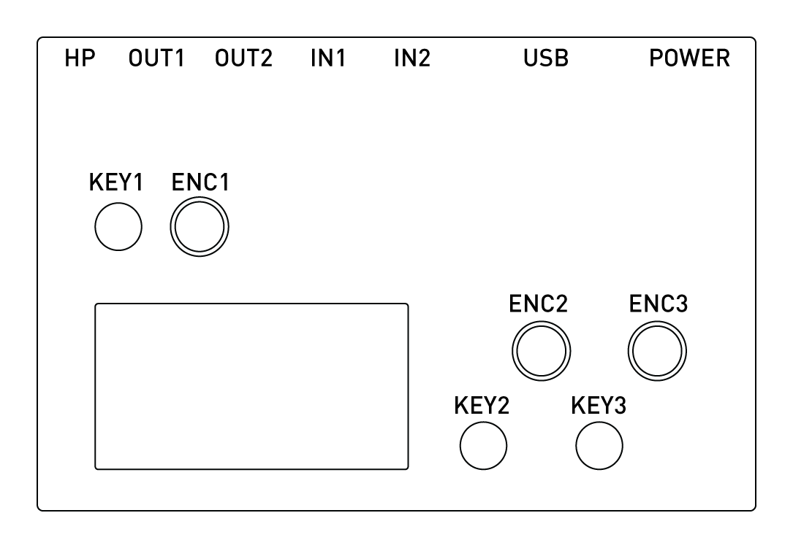

# norns

**current version: [180828](https://github.com/monome/norns/releases)**

- [beginning guide](norns-legend.pdf) is a one-sheet quick introduction.
- [dust docs](dust) is documentation on individual engines and scripts.
- [update](update) instructions.
- [studies](/docs/norns/study-1/) -- series of tutorials for creating scripts

## legend

## begin

The mini-USB plug provides power and charges the internal battery. Use the cable and power supply provided. (The included supply supplies 2A via USB connector).

Hold KEY1 for three seconds.

Be still, and norns will awaken.

There's a small light near the power plug.  ORANGE means power.  WHITE means disk access.

On the bottom of the norns there is a tiny push switch will hard power-off the device. For general shut down use the _sleep_ menu function. This fully turns off the norns with a proper software shutdown. Use the bottom switch is something in software went wrong.

## awake

A changing melody will play.

- ENC1 changes the tempo.
- ENC2 navigates position, ENC3 changes position.
- KEY3 toggles the sequence to edit.
- KEY2 morphs the current sequence.

- HOLD KEY3, then:
- ENC1 changes transposition.
- ENC2 and ENC3 change sequence lengths.
- KEY2 resets sequence positions.

- HOLD KEY1, then:
- ENC1 changes scale mode.
- ENC2 changes filter cutoff.
- ENC3 changes release time.

TAP KEY1 quickly to enter MENU.

## menu

Tap KEY1 to toggle between PLAY and MENU.

In MENU mode:

- ENC2 scrolls up/down.
- KEY3 is forward.
- KEY2 is back.

### SELECT

Explore the collection of scripts.  Selecting a script will show a description.  Forward again will run the script.  The play screen will return upon running.  Tap KEY1 to toggle between PLAY and MENU.

### PARAMETERS

Scripts can define their own parameters. ENC2 scrolls and ENC3 changes parameter values.

HOLD KEY1 to access parameter set saving and loading:

- ENC3 scrolls set number (0 is default, with 1-99 available)
- KEY2 loads the selected set
- KEY3 saves the set to the selected position

Note that some scripts may have no parameters.

### SYSTEM / AUDIO

Like the parameter list, but for the global audio settings. Includes output and input levels, headphone gain, aux send (reverb), and insert (compression).

See the REFERENCE section below for details on the parameters available.

### SYSTEM / WIFI

The WIFI nub must be inserted before starting.  Here you can set up a hotspot or connect to an existing network.

Hotspot will create a network:

- SSID: `norns`
- password: `nnnnnnnn`

Connecting to an existing network requires a few steps. Upon entering the SYSTEM menu a WIFI scan is initiated. This will take a bit of time. Once entering the WIFI screen and scrolling to NETWORK you'll be able to select a network with ENC3 (indicated on the bottom right). You'll then be prompted for a password. This network and password will be saved for future use.

_NOTE:_ Right now only WPA networks appear to work with this setup. We're looking to add WEP/etc networks soon. So you may need to adjust your router settings.

### SYSTEM / SYNC

A USB disk must be connected. Here you can sync your scripts/data/audio to an external disk, or copy scripts/audio/data from an external disk.

This is the current method for getting sound and scripts on and off of the device.

- Format a USB drive with a FAT32 file system.
- Execute `SYSTEM > SYNC > TO DISK` (this may take some time, be patient)
- Eject the disk and insert it into your computer. You can now retrieve your TAPE files, etc. Copy new audio files into the `dust/audio` folder for use with scripts.
- Put the disk back into norns and execute `SYSTEM > SYNC > FROM DISK`

### SYSTEM / UPDATE

This searches the USB disk for update files.

### SYSTEM / LOG

Displays the day's news.

### SLEEP

Powers down, getting rest for later.

### LEVELS

Go BACK from home to see the LEVELS screen.

Here you have VUs and mixing capabilities.

- ENC1 output
- ENC2 input
- ENC3 monitor (input to output)

Battery percentage level is indicated in the upper right. Hold KEY1 to see current consumption.

#### TAPE

Within LEVELS you can record and play directly to and from disk.

HOLD KEY2 for all. ENC3 toggles REC/PLAY.

REC

- KEY3 to arm recording.
- KEY3 again to start.
- KEY3 again to stop.

PLAY

- KEY3 loads file.
- KEY3 to play.
- ENC3 to toggle PLAY/STOP.

## dust

DUST is the collection of scripts, engines, and sounds on the norns. it is a public repository and contributions are welcome.

See the [dust docs](dust) for documentation on individual engines and scripts.

## maiden

_note: be sure you've run the system [update](update)_

For a first look at _maiden_ (the web editor) turn on WIFI (connect to your norns via hotspot) and try opening a web browser to:

- `http://norns.local`

(if not found, try `http://172.24.1.1` or the appropriate IP address.)

More documentation coming.

## other access

When connected via WIFI you can SSH into norns at the IP address shown in SYSTEM.

- user: `we`
- password: `sleep`

Without WIFI, you can connect to norns via USB-UART by connecting the power cable to your computer. On Mac/linux do:

`screen /dev/tty.usb(tab) 115200`

Where `(tab)` appears hit TAB to autocomplete the serial number. Login is the same as above.

## help

The [community forum](https://llllllll.co/tag/norns) has various informative threads. Please join us!

Check the [known bugs](https://github.com/monome/norns/wiki/known-bugs) list for problems and solutions.

If you're experiencing hardware problems contact info@monome.org and we can help right away.

## contributing

norns is the result of generous contributions by many people, and the ecosystem continues to evolve. We welcome discussion and code to help further the goal of an open, dynamic instrument creation platform. check out the [github repo](https://github.com/monome/norns).

We're also always looking for help with [documentation](https://github.com/monome/docs), if your skills include design, instruction, or proofreading. Collective efforts have created numerous exceptional projects over the years, and there's more to a project than just code!

Found a bug? Let us know. Please file a [github issue](https://github.com/monome/norns/issues) or let us know on [lines](https://llllllll.co/t/norns-help/14016).

---

## reference

### SYSTEM AUDIO PARAMETERS

Basic:

- output: main level (stereo, affects both main outs and headphones)
- input: input level (stereo)
- monitor: monitor level, passing input to output
- monitor mode: STEREO/MONO. stereo: L input to L output, etc. mono: L to L/R. R to L/R.
- headphone: gain, 0-64. set according to your headphone preference and impedance.

AUX (Reverb):

- aux fx: on/off
- aux engine level: engine output -> aux input
- aux input 1 level: input 1 -> aux input
- aux input 2 level: input 2 -> aux input
- aux input 1 pan: pan for input 1
- aux input 2 pan: pan for input 2
- aux return level: aux output -> main output

- rev pre delay: reverb delay time
- rev lf x: reverb low frequency crossover
- rev low time: reverb low time
- rev mid time: reverb mid time
- rev hf damping: reverb high frequency damping

INSERT (Compressor):

- insert fx: on/off
- insert mix: dry/wet (dry = 0.0, wet = 1.0)
- comp ratio: compressor ratio
- comp thresh: compressor threshold
- comp attack: compressor attack time
- comp release: compressor release time
- comp makeup: compressor makeup gain

