
<iframe src="https://player.vimeo.com/video/113231441?color=ff7700&title=0&byline=0&portrait=0" style="position:absolute;top:0;left:0;width:100%;height:100%;" frameborder="0" allow="autoplay; fullscreen" allowfullscreen></iframe>

# Earthsea

*Grid-enabled Shape-Memory Pattern Instrument*

---

### WARNING: Earthsea requires high +5v current

Please make certain to check your case’s +5v power supply capacity. If it is underpowered (<600mA), or highly taxed, our [Switch](/docs/switch) is required.

## Introduction

Earthsea is a platform for playing, looping, and manipulating control-voltage gestures, which may take the form of melodies and timbral transformations.

A monome grid is plugged into the front panel of the module, becoming a complete interface. Looped patterns continue to play when the grid is disconnected, facilitating hot-swap reconnection to other monome-enabled modules during performance.

Earthsea is built upon a map of tones, using the grid as a playing surface for melodies, available as *Pos*. The *Edge* output provides various gating modes including a fixed interval and drone.

Multi-press gestures invoke *shape-memories*. Three channels of CV memory are set by turning panel knobs per shape. These sets of CV can be instantly recalled by the different shapes, or glide between memories with independent slew per channel and shape.

Patterns of notes and shapes can be recorded into a bank of sixteen slots. Gate, retrigger or loop playback while performing additional notes or shapes atop. Recall previous patterns from the bank, or perform the bank directly. Patterns can also be performed across the keymap with arpeggiate mode, shifting the root note and retriggering the pattern.

*Shape-memories* and all recorded patterns are storable to internal flash memory for instant recall on power-up. eight full presets can be stored and dynamically loaded.

Additional magic shapes for pattern modulations allow the resequencing of your performances on the fly.

[Image of Earthsea panel]

## Installation

**Align the ribbon cable so the red stripe corresponds to the white indicator on the rear of the module's circuit board.**

- Be careful not to misalign the connector left-to-right either as it can damage this module, and others in your case.
- Secure the module in your case with included screws, hiding under blue tape in the box.

As mentioned at top, monome modules require high +5v current. Before powering up your case, make sure the power supply can provide at least 600mA of current on the +5v line. Even if it appears to work in an underpowered case, it may degrade slowly over time until it fails and destroys the Earthsea. These repairs are not warrantied.

Power consumption:

- 18mA @ +12V
- 17mA @ -12V
- 42mA @ +5V (no grid connected), **up to 600mA (with grid)**

## Panel details

- 3 *shape* knobs
- 3 *shape* CV outputs (*1, 2 & 3*, voltage range, slew, sample & bit rate)
- 1 *edge* CV output (voltage range, sample rate)
- 1 *pos* CV output (voltage range, slew, sample, and bit rate)
- 1 USB-A port
- 1 *preset* button

## Getting Started

(Hint: video tutorial at the bottom).

_monome 128 is required. monome 64 is not recommended. 8x8 grids will still work, though some functions are not accessible and the playing surface is tightly constricted._

Connect your monome grid (via SWITCH if used) to the Earthsea panel. A mostly blank canvas will be presented, representing the *keymap*. Press keys to change the CV (1V/Octave) at the *Pos*, or Position, output on Earthsea's panel. Each time you press a key a gate will be sent to the *Edge* output on the panel, ideal for attaching to an envelope.

Three dim leds will light in the bottom-left of the grid. These illustrate the current state of the shape-memories, again available on the panel as '1', '2' and '3'. Turn the panel knobs to change the three CV values from 0V (left) to 10V (right), and see the dim-leds move across the surface.

The far left column is reserved for special functions:

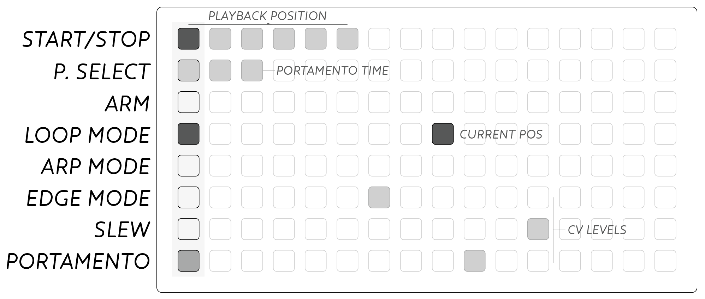

## Keymap

The *Pos* output of Earthsea is controlled by playing notes on the grid as a sort of extended keyboard. The CV output is calibrated, 1Volt per octave, and designed to be attached to an oscillator to play melodies. The keymap is thus monophonic, allowing only a single note to be played at a time.

The 'pitch' output by *Pos* is lowest at the lower-left of the grid, and higher at the upper-right corner. The current output value is displayed on the grid as a bright led.

- Horizontal: Semitone increase from left to right
- Vertical: Fourths (5 semitones) from bottom to top.

For those familiar with guitar or bass these intervals should feel familiar and common harmonic shapes will reveal themselves. A primer on some basic harmonic structures is provided at the end of this manual

## Shape-Memories

On top of the keymap, it is simultaneously possible to perform *shape-memories*. These are gestures that can recall the three CV outs as well as set a new keymap *Pos*.

Eight multi-finger gestures invoke these shape-memories. Two & three key combinations recall *sets* of CV values:

### Doubles

Two finger gestures, or **doubles**, will set the *Pos* and *Edge* outputs in addition to recalling their *shape-memory*. The root note selected for *Pos* is demonstrated below. Consider doubles as fanning out around the root note, starting from North, clockwise through South-East.

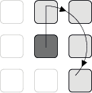

**Doubles** can be incorporated into melodic lines and recorded patterns to introduce timbral change within a performance gesture. Using these you can add CV recall throughout a melodic phrase as if you were playing a two-note chord.

### Triples

Three finger gestures, or **triples**, only recall CV sets. **Triples** allow the performance of timbral change in the same way as single presses perform notes. These gestures are particularly useful when patterns are playing back, recalling cv sets without adding notes or changing the root position.

### Defining Shape-Memories

Each shape has it's own values for each of the 3 CV channels. This *set* of values can be changed at any time by turning the respective panel knob to the desired setting. Changes are made to the currently selected shape, that is, the most recently performed shape gesture.

To define another shape's memory set, recall that shape with the double or triple gesture, and edit with the panel knobs.

Visual feedback of the current shape's set is provided on the panel leds and the bottom 3 rows of the grid as dim-lit leds.

### Slew

In addition to CV values, each shape's *set* can have a *Slew* time per CV channel. Hold the *SLEW* key (left column, 2nd from bottom) and turn the panel knobs to set the slew time for each channel. The grid display will show a bright led and dim-bar to indicate slew time on the bottom three rows.

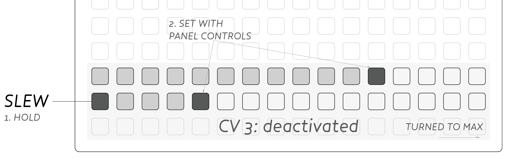

Max slew time is around 6 seconds, and time can be adjusted smoothly down to instant updates. When shape-memories are recalled with slew times, the bottom three grid rows will visualize the CV output, sliding to their destination value in accordance with the slew time.

### Deactivated Channels (max slew)

Setting *slew* to the maximum value will deactivate that channel's cv altogether for the current shape. Deactivated channels will visually turn off on the bottom three rows when holding the *SLEW* mode key.

When a shape has a deactivated channel, that cv channel will remain unchanged upon recall. If a channel is currently slew-ing toward a new value when a deactivated channel is recalled, the slew will continue as expected.

Use this functionality if you want long slews to remain uninterrupted while changing between other shape-memories quickly. Alternatively it can be used such that the given shape-memory takes on a different sound depending on the pattern that was recalled most recently before it.

## Patterns

In order to expand the possibilities within the Eurorack environment, performances across the keymap (notes and shape-memories) can be recorded live. There are 16 available pattern slots (per *Preset*, see below).

Once recorded, patterns can be manipulated: looped, transposed & time modulated. Each pattern can include up to 64 notes or shapes, with no limit on length in time.

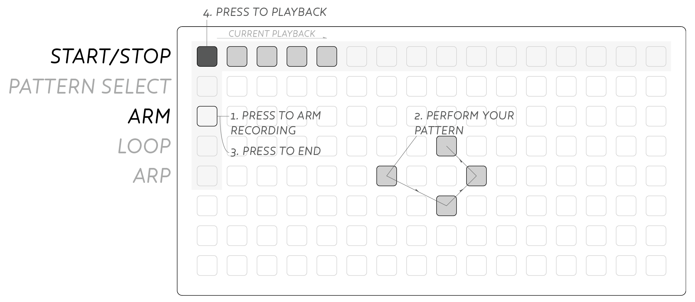

### Record

To make a pattern, press the ARM key (left column, third row down). The recording will begin at the first press of your performance. Play your pattern and press ARM again to end recording.

The START/STOP key (top left) will be lit to show that a pattern is present. Press START/STOP to begin playback, and again to stop the pattern midway. The pattern will play through to the end and then stop.

### Loop Mode

Each pattern can be set to loop by pressing the LOOP MODE key which will light. Now playback will start again when reaching the end of the recording.

### Auto-Loop Record

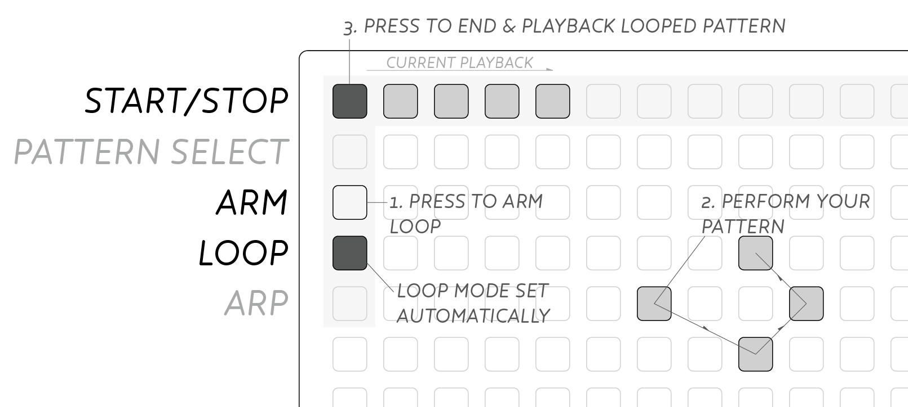

If you wish to loop a pattern directly, end your recording by pressing START/STOP rather than ARM. The pattern will instantly begin playback and the LOOP MODE toggle (left column, fourth row down) will be set.

### Retrigger

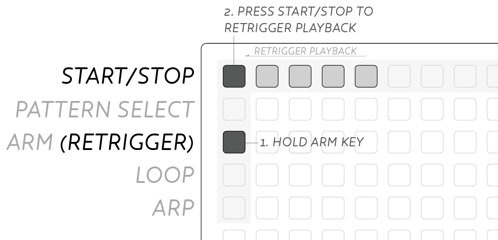

Patterns can be restarted while already playing, by holding ARM then pressing START/STOP.

### Pattern Select

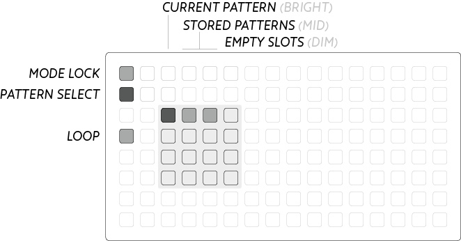

To access all 16 patterns, hold the P.SELECT button and pick a pattern from the lit 4×4 grid. The current pattern is displayed at full-brightness, existing patterns are mid-brightness, and empty slots are low-brightness.

### Pattern Bank Performance

The pattern bank itself can be performed directly, juggling between different patterns.

To enter, hold P.SELECT, then press START/STOP to lock onto the pattern bank. Now when you press a pattern slot it will playback instantly. Note that you can also set the LOOP mode for the selected pattern from within this mode.

## Arp Mode

In addition to playback and looping, patterns can also be transposed on the grid using Arpeggio, or ARP, mode. This functionality is greatly inspired by Stretta's [polygomé](https://github.com/stretta/BEAP) max patch.

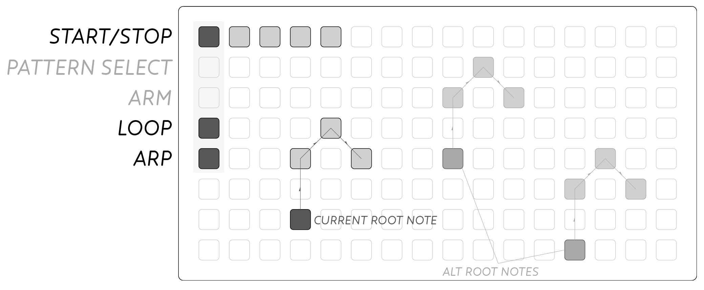

After recording a pattern, activate the ARP MODE button from the left column. You will see a lit key showing the pattern's 'root' position. Press this key to playback the pattern as normal (including looping if set).

Pressing elsewhere in the keymap will transpose and playback the pattern. This transposition is 'destructive' so leaving ARP mode will retain the last selected transposition.

Shape-memories are still available in this mode, where doubles set the root and begin playback, while triples only recall cv sets. Legato gestures will modulate the transposition of a pattern without restarting playback, particularly useful for longform recordings.

> Note: It is recommended to record patterns in the middle of the grid so they can be transposed in all directions. When a pattern tries to go 'outside' of the playing grid, it is clamped to the maximum value for that row or column.

## Portamento

Classic portamento, or pitch bend, can be applied to the *Pos* output with the PORTAMENTO button. Hold the lower-right key and turn Channel 1's knob to set the time, displayed on the 2nd row of the grid.

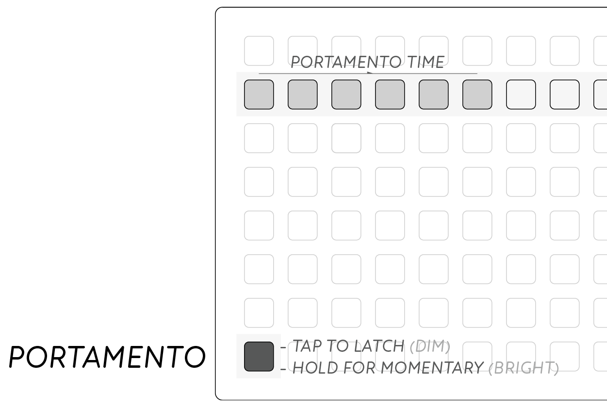

Tap PORTAMENTO to latch on, or perform the pitch glide by holding PORTAMENTO for momentary slides.

## Edge

The default behaviour of the *Edge* output is a traditional **HOLD** output. When holding a note down, *Edge* is high and stays high throughout a legato phrase, until all keys are lifted.

Using the EDGE MODE key (left column, 3rd from bottom) this behaviour can be changed to **FIXED** and **DRONE** modes. Hold EDGE and press within the 4×4 glyphs to select the different modes. The current selection will be brighter than the rest (flashing on mono-bright).

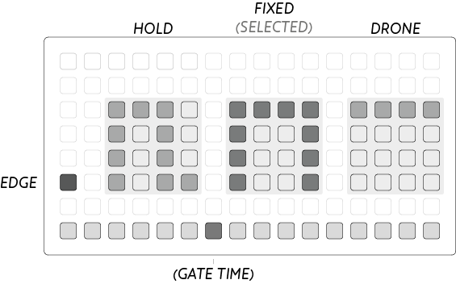

**FIXED** mode creates a fixed length gate at the *Edge* output. After selecting **FIXED** mode the bottom row will be activated displaying the *gate time*. Press in the bottom row, or turn the knob on Channel 1 to fine tune the gate time. When performing rapid presses in **FIXED** mode the timer is restarted at each new press, so legato phrases are still possible. Length can be very long for extended gates, particularly well matched to long-attack envelope generators.

**DRONE** mode allows easy latching of the *Edge* output. Pressing any key will cause *Edge* to go high, and it will remain high until that same position is pressed again, toggling off the lit key. **DRONE** is an 'infinite legato' mode where phrases can be performed in a smooth gesture without worrying about press/release technique.

## Runes

Above shapes have been exclusively referring to the *shape-memory* recall gestures. Additionally there a number of magic shapes or *Runes* that allow meta functions.

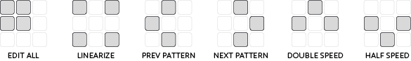

### Edit All

Press the *edit all* rune to enter a global setup mode. A flashing square appears in the right of the grid. Best used to set 'default' values that can be refined for each shape.

Turning the panel knobs will set the cv values for **every shape**. Holding the SLEW button allows setting slew for all shapes as well.

### Linearize

This *Rune* destructively edits the current pattern's timing, particularly useful for making arpeggio patterns and riffs.

The time between each note and shape is set to the same time interval as the first two notes or shapes. A pattern of 7 notes will thus become a rigid 7-beat sequence.

### Previous / Next Pattern

These *runes* allow navigating through the pattern bank without having to use the bank selector, nor stop playback. If a pattern is currently playing when this rune is pressed, the newly recalled pattern will begin playing immediately.

### Double / Half Speed

These *runes* destructively edit the playback speed of a pattern, even while it is currently playing. Press double-speed a couple times to make rapid arpeggios, or even Gameboy-esque chords when taken to the limit. Half speed opens up the possibility for long evolving chord sequences, especially when applied to a linearized pattern.

> Note: Doubling the speed too many times will gradually degrade the timing between notes. At the extreme this can mean patterns are not able to be returned to normal speed with the Half speed rune.
>
> Maximum time between events is over 60 seconds so a few Half Speed gestures can easily create 15+ minutes of playback.

## Presets

Entire collections of *shape-memories* and all sixteen patterns can be saved to internal flash. On power-up the most recently saved set will be recalled ready for performance.

To access the memory system, push the button next to the USB port on the panel. The display on the grid will change to show eight storage locations. Access each by pressing the leftmost column. Hold a position to save to this location. Press a currently selected location to load. Escape the memory screen by pressing the panel key again.

Quick-save to the current memory slot by push and holding the panel key.

It is possible to backup all your presets as part of the module's firmware; see [modular firmware updates](/docs/modular/update/).

## Chord Forms & Scales

The fourths & semitones arrangement was chosen to be at once familiar to a broad audience but also present an alternative way to approach harmony and scales in typically keyboard oriented electronic music. Using this arrangement allows melodic progressions over a wide range with relatively minor hand movements. The regular (or isometric) layout means patterns can be shifted around the keymap without alteration to play in different keys.

Below are a few examples of shapes and sequences to help orient oneself in the keymap and start the journey of learning the Earthsea instrument. In the below diagrams, dark keys represent the root note and octaves of it, grey keys represent the thirds, and finally keys with black outline represent the other scale tones for each map. Play through the octaves and thirds to form arpeggios.

Committing these shapes to memory will allow one to smoothly move between the vertical and diagonal shape for each scale and through practice and dedication play changes and improvised passages. Like all serious instruments, it requires practice, though hopefully the visual and tangible shapes aid in the process. Each map is displayed at an arbitrary starting note, but all can be moved around the grid into the appropriate key.

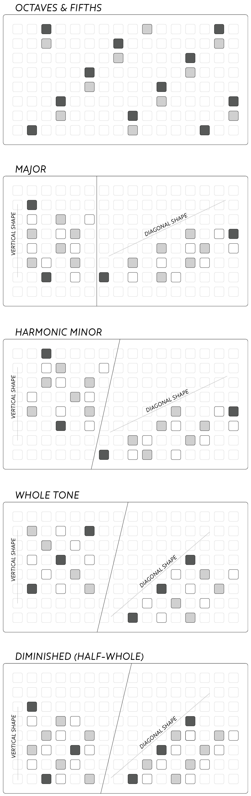

## Key map helper

While holding down *Slew* you can toggle on-off a "key map" on the main playing space. Toggled-on keys only serve as a visual cue, to help you remember a complicated scale or melody. Key maps are saved with each preset.

## USB MIDI

*Requires v1.8 firmware.* Thanks to [@ngwese](https://github.com/ngwese).

Plug in a class-compliant USB MIDI device and the Earthsea will act as a simple MIDI-to-CV converter.

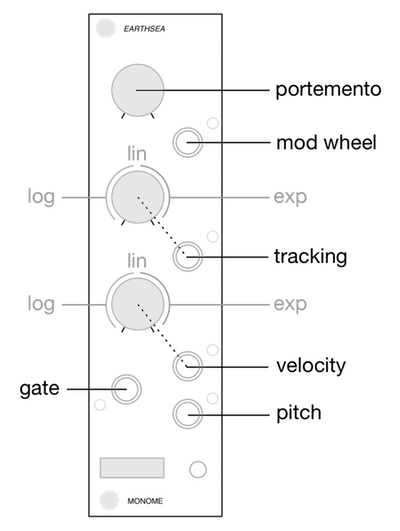

## Video Tutorial

<iframe src="https://player.vimeo.com/video/113231441?color=ff7700&title=0&byline=0&portrait=0" style="position:absolute;top:0;left:0;width:100%;height:100%;" frameborder="0" allow="autoplay; fullscreen" allowfullscreen></iframe>

