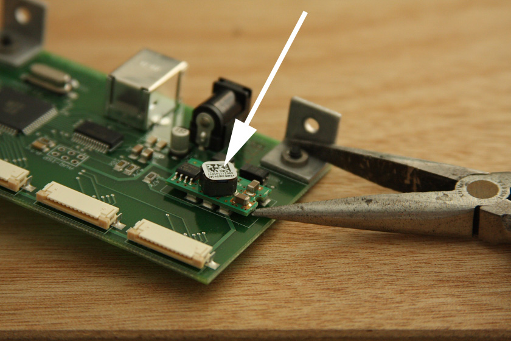
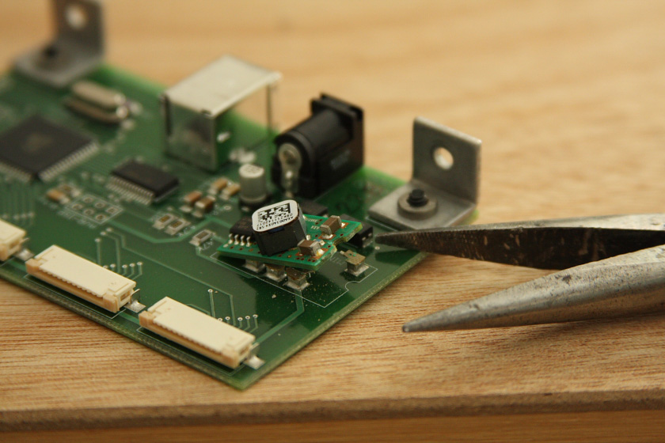
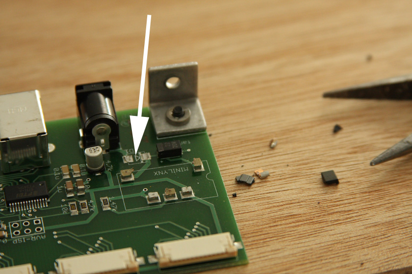
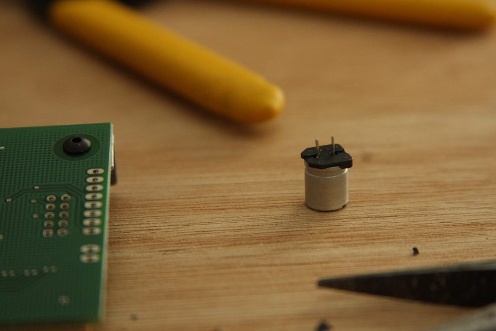
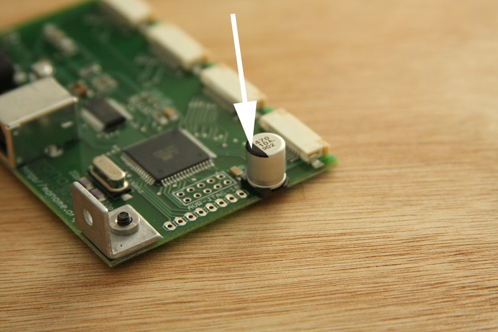
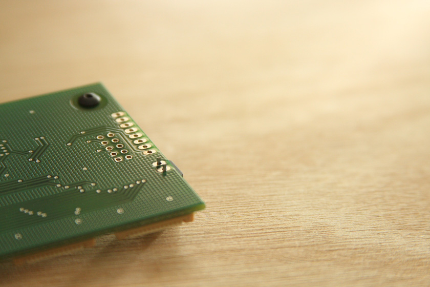
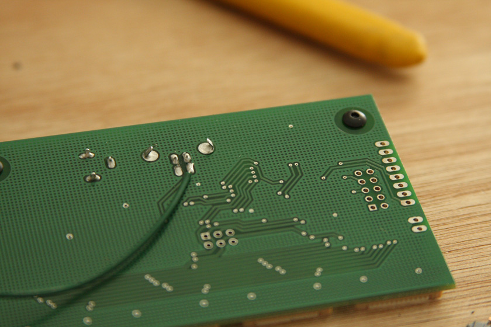
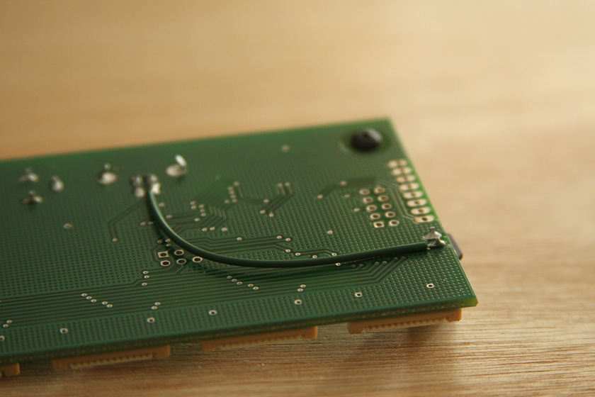

# bus power upgrade

for series (walnut and orange lighting) monome 128 and 256 devices.

### required parts

* short length of wire (22-26g stranded)
* 470uF electrolytic capacitor (ex: [digikey](http://digikey.com) p/n PCE4576CT-ND)

### required tools

* pliers
* soldering iron

upgrade kits are [available from monome](http://market.monome.org/products/bus-power-upgrade-kit).

or, if this process looks like it's not for you, we can do it for you (at a greater cost) contact [help@monome.org](mailto:help@monome.org).

## remove logic board

all modifications happen to the logic board. remove it according to [howto - disassemble the two fifty six](/docs/grid/disassembly/series). (disassembly is identical for monome 128).

## remove DCDC converter

this will certainly make you uncomfortable. the DCDC is the part indicated by the arrow in the photo below-- a bunch of small parts mounted to another circuit board. pry a set of pliers underneath and pull it off. this will require a bit of force. if traces come up with the pads, don't worry, just cut them before they run too far.

## remove diode

indicated by white arrow. you could use your soldering iron, or you can simply use your pliers (give it a twist to remove-- it'll probably break apart).

## install capacitor

bend the legs straight.

this capacitor has a polarity (indicated by the black bar on top). **do not put this in backwards!**

## jumper wire

connects between usb power and logic board power. ensure a solid, clean connection. add solder to each point, don't simply try to heat up and stab the wire in.

## complete

bus power upgrade finished!

suggestion for side plate finishing:

made of high grade 5052 aluminum, the side plates are soft enough to be workable.

each part is machine finished and have a brushed aesthetic. if you'd like to go for a higher polish, use steel wool or high-grit sand paper. with enough effort you can achieve near-mirror-quality.

this will also remove any scratches or markings.
