# grid disassembly: 40h edition

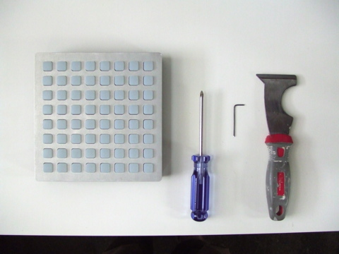

a visual journey towards the components of the 40h.

tools:
  - medium philips screwdriver
  - 1/16" hex wrench
  - paint scraper (something with an angled but not sharp edge)

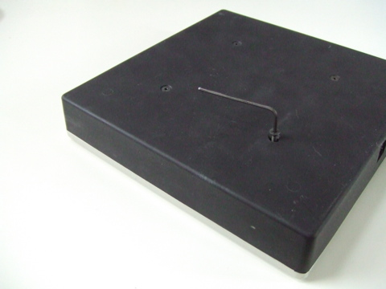

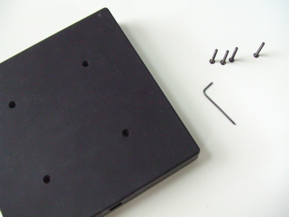

Run the scraper between the base enclosure and aluminum plate, separating the silicone layer.  careful not to cut into the enclosure.  go all the way around the perimeter through all four sides:

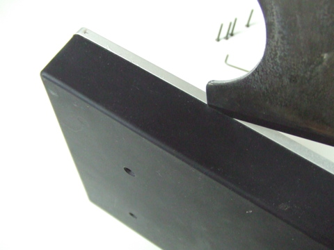

At one corner, pry the base directly away from the plate. free the corner just enough to get a good start at separation.

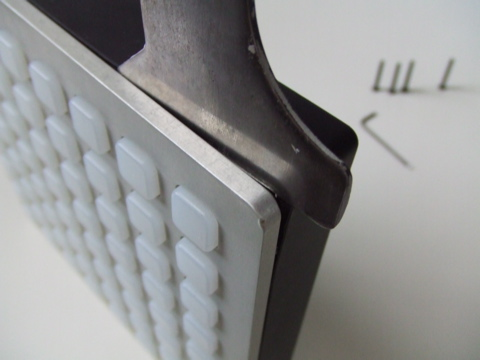

Use your hands to pull (don't be shy) the two apart.  This will take a decent grip.

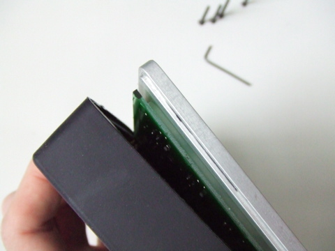

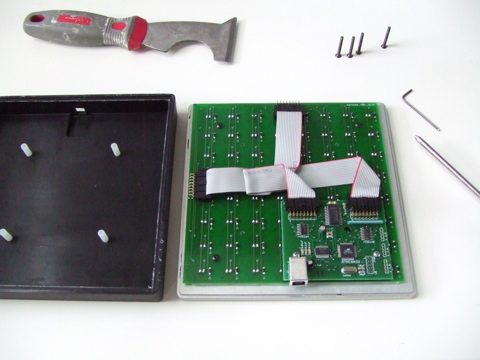

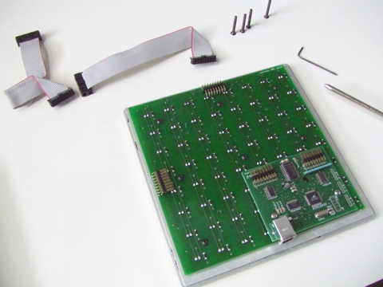

If you have one of the first 100 or so units made, you'll have the first style ribbons which are soldered to the board:

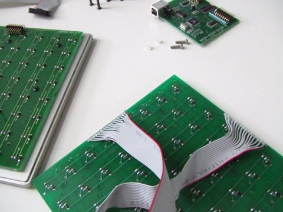

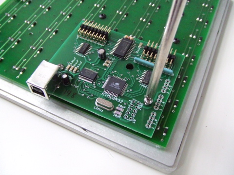

don't lose the small nylon standoffs:

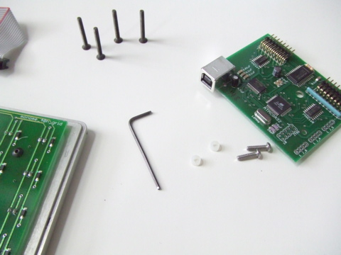

there are seven small hex screws holding the pcb to the plate:

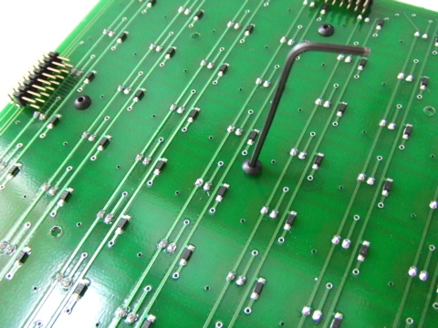

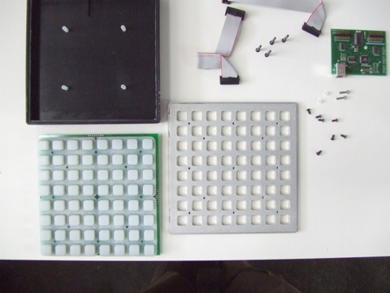

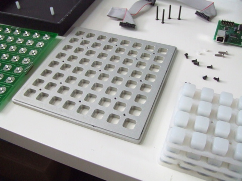

It's all out on the table now.
