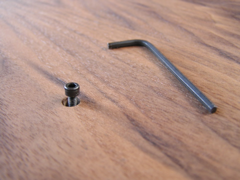

# grid disassembly: series edition

how to pull apart and reassemble a two fifty six with the help of a few photos.

what you'll need:
- 1/16" hex wrench
- 3/32" hex wrench

that's it really.  here we go.

## base enclosure

remove the four bottom hex socket screws.

separate the plate from the enclosure.  if it's tight, try holding the entire unit with both hands with the plate facing down.  sharply shake the unit downwards until the plate frees itself.  do not attempt to pry the plate out---you'll just damage the wood.

if it's really tight, reinsert the bottom hex screws just slightly, so they stick out past the wood.  now place the entire unit on a table, screws down.  gently push down on the wood sides.  the plate will pop out a bit. remove the screws completely now, and retry the shake method.

set the plate down on a table, holding the wood enclosure close without exerting stress on the ribbon cables.

detach the four ribbon cables.  pull close to the connector.

## hardware and pcbs

remove the four threaded hex spacers (no tool needed).

remove the sixteen small hex screws.

now the keypads are left.

## reassembly

the keypads have a proper orientation---the diodes on the pcb must fit into the gaps in the keypads.  this photo shows the gaps, make sure the pcbs lay in the same direction.  the boards will lay nicely flat if everything is aligned.  add the hex screws and hex standoffs.

unlatch all of the ribbon connectors on the grid boards.

unlatch the ribbon connectors on the logic board.

connect the ribbon cables to the grid board.  insert one end, metal side up, then close the latch to lock it in.  make sure each is well seated.  note that one cable has a bend in the connector---this belongs in the bottom left quadrant, as shown below.  make your setup look like this:

time to connect everything.  hold like shown, with cables coming toward you.

connect the closest (longest) left grid cable to the leftmost logic connector.  this is a bit tricky one-handed---you must hold the aluminum plate near through this process to avoid stress on the cables.  **metal side must be up** for proper contact.  note that this will require a twist of the ribbon.

connect further (shorter) left grid cable to the second logic connector.

connect close (longer, with bend in connector) right grid cable to third logic connector.

connect the remaining cable.

gently set and close the unit.  be sure the ribbons didn't get themselves pulled or pinched in some weird way.

add the four bottom cap screws and the job is done.
