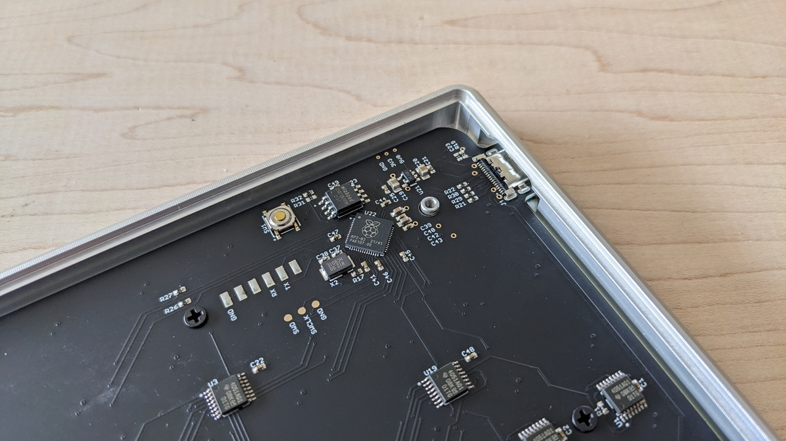

## firmware

### instructions

1. Remove the bottom screws.
2. Locate the golden pushbutton near the USB port. Hold it down while connecting the grid to a computer.
3. A USB drive will enumerate. Download the appropriate firmware listed below and copy the file to this drive. The drive will unmount immediately upon copying the file (on macOS this may cause a benign alert).
4. Disconnect and put the screws back on (make sure to place the spacers first).

### files

for the new [iii](/docs/iii) firmwares, see [github.com/monome/iii](https://github.com/monome/iii/releases/latest) for latest release files.

for original serialosc-only firmwares:

- zero, circuit board marking `monome/grid-zero/230412` - [download zero-240123.uf2](zero-240123.uf2)
- one, circuit board marking `monome/grid-one/230412` - [download one-240123.uf2](one-240123.uf2)
- late 2022, circuit board marking `monome/grid/220914` - [download grid-240123.uf2](grid-240123.uf2)
- **all other grid editions do not require a firmware update**

### troubleshooting

If you flash the firmware and don't see LED activity afterward, verify that the firmware file you flashed corresponds to the correct board version.

