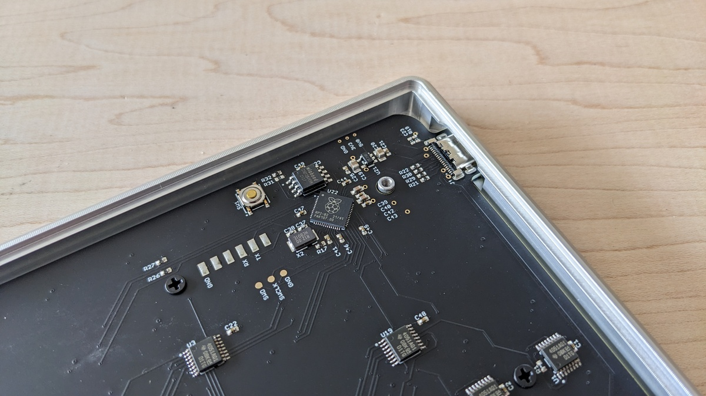

## firmware

Note that this is only for grids made in 2022 and early 2023, with the marking on the circuit board `monome/grid/220914`.

1. Remove the bottom screws.
2. Locate the golden pushbutton near the USB port. Hold it down while connecting the grid to a computer.
3. A USB drive will enumerate. Download the firmware [one.uf2](one.uf2) and copy the file to this drive.
4. Disconnect and put the screws back on (make sure to place the spacers first).

This new firmware addresses some edge communication stability issues and also low-brightness insconsistencies due to the LED driver circuit used.
