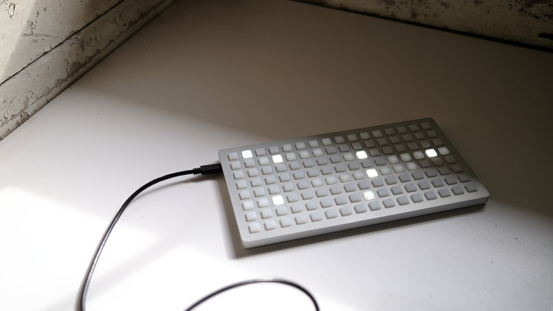

An open, tactile instrument that allows the user to imagine and define its function.

The monome grid by default does nothing. Connected to a computer or module, interaction is determined by the chosen application: sequencer, sample cutter, tone map, polyrhythm machine. We’ve put together studies to help you create your own.

Resources for connecting to:

- [norns](grid-norns) - sound computer made by monome
- [computer](grid-computer) - macOS, Windows, and Linux
- [modular](grid-modular) - Eurorack modules which support the grid

Additional information:

- [serialosc](/docs/serialosc) - an OSC server to connect a grid to your macOS, Windows or Linux machine
- [firmware](firmware) - late 2022 through early 2024 grid update
- [editions](editions) - information about different device generations
- [disassembly](disassembly) - guides for disassembling the hardware
- [care](care) - some suggestions for device maintenance (tl;dr: don't rest other gear on top of grid, as it will discolor pads)
- [bus power upgrade](buspowerupgrade) - some very early grid models had external power, they can be updated
