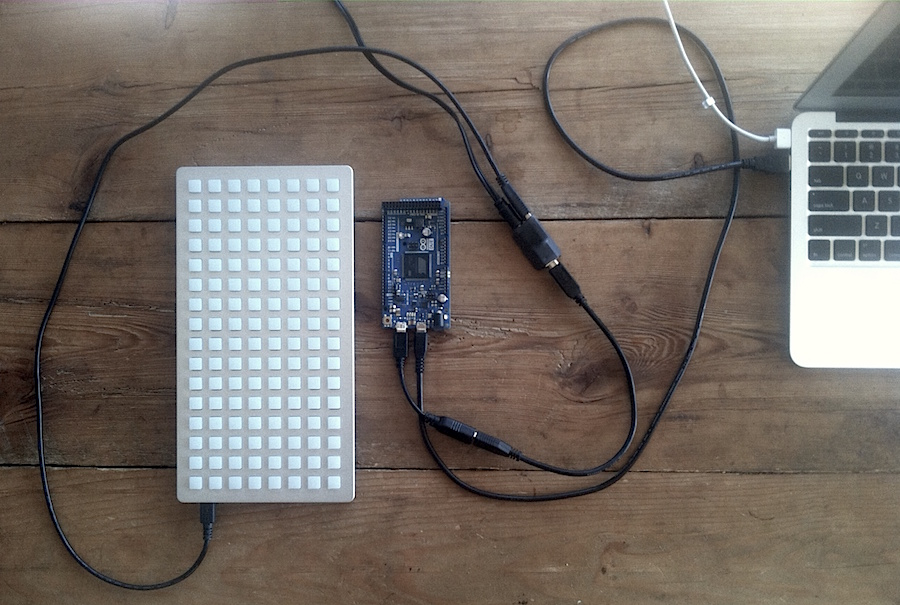
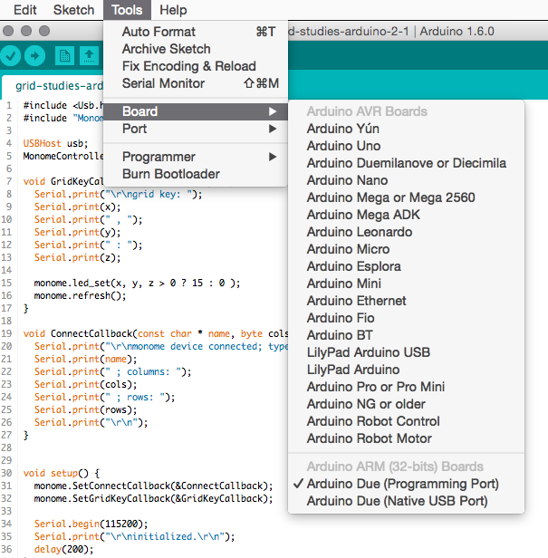
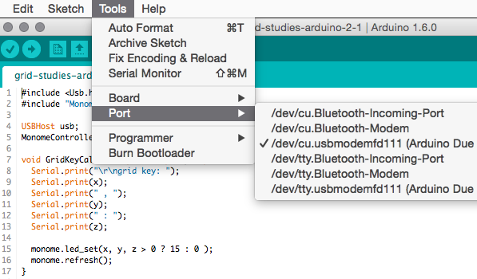
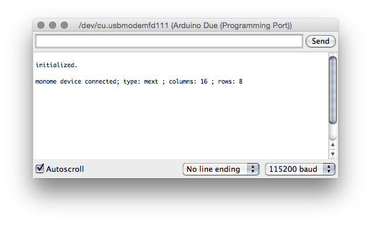

# Grid Studies: Arduino

Arduino is an open-source electronics platform based on easy-to-use hardware and software. It is intended for anyone making interactive projects.

We'll be using the Ardunio's USB Host capabilities to run grid code without a computer, with easy access to physical hardware: sensors, motors, other actuators, wireless bits, everything.

## Prerequisites

If you're very new to Arduino, it will be very beneficial to work through the 'Getting Started' section at Arduino.cc: [https://arduino.cc/en/Guide/HomePage](http://arduino.cc/en/Guide/HomePage)

Be sure you have Arduino version 1.6.0 or later. **It is required.**

Download Arduino: [arduino.cc](http://arduino.cc/en/Main/Software)

Download the monome installer: [/docs/serialosc/setup](/docs/serialosc/setup)

Download the code examples here: [files/grid-studies-arduino.zip](files/grid-studies-arduino.zip)

## Hardware

There are innumerable versions of the Arduino hardware.

**Ardunio Due required.** Other variants will not work. You can get them at the [Arduino Store](http://store.arduino.cc/product/A000062) and at various [distributors](http://arduino.cc/en/Main/Buy).

To gain access to the USB Host capabilities, you need a strange USB cable-- micro OTG to Female A. See [Digikey 839-1105-ND](http://www.digikey.com/product-search/en?x=0&y=0&lang=en&site=us&keywords=839-1105-ND).

Grids also require a substantial amount of power to light so many LEDs-- more power than an Arduino can supply. The solution to this is to power the grid externally. We've made a small adapter that does this, called *ext5v*. You can get one at [market.monome.org](http://market.monome.org).

The kit includes the needed OTG-A cable and a very short USB cable to make this entire setup very tidy, as seen below.



It is incredibly important to power the small adapter with 5V and nothing else. You can fry all sorts of things otherwise. The 5V DC supply is included in the kit (not shown in the photo).

## Setup

Download the MonomeHost library:

[github.com/monome/MonomeHost/releases/latest](https://github.com/monome/MonomeHost/releases/latest)

Unzip the file. Launch the Arduino software.

Go to `Sketch` > `Import Library` > `Add Library...`

Navigate to the unzipped folder of the MonomeHost library. It will be installed.

Finally, you'll need to select your `Board` and `Port` settings to specify the connected Arduino Due. See the screenshots below.

--



--



--

We're ready to go.


## 1. Connect

*See grid-studies-1.ino for this section.*

The MonomeHost library facilitates easy connection and communication with grids. First, two headers must be included, and then we initialize our grid:

```cpp
#include <Usb.h>
#include "MonomeController.h"

USBHost usb;
MonomeController monome(usb);
```

Next the `setup()` function is run, as is usual with Arduino:

```cpp
void setup() {
  monome.SetConnectCallback(&ConnectCallback);

  Serial.begin(115200);
  Serial.print("\r\ninitialized.\r\n");
  delay(200);
}
```

Here `SetConnectCallback()` assigns a function which will be called upon successful connection to a grid device.

After this, we set up the serial debug port and print something (to let us know we're getting started when the sketch runs.)

Here is the function we assigned to be called upon device connection:

```cpp
void ConnectCallback(const char * name, byte cols, byte rows) {
  Serial.print("\r\nmonome device connected; type: ");
  Serial.print(name);
  Serial.print(" ; columns: ");
  Serial.print(cols);
  Serial.print(" ; rows: ");
  Serial.print(rows);
  Serial.print("\r\n");
}
```

It prints out a bunch of device parameters, so you know it's connected.

And finally the main loop:

```cpp
void loop() {
  usb.Task();
}
```

That's it! Compile and upload the sketch. To actually see something happen, run the `Serial Monitor` which is in the `Tools` menu. Set the baud rate to 115200 as shown:



You should see something similar get printed. Try resetting the hardware with the button near the USB ports on the Arduino.

## 2. Basics

*See grid-studies-2.ino for this section.*

### 2.1 Key input

Within `setup()` we assign a function to handle key presses, similar to how we handle connection events:

```cpp
monome.SetGridKeyCallback(&GridKeyCallback);
```

And then the function itself:

```cpp
void GridKeyCallback(byte x, byte y, byte z) {
  Serial.print("\r\ngrid key: ");
  Serial.print(x);
  Serial.print(" , ");
  Serial.print(y);
  Serial.print(" : ");
  Serial.print(z);
```

Grid input has three parameters:

	x : horizontal position (0-15)
	y : vertical position (0-7)
	z : state (1 = key down, 0 = key up)

Right now we're just printing this data out to the serial monitor. We will, of course, do more interesting things with this function in the future.

### 2.2 LED output

We change the state of an LED by using the function:

```cpp
monome.led_set(x, y, z);
```

This changes the LED at position `(x,y)` to state `z`, where `z` is 0 to 15. 0 is off 15 is full brightness, with 14 dimmed levels in between.

The grid is not physically refreshed until you explicitly call:

```cpp
monome.refresh();
```

This way you can assemble a full grid update and refresh synchronously.

In our first example, we simply turn on LEDs according to key-downs, inside the `GridKeyCallback()` function:

```cpp
monome.led_set(x, y, z * 15);
monome.refresh();
```

Since `z` from the key input is 0 or 1, we multiply by 15 to get off and full brightness in the same position.

## 3. Further

Now we'll show how basic grid applications are developed by creating a step sequencer. We will add features incrementally:

- Use the top six rows as toggles.
- Generate a clock pulse to advance the playhead from left to right, one column at a time. Wrap back to 0 at the end.
- Display the play head on "position" (last) row.
- Indicate the "activity" row (second to last) with a low brightness.
- Trigger an event when the playhead reads an "on" toggle. Our "event" will be to turn on the corresponding LED in the "activity" row.
- Jump to playback position when key pressed in the position row.
- Adjust playback loop with two-key gesture in position row.


### 3.1 Toggles

*See grid-studies-3-1.ino for this step.*

First we'll create a new array called `step` that can hold 6 rows worth of step data. On key input we'll look for key-down events in the top six rows:

```cpp
// toggle steps
if(z == 1 && y < 6) {
	step[y][x] ^= 1;
	dirty = true;
}
```

If this condition is true, we toggle the corresponding position in the `step` data. Notice the addition of the `dirty` flag.

Inside `loop()` we check this flag. If true, it means we need to refresh the grid display.

```cpp
if(dirty) {
	redraw();
	monome.refresh();
	dirty = false;
}
```

We will "build" the LED display from scratch each time, inside of `redraw()`. Below we simply copy the `step` data to the `led` array, doing the proper multiplication by 11 in order to get almost-full brightness:

```cpp
void redraw() {
	monome.led_clear();
	for(int y=0;y<6;y++)
		for(int x=0;x<16;x++)
			monome.led_set(x,y,step[y][x] * 11);
}
```

First `led_clear()` completely clears the grid, and then we iterate through the array, copying `step` data to the grid.

After leaving `redraw()` we do `monome.refresh()` and then unset `dirty`.

That'll get us started.

### 3.2 Play

*See grid-studies-3-2.ino for this step.*

Now we need a clock. We'll make a quick (read: slightly sloppy) clock using `millis()`. First a few variables:

```cpp
unsigned long t = millis();
unsigned long interval = 200;
```

And then inside `loop()`:

```cpp
if(millis() - t > interval) {
	t = millis();
	next();
}
```

Each time this is called, the current time is compared to the last recorded `t` to see if it has reached `interval`. If so, we reset `t` to the current time and call `next()`, which will process the next sequence step.

You can change the speed by altering the value of `interval`. The value is roughly the number of milliseconds in between steps-- so smaller values will make the sequencer go faster.

Inside `next()` we update `play_position`:

```cpp

void next() {
  if(play_position == 15)
      play_position = 0;
  else
      play_position++;

  dirty = true;
}
```

This simply increments the position and wraps back to 0 once it hits the end. We set the dirty flag, as we want to redraw a play head on the grid. Shown is the updated `redraw()`:

```cpp
byte highlight;
for(byte x=0;x<16;x++) {
	if(x == play_position)
		highlight = 4;
	else
		highlight = 0;

	for(byte y=0;y<6;y++)
 		monome.led_set(x,y,step[y][x] * 11 + highlight);
}
```

During this loop which copies steps to the grid, we check if we're updating a column that is the play position. If so, we increase the highlight value. By adding this value during the copy we'll get a nice effect of an overlaid translucent bar.

### 3.3 Triggers

*See grid-studies-3-3.ino for this step.*

When the playhead advances to a new row we want something to happen which corresponds to the toggled-on rows. We'll do two things: we'll show separate visual feedback on the grid in the second-to-last (trigger) row, and we'll call a `trigger()` function that will send serial.

Drawing the trigger row happens entirely in the `redraw()`:

```cpp
// draw trigger row and on-triggers
for(byte x=0;x<16;x++)
	monome.led_set(x,6,4);
for(byte y=0;y<6;y++)
	if(step[y][play_position] == 1)
		monome.led_set(y,6,15);
```

First we create a dim row (level 4 is fairly dim). Then we search through the `step` array at the current play position, showing a bright indicator for each on state. This displays a sort of horizontal correlation of rows (or "channels") 1-6 current state.

For sending serial, we create a function `trigger()` which gets passed values of activated steps. This is what we do, inside `next()` right after we change `play_position':

```java
// TRIGGER SOMETHING
for(int y=0;y<6;y++)
	if(step[y][play_position] == 1)
		trigger(y);
```

And then `trigger()` itself:

```cpp
void trigger(byte i) {
	Serial.print(i);
}
```

You'll need to open Serial Monitor to see this. Compelling, yes! But this code is easily replaced with digital IO, sending MIDI, revving a motor, shooting a canon, etc.

### 3.4 Cutting

*See grid-studies-3-4.ino for this step.*

We will now use the bottom row to dynamically cut the playback position. First let's add a position display to the last row, which will be inside `redraw()`:

```cpp
// draw playback position
monome.led_set(play_position,7,15);
```

Now we look for key presses in the last row, in the `GridKeyCallback()` function:

```cpp
// toggle steps
if(z == 1 && y < 6) {
	step[y][x] ^= 1;
	dirty = true;
}
// cut
else if(y == 7) {
	if(z == 1)
		cutting = true;
		next_position = x;
	}
}
```

We've added two variables, `cutting` and `next_position`. Check out the changed code inside `next()` where we advance the play head:

```cpp
if(cutting)
	play_position = next_position;
else if(play_position == 15)
	play_position = 0;
else
	play_position++;

cutting = false;
```

Now, when pressing keys on the bottom row it will cue the next position to be played. Note that we set `cutting = false` after each cycle so that each press only affects the timer once.

### 3.5 Loop

Lastly, we'll implement setting the loop start and end points with a two-press gesture: pressing and holding the start point, and pressing an end point while still holding the first key. We'll need to add a variable to count keys held, one to track the last key pressed, and variables to store the loop positions.

```java
byte keys_held, key_last;
byte loop_start, loop_end = 15;
```

We set `loop_end` by default to the maximum length (15).

We count keys held on the bottom row thusly:

```cpp
keys_held = keys_held + (z*2) - 1;
```

By multiplying `z` by 2 and then subtracting one, we add one on a key down and subtract one on a key up.

We'll then use the `keys_held` counter to do different actions:

```cpp
// cut and loop
else if(y == 7) {
	// track number of keys held
	keys_held = keys_held + (z*2) - 1;

	// cut
	if(z == 1 && keys_held == 1) {
		cutting = true;
		next_position = x;
		key_last = x;
	}
	// set loop points
	else if(z == 1 && keys_held == 2) {
		loop_start = key_last;
		loop_end = x;
	}
}
```

We then modify the position change code in `next()`:

```cpp
if(cutting)
	play_position = next_position;
else if(play_position == 15)
	play_position = 0;
else if(play_position == loop_end)
	play_position = loop_start;
else
	play_position++;
```

Done!


## Closing

### Suggested Exercises

- "Record" keypresses in the "trigger" row to the toggle matrix.
- Display the loop range on the bottom row of the grid.
- Use the rightmost key in the "trigger" row as an "alt" key.
	- If "alt" is held while pressing a toggle, clear the entire row.
	- If "alt" is held while pressing the play row, reverse the direction of play.


## Credits

*Arduino* was founded by Massimo Banzi, David Cuartielles, Tom Igoe, Gianluca Martino, and David Mellis. [Arduino](http://arduino.cc).

*MonomeHost* was written by and is maintained by [Ezra Buchla](http://catfact.net).

This tutorial was created by [Brian Crabtree](http://nnnnnnnn.org) for [monome.org](https://monome.org).

Contributions welcome. Submit a pull request to [github.com/monome/docs](https://github.com/monome/docs) or e-mail `help@monome.org`.
