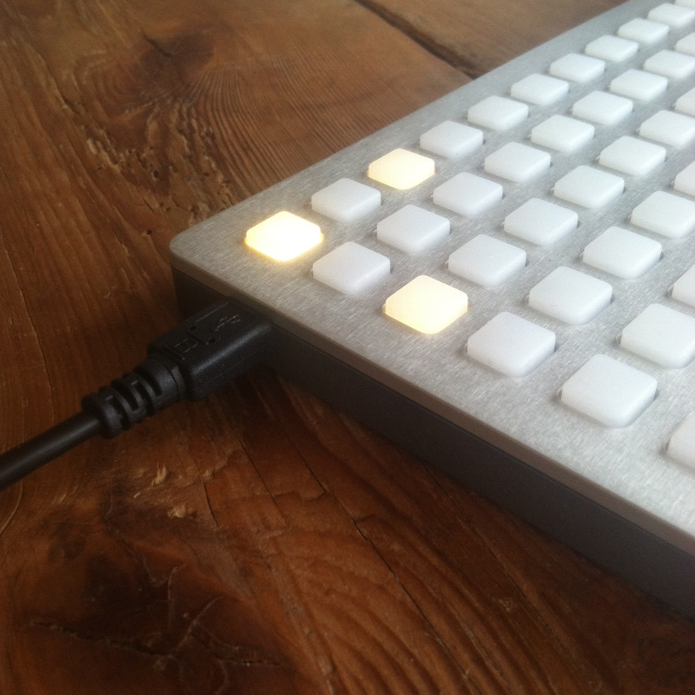

# Grid Studies: node.js

Node.js is a platform built on Chrome's JavaScript runtime for easily building fast, scalable network applications. Node.js uses an event-driven, non-blocking I/O model that makes it lightweight and efficient, perfect for data-intensive real-time applications that run across distributed devices.

Node.js is generally used to build web servers but can also be used to interface with monome devices, send and receive MIDI messages, or work with raw audio stream using the many modules available on [NPM](http://npmjs.org).

The `monome-grid` library has been designed for the latest stable version of Node, currently 8.9.x .

## Prerequisites

If you're very new to node.js (or JavaScript) a few tutorials and introduction videos have been provided below:

[Code School - Node.js](https://www.codeschool.com/courses/real-time-web-with-node-js)

[The Node Beginner Book](http://www.nodebeginner.org/)

Download Node.js: [nodejs.org](http://nodejs.org/)

Download the monome installer: [/docs/serialosc/setup](/docs/serialosc/setup)

Download the code examples here: [files/grid-studies-nodejs.zip](files/grid-studies-nodejs.zip)

## Initial Project Setup

First install node.js. The [official installers](https://nodejs.org/en/download/) for your platform of choice are recommended. (This guide presumes you're running either Mac OSX or Unix/Linux; whilst it should work on Windows, the examples are given for a Unix shell).

Once installed, open a terminal window and create a new folder:

```
$ mkdir grid-studies
$ cd grid-studies
```

Next run `npm init` to create a `package.json` file.  Just push enter on each of the prompts after running `npm init`:

```
$ npm init
```

Next install the `monome-grid` library:

```
$ npm install --save monome-grid
```

Now install the `easymidi` library:

```
$ npm install --save easymidi
```
Note: If you're experiencing errors while installing easymidi with npm, you might need the libasound2-dev package installed on your system. For debian: ```$ sudo apt install libasound2-dev```


You can now copy the examples to this folder and run them using the `node` command:

```
$ node grid_studies_2.js
```

## 1. Connect

The `monome-grid` library facilitates easy connection and communication with grids. It uses the modern javascript idiom of 'async/await' to reflect that grid code can't run until the grid has properly been initialised.

First, require the `monome-grid` library:

```javascript
const monomeGrid = require('monome-grid');
```

Then, connect to the grid inside an asynchronous function like so:

```javascript
async function run() {
  let grid = await monomeGrid();
}

run()
```

Here the first monome device found is attached. If you want to connect to a specific grid (if you have more than one connected) you can specify a serial number, which can be found using *serialosc-monitor*.

```javascript
async function run() {
  let grid = await monomeGrid('m1000011');
}

run()
```

The library communicates with *serialosc* to discover attached devices using OSC. For a detailed description of how the mechanism and protocol work, see [monome.org/docs/tech:osc](http://monome.org/docs/tech:osc).

## 2. Basics

*See grid\_studies\_2.js for this section.*

```javascript
const monomeGrid = require('monome-grid');

async function run() {
  let grid = await monomeGrid(); // optionally pass in grid identifier

  // initialize 2-dimensional led array
  let led = [];
  for (let y=0;y<8;y++) {
    led[y] = [];
    for (let x=0;x<16;x++)
      led[y][x] = 0;
  }

  // refresh leds with a pattern
  let refresh = function() {
    led[0][0] = 15;
    led[2][0] = 5;
    led[0][2] = 5;
    grid.refresh(led);
  }

  // call refresh() function 60 times per second
  setInterval(refresh, 1000 / 60);

  // set up key handler
  grid.key((x, y, s) => console.log(`key received: ${x}, ${y}, ${s}`));
}

run();
```


### 2.1 Key input

The monome-grid library calls the function passed to `grid.key()` upon receiving input from the grid. It has three parameters.

	x : horizontal position (0-15)
	y : vertical position (0-7)
	s : state (1 = key down, 0 = key up)

Inside our aysnc function, we define the key function and simply print out incoming data.

```javascript
grid.key((x, y, s) => console.log(`key received: ${x}, ${y}, $[s}`));
```

We will, of course, do more interesting things with this function in the future.

### 2.2 LED output

Use the `grid.refresh()` function to update the state of the LEDs on the grid. This function accepts an array which represents the entire grid, hence the full frame is updated on each call.

First, inside the async function, create the 2-dimensional array:

```javascript
let led = [];
for (let y = 0; y < 8; y++) {
  led[y] = [];
}
```

This array has 8 rows which each contain an empty array representing the columns. Each LED on the grid can have a brightness range of 0-15, where 0 is off and 15 is maximum brightness. The values in the array are initially undefined, but we can set them all to 0 as follows:

```javascript
let led = [];
for (let y = 0; y < 8; y++) {
  led[y] = [];
  for (let x = 0; x < 16; x++) {
    led[y][x] = 0;
  }
}
```

We can draw a small pattern by setting individual elements of the array:

```javascript
led[0][0] = 15;
led[2][0] = 5;
led[0][2] = 5;
```

And finally, to copy this entire array to the grid:

```javascript
grid.refresh(led);
```

As seen in *grid\_studies\_2.js* we place this code inside the `refresh()` function - itself, part of the async function `run`. Note that we run the `refresh` function 60 times a second, using `setInterval` Upon running the sketch you will see this:



### 2.3 Coupled interaction

*See grid\_studies\_2_3.js for this section.*

The previous code refreshes the grid constantly with every call of `refresh()`, which we typically do not want to do-- it doesn't make sense to have the computer spend time redrawing the same thing constantly.

Next we'll change the LED state to show which keys are being held, and only redraw when something has changed.

```javascript
const monomeGrid = require('monome-grid');

async function run() {
  let grid = await monomeGrid(); // optionally pass in grid identifier


  // initialize 2-dimensional led array
  let led = [];
  for (let y=0;y<8;y++) {
    led[y] = [];
    for (let x=0;x<16;x++)
      led[y][x] = 0;
  }

  let dirty = true;

  // refresh leds with a pattern
  let refresh = function() {
    if(dirty) {
      grid.refresh(led);
      dirty = false;
    }
  }

  // call refresh() function 60 times per second
  setInterval(refresh, 1000 / 60);

  // set up key handler
  grid.key((x, y, s) => {
    led[y][x] = s * 15;
    dirty = true;
  });
}

run();
```

We add a boolean variable `dirty` to indicate if the grid needs to be refreshed. We set this to `true` initially so the grid is immediately cleared upon start.

Now we change the grid display upon incoming key data:

```javascript
grid.key((x, y, s) => {
  led[y][x] = s * 15;
  dirty = true;
});
```

Since `s` is either 0 or 1, when we multiply it by 15 we get off or full brightness. We set the LED location according to the position of the incoming key press, x and y.

We changed the `led` array, so we specify that the grid need refreshing:

```javascript
dirty = true;
```

Once this flag is set, the grid will be updated on the next iteration of `refresh()`:

```javascript
let refresh = function() {
  if(dirty) {
    grid.refresh(led);
    dirty = false;
  }
}
```

Once we've refreshed the grid, we set the `dirty` flag to `false` so we're not needlessly refreshing.

The `refresh` function is called at 60fps unless you specify a different rate in the `setInterval(refresh, 1000 / 60)` such as `setInterval(refresh, 1000 / 10)` for 10fps.

As always, we wrap everything in an `async` function; see `grid_studies_2_3.js` for reference

### 2.4 Decoupled interaction

The most basic decoupled interaction is a toggle. Turn the grid into a huge bank of toggles simply by changing line 30 (which is in the `grid.key` callback function):

```javascript
if(s == 1) led[y][x] ^= 15;
```

Now only key downs (s = 1) do something. They use an xor operator to toggle the LED value between 0 and 15, depending on the previous state of the LED.

## 3. Further

Now we'll show how basic grid applications are developed by creating a step sequencer. We will add features incrementally:

- Use the top six rows as toggles.
- Generate a clock pulse to advance the playhead from left to right, one column at a time. Wrap back to 0 at the end.
- Display the play head on "position" (last) row.
- Indicate the "activity" row (second to last) with a low brightness.
- Trigger an event when the playhead reads an "on" toggle. Our "event" will be to turn on the corresponding LED in the "activity" row.
- Jump to playback position when key pressed in the position row.
- Adjust playback loop with two-key gesture in position row.


### 3.1 Toggles

*See grid\_studies\_3_1.js for this step.*

First we'll create a new array called `step` that can hold 6 rows worth of step data. Note that we've created a new function called `create2DArray` to help us create new arrays. On key input we'll look for key-down events in the top six rows:

```javascript
  // toggle steps
  if(s == 1 && y < 6) {
    step[y][x] ^= 1;
    dirty = true;
  }
```

If this condition is true, we toggle the corresponding position in the `step` data and set the dirty flag so the grid will refresh.

We will "build" the LED display from scratch each time we need to refresh. This will be done inside of `refresh()` so we no longer need the `led` array to be global. Below we simply copy the `step` data to the `led` array, doing the proper multiplication by 15 in order to get full brightness.

```javascript
let refresh = function() {
  if(dirty) {
    let led = create2DArray(8, 16);

    // display steps
    for (let x=0;x<16;x++)
      for (let y=0;y<6;y++)
        led[y][x] = step[y][x] * 15;

    // update grid
    grid.refresh(led);
    dirty = false;
  }
}
```

That'll get us started.

### 3.2 Play

*See grid\_studies\_3_2.js for this step.*

For simplicity we're going to make a not-very-smart timer to drive our sequencer. Basically we'll count `refresh` cycles and upon matching a specified interval, we'll take a step forward in the sequence.

```javascript
let timer = 0;
let play_position = 0;
const STEP_TIME = 10;
// ...

let refresh = function() {
  if(timer == STEP_TIME) {
    if(play_position == 15)
      play_position = 0;
    else
      play_position++;

    timer = 0;
    dirty = true;
  }
  else timer++;

// ...
```

In `refresh` we check `timer` against `STEP_TIME`. If they are equal, we process the next step, which in this case simply means incrementing `play_position`, which must be wrapped to 0 if it's at the end. We reset `timer` so it can count back up, and set the dirty flag so the grid redraws.

You can change the speed by altering `STEP_TIME`. (We've made it a constant, for now, assuming that it won't change during the running of the script. If you want to alter the tempo, it'll have to become a regular variable.

For the redraw we add highlighting for the play position. Note how the multiply by 15 has been decreased to 11 to provide another mid-level brightness. We now have a series of brightness levels helping to indicate playback, lit keys, and currently active keys:

```javascript
let highlight = 0;

// display steps
for (let x=0;x<16;x++) {
  // highlight the play position
  if(x == play_position)
    highlight = 4;
  else
    highlight = 0;

  for (let y=0;y<6;y++)
    led[y][x] = step[y][x] * 11 + highlight;
}
```

During this loop which copies steps to the grid, we check if we're updating a column that is the play position. If so, we increase the highlight value. By adding this value during the copy we'll get a nice effect of an overlaid translucent bar.

### 3.3 Triggers

*See grid\_studies\_3_3.js for this step.*

When the playhead advances to a new row we want something to happen which corresponds to the toggled-on rows. We'll do two things: we'll show separate visual feedback on the grid in the second-to-last (trigger) row, and we'll print something to the console.

Drawing the trigger row happens entirely in the `refresh()`:

```javascript
for(let x=0;x<16;x++) {
  led[6][x] = 4;
}

for(let y=0;y<6;y++) {
  if(step[y][play_position] == 1) {
    led[6][y] = 15;
  }
}
```

First we create a dim row (level 4 is fairly dim). Then we search through the `step` array at the current play position, showing a bright indicator for each on state. This displays a sort of horizontal correlation of rows (or "channels") 1-6 current state.

For the screen drawing, we create a function `trigger` which gets passed values of activated steps. This is what we do, inside `refresh` right after we change `play_position`:

```javascript
// TRIGGER SOMETHING
for(let y=0;y<6;y++) {
  if(step[y][play_position] == 1) {
    trigger(y);
  }
}
```

And then `trigger` itself:

```javascript
let trigger = function(i) {
  console.log(`trigger at ${i}`);
}
```

This simply prints on the console.  We could have this trigger a MIDI note for example.

### 3.4a Cutting

*See grid\_studies\_3_4.js for this step.*

We will now use the bottom row to dynamically cut the playback position. First let's add a position display to the last row, which will be inside `refresh()`:

```javascript
led[7][play_position] = 15;
```

Now we look for key presses in the last row, in the `key` function:

```javascript
grid.key((x, y, s) => {
  // toggle steps
  if(s == 1 && y < 6) {
    step[y][x] ^= 1;

    dirty = true;
  }
  // cut
  else if(y == 7) {
    if(s == 1)
      cutting = true;
      next_position = x;
  }
});
```

We've added two variables, `cutting` and `next_position`. Check out the changed code where we check the timer:

```javascript
if(timer == STEP_TIME) {
  if(cutting)
    play_position = next_position;
  else if(play_position == 15)
    play_position = 0;
  else
    play_position++;

  cutting = false;
  // ...
```

Now, when pressing keys on the bottom row it will cue the next position to be played. Note that we set `cutting = false` after each cycle so that each press only affects the timer once.

### 3.4b Loop

Lastly, we'll implement setting the loop start and end points with a two-press gesture: pressing and holding the start point, and pressing an end point while still holding the first key. We'll need to add a variable to count keys held, one to track the last key pressed, and variables to store the loop positions.

```javascript
let keys_held = 0
let key_last = 0;
let loop_start = 0
let loop_end = 15;
```

We set loop_end to 15 to begin with the full range. We count keys held on the bottom row thusly:

```javascript
keys_held = keys_held + (s*2) - 1;
```

By multiplying `s` by 2 and then subtracting one, we add one on a key down and subtract one on a key up.

We'll then use the `keys_held` counter to do different actions:

```javascript
// cut and loop
else if(y == 7) {
  // track number of keys held
  keys_held = keys_held + (s*2) - 1;

  // cut
  if(s == 1 && keys_held == 1) {
    cutting = true;
    next_position = x;
    key_last = x;
  }
  // set loop points
  else if(s == 1 && keys_held == 2) {
    loop_start = key_last;
    loop_end = x;
  }
}
```

We then modify the position change code:

```javascript
if(timer == STEP_TIME) {
  if(cutting)
    play_position = next_position;
  else if(play_position == 15)
    play_position = 0;
  else if(play_position == loop_end)
    play_position = loop_start;
  else
    play_position++;
```

Done!

### 3.5a Sending MIDI Notes

Let's make it actually send some MIDI notes.  The `easymidi` module can be used to create and listen to all types of MIDI events.  First we'll get some basic initialization out of the way by loading the `easymidi` module and creating a virtual MIDI input and output:

```javascript
const easymidi = require('easymidi');

const output = new easymidi.Output('grid out', true);
const input = new easymidi.Input('grid in', true);
```

Next let's implement the trigger method and make it actually do something.  We're going to add a new variable called `type` that will take the values `noteon` or `noteoff`:

```javascript
let trigger = function(type, i) {
  output.send(type, {
    note: 36 + i,
    velocity: 127,
    channel: 0
  });
}
```

Next we need to modify the code that calls trigger to pass it the `type` argument.  We'll need to send both "noteon" and "noteoff" messages to avoid leaving hanging notes.  To do this we'll calculate the `last_play_position` and use it to trigger "noteoff" messages while sending "noteon" messages to the current play_position:

```javascript
// TRIGGER SOMETHING
let last_play_position = play_position - 1;
if(last_play_position == -1)
  last_play_position = 15;
for(let y=0;y<6;y++) {
  if(step[y][last_play_position] == 1)
    trigger('noteoff', y);
  if(step[y][play_position] == 1)
    trigger('noteon', y);
}
```

Now if you open Ableton Live for example, you should see a "grid out" device that you can enable and route to an instrument.  You can also route the notes to a real MIDI device by changing this line:

```javascript
let output = new easymidi.Output('grid out', true);
```

To something like this:

```javascript
let output = new easymidi.Output('Real Device Name');
```

The `true` argument means create a virtual device so don't use that when interfacing with a real MIDI output.  If you aren't sure what the names of your devices are you can create a small script to check:

```javascript
let easymidi = require('easymidi');
console.log(easymidi.getOutputs());
```

Save this as `listmidi.js` and run it on the command line with `node listmidi.js`.  You should see an array of device names.

### 3.5b MIDI Clock Sync

Now we'll make the sequencer respond to MIDI clock messages.  First, we can delete the STEP_TIME and timer variables as they are no longer needed.  We'll also want to move the code that handles timing out of the `refresh()` function and into a few event handlers.  Here's the main event handler to listen for midi clock messages:

```javascript
let ticks = 0;

input.on('clock', () => {
  ticks++;
  if(ticks % 12 != 0)
    return;

  if(cutting)
    play_position = next_position;
  else if(play_position == 15)
    play_position = 0;
  else if(play_position == loop_end)
    play_position = loop_start;
  else
    play_position++;

  // TRIGGER SOMETHING
  let last_play_position = play_position - 1;
  if(last_play_position == -1)
    last_play_position = 15;
  for(let y=0;y<6;y++) {
    if(step[y][last_play_position] == 1)
      trigger('noteoff', y);
    if(step[y][play_position] == 1)
      trigger('noteon', y);
  }

  cutting = false;
  dirty = true;
});
```

This is mostly a re-arrangement of existing code but there is a new variable called `ticks` that we'll use to keep track of the number of MIDI clock messages we've received.  This function will get called every time a 'clock' message is received on the input device (our virtual MIDI device named "grid in").

MIDI clock messages come in at a rate of 96 per measure, so on each tick we'll check if it's divisible evenly by 12 to provide 8th note resolution:

```javascript
ticks++;
if(ticks % 12 != 0)
  return;
```

First we increment `ticks` and then do the divisibility check.  If it's not divisible by 12 we'll return out of the function and wait for the next tick.  If it is divisible we'll advance the play_position and trigger noteoff/noteon messages as needed.

This mostly works but we need to account for a few other MIDI messages.  For example, this won't trigger notes in the first `play_position`.  To trigger these notes we'll listen for the 'start' MIDI message:

```javascript
input.on('start', () => {
  for(let y=0;y<6;y++)
    if(step[y][play_position] == 1)
      trigger('noteon', y);
});
```

Another issue we have is that if we reset the play position to 0 in our DAW we we still might be halfway through playing the segment on the sequencer.  We should reset the `play_position` and `ticks` if this occurs:

input.on('position', (data) => {
  if(data.value != 0)
    return;
  ticks = 0;
  play_position = 0;
  if(loop_start)
    play_position = loop_start;
  dirty = true;
});

And that's it! We have a fully functioning MIDI sequencer that can sync to MIDI clock and trigger notes.  To try it out in Ableton, simply turn on the "sync" option for the "grid in" MIDI device and turn on the "track" option for the "grid out" device (and route it to an instrument).  See `grid_studies_3_5.js` for the completed MIDI implementation.

## Closing

### Suggested Exercises

- "Record" keypresses in the "trigger" row to the toggle matrix.
- Display the loop range on the bottom row of the grid.
- Use the rightmost key in the "trigger" row as an "alt" key.
	- If "alt" is held while pressing a toggle, clear the entire row.
	- If "alt" is held while pressing the play row, reverse the direction of play.
- Synchronize ticks/play_position based on the value coming in to the 'position' MIDI message (if it's non-zero).

## Credits

*Node.js* is maintained by [Joyent](http://www.joyent.com).

The *monome-grid* library was written and is maintained by [Tom Dinchak](https://soundcloud.com/phortran).

This tutorial was created by [Tom Dinchak](https://soundcloud.com/phortran) and [Tom Armitage](https://tomarmitage.com) for [monome.org](https://monome.org).

Contributions welcome. Submit a pull request to [github.com/monome/docs](https://github.com/monome/docs) or e-mail [info@monome.org](mailto:info@monome.org).
