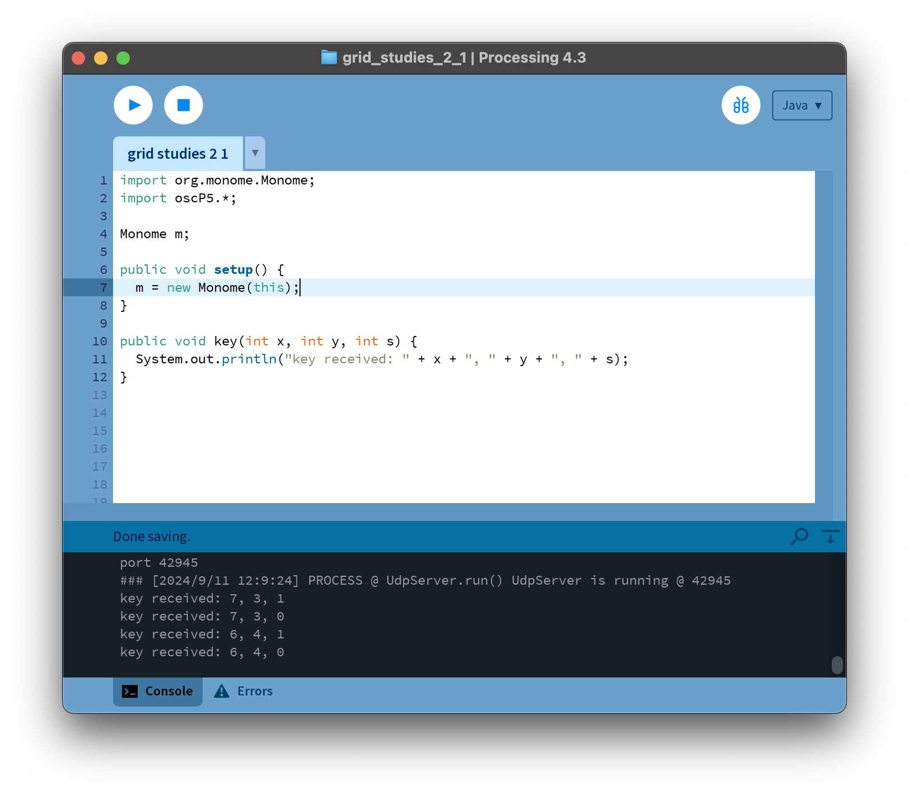
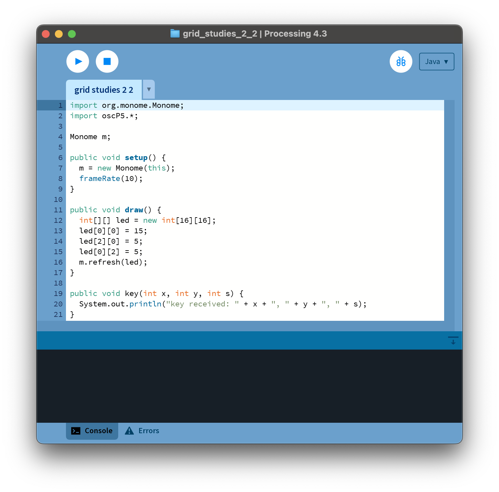
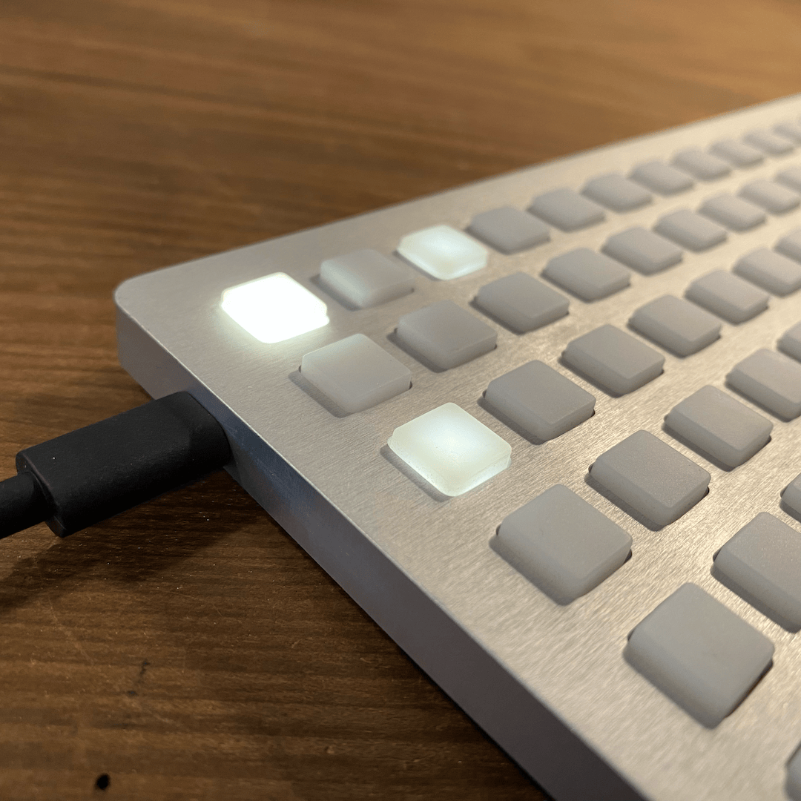
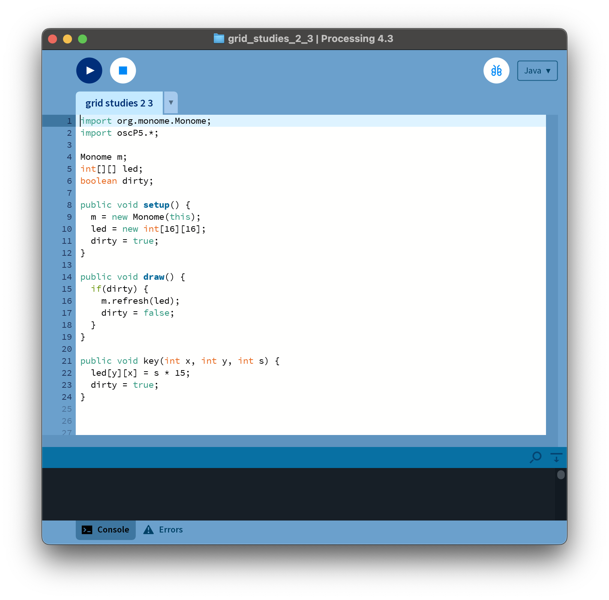
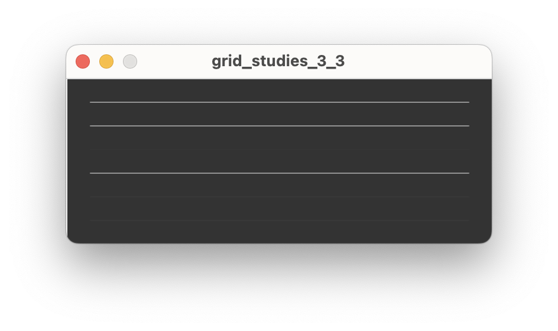

# Grid Studies: Processing
{: .no_toc }

Processing is a programming language, development environment, and online community. Initially created to serve as a software sketchbook and to teach computer programming fundamentals within a visual context, Processing has evolved into a development tool for multi-media performance, including interaction with hardware devices and libraries for sound manipulation. Highly accessible and with a wealth of tutorial information, Processing is a great choice for coding with the monome grid and is fully cross-platform making it highly useful when sharing projects.

<details open markdown="block">
  <summary>
    sections
  </summary>
  {: .text-delta }
- TOC
{:toc}
</details>

## Prerequisites

If you're very new to Processing or Java, it will be very beneficial to work through the 'getting started' tutorial available directly from Processing.org: [processing.org/tutorials](https://processing.org/tutorials/gettingstarted/)

Download Processing: [processing.org](http://processing.org)

Download and install serialosc: [/docs/serialosc/setup](/docs/serialosc/setup)

Download the code examples here: [files/grid-studies-processing.zip](files/grid-studies-processing.zip)

## Library Setup

Download the monome-processing library:

[github.com/monome/monome-processing/releases/latest](https://github.com/monome/monome-processing/releases/latest)

Download the oscP5 library:

[sojamo.de/libraries/oscp5](http://www.sojamo.de/libraries/oscp5)

These libraries must be copied to the `libraries` folder of your Sketchbook, which is typically `~/Documents/Processing/` on macOS and `/Documents/Processing/` on Windows.

For example, proper installation of `oscP5` on macOS would look like:

	~/Documents/Processing/libraries/oscP5/library/oscP5.jar

You'll need to restart Processing if it's running while you installed these libraries.

## 1. Connect {#connect}

The monome-processing library facilitates easy connection and communication with grids. Connect to a grid with the following code:

```java
import org.monome.Monome;
import oscP5.*;

Monome m;

public void setup() {
	m = new Monome(this);
}
```

Here the first monome device found is attached. If you have more than one grid connected and want to connect to a specific unit, you can specify a serial number, which can be found using *serialosc-monitor* / System Information on macOS / Device Manager on Windows.

```java
m = new Monome(this, "m1000011");
```

The library communicates with *serialosc* to discover attached devices using OSC. For a detailed description of how the mechanism and protocol work, see [monome.org/docs/tech:osc](http://monome.org/docs/tech:osc).

## 2. Basics {#basics}

In this section, we'll cover how to:

- interpret key presses
- draw LEDs coupled to key presses
- draw LEDs decoupled from key presses

### 2.1 Key Input {#key-input}

*See `grid_studies_2_1.pde` for this section.*



The monome library calls the function `key()` upon receiving input from the grid. It has three parameters.

	x : horizontal position (0-15)
	y : vertical position (0-7)
	s : state (1 = key down, 0 = key up)

Below we define the key function and simply print out incoming data.

```java
public void key(int x, int y, int s) {
  System.out.println("key received: " + x + ", " + y + ", " + s);
}
```

We will, of course, do more interesting things with this function in the future.

### 2.2 Drawing LEDs {#drawing-leds}

*See `grid_studies_2_2.pde` for this section.*



Since current grids are offered in 128 and 256 variants, we'll create a 16-by-16 array to keep our code size-agnostic:

```java
int[][] led = new int[16][16];
```

This array has 8 rows of 16 columns. On initialization this array is cleared (all elements set to 0). Each LED on the grid can have a brightness range of 0-15, where 0 is off and 15 is maximum brightness.

We can draw a small pattern by setting individual elements of the array:

```java
led[0][0] = 15;
led[2][0] = 5;
led[0][2] = 5;
```

We use the `m.refresh()` function to update the state of the LEDs on the grid. This function accepts an array which represents the entire grid, hence the full frame is updated on each call. So finally, to copy this entire array to the grid:

```java
m.refresh(led);
```

As seen in `grid_studies_2_2.pde` we place this code inside the `draw()` function. Upon running the sketch you will see this:



### 2.3 Coupled LED Interaction {#coupled-led-interaction}

*See `grid_studies_2_3.pde` for this section.*

The previous code refreshes the grid constantly with every call of `draw()`, which we typically do not want to do. It doesn't make sense to have the computer spend time redrawing the same thing constantly.

So, let's change the LED state to show which keys are being held, and *only* redraw when something has changed.



First, we move the `led` array to the top, so that it is global. This way we can change the array from inside the `key()` function. We then allocate the array as 16-by-16 inside of `setup()`.

We add a boolean variable `dirty` to indicate if the grid needs to be refreshed. We set this to `true` within `setup()` so the grid is immediately cleared upon start.

Now we change the grid display with incoming key data:

```java
public void key(int x, int y, int s) {
  led[y][x] = s * 15;
  dirty = true;
}
```

Since `s` is either 0 or 1, multiplying it by 15 provides either no light or full brightness. We set the LED location according to the position of the incoming key press, x and y.

We changed the `led` array, so we specify that the grid needs to be refreshed:

```java
dirty = true;
```

Once this flag is set, the grid will be updated on the next iteration of `draw()`:

```java
public void draw() {
  if(dirty) {
    m.refresh(led);
    dirty = false;
  }
}
```

Once we've refreshed the grid, we set the `dirty` flag to `false` so we're not needlessly refreshing.

The `draw()` function is called at 60 frames per second unless you specify a different rate in `setup()` such as `frameRate(10);`.

### 2.4 Decoupled LED Interaction {#decoupled-led-interaction}

The most basic decoupled interaction is a toggle. Turn the grid into a huge bank of toggles simply by changing line 22, in the `key` function:

```java
if(s == 1) led[y][x] ^= 15;
```

Now, only key presses (s = 1) do something, whereas releases are ignored. Each key press uses an XOR operator to toggle the LED value between 0 and 15, depending on the previous state of the LED.

## 3. Further {#further}

Now we'll show how basic grid applications are developed by creating a step sequencer. We will add features incrementally:

- Use the top six rows as toggles.
- Generate a clock pulse to advance the playhead from left to right, one column at a time. Wrap back to 0 at the end.
- Display the play head on "position" (last) row.
- Indicate the "activity" row (second to last) with a low brightness.
- Trigger an event when the playhead reads an "on" toggle. Our "event" will be to turn on the corresponding LED in the "activity" row.
- Jump to playback position when key pressed in the position row.
- Adjust playback loop with two-key gesture in position row.


### 3.1 Toggles {#toggles}

*See `grid_studies_3_1.pde` for this step.*

First we'll create a new array called `step` that can hold 6 rows worth of step data. On key input we'll look for key-down events in the top six rows:

```java
  // toggle steps
  if(s == 1 && y < 6) {
    step[y][x] ^= 1;
    dirty = true;
  }
```

If this condition is true, we toggle the corresponding position in the `step` data and set the dirty flag so the grid will refresh.

We will "build" the LED display from scratch each time we need to refresh. This will be done inside of `draw()` so we no longer need the `led` array to be global. Below we simply copy the `step` data to the `led` array, doing the proper multiplication by 15 in order to get full brightness.

```java
if(dirty) {
	int[][] led = new int[16][16];

	// display steps
	for(int x=0;x<16;x++)
		for(int y=0;y<6;y++)
			led[y][x] = step[y][x] * 15;

	// update grid
	m.refresh(led);
	dirty = false;
}
```

That'll get us started.

### 3.2 Play {#play}

*See `grid_studies_3_2.pde` for this step.*

For simplicity we're going to make a not-very-smart timer to drive our sequencer. Basically we'll count `draw()` cycles and upon matching a specified interval, we'll take a step forward in the sequence.

```java
int timer;
int play_position;
int STEP_TIME = 10;

// ...

public void draw() {
  if(timer == STEP_TIME) {
    play_position = (play_position + 1) % 16;
    timer = 0;
    dirty = true;
  }
  else timer++;

  // ...
```

In `draw()` we check `timer` against `STEP_TIME`. If they are equal, we process the next step, which in this case simply means incrementing `play_position` by 1, which must be wrapped to 0 if it's at the end. We reset `timer` so it can count back up, and set the dirty flag so the grid redraws.

You can change the speed by altering `STEP_TIME`.

For the redraw we add highlighting for the play position. Note how the multiply by 15 has been decreased to 11 to provide another mid-level brightness. We now have a series of brightness levels helping to indicate playback, lit keys, and currently active keys:

```java
int highlight;

// display steps
for(int x=0;x<16;x++) {
	// highlight the play position
 	if(x == play_position)
   		highlight = 4;
	else
   		highlight = 0;

 	for(int y=0;y<6;y++)
   		led[y][x] = step[y][x] * 11 + highlight;
}
```

During this loop which copies steps to the grid, we check if we're updating a column that is the play position. If so, we increase the highlight value. By adding this value during the copy we'll get a nice effect of an overlaid translucent bar.

### 3.3 Triggers {#triggers}

*See `grid_studies_3_3.pde` for this step.*



When the playhead advances to a new row we want something to happen which corresponds to the toggled-on rows. We'll do two things: we'll show separate visual feedback on the grid in the second-to-last (trigger) row, and we'll call a draw something to the computer screen.

Drawing the trigger row happens entirely in the `draw()`:

```java
// draw trigger bar and on-states
for(int x=0;x<16;x++)
	led[6][x] = 4;
for(int y=0;y<6;y++)
	if(step[y][play_position] == 1)
		led[6][y] = 15;
```

First we create a dim row (level 4 is fairly dim). Then we search through the `step` array at the current play position, showing a bright indicator for each on state. This displays a sort of horizontal correlation of rows (or "channels") 1-6 current state.

For the screen drawing, we create a function `trigger()` which gets passed values of activated steps. This is what we do, inside `draw()` right after we change `play_position':

```java
// TRIGGER SOMETHING
for(int y=0;y<6;y++)
	if(step[y][play_position] == 1)
		trigger(y);
```

And then `trigger()` itself, which just draws some lines:

```java
public void trigger(int i) {
  line(20,20+i*20,width-20,20+i*20);
}
```

Some code is added throughout the file to set up drawing and gently fade everything on each redraw.

### 3.4 Cutting {#cutting}

*See `grid_studies_3_4.pde` for this step.*

We will now use the bottom row to dynamically cut the playback position. First let's add a position display to the last row, which will be inside `draw()`:

```java
led[7][play_position] = 15;
```

Now we look for key presses in the last row, in the `key` function:

```java
public void key(int x, int y, int s) {
  // toggle steps
  if(s == 1 && y < 6) {
    step[y][x] ^= 1;

    dirty = true;
  }
  // cut
  else if(y == 7) {
    if(s == 1)
      cutting = true;
      next_position = x;
  }
}
```

We've added two variables, `cutting` and `next_position`. Check out the changed code where we check the timer:

```java
if(timer == STEP_TIME) {
	if(cutting)
		play_position = next_position;
	else if(play_position == 15)
		play_position = 0;
	else
		play_position++;

	cutting = false;
// ...
```

Now, when pressing keys on the bottom row it will cue the next position to be played. Note that we set `cutting = false` after each cycle so that each press only affects the timer once.

### 3.5 Loop {#loop}

Lastly, we'll implement setting the loop start and end points with a two-press gesture: pressing and holding the start point, and pressing an end point while still holding the first key. We'll need to add a variable to count keys held, one to track the last key pressed, and variables to store the loop positions.

```java
int keys_held, key_last;
int loop_start, loop_end;
```

Setup the default loop length to begin with the full range:

```java
public void setup() {
	...
	loop_end = 15;
}
```

To count keys held on the bottom row:

```java
keys_held = keys_held + (s*2) - 1;
```

By multiplying `s` by 2 and then subtracting one, we add one on a key down and subtract one on a key up.

We'll then use the `keys_held` counter to do different actions:

```java
// cut and loop
else if(y == 7) {
	// track number of keys held
	keys_held = keys_held + (s*2) - 1;

	// cut
	if(s == 1 && keys_held == 1) {
		cutting = true;
		next_position = x;
		key_last = x;
	}
	// set loop points
	else if(s == 1 && keys_held == 2) {
		loop_start = key_last;
		loop_end = x;
	}
}
```

We then modify the position change code:

```java
if(timer == STEP_TIME) {
	if(cutting)
		play_position = next_position;
	else if(play_position == 15)
		play_position = 0;
	else if(play_position == loop_end)
		play_position = loop_start;
	else
		play_position++;
```

Done!

## Closing {#closing}

### Suggested Exercises {#suggested-exercises}

- "Record" keypresses in the "trigger" row to the toggle matrix.
- Display the loop range on the bottom row of the grid.
- Use the rightmost key in the "trigger" row as an "alt" key.
	- If "alt" is held while pressing a toggle, clear the entire row.
	- If "alt" is held while pressing the play row, reverse the direction of play.


## Credits {#credits}

*Processing* was designed by Ben Fry and Casey Reas and is maintained by the [Processing Foundation](processing).

*monome-processing* was written by and is maintained by [Tom Dinchak](https://soundcloud.com/phortran).

This tutorial was created by [Brian Crabtree](https://nnnnnnnn.org) for [monome.org](https://monome.org), with updates in 2024 by [Dan/i Derks](https://dndrks.com).

Contributions welcome. Submit a pull request to [github.com/monome/docs](https://github.com/monome/docs) or e-mail [help@monome.org](mailto:help@monome.org).
