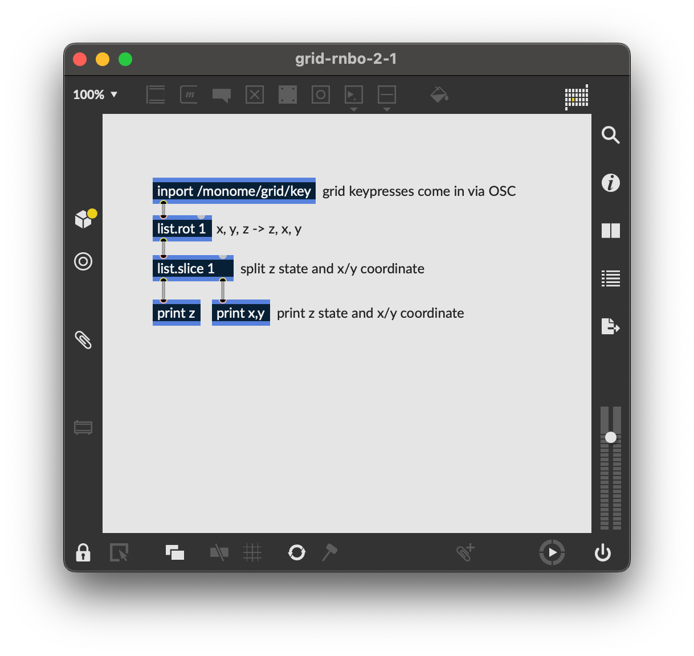
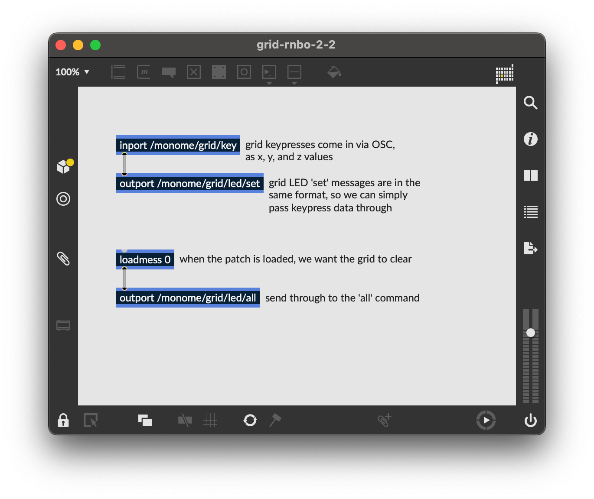
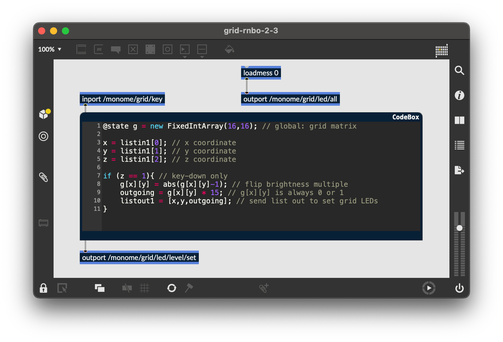
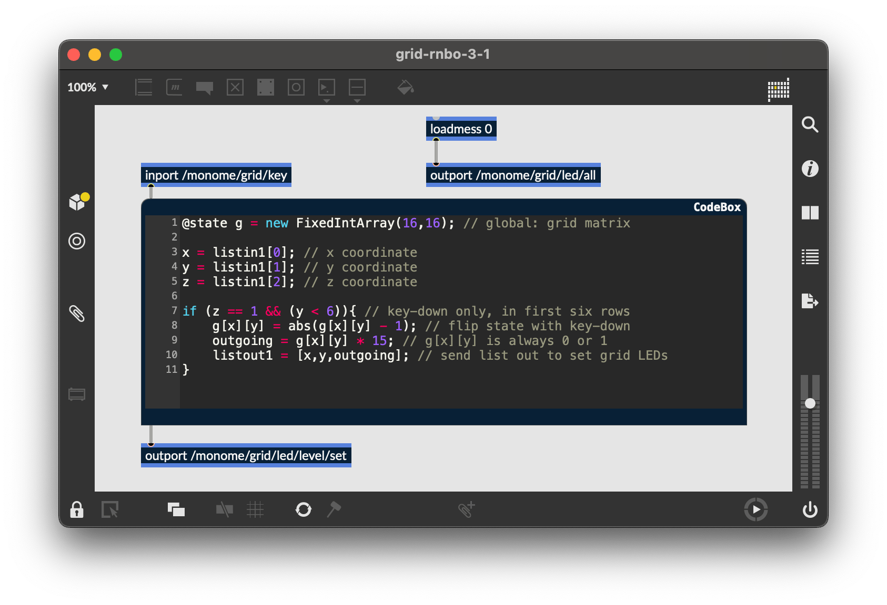
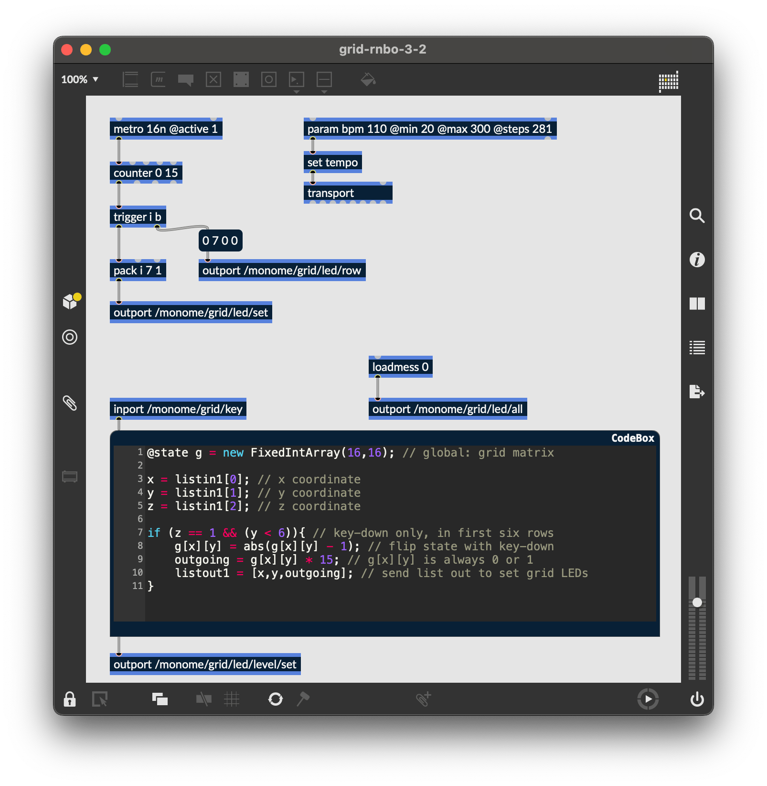
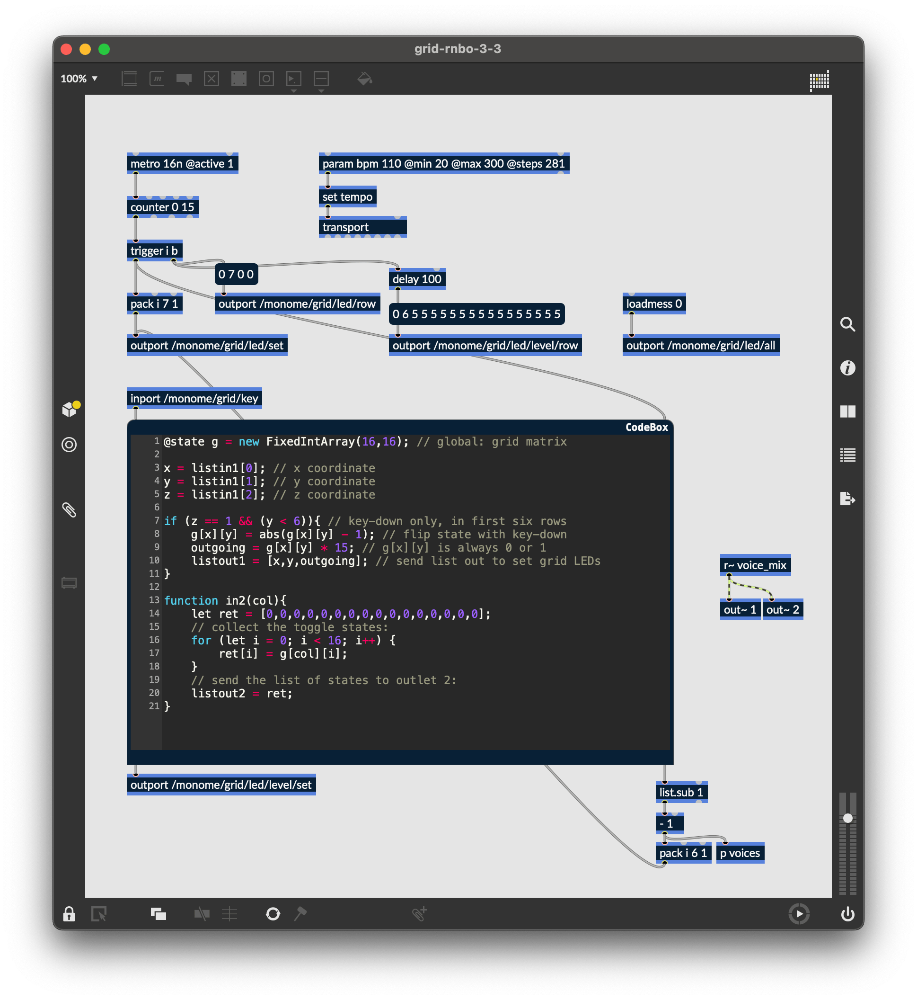
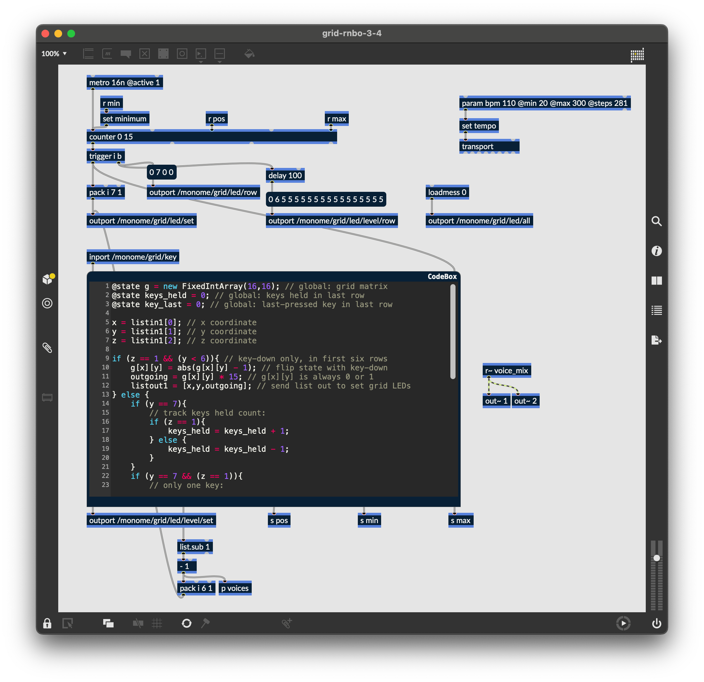

# Grid Studies: RNBO

RNBO, by [Cycling '74](https://cycling74.com/), is a library and toolchain that uses the same visual programming patching paradigm of [Max](/docs/grid/studies/max/), but which can be compiled to run on a number of external targets. Though RNBO can export to web experiences and audio plugins, this study will focus on the Raspberry Pi target.

This tutorial will show the basics of interfacing with the grid including how a simple, yet immediate sequencer platform can be made with a small amount of code.

## IMPORTANT: Prerequisites (#prerequisites)

Since RNBO is an extension of Max, this study assumes familiarity with Max's patching interface and workflow nuances. We'll also assume familiarity with navigating a command line interface, as required by the RNBO Raspberry Pi export process. If you're absolutely new to RNBO it may be helpful to first go through the documents and videos at the [RNBO Hub](https://rnbo.cycling74.com/).

This study's requirements:

- Install Max 8: [cycling74.com/downloads](https://cycling74.com/downloads/)
- Install the `monome` package from Max's [Package Manager](https://docs.cycling74.com/max8/vignettes/package_manager)
- Install serialosc: [/docs/serialosc/setup](/docs/serialosc/setup)
- Download the code examples here: [files/grid-studies-rnbo.zip](files/grid-studies-rnbo.zip)
- Set up a Raspberry Pi for RNBO export: [Raspberry Pi Target Overview](https://rnbo.cycling74.com/learn/raspberry-pi-target-overview)
- Once you've [set up your RNBO Pi](https://rnbo.cycling74.com/learn/raspberry-pi-setup), SSH in and execute:
  - `sudo apt-get update`
  - `sudo apt-get install serialosc`
  - `sudo apt-get install liblo-tools`
  - `sudo reboot now`

### style note

Throughout this text, we'll use the following formatting styles:

- `(message text)`: refers to a Max message object
- `[objectname @args val]`: refers to a non-message Max object and the arguments needed

### monitoring

To monitor the `[print]` messages throughout this study, SSH into your RNBO Pi and execute:

```bash
journalctl -u rnbooscquery -f
```

## 1. Connect

To communicate with grids we trade OSC messages with serialosc. serialosc is an invisible daemon on your computer, which translates OSC messages to streams of numbers over USB.

First we will show how to talk to serialosc using our RNBO-flashed Pi.

### IMPORTANT: grid + Pi (#grid-pi)

In a terminal on another computer connected to the same network, SSH into your Pi.

Connect your grid to the Pi and set up an OSC monitor with:

```bash
oscdump 6666
```

Open another terminal window and connect to the Pi via SSH again. To list the available devices, we’ll query `serialoscd` which listens on port 12002, and we’ll route the response to our monitor:

```bash
oscsend localhost 12002 /serialosc/list si localhost 6666
```

Say we have an 8x16 grid attached, results might look like this:

```bash
e9f889ce.ed5f7834 /serialosc/device ssi "m3752118" "monome one" 10806
```

Here, port `10806` is where the device is listening. **Note that this will be unique per setup, so we'll abstract this number with `<!port!>` in all of the following commands.**

To have this grid send data to our terminal, execute:

```bash
oscsend localhost <!port!> /sys/port i 6666
```

Press some keys on the Pi-connected grid and in our monitoring terminal window, we should see:

```bash
e9f88bc3.57bca105 /monome/grid/key iii 5 3 1
e9f88bc4.54676a72 /monome/grid/key iii 5 3 0
e9f88bda.263e2930 /monome/grid/key iii 7 4 1
e9f88bda.769e0a41 /monome/grid/key iii 8 3 1
e9f88bda.91f2020f /monome/grid/key iii 8 3 0
e9f88bda.938348f4 /monome/grid/key iii 7 4 0
```

### IMPORTANT: grid + RNBO + Pi setup (#important)

*Note: you will not be able to connect your grid to your RNBO project unless you perform these tasks.*

After completing the steps above, open `grid-rnbo-1.maxpat` and perform each of the numbered tasks.


## 2. Basics

*See `grid-rnbo-2.maxpat` for this section.*

RNBO's [inports and outports](https://rnbo.cycling74.com/learn/messages-and-ports#inports-and-outports) allow messages from the grid to flow in and out of the patcher. In `grid-rnbo-1-1.maxpat`, we added our grid to the [listener ports](https://rnbo.cycling74.com/learn/rnbo-raspberry-pi-oscquery-runner#listener-ports) to create a bi-directional communication link between the grid and the Pi.


### 2.1 Key input

*Open and export `grid-rnbo-2-1` to your Pi for this section.*



*Note: unless you reassign the prefix of your grid, it will default to `/monome`. If you've reassigned the prefix, please adjust all instances of `/monome` in the patcher to match your chosen string.*

To see what is coming from the grid, we'll print the `x`, `y` and `z` values reported by `/monome/grid/key` each time we press a key:

- `x` and `y` make up the 0-indexed Cartesian coordinates (eg. `0, 0` is the upper-left key )
- `z` indicates key down (`1`) or key up (`0`)

Since Max and RNBO both execute in right-to-left order, we'll use `[list.rot 1]` to rotate our incoming grid messages (typically reported as `/monome/grid/key x y z`), so we have `z` state listed first. We then use `[list.slice 1]` to slice up the messages into `z` (left outlet) and `x,y` (right outlet), which then print in order of Cartesian coordinate *then* state.

### 2.2 Coupled LED output

*Open and export `grid-rnbo-2-2` to your Pi for this section.*



The most basic grid patch is "light up the pressed key", which we can implement in RNBO very easily by passing the list of each key's press and release (`x`, `y` and `z`) to `/monome/grid/led/set`, which looks for the same data.

To clear the entire grid when our patch is loaded, we send `[loadmess 0]` through `[outport /monome/grid/led/all]`.

### 2.3 Decoupled interaction

*Open and export `grid-rnbo-2-3` to your Pi for this section.*



The grid can also display information beyond the current physical interaction. Throughout this doc, we'll refer to this quality of LED independence as being *decoupled*. The most fundamental decoupled interface is an array of toggles.

Here, where we'll introduce some text-based code alongside our visual patching using RNBO's `[codebox]`, a JavaScript-like scripting language for handling event code directly inside of RNBO.

Notes for this exercise:

- We'll use [RNBO's `@state` decorator](https://rnbo.cycling74.com/learn/understanding-storage-let-const-state-param) to create a global matrix to track our grid coordinates. `@state` data is *not* reset between `[codebox]` calls, unlike `let` variables.
- `[codebox]` allows [multi-dimensional arrays](https://rnbo.cycling74.com/codebox#fixed-arrays), perfect for grid's x/y coordinates
- `[codebox]` can ingest and output *lists* using `listinX` and `listoutX`, where `X` is the corresponding inlet or outlet
  - incoming lists can be parsed by index (starting at 0)

So, we use a `[codebox]` to ignore the key up state, switching the LED state *only* on key down:

```js
@state g = new FixedIntArray(16,16); // global: grid matrix

x = listin1[0]; // x coordinate
y = listin1[1]; // y coordinate
z = listin1[2]; // z coordinate

if (z == 1){ // key-down only
	g[x][y] = abs(g[x][y]-1); // flip brightness multiple
	outgoing = g[x][y] * 15; // g[x][y] is always 0 or 1 
	listout1 = [x,y,outgoing]; // send list out to set grid LEDs
}
```

By simply connecting the outlet of our `[codebox]` to the inlet of the grid's `[outport]` (and exporting to the Pi), we now have a toggle bank!

## 3.0 Further

*See `grid-rnbo-3.maxpat` for this step.*

Now we'll show how basic grid applications are developed by creating a step sequencer for a 128-sized grid. We will add features incrementally:

- Use the top six rows as toggles.
- Accept a clock pulse to advance the playhead from left to right, one column at a time. Wrap back to 0 at the end.
- Display the playhead on "position" (last) row.
- Indicate the "activity" row (second to last) with a low brightness.
- Trigger an event when the playhead reads an "on" toggle. Our "event" will be to turn on the corresponding LED in the "activity" row.
- Jump to playback position when key pressed in the position row.
- Adjust playback loop with two-key gesture in position row.


### 3.1 Toggles

*Open and export `grid-rnbo-3-1` to your Pi for this section.*



This works identically to our previous "decoupled interaction" example, but we want to **only use the first six rows**. So we add a conditional to our `[codebox]`'s `if` statement:

```js
@state g = new FixedIntArray(16,16); // global: grid matrix

x = listin1[0]; // x coordinate
y = listin1[1]; // y coordinate
z = listin1[2]; // z coordinate

if (z == 1 && (y < 6)){ // key-down only, in first six rows
	g[x][y] = abs(g[x][y] - 1); // flip state with key-down
	outgoing = g[x][y] * 15; // g[x][y] is always 0 or 1 
	listout1 = [x,y,outgoing]; // send list out to set grid LEDs
}
```

### 3.2 Play

*Open and export `grid-rnbo-3-2` to your Pi for this section.*



We can create a playhead with a simple `[counter 0 15]`, which will automatically wrap back to 0 after the 15th step.

To see the play position on the bottom row, we will need turn on the corresponding LED position *after* first clearing the entire row. To enforce this order, we'll use `trigger` object, which outputs what it receives in the ordered specified, from right to left.

We can clear a row by `bang`ing a `(0 7 0 0)` message and sending it through `[outport /monome/grid/led/row]`.

The format of this message is:

```
/monome/grid/led/row x_offset y d[...]
```

In this example `y` is 7, the last row. Check out the [full OSC spec](https://monome.org/docs/serialosc/osc/#grid) for more information on this message.

After we clear the row, we turn on the corresponding LED by packing the playhead's position as an integer along with `7` (row) and `1` (state), into a normal single-LED message:

```
[pack i 7 1] -> [outport /monome/grid/led/set]
```

We'll also add a [parameter](https://rnbo.cycling74.com/learn/using-parameters) to control the tempo of the patch, which can be accessed in the [Raspberry Pi Web Interface](https://rnbo.cycling74.com/learn/raspberry-pi-web-interface-guide).

Now when you export to the Pi target, you'll see the playhead moving along the bottom row.

### 3.3 Triggers and notes

*Open and export `grid-rnbo-3-3` to your Pi for this section.*



As the playhead moves we want to read the contents of the corresponding column and trigger notes based on which toggles are turned on.

We start by sending the column identifier of the current play position through the second inlet of our `[codebox]`, which triggers this function:

```js
function in2(col){
	let ret = [0,0,0,0,0,0,0,0,0,0,0,0,0,0,0,0];
	// collect the toggle states:
	for (let i = 0; i < 16; i++) {
		ret[i] = g[col][i];
	}
	// send the list of states to outlet 2:
	listout2 = ret;
}
```

The function will output a list of 0/1 values which indicate the toggle states from top to bottom. We can "extract" only the 1's (on-states) using a `[list.sub 1]`. However, these values are indexed from 1, and we need them indexed from 0 (because this is how the grid indexes its LEDs) so we subtract one.

We can light up the corresponding `x` position in the 6th row for each "event" with `[pack i 6 1]`, before sending the data back to `[outport /monome/grid/led/set]`. We also use this `x` position to trigger our voices, which are inside of the `[p voices]` sub-patcher. Inside of `[p voices]`, we use [RNBO's parameters system](https://rnbo.cycling74.com/learn/using-parameters) to determine the note value of each row:


Similarly to the play position display, we need to clear the row between refreshes. But since more than one event can be displayed per step, we'll want to clear only once per group of triggers. We can accomplish the desired visual effect by clearing the row 100 milliseconds after the events arrive.

Furthermore, to give the interface some delineation (not just a field of random LEDs) we will "clear" this row to a low-brightness level rather than completely off:

```
(0 6 5 5 5 5 5 5 5 5 5 5 5 5 5 5 5 5)
```

This message is sent to `[outport /monome/grid/led/level/row]`, which follows this format:

```
/monome/grid/led/level/row x_off y d[...]
```

The format is similar to the monochromatic `row` message, but here `d[...]` is discrete LED values of 0-15. The message we're using has 16 entries of the number 5, which sets the entire 6th row to a dim level.

The "triggered" LEDs will be full brightness, drawn on top of this dim row.

Lastly, there's a tiny sound engine so you can actually hear something. You can change the note values by opening up the [Raspberry Pi web interface](https://rnbo.cycling74.com/learn/raspberry-pi-web-interface-guide):


### 3.4 Cutting and Looping

*Open and export `grid-rnbo-3-4` to your Pi for this section.*



To liven up the sequencer, we will have key presses on the playhead row jump to the pressed position. But we also want a two-key gesture (holding down a first while pressing a second) to set the start-end loop boundaries. This requires keeping track of how many keys are being held down in the last row.

First we add states for `keys_held` and `key_last` in our `[codebox]`, increasing and decreasing the `keys_held` count when a key is pressed or released in the bottom row. Using this state, we can determine whether the two-key gesture has been executed:

- if it has, we update the `[counter]`'s minimum and maximum values
- if it hasn't, we simply update the `[counter]`'s current position (set on the next clock tick)

We then send these values through three new `[codebox]` outlets:

```js
@state g = new FixedIntArray(16,16); // global: grid matrix
@state keys_held = 0; // global: keys held in last row
@state key_last = 0; // global: last-pressed key in last row

x = listin1[0]; // x coordinate
y = listin1[1]; // y coordinate
z = listin1[2]; // z coordinate

if (z == 1 && (y < 6)){ // key-down only, in first six rows
	g[x][y] = abs(g[x][y] - 1); // flip state with key-down
	outgoing = g[x][y] * 15; // g[x][y] is always 0 or 1 
	listout1 = [x,y,outgoing]; // send list out to set grid LEDs
} else {
	if (y == 7){
		// track keys held count:
		if (z == 1){
			keys_held = keys_held + 1;
		} else {
			keys_held = keys_held - 1;
		}
	}
	if (y == 7 && (z == 1)){
		// only one key:
		if (keys_held == 1){
			key_last = x;
			out3 = key_last;
		// two keys:
		} else {
			if (key_last < x){
				out4 = key_last;
				out5 = x;
			}
		}
	}
}

function in2(col){
	let ret = [0,0,0,0,0,0,0,0,0,0,0,0,0,0,0,0];
	// collect the toggle states:
	for (let i = 0; i < 16; i++) {
		ret[i] = g[col][i];
	}
	// send the list of states to outlet 2:
	listout2 = ret;
}
```

## Closing

We've created a minimal yet intuitive interface for rapidly exploring sequences -- we can change event triggers, loop points, and jump around the data performatively. Many more features could be added. There are numerous other ways to think about interaction between key press and light feedback in completely different contexts.

### Suggested exercises

- Add MIDI output
- If you have access to a 256 grid, try adapting the 3.x patches to accommodate this larger size.
- Display the loop range with dim LED levels.
- "Record" keypresses in the "trigger" row to the toggle matrix.
- Display the playhead position as a dim column behind the toggle data.
- Use the rightmost key in the "trigger" row as an "alt" key.
	- If "alt" is held while pressing a toggle, clear the entire row.
	- If "alt" is held while pressing the play row, reverse the direction of play.

## Credits

*RNBO* is bundled with *Max* and is actively developed by [Cycling '74](http://cycling74.com).

This tutorial was created by [Dan Derks](https://dndrks.com) for [monome.org](https://monome.org), with generous feedback and counsel from Cycling '74 (Alex Norman, Tom Hall, and Alex Van Gils).

Contributions welcome. Submit a pull request to [github.com/monome/docs](https://github.com/monome/docs) or e-mail `help@monome.org`.