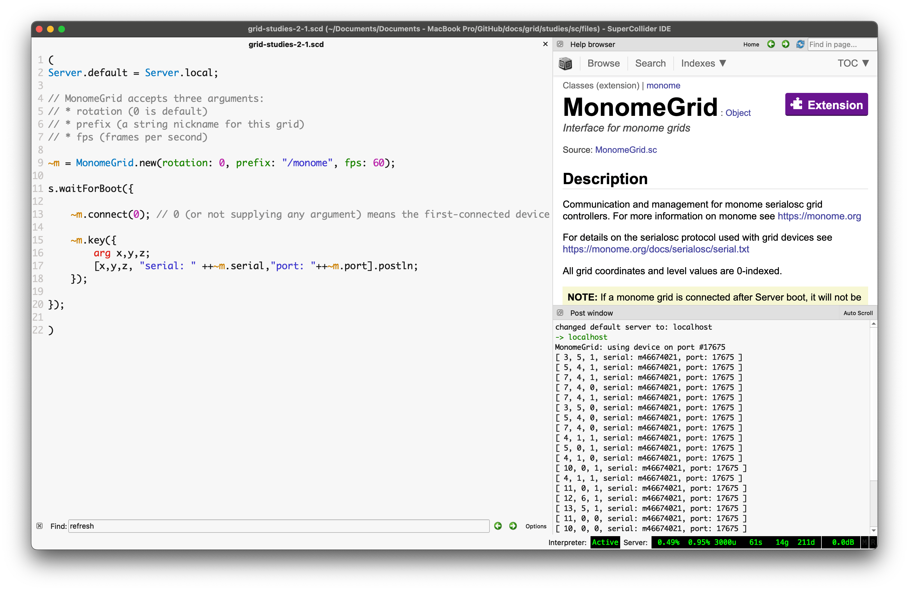

# Grid Studies: SuperCollider

SuperCollider is an environment and programming language for real time audio synthesis and algorithmic composition. It provides an interpreted object-oriented language which functions as a network client to a state of the art, realtime sound synthesis server.

## Prerequisites

If you're very new to SuperCollider, it will be very beneficial to work through the 'Getting Started' tutorial which is within SuperCollider's help file documentation.

Download SuperCollider: [supercollider.github.io](https://supercollider.github.io/)

Download the monome installer: [/docs/serialosc/setup](/docs/serialosc/setup)

Download the code examples here: [files/grid-studies-sc.zip](files/grid-studies-sc.zip)

## Library Setup

Download the monom library:

[github.com/catfact/monom/archive/master.zip](https://github.com/catfact/monom/archive/master.zip)

Unzip and copy the resulting folder to your SuperCollider user extensions folder:

- In SuperCollider, select "Open user support directory” from the File menu.
- Move or copy the `monom-master` folder into the `Extensions` folder (it might not exist,
  in which case you will need to create it).

## 1. Connect

The monom library facilitates easy connection and communication with grids. Connect to a grid with the following code:

~~~
~m = MonoM.new("/monome", 0);
// ...
~m.useDevice(0);
~~~

Here the first monome device found is attached. There needs to be a slight delay in between initalizing the new device and connecting to it. Starting up the server works fine:

~~~
~m = MonoM.new("/monome", 0);

s.waitForBoot({

~m.useDevice(0);
~~~

The arguments to the initializer are prefix and grid rotation.

The library communicates with *serialosc* to discover attached devices using OSC. For a detailed description of how the mechanism and protocol work, see [monome.org/docs/tech:osc](http://monome.org/docs/tech:osc).

## 2. Basics

*See grid-studies-2.scd for this section.*

### 2.1 Key input

We read grid key input by creating an OSC responder. Three parameters are received, in order:

	x : horizontal position (0-15)
	y : vertical position (0-7)
	s : state (1 = key down, 0 = key up)

Below we define the function and simply print out incoming data.

~~~
OSCFunc.newMatching(
		{ arg message, time, addr, recvPort;
			message.postln;
		}, "/monome/grid/key");
~~~

`/monome/grid/key` is the OSC pattern this function responds to. We can later pull apart `message` to use the `x`, `y`, and `s`.

### 2.2 LED output

Updating a single LED takes the form:

~~~
~m.ledset(x, y, s);
~~~

Where `s` ranges from 0 (off) to 15 (full brightness) with variable levels in between.

### 2.3 Coupled interaction

Instead of printing the key output, we can show the key state on the grid quite simply:

~~~
OSCFunc.newMatching(
		{ arg message, time, addr, recvPort;
			~m.ledset(message[1], message[2], message[3]);
		}, "/monome/grid/key");

});
~~~

### 2.4 Decoupled interaction

*See grid-studies-2-4.scd for this step.*

The most basic decoupled interaction is a toggle. Turn the grid into a huge bank of toggles by first creating an Array to store data. It needs to be the same size as our grid. We'll call this `step` and initialize it full of zeros.

~~~
~step = Array.fill(128, {0});
~~~

Now we need our key input code to switch the states. Instead of updating a single LED, we do this:

~~~
if(message[3] == 1, {
				var pos = message[1] + (message[2] * 16);
				if(~step[pos] == 1,
					{~step[pos] = 0},
					{~step[pos] = 1}
				);
				d.value;
			})
~~~

`message[3]` is the key state (down or up). Here we do something only on key down (value == 1). We calculate the position, and then change the value of the `step` based on its previous state.

We refresh the grid in function `d` which is executed with `d.value;`:

~~~
d = {
		for(0,7, {arg y;
			for(0,15, {arg x;
				~m.levset(x,y,~step[y*16+x] * 15);
			})
		})
	};
~~~
Here we traverse the array, updating each LED in according to its value. We multiply by 15 which gives us 0 (off) or 15 (full brightness) per position.

## 3. Further

Now we'll show how basic grid applications are developed by creating a step sequencer. We will add features incrementally:

- Use the top six rows as toggles.
- Generate a clock pulse to advance the playhead from left to right, one column at a time. Wrap back to 0 at the end.
- Display the play head on "position" (last) row.
- Indicate the "activity" row (second to last) with a low brightness.
- Trigger an event when the playhead reads an "on" toggle. Our "event" will be to turn on the corresponding LED in the "activity" row.
- Jump to playback position when key pressed in the position row.
- Adjust playback loop with two-key gesture in position row.

### 3.1 Toggles

We already have a full bank of toggles set up. Let's shrink down the bank to just the top 6 rows. First `step` can be reduced to 96 elements. And then we'll adjust the key detection so toggling only happens if `y` is less than 6:

~~~
	if((message[3] == 1) && (message[2] < 6), {
		var pos = message[1] + (message[2] * 16);
		if(~step[pos] == 1,
			{~step[pos] = 0},
			{~step[pos] = 1}
		);
		d.value;
	});
~~~

That will get us started.

### 3.2 Play

*See grid-studies-3-2.scd for this step.*

Let's make a timer routine that moves a virtual playhead.

~~~
t = Routine({
	var interval = 0.125;
	loop {
		if(~play_position == 15,
				{~play_position = 0;},
				{~play_position = ~play_position + 1;}
			);

		d.value;

		interval.yield;
	}

});

t.play();
~~~

This routine runs at a timing interval specified by the variable `interval`. The `play_position` is advanced, rolling back to 0 after 15. We redraw the grid each time the play head moves.

For the redraw we add highlighting for the play position. Note how the multiply by 15 has been decreased to 11 to provide another mid-level brightness. We now have a series of brightness levels helping to indicate playback, lit keys, and currently active keys:

~~~
d = {
		var highlight;
		for(0,15, {arg x;
			if(x==~play_position,
					{highlight = 1},
					{highlight = 0});

			for(0,5, {arg y;
				~m.levset(x,y,(~step[y*16+x] * 11) + (highlight * 4));
			});
		})
	};
~~~

During this loop which copies steps to the grid, we check if we're updating a column that is the play position. If so, we increase the highlight value. By adding this value during the copy we'll get a nice effect of an overlaid translucent bar.

### 3.3 Triggers

*See grid-studies-3-3.scd for this step.*

When the playhead advances to a new row we want something to happen which corresponds to the toggled-on rows. We'll do two things: we'll show separate visual feedback on the grid in the second-to-last (trigger) row, and we'll make a sound.

Drawing the trigger row happens in `d`:

~~~
d = {
		var highlight;
		for(0,15, {arg x;
			if(x==~play_position,
					{highlight = 1},
					{highlight = 0});

			for(0,5, {arg y;
				~m.levset(x,y,(~step[y*16+x] * 11) + (highlight * 4));
			});

			// set trigger row background
			~m.levset(x,6,4);
		});

		// show triggers
		for(0,5, {arg t;
			if(~step[(t*16) + ~play_position] == 1,
				{~m.levset(t,6,15);}
			)
		})
	};
~~~

First we create a dim row (level 4 is fairly dim). Then we search through the `step` array at the current play position, showing a bright indicator for each on state. This displays a sort of horizontal correlation of rows (or "channels") 1-6 current state.

And then trigger a sound, if the toggle is on, inside `t`:

~~~
// TRIGGER SOMETHING
for(0,5, {arg t;
	if(~step[(t*16) + ~play_position] == 1,
			{Synth(\singrain, [freq: (5-t)*100+300,
				amp: rrand(0.1, 0.5), sustain: interval * 0.8]);}
	)
});
~~~

If `step` is 1 for at `play_position` we trigger a sound. The frequency corresponds to the row position.

### 3.4 Cutting

*See grid-studies-3-4.scd for this step.*

We will now use the bottom row to dynamically cut the playback position. First let's add a position display to the last row, which will be inside `d`:

~~~
// play position
		~m.levset(~play_position,7,15);
~~~

We clear this row first, a few lines prior.

Now we look for key presses in the last row, in the key function:

~~~
OSCFunc.newMatching(
		{ arg message, time, addr, recvPort;

			if((message[3] == 1) && (message[2] < 6), {
				var pos = message[1] + (message[2] * 16);
				if(~step[pos] == 1,
					{~step[pos] = 0},
					{~step[pos] = 1}
				);
			});

			if((message[3] == 1) && (message[2] == 7), {
				~next_position = message[1];
				~cutting = 1;
			});
		}, "/monome/grid/key");
~~~

We've added two variables, `cutting` and `next_position`. Check out the changed code where we check the timer:

~~~
if(~play_position == 15,
		{~play_position = 0;},
		{
			if(~cutting == 1,
				{~play_position = ~next_position; ~cutting = 0;},
				{~play_position = ~play_position + 1;})
		};
	);
~~~

Now, when pressing keys on the bottom row it will cue the next position to be played. Note that we set `cutting = 0` after each cut so that each press only affects the timer once.

### 3.5 Loop

*See grid-studies-3-5.scd for this step.*

Lastly, we'll implement setting the loop start and end points with a two-press gesture: pressing and holding the start point, and pressing an end point while still holding the first key. We'll need to add a variable to count keys held, one to track the last key pressed, and variables to store the loop positions.

~~~
~keys_held = 0;
~key_last = 0;
~loop_start = 0;
~loop_end = 15;
~~~

We count keys held on the bottom row thusly:

~~~
if(message[2] == 7,
	if(message[3] == 1,
		{~keys_held = ~keys_held + 1;},
		{~keys_held = ~keys_held - 1;});
);
~~~

We'll then use the `keys_held` counter to do different actions:

~~~
// loop and cut
if((message[3] == 1) && (message[2] == 7), {
	if(~keys_held == 1, {
		~next_position = message[1];
		~cutting = 1;
		~key_last = message[1];
		},
		{
			~loop_start = ~key_last;
			~loop_end = message[1];
			~loop_end.postln;
	});
});
~~~

We then modify the position change code:

~~~
// update position
if(~cutting == 1,
		{~play_position = ~next_position; ~cutting = 0;},
		{
			if(~play_position == 15,
				{~play_position = 0;},
				{
					if(~play_position == ~loop_end,
						{~play_position = ~loop_start;},
						{~play_position = ~play_position + 1;});
				}
			);
		};
	);
~~~

Done!

## Closing

### Suggested Exercises

- "Record" keypresses in the "trigger" row to the toggle matrix.
- Display the loop range on the bottom row of the grid.
- Use the rightmost key in the "trigger" row as an "alt" key.
	- If "alt" is held while pressing a toggle, clear the entire row.
	- If "alt" is held while pressing the play row, reverse the direction of play.

## Credits

*SuperCollider* was written by James McCartney and is now maintained [as a GPL project by various people](http://supercollider.sourceforge.net).

*monom* was written by and is maintained by [Ezra Buchla](http://catfact.net).

This tutorial was created by [Brian Crabtree](http://nnnnnnnn.org) for [monome.org](https://monome.org). Huge thanks to Raja Das for his very extensive Monoming with SuperCollider Tutorial.

Contributions welcome. Submit a pull request to [github.com/monome/docs](https://github.com/monome/docs) or e-mail [info@monome.org](mailto:info@monome.org).
