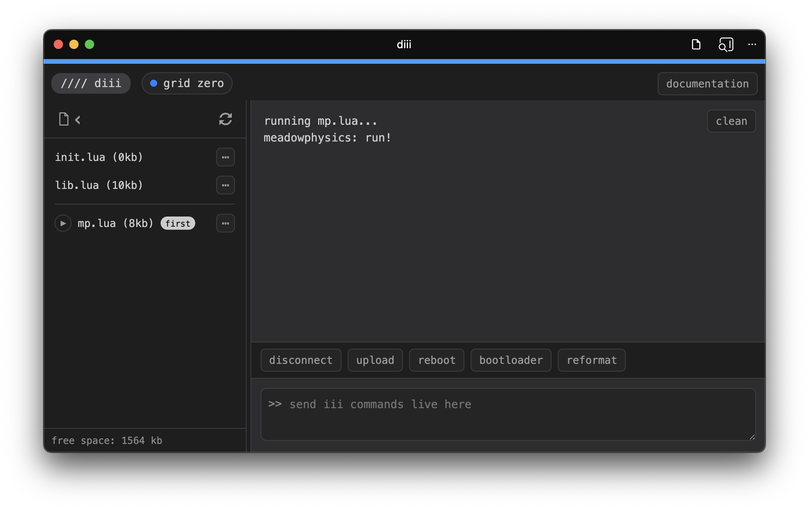

# iii

An evolution of capabilities for monome grid and arc, where an interactive scripting environment runs on the device itself.

- scripting is in Lua (which is familiar to [norns](https://monome.org/docs/norns) and [crow](https://monome.org/docs/crow))
- scripts can be uploaded and executed on startup
- the device enumerates as USB-MIDI for connecting directly to MIDI hosts
- also enumerates as USB-TTY for file transfer and live scripting interaction
- Lua libraries are provided for time-based operations (metros, measurement) and writing arbitrary data to the internal file system (ie: presets or stored sequences)

The grid was originally conceived of as "doing nothing by itself" without being connected to a computer running a program. Now the tiny computer inside the grid (RP2040) is capable of various musical operations on its own. We're hoping this means in some cases simply requiring less complexity (as in, a specialized eurorack module or DAW plugin or tricky command line framework). It also provides the possibility to connect to less-general-purpose computers (like phones) who prefer MIDI rather than serial.

That said, the original method of interfacing via norns or serialosc (and any of the [various languages and environments](https://monome.org/docs/grid/grid-computer/)) is a fundamentally excellent approach. iii fills a small gap.

The new firmware is capable of toggling between iii and monome/serial modes.

## Compatibility

grid -- [editions](/docs/grid/editions)

- yes: 2022 and later grids (includes grids one and zero).
- no: 2020-2021 grids use different microcontroller, hence cannot use this firmware. (they are, however, mechanically compatible so we are considering a PCB upgrade. TBA.)
- no: all other grids use an FTDI USB Serial chip which means they can't do USB-MIDI.

arc -- [editions](/docs/arc/editions)

- yes: 2025. has pushbutton.
- no: everything else.

_Note:_ [viii](https://github.com/dessertplanet/viii) is a browser-based virtual iii environment for grid and arc editions that don't support iii.

## Firmware Files

See [github.com/monome/iii](https://github.com/monome/iii/releases/latest) for latest release files.

## Firmware via Bootloader Switch

_Note:_ arc ships with iii support but still needs to be updated to the newest version. For firmware updates, activate the bootloader via `diii`, see below.

_Note:_ grids from 2022 have a different LED driver and hence require a different firmware. Identify the PCB revision by checking the date on the corner.

- Remove the bottom screws.
- Locate the golden pushbutton near the USB port. Hold it down while connecting the grid to a computer. This will start the device in bootloader mode.
- A USB drive will enumerate. Download the appropriate firmware and copy the UF2 file to this drive. The drive will unmount immediately upon copying the file (on macOS this may cause a benign alert).
- Disconnect and put the screws back on (make sure to place the spacers first).
- You'll immediately need to understand "modes" so read on to avoid confusion.

## Firmware Updates

For firmware _updates_ you can use the `diii` application (see below) to reboot the device into bootloader mode without opening the unit again.

_Note:_ If you had a previous beta firmware installed, execute `fs_reformat()` (or click the reformat button) and restart the device to ensure the newest lib is installed.

## Modes

The "mode" is indicated by the startup light pattern.

- particles: this is standard monome/serial mode, compatible with norns, serialosc, ansible, etc.
- plasma: iii mode with a blank script.

(Particles looks like an explosion, plasma more like waves).

To change the mode, while powering up the device hold down
- grid: key 1,1 (top left)
- arc: there's only one key

To force-clear a script, switch _into_ iii mode while holding down the key until the timer animation completes. (This may be helpful for debugging a locked-up script).

## diii

A browser-based utility to manage and live-code iii devices.



[monome.org/diii](https://monome.org/diii)

See the [full documentation](/docs/iii/diii).

Alternatively, see the Python-based [command line version](/docs/iii/diii-cli).

## Library

arc

- [cycles](library/cycles) - rotating midi cc with friction
- [erosion](library/erosion) - four by four meta cc with interpolation and scene recall
- [snows](library/snows) - very slow asynchronous arpeggiator
- [ribbons](library/ribbons) - folded euclidean arpeggiator

grid

- [intervals](library/intervals) - basic MIDI note map
- [meadowphysics](library/mp) - rhizomatic cascading counter
- [wake](library/wake) - polymodulated parameter sequencer

See the [iii thread](https://llllllll.co/t/iii/74311) on the lines forum for other community scripts.

Note: if you've written a script for the old firmware, here's a short [porting guide](/docs/iii/porting) to update the syntax.


## Scripting

A very simple example grid script which sends MIDI notes:

```lua
grid_led_all(0)
grid_refresh()

function event_grid(x,y,z)
  note = x + (7-y)*5 + 50
  print(note,z)
  if z>0 then midi_note_on(note) else midi_note_off(note) end
  grid_led(x,y,z*15)
  grid_refresh()
end
```

See the [scripting reference](/docs/iii/code) for library functions.

Discussion happens at [iii scripting thread](https://llllllll.co/t/iii-scripting/74312) on the lines forum.


## Further

iii is open source under GPLv3 at [codeberg.org/tehn/iii](https://codeberg.org/tehn/iii)

We designed this system to be a platform for building DIY controllers and instrments. See the [example project](https://codeberg.org/tehn/iii-blink) for a Pico devboard.

Please do not clone monome designs for commercial purposes. It directly impacts us and the community negatively and makes us less compelled to share sources. We've shared these resources to help new ideas become real. Please go have new ideas, we'd love to see them.


## Acknowledgements

iii is a monome initiative, designed and coded primary by Brian Crabtree aka [tehn](https://nnnnnnnn.co) and [Ezra Buchla](https://ezrabuchla.com). web-diii was coded by Dune Desormeaux aka [dessertplanet](https://github.com/dessertplanet).

