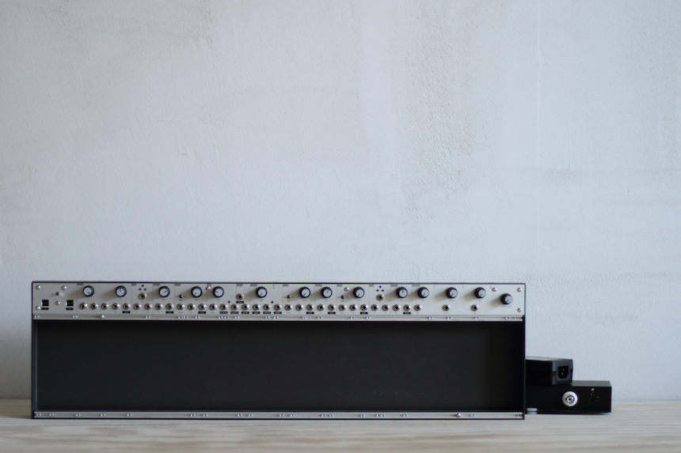
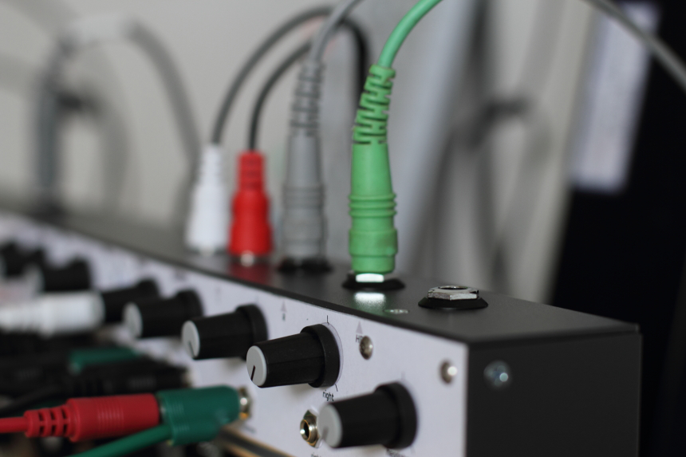
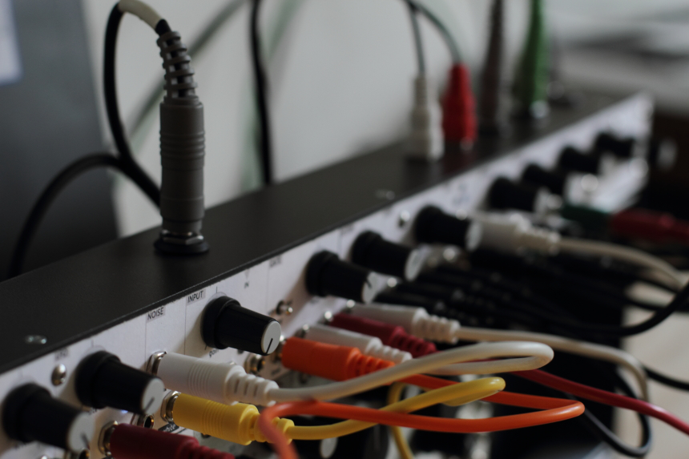
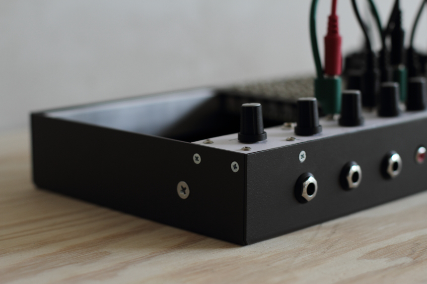

<iframe src="https://player.vimeo.com/video/146946774?color=ff7700&title=0&byline=0&portrait=0" style="position:absolute;top:0;left:0;width:100%;height:100%;" frameborder="0" allow="autoplay; fullscreen" allowfullscreen></iframe>

# isms

*an extensible electronic instrument and composition system encompassing generalized practices and inter-ideological patterns*

**a [mannequins](https://whimsicalraps.com) + monome collaboration**

isms ("*-isms*", \i\z\m\s\) is a eurorack modular synth case with an integrated top panel of carefully chosen fundamental circuits. necessary general functionality is densely packed into the case itself so you can focus available rack space on control and synthesis modules. rear-mount jacks are integrated into the case and out of the way of peformance. the size and proportions are designed for balance: large enough not to feel constrained, yet not so boundless as to be overwhelming. ergonomics and flexibility are central.

## specifications

[high resolution panel diagram](/images/isms-panel.pdf)  
[manual with full panel descriptions](/images/isms-manual.pdf)

highlights:

- vactrol-based gates
- output mixer and jacks
- external input with envelope out and gate detection
- spring reverb driver
- LFO and noise
- panel bus connections
- headphone driver
- high-capacity clean power design

technical:

- 24" x 6.75" x 1.75" — 6 lbs. — steel
- 120hp — 41mm module depth
- sliding square nuts, metric screws included
- +12v @2A — +5v @1.5A — -12v @1.5A
- bus board (18 connectors) tucked under top row, module space is completely clear
- fits incredibly well into a Pelican 1700 case (not included)

  
  
  

## demos

<iframe width="100%" height="300" scrolling="no" frameborder="no" allow="autoplay" src="https://w.soundcloud.com/player/?url=https%3A//api.soundcloud.com/playlists/161419885&color=%23ff5500&auto_play=false&hide_related=false&show_comments=false&show_user=true&show_reposts=false&show_teaser=false&visual=true"></iframe>
 

<iframe src="https://player.vimeo.com/video/146946774?color=ff7700&title=0&byline=0&portrait=0" style="position:absolute;top:0;left:0;width:100%;height:100%;" frameborder="0" allow="autoplay; fullscreen" allowfullscreen></iframe>

<iframe src="https://player.vimeo.com/video/161804200?color=ff7700&title=0&byline=0&portrait=0" style="position:absolute;top:0;left:0;width:100%;height:100%;" frameborder="0" allow="autoplay; fullscreen" allowfullscreen></iframe>

<iframe src="https://player.vimeo.com/video/143014827?color=ff7700&title=0&byline=0&portrait=0" style="position:absolute;top:0;left:0;width:100%;height:100%;" frameborder="0" allow="autoplay; fullscreen" allowfullscreen></iframe>
