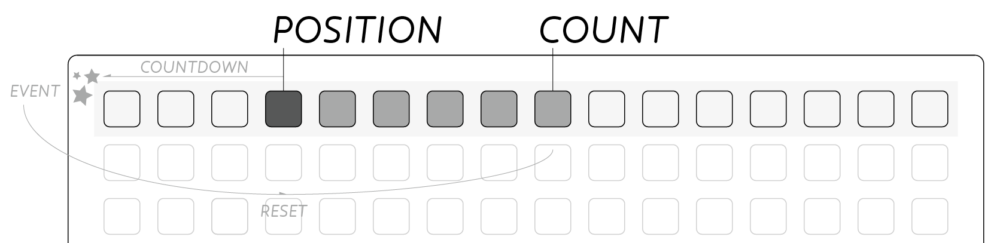
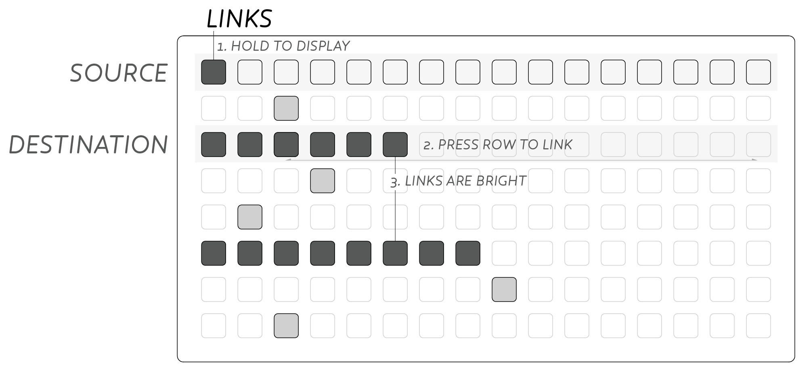
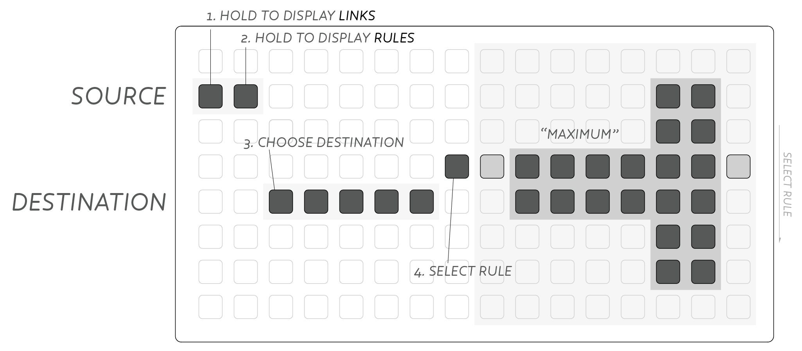
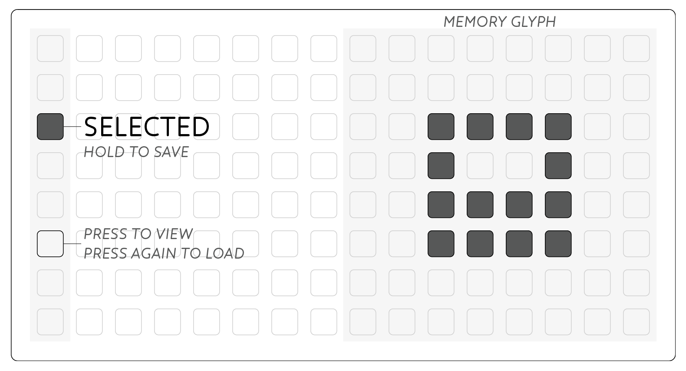
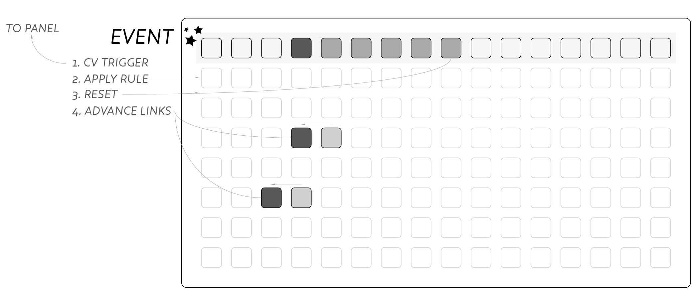
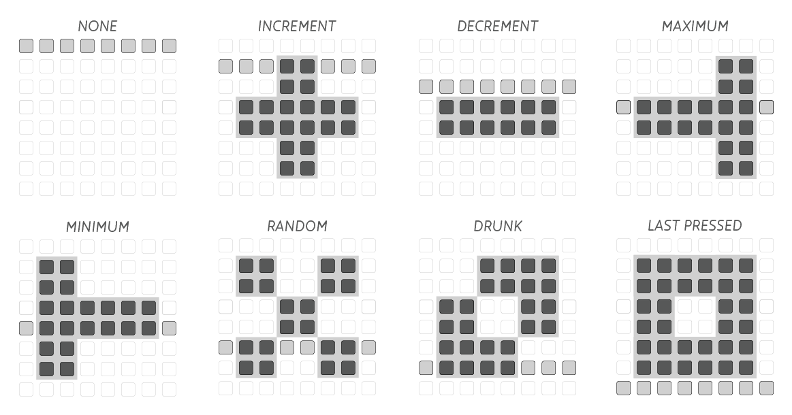
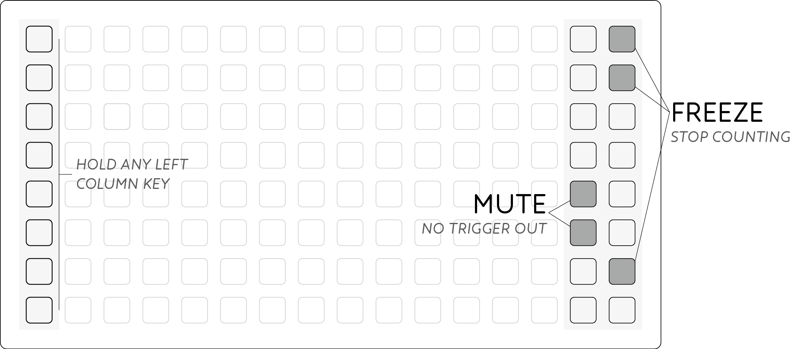

<iframe src="https://player.vimeo.com/video/107582557?color=ff7700&title=0&byline=0&portrait=0" style="position:absolute;top:0;left:0;width:100%;height:100%;" frameborder="0" allow="autoplay; fullscreen" allowfullscreen></iframe>

<iframe src="//player.vimeo.com/video/107582557?color=FF7700&title=0&byline=0&portrait=0" width="860" height="484" frameborder="0" webkitallowfullscreen mozallowfullscreen allowfullscreen></iframe>

# Meadowphysics

*Grid-enabled Rhizomatic Cascading Counter*

---

### WARNING: monome modules require high +5v current

Please make certain to check your case’s +5v power supply capacity (600ma minimum).

## Introduction

Meadowphysics facilitates the exploration of polyrhythms and rule-based sequencing, producing a wide range of emergent patterns.

A monome grid is plugged into the front panel of the module, becoming a complete interface. The sequence continues running when the grid is disconnected, facilitating both live performance and precomposed playback of generative systems.

Meadowphysics is composed of eight counters, one per row, falling toward zero. Each counter is configured via the main grid interface, setting the number of counts per row before an event is created. The internal clock, or externally patched clock input, only drive the first of these counters, creating a rhythmic base to build tangled polyrhythmic structures.

The remaining seven counters are cross-assigned with the other rows, each stepping toward zero when receiving an event. Any combination of cross-assignments is possible, enabling the intuitive creation of very complicated long-form mutating polyrhythms.

When counters hit zero and create events, they can also effect *Rules* on themselves or other counters. The length of the effected counter, normally set by the grid, can be reassigned by these Rules. Rules can increment, decrement or randomize Count, amongst others. Interlinking these Rules between different counters, long evolving patterns will emerge.

Through carefully balanced interlinked counters and rules, complex rhythms can be created that push and pull in ways not associated with digital sequences. These non-linear, rhizomatic sequences become particularly interesting when they respond to user input, allowing one to guide the structure into musical territory.

Full configurations are preset-able and savable to flash for later recall and instant resume on power-up.

## Installation

**Align the ribbon cable so the red stripe corresponds to the white indicator on the rear of the module's circuit board.**

- Be careful not to misalign the connector left-to-right either as it can damage this module, and other's in your case.
- Secure the module in your case with included screws, hiding under blue tape in the box.

As mentioned at top, monome modules require high +5v current. Before powering up your case, make sure the power supply can provide at least 600mA of current on the +5v line. Even if it appears to work in an underpowered case, it may degrade slowly over time until it fails and destroys the Meadowphysics. These repairs are not warrantied.

Power consumption:

- 18mA @ +12V
- 17mA @ -12V
- 42mA @ +5V (no grid connected), **up to 600mA (with grid)**

## Getting Started

(Hint: video tutorial at the bottom).

Connect your monome grid (via SWITCH if used) to the Meadowphysics panel. Eight counters are represented vertically on the grid, echoed onto the eight output jacks on the panel. As each counter reaches the left edge of the grid, it outputs a trigger as indicated by the panel led, and is reset to its starting *Count*. Turn the *clock* knob to watch the speed of the counters advance faster or slower.

> Above: *Count* is indicated by the dim bar in the row. The bright led shows the current *Position* as incremented by the clock. When reaching  the left edge an *Event* is created, at which point the *Position* resets to *Count*.

Each row's timing, or *count*, is set by a press along the given row, excluding the far left column. Only the top row is controlled by the internal, or externally patched, clock. All remaining rows are *linked* to this row in order to countdown.

Hold the leftmost key to see a row's *links* and press other rows to connect them. The row on which you hold the leftmost key is the *source* and triggers the *destination* row when the *source* reaches zero.

### Count, Position & Clock

*Count* is indicated by the dim bar in each row. It represents the number of received triggers this row requires before creating its own event. Pressing a key will change the row's *count* and reset the countdown *position* to this new maximum.

*Position* is indicated by the moving bright light in each row. It moves from right to left, creating a trigger event when it reaches 'zero' at the leftmost edge.

Internal clock speed is controlled by the *clock* knob. If a cable is attached to the clock *in* the internal clock is disabled. The clock *in* accepts trigger pulses to advance the first row counter. Clock *out* sends out the current clock which is additionally indicated by the panel led near the jack.

Each clock pulse moves the *position* of the top row toward the left by one. No other rows are directly affected by the clock, relying on *links* to this row. Changing the *count* of the top row divides or multiplies the tempo for all of Meadowphysics.

### Links

Holding the leftmost key in any row displays the currently *linked* rows. The grid displays *linked* counters as bright rows, while unconnected rows show only a dim led at the current *count* position.

> Above: A link is added from Row 1 to Row 3 with a press in Row 3. Row 1 is already linked to Row 6 as shown by the bright led bar. Whenever Row 1 triggers an event, Rows 3 & 6 will move to the left by one step.

While holding this left *link* key press another row to toggle a *link* on or off for that row. By default the top row is *linked* to all rows below, while the remaining rows have no connections.

Basic clock division and polyrhythms are already achieved in the default state. Adding *links* between the lower rows allows more complex and shifting rhythms to be uncovered.

### Rules

Holding the leftmost (*link*) key in a row, then adding the second to left key will display that row's *rule* and destination. This *rule* can change the *count* of the destination row.

> Above: Adding a *Rule* where Row 2's event will cause Row 5's *Count* to be set to maximum (16). Hold Row 2's leftmost key, then next to leftmost to show it's rules. Set Row 5 as the destination by pressing in the middle of the row, then select **Maximum** rule by the 4th row on the right side of the grid.

The *rule* choice is displayed on the right, while the destination is shown in the middle of the grid. Available *rules* are explained below.

## Preset

Entire collections of sixteen patterns can be saved to internal flash. On power-up the most recently saved set will be recalled and will play instantly.

To access the memory system, push the key next to the USB port on the module's panel. The display on the grid will change to display the *Preset* system. Either storage locations are accessed from the left most column. The current Preset is indicated with a bright led.

- Press a key in the left column to select a *Preset*.
- Press again to **load** the selected Preset.
- Hold a key to **save** the current state to the given Preset.
- Press the panel key again to escape Preset mode (ie *cancel*).

To quick-save the current memory slot, push and hold the panel key. The grid will display the *Preset* system, then return to the current pattern after quick-save is complete. This is handy to quickly save your work before powering down the synthesizer.

Each *Preset* has an associated *glyph* available on the right 8x8 quadrant. Press keys here to draw a visual cue to associate with your *Preset*. It is saved with the current data when holding a preset slot.

## Events

Whenever a counter reaches zero a number of *events* occur allowing the system to produce output as well as evolve the system. The sequence is:

- A cv trigger is output from the panel jack, indicated by the led.
- A *rule* is applied to the assigned destination row.
- The row's *position* is reset to its *count* value.
- Any *linked* rows move their *position* one step to the left.

## Links

*Links* are connections between rows. When a row hits zero, any *linked* rows move one *position* to the left. We call the row that hits zero the *source*, and the *linked* rows are the destination(s). Any row can be *linked* to any number of other rows, allowing a great tangle of counters.

All rows must be in some way *linked* to the first row in order to advance at all. This connection need not be direct, and more complex nested connections lead to far more interesting systems. *Linking* all eight rows in sequence, and setting all *counts* to 2, will create a binary counter which loops only every 256 steps.

## Rules

*Rules* provide an additional layer of interaction where a row can change the structure of the system itself. Without *rules*, presets will always play the same pattern, repeating regularly, even if quite infrequent.

*Rules* allow self-modifying systems capable of non-linear yet repetitive patterns, or even autonomous generative systems when using the 'Random' and 'Drunk' rules.

When selecting a row's *rule* there are eight options. A helpful glyph is displayed on the right side of the grid, conveying the function of the rule:

1. **None** doesn't apply a rule.
2. **Increment** adds one to the current *count* (move right).
3. **Decrement** subtracts one from current *count* (move left).
4. **Maximum** sets *count* to highest value (16 at far right).
5. **Minimum** sets *count* to lowest value (2 at far left).
6. **Random** changes *count* to any value 2 through 16.
7. **Drunk** randomly change *count* up or down by one, or leave alone.
8. **Last Pressed** resets *count* to the last physically pressed *count*.

## Freeze

*Note: 16wide grids only*

*Freezing* any row will stop it from counting down when receiving *Links*. This can have a dramatic effect especially when *Rules* are being driven by the frozen row. Applying *Freeze* to the first row will stop Meadowphysics altogether, regardless of the clock.

- Hold any leftmost column key
- Rightmost column displays currently *Frozen* rows
- Press any rightmost key to *Freeze* that crow
- Press any lit key to turn off *Freeze*

## Mute

*Note: 16wide grids only*

Converse to *Freeze*, applying *Mutes* doesn't stop rows counting down, but only stops the physical outputs from triggering. Using *Mutes* is a grid-based shortcut for unpatching a cable from any of the outputs. When using rows to trigger percussive sounds or effects, the *Mutes* become a quick way of muting drum channels briefly and simultaneously.

- Hold any leftmost column key
- Next-to-rightmost column displays currently *Muted* rows
- Press any next-to-rightmost key to *Mute* that row
- Press any lit key to turn off *Mute*

## Techniques

Meadowphysics uses emergent and probabilistic methods to create evolving and interacting patterns. It is at once quite simple, but holds the capacity for great complexity. Resultingly these are a few ideas to help explain simple use cases and how to approach more complex systems.

### Clock Division & Polyrhythms

Meadowphysics can perform simple clock division and create the polyrhythms of applications like flin and boiingg. The module ships with such an arrangement by default, providing clock divisions of 1 through 8.

Link row 1 to all other rows and you should see all the rows start to move. Then press in each row to set the count. Row 1 is now a master divider so you can speed up or slow down the whole sequence.

Whenever you press a new count value the position of that row will return to it. In this way you can set multiple rows to the same count but have them trigger in sequence rather than all at once. There is no 'reset' function so if you want multiple rows in time press both new count values at once.

Using even number values will create simple and many traditional rhythmic patterns, though introducing counts of 5, 7 and higher will create phasing patterns that take much longer to repeat.

### Cascaded Patterns

Another basic approach to linking rows is the 'cascade' where each row is linked only to the row immediately beneath it.

For example you can set all row's counts to 2 and count in a binary fashion (ie. frequencies of 2,4,8,16 etc). Changing all rows to 3 you have a ternary counter, or powers of 3 (ie. frequencies of 3,9,27,81 etc). Of course the count in each row need not be the same, and arbitrary values can be used to create long-form counters.

This structure will create rapid output on the top triggers, and very sparse triggers below. In the powers of 3 example above it takes over 2000 pulses for the last row to trigger!

### Rhizomatic Patterns

Any row can trigger any other row in Meadowphysics allowing quite complex patterns. Importantly it allows rows to trigger in a syncopated way where previously triggers were at constant intervals. A simple example:

- Link row 1 to rows 2 and 3
- Link row 2 and 3 to row 4.

Now by changing the count of rows 2 and 3 you will alter the rhythm produced on row 4. To make the pattern more complex you can link row 4 back to any of rows 1, 2 or 3 with varying results.

While it's enticing to add a whole collection of links throughout all 8 channels, it's quite educative to start with a small collection of rows (try 3 or 4) and experiment with different link arrangements and count values.

### Adding Rules

In addition to the great power of interlinked rhizomatic patterns, greater variation can be had by applying rules to influence rows *count* values.

The easiest way to get a feel for the rules is to apply them on the top-row. By default each row applies the rule to itself, though this can be changed by altering the destination with the middle rows of the grid – a brightly lit bar displays this destination.

Using the **Drunk** rule is an easy way to create variability in a pattern, especially when applied on an infrequently triggering row.

To create more complex self-modifying patches a number of approaches can be taken, though a few tips can ease the creation:

- Apply 2 rules to the same destination row.
- Use rules with opposing actions.

For example:

- Link row 1 to rows 2 and 3.
- Set row 1's rule to **Increment** and apply to row 3.
- Set row 2's rule to **Minimum** and apply to row 3.

This creates a pattern where row 3's output becomes less frequent over time and then is reset to high frequency when row 2 triggers. This effect can be amplified if row 2 is triggered at an even slower rate:

- Remove the link from row 1 to row 2.
- Link row 1 to row 4.
- Set row 4 to a count of 2.
- Link row 4 to row 2.

Now changing the count of rows 2 & 4 will change the rate of row 3's deceleration.

A similar approach could have two rows applying increment and decrement to a third row such that the movement is balanced out. The trick (and challenge!) is to have the count of these rows somewhat similar, or balanced such that the system doesn't always lead in one direction.

### 'Last Pressed' Rule

The 8th rule is the **Last Pressed** rule. This is a very powerful rule which can act as a sort of 'reset' to undo the effect of other rules. When this event occurs, the count will return to the last physical press, ignoring any preceding rule actions like increment or random.

This rule is likely best used at the end of a long-form pattern where a number of rule events have already occurred. Link the row that applies 'Last Pressed' from Row 1 for example, and at every *n* divisions of the master the clock, reset the row which is having rules applied - creating a regular 'resetting' of the pattern. Use with the drunk and random rules is encouraged to provide a degree of consistency to otherwise wild events.

- Link row 1 to rows 2, 3, 4 and 8.
- Set row 2's rule to **Increment**, apply to row 8, set count to 2.
- Set row 3's rule to **Decrement**, apply to row 8, set count to 3.
- Set row 4's rule to **Last Pressed**, apply to row 8, set count to 15.
- Set row 8's count to 2.

Now row 8 will output at a changing rate (depending on rows 2 & 3), but every 15 clock pulses will be reset to a count of 2. Add another link to row 5 and send a **Drunk** rule to row 8, for shifting variation.

### Rule-based Interactive Patterns

Lastly it can be interesting to create patterns that largely depend on tactile interaction. Set a number of rows to the 'increment' rule, or cross assign them. Pressing a number of keys to set short counts for these rows will create a more active trigger output. Then as more triggers occur the counts will increase, leading to longer pauses between rhythms.

Using a very fast clock, the resting state can be quite interesting still, where physical interaction will causes a flurry of triggers to occur.

## Video Tutorial

<iframe src="https://player.vimeo.com/video/107586549?color=ffffff&title=0&byline=0&portrait=0" width="860" height="484" frameborder="0" webkitallowfullscreen mozallowfullscreen allowfullscreen></iframe>

