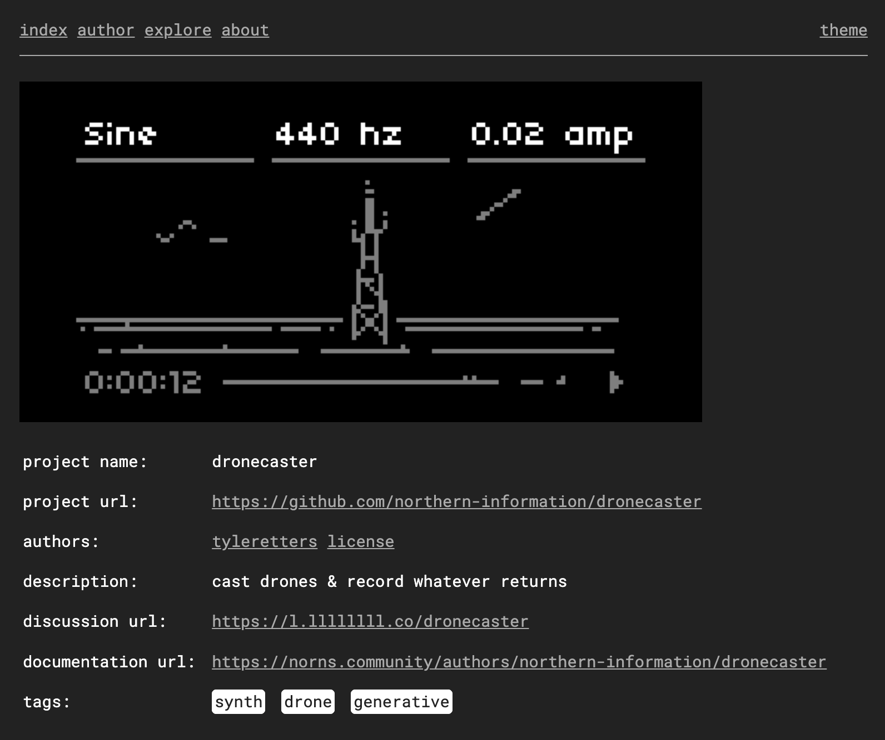

## [norns.community](https://norns.community)

since 2018, norns has grown beyond our earliest imaginings: all sorts of new functionality, expanded documentation, group tutorials and classes, weekly hangouts, and perhaps most notably a huge explosion of community-contributed scripts. script-making is also art-making, and the inspiring level of sharing has itself built a community.

[norns.community](https://norns.community) is a centralized place for community projects. it was initiated by monome and the vision was shaped by the talents of `@tyleretters` who added sharp visual styling + data design and `@eigen` who created a dynamic discovery mechanism with tagging and gallery images.

## summon

<iframe src="https://player.vimeo.com/video/412510077?byline=0&portrait=0" style="position:absolute;top:0;left:0;width:100%;height:100%;" frameborder="0" allow="autoplay; fullscreen" allowfullscreen></iframe>

in the video above, scripts made by the [lines community](https://llllllll.co) are being played by the [lines community](https://llllllll.co).

[orca](https://norns.community/en/authors/collabs/orca) // script: [`@its_your_bedtime`](https://www.instagram.com/its_your_bedtime/) // performance: [`@elia`](https://www.instagram.com/eliapiana/)

[TimeParty](https://llllllll.co/t/timeparty/22837) // script: [`@crim`](https://llllllll.co/u/crim/summary) // performance: [`@Olivier`](https://www.instagram.com/oliviercreurer/)

[mlr](https://llllllll.co/t/mlr-norns/21145) // script: [`@tehn`](https://softbits.bandcamp.com/album/rapid-history) // performance: [`@shellfritsch`](https://linktr.ee/coolmaritime)

[QUENCE](https://llllllll.co/t/quence/29436) // script: [`@spunoza`](https://www.youtube.com/channel/UCYTk7jkyot_w15r_7mqcTuw) // performance: [`@Justmat`](https://www.instagram.com/probably_justmat/)

[Compass](https://norns.community/en/authors/olivier/compass) // script: [`@Olivier`](https://www.instagram.com/oliviercreurer/) // performance: [`@glia`](https://www.instagram.com/zunaito/)

[otis](https://norns.community/en/authors/justmat/otis) // script: [`@Justmat`](https://www.instagram.com/probably_justmat/) // performance: [`@mattlowery`](https://www.instagram.com/mattlowery/)

[Animator](https://llllllll.co/t/animator/28242) // script: [`@crim`](https://llllllll.co/u/crim/summary) // performance: [`@bereenondo`](http://www.instagram.com/bereenondo)

[wrms](https://norns.community/en/authors/andrew/wrms) // script: [`@andrew`](https://www.instagram.com/_and.rew__/) // performance: [`@zanderraymond`](https://www.instagram.com/zanderraymond/)

[cheat codes](https://norns.community/en/authors/dan_derks/cheat_codes_2) // script: [`@dan_derks`](https://www.instagram.com/jailaibookie/) // performance: [`@andrew`](https://www.instagram.com/_and.rew__/)