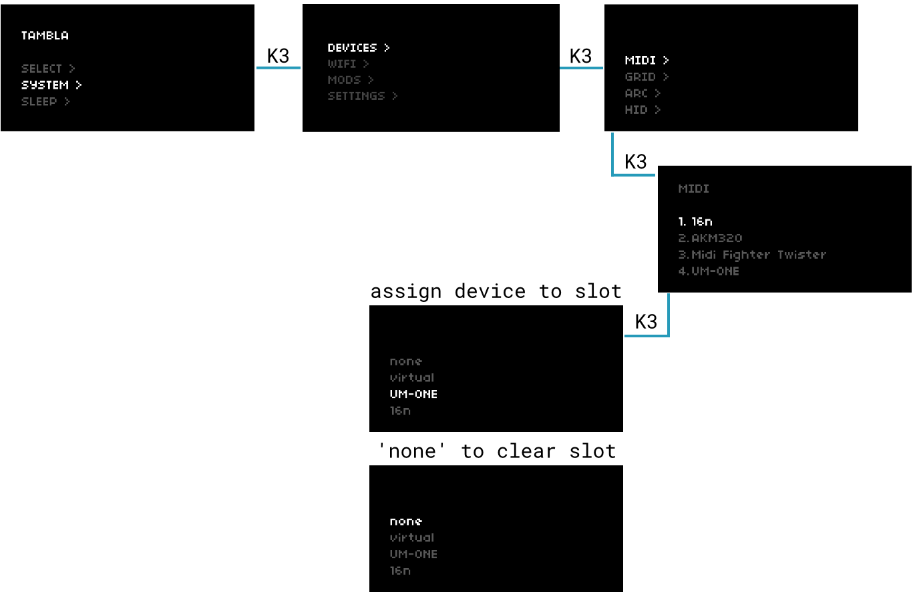
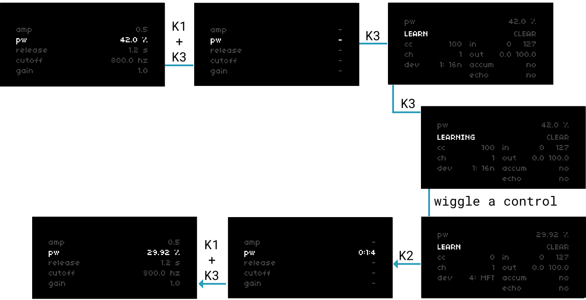
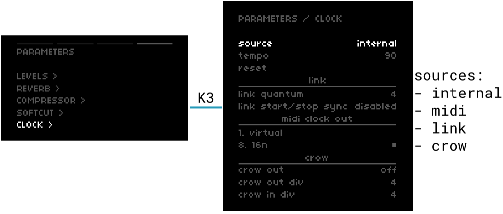

# control + clock

norns plays well with others -- black box drum machines, MIDI keyboards + faderbanks, modular synths, Max/MSP, Ableton Live, etc.

In this section, we'll cover the basics of nestling norns among your other gear and establishing leader/follower networks for clocking in a variety of contexts.

sections: [MIDI connect](#connect) &mdash; [managing MIDI devices](#manage) &mdash; [MIDI mapping](#map) &mdash; [OSC](#OSC) &mdash; [clocking](#clock)

## MIDI control

### connect

When you connect a MIDI device to one of the four USB ports, norns automatically catalogues it under `SYSTEM > DEVICES > MIDI`:

  
*[figure 1: managing MIDI devices through SYSTEM > DEVICES > MIDI](image/control_clock-images/device-management.png)*

norns can remember up to 16 MIDI previously-connected MIDI devices. The order of devices actually matters -- many scripts will have a parameter for `device port` or similar, where you'll need to specify which slot holds the device you want to use (control in or out). If you're ever unsure which is which, just check this page.

norns will remember these devices until they're manually removed, even if they are no longer connected. If you have more than 16 unique USB-MIDI devices you'd like to use with different norns scripts, you'll need to manage these ports over time.

### manage

If a script doesn't specify a device in or out port, the script will default to the device at port 1.

Let's say we're running a sequencer and we want to send MIDI out a connected USB-MIDI interface. The device list in [figure 1](image/control_clock-images/device-management.png) shows a `16n` at port 1, but we want this to be the `UM-ONE`.

To assign devices:

- select the port you wish to modify
- press **K3** to open a menu of currently connected devices
- use **E2** to select the device you wish to assign to this port
- press **K3** to assign it

To clear ports:

- select the port you wish to modify
- press **K3** to open a menu of currently connected devices
- press **K3** while `none` is selected to clear the port's assignment

### map

As we saw in [**play**](/docs/norns/play), the controls in a script's PARAMETERS can be fun to modify in realtime. To wrangle a bunch of parameters at once, let's map some to one of our connected MIDI controllers.

  
*[figure 2: mapping MIDI control](image/control_clock-images/device-map.png)*

To MIDI-learn:

- hold **K1** and press **K3** to enable mapping mode
- use **E2** to select the parameter you wish to map and press **K3** to open its mapping menu
- with LEARN selected (default), press **K3** and wiggle your MIDI control to map it to the parameter

#### manual map settings

- **CLEAR**: clears the current map

- **cc**: controller MIDI cc

- **ch**: controller MIDI channel

- **dev**: controller MIDI device
  
  - slots 1-16 enumerated in `SYSTEM > DEVICES > MIDI`
  - norns supports up to 16 devices
  - devices can be queried in maiden:  
  
  ```lua
  tab.print(midi.devices)
  -- > 1    table: 0x448a70
  -- > 5    table: 0x6abbb8
  -- > 3    table: 0x617c30
  tab.print(midi.devices[5])
  -- > dev    userdata: 0x6b70b4a8
  -- > id        5
  -- > name    OP-Z
  ```

- **in**: range of incoming MIDI values

- **out**: the min/max values that **in** spans
  
  - eg. though a filter parameter might span 20 Hz to 20000 Hz, you can use **out** as a way to clamp a MIDI fader to a 800 Hz - 1600 Hz range
  - hold **K3** while adjusting to fine-tune with 1/20th quantum

- **accum**: enable when using relative midi cc streams (for controllers that send deltas rather than 0-127 absolute streams)

#### PMAPs

Every time a parameter is mapped, norns will save this configuration as a PMAP file. PMAPs are unique to the currently-loaded script and are stored under `data/[scriptname]/[scriptname].pmap`. An example entry:

```lua
"bd_atk":"{dev=1, ch=1, accum=false, out_lo=0, value=0, in_hi=127, out_hi=1, in_lo=0, cc=100}"
```

You'll notice that these entries are identical to the ones located on the mapping screen.

## OSC

[Open Sound Control (OSC)](https://en.wikipedia.org/wiki/Open_Sound_Control) is a network protocol for sending messages supported by numerous sound and media applications.

OSC allows you to control norns over WIFI using applications like Max/MSP, TouchOSC, Clean OSC, OSCulator, or Wekinator. You can create custom control surfaces to extend your gestural interactions with norns -- eg. rather than using MIDI faderbank to change reverb damping, you could use a biometric sensor or Wiimote.

All of the [audio parameters](https://monome.org/docs/norns/play/#audio-parameters) have OSC names. To see them, navigate to `PARAMETERS > MAP`:

| param             | OSC name             |
| ----------------- | -------------------- |
| **LEVELS**        | ---                  |
| output            | `output_level`       |
| input             | `input_level`        |
| monitor           | `monitor_level`      |
| engine            | `engine_level`       |
| softcut           | `softcut_level`      |
| tape              | `tape_level`         |
| monitor mode      | `monitor_mode`       |
| headphone         | `headphone_gain`     |
| **REVERB**        | ---                  |
| reverb            | `reverb`             |
| rev engine input  | `rev_eng_input`      |
| rev cut input     | `rev_cut_input`      |
| rev monitor input | `rev_monitor_input`  |
| rev tape input    | `rev_tape_input`     |
| rev return level  | `rev_monitor_output` |
| rev pre delay     | `rev_pre_delay`      |
| rev lf fc         | `rev_lf_fc`          |
| rev low time      | `rev_low_time`       |
| rev mid time      | `rev_mid_time`       |
| rev hf damping    | `rev_hf_damping`     |
| **COMPRESSOR**    | ---                  |
| compressor        | `compressor`         |
| comp mix          | `comp_mix`           |
| comp ratio        | `comp_ratio`         |
| comp threshold    | `comp_threshold`     |
| comp attack       | `comp_attack`        |
| comp release      | `comp_release`       |
| comp pre gain     | `comp_pre_gain`      |
| comp post gain    | `comp_post_gain`     |
| **SOFTCUT**       | ---                  |
| input adc         | `cut_input_adc`      |
| input engine      | `cut_input_eng`      |
| input tape        | `cut_input_tape`     |

Format your messages as `/param/osc_name value`, eg:

```
/param/comp_ratio 2.3
/param/rev_monitor_output 0
/param/output_level 0.5
```

Please note that norns receives OSC messages on port `10111`.

Want to see norns + OSC in action? Check out `@felart`'s [TouchOSC template](https://github.com/felart/Norns-TouchOSC) for the LEVELS, REVERB, and COMPRESSOR controls.

For more detail on norns + OSC scripting, please see [study 5](/docs/norns/study-5/#numbers-through-air).

## clock

norns benefits from a global clock system. This helps makes it straightforward to pass a clock signal from an external source to a norns script, to pass the norns internal clock to a modular synth, or sync norns and Ableton Live over WIFI.

*nb. please ensure that your MIDI devices are connected as needed by following the steps in [**connect**](#connect)*

  
*[figure 3: global clock settings](image/control_clock-images/clock.png)*

### settings

**source**

The global clock can be driven from four different sources.

- internal: advances independently
- midi: an incoming MIDI clock signal will advance
- link: if Ableton Live and norns are on the same WIFI network, enabling Link in Live will sync norns + Live in mutual following
- crow: pulses from a modular synth into a USB-connected [crow](/docs/crow) will advance

**tempo**

If clock is set to `internal` or `link`, use **E3** to adjust tempo (internal minimum: 1 bpm / Link minimum: 20 bpm ; maximum: 300 bpm)

If clock is set to `midi` or `crow`, an average tempo will be listed but cannot be changed.

**reset**

Press **K3** to restart the clock if it's stopped.

**link quantum**

From [Ableton](https://ableton.github.io/link/):

> "In order to enable the desired bar and loop alignment, an application provides a quantum value to Link that specifies, in beats, the desired unit of phase synchronization. Link guarantees that session participants with the same quantum value will be phase aligned, meaning that if two participants have a 4 beat quantum, beat 3 on one participant’s timeline could correspond to beat 11 on another’s, but not beat 12. It also guarantees the expected relationship between sessions in which one participant has a multiple of another’s quantum. So if one app has an 8-beat loop with a quantum of 8 and another has a 4-beat loop with a quantum of 4, then the beginning of an 8-beat loop will always correspond to the beginning of a 4-beat loop, whereas a 4-beat loop may align with the beginning or the middle of an 8-beat loop."

**midi out**

norns can send a MIDI clock signal out to any port, regardless of the current clock source. This means norns can be a Link-to-MIDI-clock or CV-pulse-to-MIDI converter.

**crow out**

norns can send a clock pulse through a USB-connected crow, to clock a modular system. Using the above settings, this means norns can also convert MIDI or Link clock to CV, as well as act as a clock divider/multiplier.

**crow out div**

Sets the pulse rate per quarter note, eg. 4 = 4 pulses per quarter note (16ths).

**crow in div**

Sets the how many incoming pulses equals a quarter note, eg. 4 = 4 pulses per quarter note (16ths).