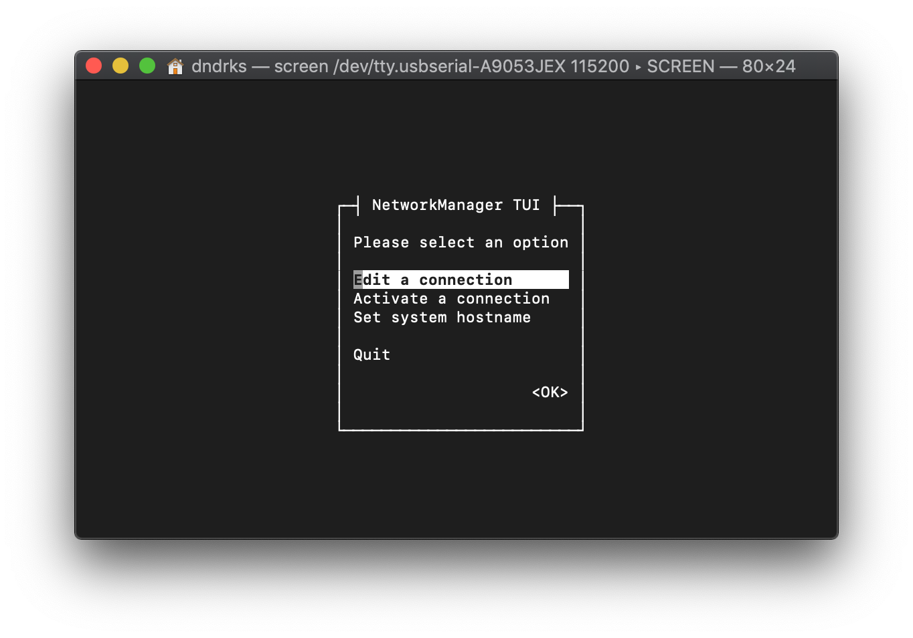

# norns: help

Between this page and the search bar above, you should be able to self-solve most norns troubles that you'd run into.

If you need additional help, we're here for you! Please send an email to help@monome.org using this format:

- *What issue did you experience?*
- *What steps are necessary to reproduce the issue?*
- *What additional hardware was connected to norns at the time of the issue? This includes controllers, WiFi dongles, external hubs, etc.*
- *Please attach any output printed in [maiden](../maiden/) when the issue occurs*

If you're unable to supply concrete steps to reliably reproduce the issue, this will reduce our efficacy. Please understand if we point you to existing resources and ask you to verify additional info.

For support with specific scripts and libraries, please visit [lines](https://llllllll.co) and search for the script's thread.

### sections
- [replacing parts](#replacing-parts)
- [wifi troubleshooting](#wifi-troubleshooting)
- [updating + managing apps](#update-apps)
- [restoring deleted system folders](#code-folder)
- [error messages](#error-messages)
- updating norns
	- [without WiFi](#manual-update)
	- [fresh install](#fresh-install)
- [backing up norns to USB](#backup-no-wifi)
- [change passwords on norns](#change-passwd)
- [taking a screenshot](#png)
- [additional q's](#faq)

## replacing parts
### wifi nub

If you have lost your nub, you can purchase a new one [here](https://www.amazon.com/150Mbps-Adapter-LOTEKOO-Wireless-Raspberry/dp/B06Y2HKT75/ref=pd_sbs_147_28?_encoding=UTF8&pd_rd_i=B06Y2HKT75&pd_rd_r=36242006-c576-11e8-a606-db11b044450e&pd_rd_w=5lyNC&pd_rd_wg=ZzAMD&pf_rd_i=desktop-dp-sims&pf_rd_m=ATVPDKIKX0DER&pf_rd_p=53dead45-2b3d-4b73-bafb-fe26a7f14aac&pf_rd_r=24C4PSVWK71S15YGJS6D&pf_rd_s=desktop-dp-sims&pf_rd_t=40701&psc=1&refRID=24C4PSVWK71S15YGJS6D) or email help@monome.org for a replacement (10 USD, shipping included, only US).

If you have experienced signal strength issues and wish to replace your WiFi dongle completely, you may wish to purchase a [high gain antenna adapter](https://www.amazon.com/Panda-Wireless-PAU06-300Mbps-Adapter/dp/B00JDVRCI0).

### charger

The charger that comes with norns is GEO151UB-6020 and its power specs are 2A / 5.25V. A direct replacement can be purchased [from Adafruit](https://www.adafruit.com/product/1994).

### battery

Before you purchase a new battery, please consider that your norns may not be reporting battery performance accurately. To test, fully drain the battery and then charge it fully.

If performance does not improve, then a direct replacement can be purchased [from Adafruit](https://www.adafruit.com/product/2011) or by emailing help@monome.org for a replacement (15 USD, shipping included, only US).

### encoders

On early batches of norns, some users have reported that the encoder values are "jumpy". To verify that your encoders are affected, please perform this simple test:

- navigate to the LEVELS page
- turn a level all the way up and continue to turn the encoder
- if the level jumps and does not remain at maximum, then you might want to replace that encoder

We are still working to identify if this is related to our assembly house or if the actual OEM parts are flawed. The fix is *incredibly* straightforward if you have access to a soldering iron. While we can provide fixes in-house, shipping back and forth has a great deal of environmental impact that we'd love to help avoid. So, please consider DIY'ing and email us at help@monome.org if you have any questions or trepidations about the DIY process.

Replacement encoders can be purchased [from Octopart](https://octopart.com/pec11r-4015f-n0024-bourns-26648251).

Please reference this [step-by-step video](https://vimeo.com/373181868/f58ea21a31) detailing the fix.

## wifi troubleshooting
_nb. If you are not actively using the wifi nub, it's best not to keep it plugged in. It uses a lot of power, draining both battery and system resources._

If you are consistently unable to connect your norns to wifi through the ['Connect' steps outlined here](../play/#connect), please perform the following steps:

1. Try plugging the wifi nub into a different USB slot on norns and perform a standard reboot.

2. Plug the wifi nub into a non-norns computer (laptop/desktop ; MacOS/Windows/Linux) and confirm that the nub functions as expected. If your nub is defective, please email help@monome.org for a replacement

3. If you are prompted to update the nub's drivers, please do so. Even if there are no updates available, sometimes the simple task of searching for an update resolves connectivity issues. When this process completes, plug the nub back into norns.

4. If norns is still unable to connect to wifi, connect the power cable to your non-norns computer and follow the `USB-UART` steps outlined [here](../maiden/#other-access). Once you perform this serial login, try executing `nmtui` for a graphical interface of the wifi utilities, which may have better luck connecting to a network:

	


5. If you are still unable to connect, please email help@monome.org with the following information:

	- Whether your nub was able to successfully connect with a non-norns computer
	- Screenshots of the terminal screens in step 4
	- Your router config (WPA, WEP, etc)

## help: how do I add/update apps on my norns? <a name="update-apps"></a>

As of 10.28.2019, maiden (the web-based editor built into norns) now features a [project manager](../maiden/#project-manager) to help facilitate project discovery, installation, and upgrades.

If you are updating a project through the project manager that was not installed by using the project manager, you will receive an error that the project cannot be found in the catalog. Please delete the previously installed version and reinstall through project manager, which establishes the necessary git files for future updates.

lines also has a dedicated [Library](https://llllllll.co/search?q=%23library%20tags%3Anorns) for projects tagged `norns`. In each project's thread, you'll find in-depth conversation as well as performance examples and tutorials. Projects for norns are primarily built and maintained by the lines community, so any questions/trouble with a specific project should be directed to its thread.

## help: I've deleted the `code` folder! <a name="code-folder"></a>

### getting the `code` folder back

1. Download [Cyberduck](http://cyberduck.io) -- this is an app that will connect to your norns and show its file system like it's a standard computer.
2. [Follow these instructions to connect to norns through Cyberduck](../sftp/).
3. After you connect to norns through Cyberduck, double click the `dust`​ folder and you should see `audio`​ and `data`.
4. In Cyberduck, click 'Action' and 'New Folder'. This will create a new folder alongside the other two. Name this folder `code`​.
5. Keep this window open for the next phase!

### restoring apps into the `code` folder
1. Download [we](https://github.com/monome/we/archive/master.zip), which is a collection of engines from monome.
2. Unzip the folder, which will be named `we-master`​.
3. IMPORTANT: Rename this folder `we`​.
4. Drag the newly named `we`​ folder into the `code`​ folder you made in the previous section's step 4.
5. You have now install the standard engines! Please reference the "how do I install/update an app onto my norns?" section for help populating your `code` folder with community apps.

## error messages

### DUPLICATE ENGINES

Supercollider fails to load if you have multiple copies of the same engine (`.sc` files) inside of `dust` (the parent folder for the projects installed on norns).

To solve this, [connect](../play/#connect) via wifi and open [maiden](../maiden). Type `;restart` into the maiden REPL at the bottom (the `>>` prompt).

This will restart the audio components and output their logs. If there's a duplicate class an error message like the following will be shown:

```
DUPLICATE ENGINES:
/home/we/dust/code/ack/lib/Engine_Ack.sc Engine_Ack.sc
/home/we/dust/code/we/lib/Engine_Ack.sc Engine_Ack.sc
### SCRIPT ERROR: DUPLICATE ENGINES
```

In this example, the `Engine_Ack.sc` engine is duplicated in two projects: `ack` and `we`. Using maiden, you would expand each project's `lib` folder to reveal the duplicated `Engine_Ack.sc`. After you remove one of the offending engines, execute `SYSTEM > RESTART` from the norns menu.

### LOAD FAIL

This simply means there is an error in the script you're trying to load.

Connect via wifi and open maiden to see the error message when you again try to load the script.

A common problem may be a missing engine. Check the output for something like:

```
### SCRIPT ERROR: missing Timber
```

In this example, the script requires `Timber`, so go find it in the Project Manager and install it. If you had just recently installed `Timber`, you need to restart your norns through SLEEP or entering `;restart` in the matron REPL.

### SUPERCOLLIDER FAIL

This indicates that something is wrong with Supercollider, which could be due to various issues.

If you're able to load maiden, there are two tabs in the main REPL area (above the `>>` prompt at the bottom of your screen). The first tab is for `matron`, the control program that runs scripts -- the other is `sc` for SuperCollider. Click into the `sc` tab and type `;restart` into the REPL. That should show you what is going on inside of SuperCollider.

- You might have a [duplicate engine](#duplicate-engines).
- You might be [missing a required engine](#load-fail).
- If an update was recently applied, it may be necessary to [manually re-apply it](#manual-update).
- If this doesn't help, you may need to re-flash your norns with a clean image (after backing up any of your data).
- If this doesn't fix it, there may be a hardware issue: e-mail help@monome.org.

### FILE NOT FOUND

If a newly-renamed script throws a `file not found` error in maiden, it is likely because the system has not registered the name change -- even though you see the new name in the UI. Perform a hard refresh on your browser ([how?](https://fabricdigital.co.nz/assets/How-to-hard-refresh-browser-infographic.jpg)).

## manual / offline update <a name="manual-update"></a>

- Download and copy [update file (01/29/2020)](https://github.com/monome/norns/releases/download/v2.2.8/norns200129.tgz) to a FAT-formatted USB drive
- Insert the disk to norns and power up.
- Connect via [serial](../maiden/#other-access).
- Copy file to `~/update/`:

```
sudo cp /media/usb0/*.tgz ~/update/
```

- Unpack and run update:

```
cd ~/update
tar xzvf norns200129.tgz
cd 200129
./update.sh
```

- Upon completion type `sudo shutdown now`.


## fresh install

- current image: [200106](https://github.com/monome/norns-image/releases/download/200106/norns200106.img.zip) - 1.1G

By far the easiest method to flash the disk image is using [etcher](https://www.balena.io/etcher/). It is available for Linux, MacOS, and Windows.

**WARNING**: flashing a disk completely erases the contents and replaces it with a clean install. Be sure to first back up any data you have in `dust`.

Steps:

1. Install etcher and get the disk image. Extract the disk image so you have a remaining `.img` file.
2. Remove the four bottom screws of the norns.
3. Plug the norns power into your laptop.
4. You'll see a switch through a notch in the circuit board, flip this to DISK.
5. Run etcher. Select the disk image. Select the Compute Module as the target. Push go and wait for it to finish.
6. Disconnect USB. Flip the switch back to RUN. Put the bottom back on.

If you prefer the command line see [this guide](https://github.com/monome/norns-image/blob/master/readme-usbdisk.md).

## back up norns to USB <a name="backup-no-wifi"></a>

nb. [SFTP through Cyberduck](../sftp/) is the most straightfoward way to back up your norns. These instructions are provided for times when you are unable to connect norns to WiFi (no dongle, no network, etc).

First, connect via [serial](../maiden/#other-access) and then insert a USB stick into norns.

- Make sure the USB stick is detected with `ls /media/usb` (this should show the contents of the USB stick)
- If it's there, copy your dust folder with `cp -r /home/we/dust /media/usb`
- Shutdown with `sudo shutdown now`

## change passwords on norns <a name="change-passwd"></a>

For security reasons (a device exposed to wifi should not have a widely-known password), one may want to change the default password for the `we` user.


### login / ssh

Change the login/ssh password for user `we` by help of 

```
sudo raspi-config
```

and follow instructions in `Change User Password`

### Samba

The `smb://` remote login password does not automatically change with the `raspi-config` method and, although Samba is a low-security, local network project, it makes sense to set its login credentials to match the newly set user password. This can be done with

```
sudo smbpasswd -a we
```

Re-type your new password and you should be all set.

## taking a screenshot <a name="png"></a>

Capturing a screenshot of your norns can be a helpful tool for creating illustrative documentation or sharing UI ideas.

With your norns powered-on and connected to the same WIFI network as your computer, connect to maiden. Then, execute this line in maiden's REPL (replacing <FILENAME> with something unique):

`_norns.screen_export_png("/home/we/<FILENAME>.png")`

Use [SFTP](../sftp/) to connect to norns and download the PNG you just created. You'll notice the PNG is kinda tiny and the colors are inverted. Let's fix that with [ImageMagick](https://imagemagick.org/script/download.php).

With ImageMagick installed on your computer, execute the following (replacing <PATH+FILENAME> with the entire path to your downloaded PNG):

`magick convert <PATH+FILENAME>.png -gamma 1.25 -filter point -resize 400% -gravity center -background black -extent 120% <PATH+FILENAME>-m.png`

For example:
`magick convert /Users/dndrks/Downloads/mlr.png -gamma 1.25 -filter point -resize 400% -gravity center -background black -extent 120% /Users/dndrks/Downloads/mlr-m.png`

This will clean up the image, make it look just like it renders on norns, and save it as a new file with the same name, but a `-m` at the end :)

## additional a's to faq's <a name="faq"></a>

- Imported audio must be 48khz, bit depth is irrelevant.

- Line noise while usb charge + audio input are both coming from the same laptop (ground loop) can be defeated with [an isolator](https://llllllll.co/t/external-grid-power-ext5v-alternative/3260).

- If a connected MIDI controller is not functioning as expected, it may be due to a known limitation in scripts that do not explicitly allow for MIDI control from channels other than channel 1. Either reassign your MIDI controller to channel 1 or insert this [bit of code](https://llllllll.co/t/norns-scripting-best-practices/23606/2) into a script.

- norns is not able to send MIDI to a VST or DAW directly over USB. You will need either two USB MIDI dongles or [2host](https://llllllll.co/t/2host-a-diy-usbmidi-host-to-host-adapter/23472).

- All grid editions will work with norns, but some apps may be coded for varibright levels that your hardware may not support.

- norns does not have built-in bluetooth + the OS is not designed to take advantage of bluetooth.
