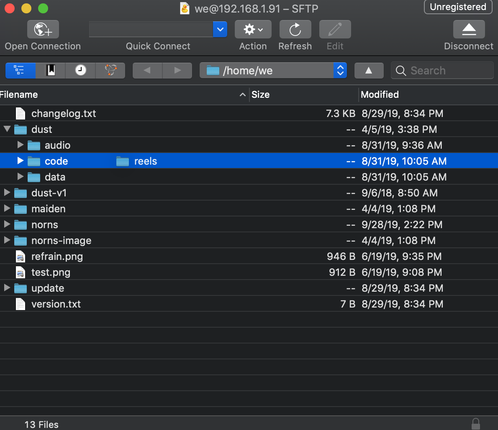
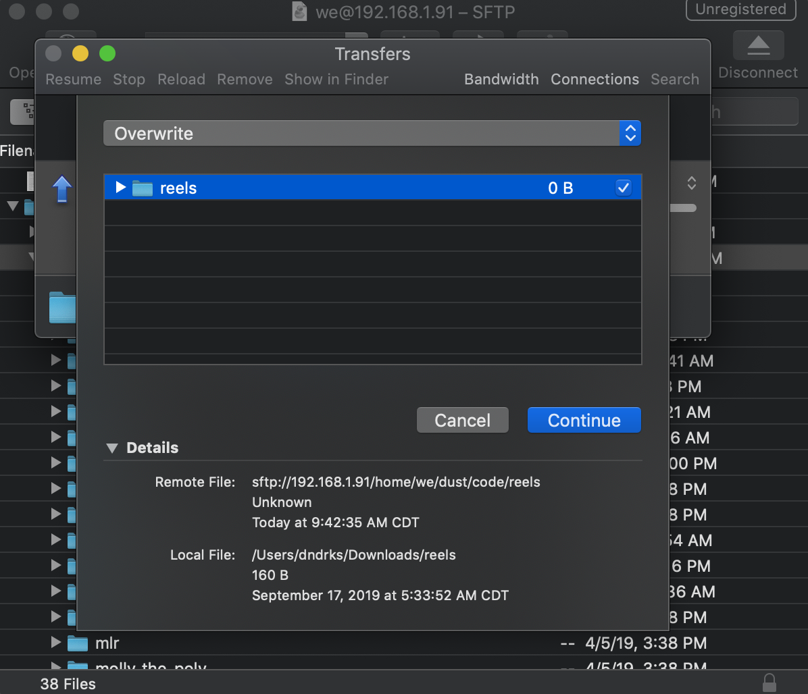

# norns: help

### contents
- [wifi troubleshooting](#wifi-troubleshooting)
- [updating + managing apps](#update-apps)
- [restoring deleted system folders](#code-folder)
- [error messages](#error-messages)
- updating norns
	- [without WiFi](#manual-update)
	- [fresh install](#fresh-install)
- [additional q's](#faq)

## wifi troubleshooting
_nb. If you are not actively using the wifi nub, it's best not to keep it plugged in. It uses a lot of power, draining both battery and system resources._

If you are consistently unable to connect your norns to wifi through the ['Connect' steps outlined here](/docs/norns/#connect), please perform the following steps:

1. Try plugging the wifi nub into a different USB slot on norns and perform a standard reboot.

2. Plug the wifi nub into a non-norns computer (laptop/desktop ; MacOS/Windows/Linux) and confirm that the nub functions as expected.  

	- If your nub is defective, please email help@monome.org for a replacement
	- If you have lost your nub, you can purchase a new one [here](https://www.amazon.com/150Mbps-Adapter-LOTEKOO-Wireless-Raspberry/dp/B06Y2HKT75/ref=pd_sbs_147_28?_encoding=UTF8&pd_rd_i=B06Y2HKT75&pd_rd_r=36242006-c576-11e8-a606-db11b044450e&pd_rd_w=5lyNC&pd_rd_wg=ZzAMD&pf_rd_i=desktop-dp-sims&pf_rd_m=ATVPDKIKX0DER&pf_rd_p=53dead45-2b3d-4b73-bafb-fe26a7f14aac&pf_rd_r=24C4PSVWK71S15YGJS6D&pf_rd_s=desktop-dp-sims&pf_rd_t=40701&psc=1&refRID=24C4PSVWK71S15YGJS6D) or email help@monome.org for a $10 (shipping incl.) replacement

3. If you are prompted to update the nub's drivers, please do so. Even if there are no updates available, sometimes the simple task of searching for an update resolves connectivity issues. When this process completes, plug the nub back into norns.

4. If norns is still unable to connect to wifi, connect the power cable to your non-norns computer and follow the `USB-UART` steps outlined [here](/docs/norns/#other-access). Once you perform this serial login, try running `nmtui` for a graphical interface of the wifi utilities, which may have better luck connecting to a network.

5. If you are still unable to connect, please email help@monome.org with the following information:

	- Whether your nub was able to successfully connect with a non-norns computer
	- Screenshots of the terminal screens in step 4
	- Your router config (WPA, WEP, etc)

## help: how do I add/update apps on my norns? <a name="update-apps"></a>

### finding apps for norns
Browse the [Library](https://llllllll.co/search?q=%23library%20tags%3Anorns%20order%3Alatest) for projects tagged `norns`. Applications for norns are built and maintained through the lines community, so any questions/trouble with a specific project should be directed to its dedicated thread.

### installing/updating apps on norns
1. Download the app you wish to install onto your computer by visiting the app's Library page and clicking the hyperlink under `Download`. Alternatively, you can visit the project's GitHub page and click the green `Clone or download` button, then select `Download ZIP`.

2. Locate (and un-zip) the folder and **remove** `-master` from it's name. eg. If you download [Reels](https://llllllll.co/t/reels/21030), the folder will be named `reels-master`. Please rename it to `reels`. do this for any application you download.

3. Connect your norns to the same wifi network as your computer or [turn norns into a hotspot](/docs/norns/#connect). [Having wifi trouble?](#wifi-troubleshooting)

4. Sharing files between norns and your computer is best achieved through SFTP. See [this guide](/docs/norns/sftp/) for a full walkthrough.

5. Once you connect your norns to your computer through SFTP, expand the `dust` folder and drag the folder you renamed in step 2 right over the `code` folder in Cyberduck:



If you have a previously-installed version of the same app on your norns, Cyberduck will ask if you'd like to Overwrite. if you wish to replace the version on your norns with this new version, select Continue:



You should now be able to load the app directly from the norns UI.

## help: I've deleted the `code` folder! <a name="code-folder"></a>

### getting the `code` folder back

1. Download [Cyberduck](http://cyberduck.io) -- this is an app that will connect to your norns and show its file system like it's a standard computer.
2. [Follow these instructions to connect to norns through Cyberduck](/docs/norns/sftp/).
3. After you connect to norns through Cyberduck, double click the `dust`​ folder and you should see `audio`​ and `data`.
4. In Cyberduck, click 'Action' and 'New Folder'. This will create a new folder alongside the other two. Name this folder `code`​.
5. Keep this window open for the next phase!

### restoring apps into the `code` folder
1. Download [we](https://github.com/monome/we/archive/master.zip), which is a collection of engines from monome.
2. Unzip the folder, which will be named `we-master`​.
3. IMPORTANT: Rename this folder `we`​.
4. Drag the newly named `we`​ folder into the `code`​ folder you made in the previous section's step 4.
5. You have now install the standard engines! Please reference the "how do I install/update an app onto my norns?" section for help populating your `code` folder with community apps.

## error messages

### DUPLICATE ENGINES

Supercollider fails to load if you have multiple copies of the same engine inside of `dust`.

To solves this [connect](../#connect) via wifi and open [maiden](../#maiden). Type `;restart` into the maiden REPL at the bottom (the `>>` prompt).

This will restart the audio components and output their logs. If there's a duplicate class an error message like the following will be shown:

```
DUPLICATE ENGINES:
/home/we/dust/code/ack/lib/Engine_Ack.sc Engine_Ack.sc
/home/we/dust/code/we/lib/Engine_Ack.sc Engine_Ack.sc
### SCRIPT ERROR: DUPLICATE ENGINES
```

Remove one of the offending scripts/classes and execute `SYSTEM > RESTART` from the norns menu.

### LOAD FAIL

This simply means there is an error in the script you're trying to load.

Connect via wifi and open maiden to see the error message when you again try to load the script.

A common problem may be a MISSING INCLUDE. Check the output for something like:

```
### MISSING INCLUDE: ack/lib/ack
### SCRIPT ERROR: load fail
/home/we/dust/code/ash/playfair.lua:21: MISSING INCLUDE: ack/lib/ack
```

The script `playfair` requires `ack`, so go find it in the Library and add the file to `dust/code/`.

### SUPERCOLLIDER FAIL

This indicates that something is wrong with Supercollider, which could be due to various issues.

- If an update was recently applied, it may be necessary to manually re-apply it.
- If this doesn't help, you may need to re-flash your norns with a clean image (after backing up any of your data).
- If this doesn't fix it, there may be a hardware issue: e-mail help@monome.org.

### FILE NOT FOUND

If a newly-renamed script throws a `file not found` error in maiden, it is likely because the system has not registered the name change -- even though you see the new name in the UI. Perform a hard refresh on your browser ([how?](https://fabricdigital.co.nz/assets/How-to-hard-refresh-browser-infographic.jpg)).

## manual / offline update <a name="manual-update"></a>

- Download and copy [update file](https://github.com/monome/norns/releases/download/v2.2.1/norns191016.tgz) to a FAT-formatted USB drive
- Insert the disk to norns and power up.
- Connect via [serial](../#connect).
- Copy file to `~/update/`:

```
sudo cp /media/usb0/*.tgz ~/update/
```

- Unpack and run update:

```
cd ~/update
tar xzvf norns191016.tgz
cd 191016
./update.sh
```

- Upon completion type `sudo shutdown now`.


## fresh install

- current image: [190801](https://monome.nyc3.digitaloceanspaces.com/norns190801.img.tgz) - 1.1G (please conserve bandwidth by not repeatedly downloading)

By far the easiest method to flash the disk image is using [etcher](https://www.balena.io/etcher/). It is available for Linux, MacOS, and Windows.

**WARNING**: flashing a disk completely erases the contents and replaces it with a clean install. Be sure to first back up any data you have in `dust`.

Steps:

1. Install etcher and get the disk image. Extract the disk image so you have a remaining `.img` file.
2. Remove the four bottom screws of the norns.
3. Plug the norns power into your laptop.
4. You'll see a switch through a notch in the circuit board, flip this to DISK.
5. Run etcher. Select the disk image. Select the Compute Module as the target. Push go and wait for it to finish.
6. Disconnect USB. Flip the switch back to RUN. Put the bottom back on.

If you prefer the command line see [this guide](https://github.com/monome/norns-image/blob/master/readme-usbdisk.md).

## additional a's to faq's <a name="faq"></a>

- Imported audio must be 48khz, bit depth is irrelevant.

- Line noise while usb charge + audio input are both coming from the same laptop (ground loop) can be defeated with [an isolator](https://llllllll.co/t/external-grid-power-ext5v-alternative/3260).

- If a connected MIDI controller is not functioning as expected, it may be due to a known limitation in scripts that do not explicitly allow for MIDI control from channels other than channel 1. Either reassign your MIDI controller to channel 1 or insert this [bit of code](https://llllllll.co/t/norns-scripting-best-practices/23606/2) into a script.

- norns is not able to send MIDI to a VST or DAW directly over USB. You will need either two USB MIDI dongles or [2host](https://llllllll.co/t/2host-a-diy-usbmidi-host-to-host-adapter/23472).

- All grid editions will work with norns, but some apps may be coded for varibright levels that your hardware may not support.

- norns does not have built-in bluetooth + the OS is not designed to take advantage of bluetooth.
