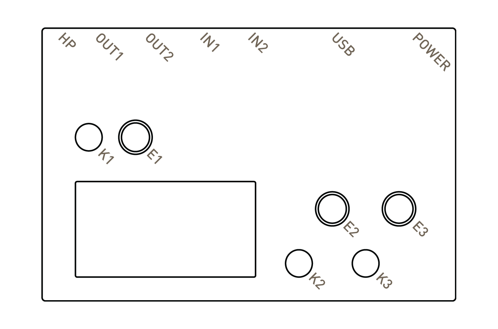
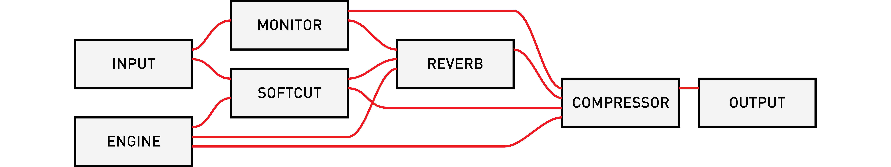
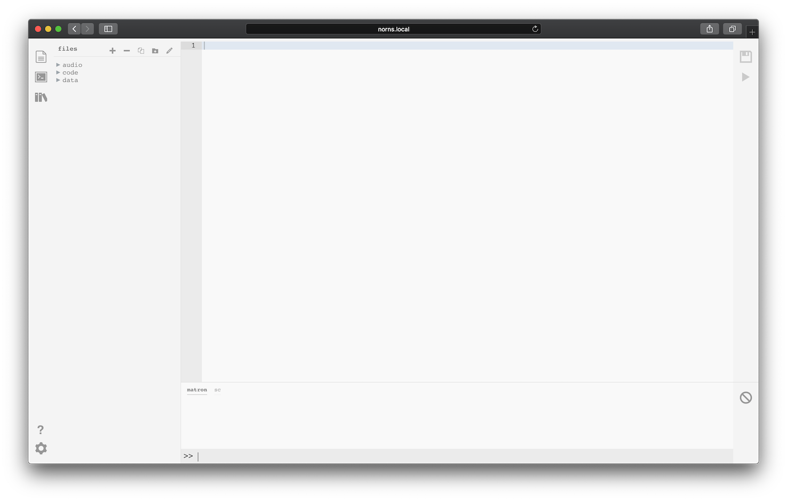
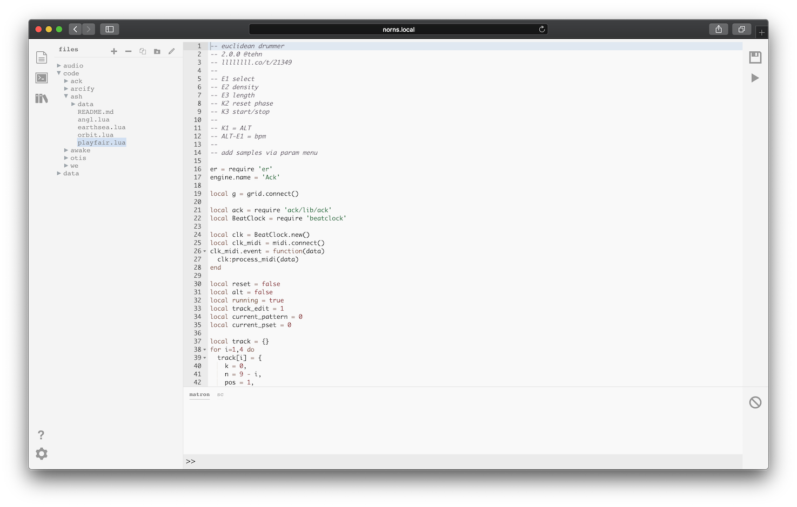

# norns

- [first](norns-first.pdf) a quick, printable introduction.
- [studies](/docs/norns/study-1/) is a series of tutorials for creating scripts.
- [tutorial](https://github.com/neauoire/tutorial) is a minimal scripting introduction.
- [script reference](/docs/norns/script-reference/) contains lists of functions.
- [scripting FAQ](/docs/norns/faq/) for frequently asked questions.

current version: [191016](https://github.com/monome/norns/releases)

- sections: [begin](#begin) &mdash; [awake](#awake) &mdash; [audio](#audio) &mdash; [maiden](#maiden) &mdash; [update](#update) &mdash; [help](#help)


## LEGEND



## BEGIN

The mini-USB plug provides power and charges the internal battery. Use the cable and power supply provided. (The included supply supplies 2A via USB connector.)

Hold **K1** for three seconds.

Be still, and norns will awaken.

There's a small light near the power plug.  ORANGE means power.  WHITE means disk access.

On the bottom of the norns there is a tiny push switch that will hard power-off the device. For general shut down use the _sleep_ menu function. This fully turns off the norns with a proper software shutdown. Use the bottom switch only if something in software went wrong.

## AWAKE

A changing melody will play.

E1 changes the mode. K1+? means hold K1 then push ?.

### STEP

- E2 navigates position, E3 changes position.
- K2 toggles the sequence to edit. K1+K2 clears all steps.
- K3 morphs the current sequence. K1+K3 randomizes.

### LOOP

- E2/E3 set loop length.
- K2 resets to play to zero. K3 jumps to random position.

### SOUND

- E2/E3 adjust selected parameter. K2/K3 move selector.

### OPTION

- E2 adjusts BPM. K1+E2 change division.
- E3 changes root note. K1+E3 selects scale.

(bonus: try plugging in a grid.)


## OTHER

Tap K1 quickly to toggle between **PLAY** and **OTHER**.

You are now at **HOME**.


In **OTHER** mode:

- E1 moves between pages.
- E2 scrolls up/down.
- K2/K3 move back/forward.

Page layout:


### HOME


At **HOME** press K2 to toggle additional system information display.

#### SELECT

Explore the collection of scripts.  Selecting a script will show a description.  Forward again will run the script.  The play screen will return upon running.  Quickly tap K1 to toggle between **PLAY** and **OTHER**.


#### SYSTEM

- AUDIO - Like the parameter list, but for the global audio settings. Includes output and input levels, headphone gain, aux send (reverb), and insert (compression). See the [AUDIO](#audio) section below for details on the parameters available.
- DEVICES - This is a list of connected USB hardware with their associated port number. Most scripts address port 1. See [norns study 4](https://monome.org/docs/norns/study-4/) for a scripting guide to multiple ports. This section lets you re-assign connected devices to specific ports.
- WIFI - Networking settings. Requires USB WIFI interface. See [CONNECT](#connect).
- UPDATE - Checks for updates. Internet connection required. See [UPDATE](#update).
- RESET - Quickly resets the audio system.


#### SLEEP

Powers down cleanly, saving current state.


### PARAMETERS


Scripts can define their own parameters. Note that some scripts may have no parameters.

- E2 scrolls.
- E3 changes values. Hold K3 for fine tuning.


HOLD K1 to access parameter set saving and loading:

- E3 scrolls set number (0 is default, with 1-99 available).
- K2 loads the selected set.
- K3 saves the set to the selected position.

Enable MIDI-mapping with E3 while the MIDI-map item is selected. Release K1 to return to the Parameter list, but now you see MIDI CC assignments. Push K3 to enable MIDI-learn, whereupon the next incoming MIDI CC will be mapped to this value.

Get out of MIDI-mapping mode by holding K1 and toggling off.


### TAPE


On this page you can record and play directly to and from disk.

K2 toggles focus between REC and PLAY.

REC

- K3 to arm recording.
- K3 again to start.
- K3 again to stop.

PLAY

- K3 loads file.
- K3 again to start.
- K3 again to stop.

PLAY expects stereo 48khz files. WAV, AIFF and other uncompressed header / sample formats supported by [libsndfile](http://www.mega-nerd.com/libsndfile) will work (including raw). FLAC also.

### LEVELS


Mixing and VU display happens here.

- K2/K3 to change selection, which is highlighted.
- E2/E3 modify the respective highlighted levels.


## AUDIO

Audio routing is shown below:



### AUDIO PARAMETERS

Control of various audio parameters happens in **SYSTEM > AUDIO**. Note that the topmost levels are also controlled via the **LEVELS** page.

param |range |description
---|---|---
output            |[-inf, 0] db     |output level
input             |[-inf, 0] db     |input level
monitor           |[-inf, 0] db     |monitor level (input mix to ouput)
engine            |[-inf, 0] db     |engine level (ie, supercollider)
softcut           |[-inf, 0] db     |multivoice sampler level
tape              |[-inf, 0] db     |tape playback level
monitor mode      |[MONO, STEREO]   |MONO = mix input 1 and 2 to both channels
headphone         |[0, 60]          |headphone gain
reverb            |[ON, OFF]        |reverb state
rev engine input  |[-inf, 12] db    |engine input to reverb
rev cut input     |[-inf, 12] db    |softcut input to reverb
rev monitor input |[-inf, 12] db    |monitor input to reverb
rev return level  |[-inf, 12] db    |reverb return level
rev pre delay     |[20, 100] ms     |delay before reverberation
rev lf fc         |[50, 1000] hz    |crossover frequency between low and middle bands
rev low time      |[1, 32] s        |time to decay by 60dB in low band
rev mid time      |[1, 32] s        |time to decay by 60dB in mid band
rev hf damping    |[1500, nyq] hz   |frequency at which high band decay time is 1/2 of mid band decay time
compressor        |[ON, OFF]        |compressor state
comp mix          |[0, 1.0]         |dry/wet mix. 0 = dry, 1 = wet
comp ratio        |[1, 20]          |compression ratio: for each N dB increase in input level above threshold, output level increases by 1dB
comp threshold    |[-100, 10] dB    |amplitutde above which the signal is compressed
comp attack       |[1, 1000] ms     |time constant (1/e smoothing time) for compression gain to exponentially approach a new _lower_ target level
comp release      |[1, 1000] ms     |time constant (1/e smoothing time) for compression gain to exponentially approach a new _higher_ target level
comp pre gain     |[-inf, 30] db    |gain pre compression
comp post gain    |[-inf, 30] db    |gain post compression


## CONNECT

Scripts can be created and edited using a web browser when norns is connected to a network. These scripts will appear in the **SELECT** list for later play.

The WIFI nub must be inserted before starting.


To connect to your local network router:

- Navigate to **SYSTEM > WIFI**.
- Select **ADD**.
- Choose your network from the list displayed.
- Enter the password. E2 toggle between top and bottom row, E3 scrolls character, K3 selects character. Select **OK** when complete.
- With success, you should be assigned an IP address shortly after.

If you do not have access to a router, you can turn the norns into a WIFI hotspot. This will create a new network which you can then connect to with your computer:

- SSID: `norns`
- password: `nnnnnnnn`


## MAIDEN

_maiden_ is the web-based editor for norns.

Point your web browser at `norns.local` to see the maiden interface. If the site is not found, try connecting directly to the IP address shown on the norns screen, for example: `192.168.1.30`.



The interface includes a meta-navigator in the far-left sidebar, which allows you to:

- toggle the *file viewer*, where you can view and select scripts to edit
- toggle the *repl* (read-eval-print-loop), where your scripts + the system both print useful information
- access the *project manager*, where you can manage the scripts that are installed on your norns

The bulk of the *file viewer* is dedicated to the EDITOR, where you can view and edit the code of a selected script.

### FILE VIEWER

This panel lets you select the text you're editing in EDITOR.

There are top bar icons for various actions: **New**, **Delete**, **Duplicate**, **New Folder**, and **Rename**.

The `>`'s can be expanded to reveal a file tree. When you select a file, it will show in the EDITOR:



### EDITOR

This is where you can edit the selected script.

To the right there is a bar with two icons: disk is **SAVE** and **PLAY** will run the current script.

The editor can be configured for various modes (default, vim, emacs) in addition to tab size and light/dark mode. Click the gear icon at the bottom left of the screen.

### REPL

Messages are printed in the bottom panel. There are two tabs: matron is the main lua environment, and sc is supercollider which is the engine environment.

You can use the bottom prompt to type commands which will be interpreted by the system. For example:

```
print("hello there")
```

will display the expected message in the window above.

The clear icon to the right will clear the current messages.

If you need to restart the matron/crone environment for any reason (ie, the menu system is not accessible), you can issue a command via the REPL:

```
;restart
```

This will disconnect maiden, but once matron has restarted you can reconnect.

### PROJECT MANAGER

As of 10.28.2019, maiden features a project manager to help you discover and download new projects. Projects contain both engines and scripts.

You can access both the *base* (projects from monome) and *community* (projects from other artists) repositories via the books icon in the left-sidebar:


#### INSTALLED

This tab shows which projects are currently installed on your norns.


Each entry has two actions: **UPDATE** and **REMOVE**.

If you choose to update a project that currently lives on your norns, please note that local modifications you have made will be overwritten. If you wish to retain multiple versions of a project, please reference the [FILE MANAGEMENT](#file-management) section.

Once you update a project through the PROJECT MANAGER, you'll see a commit number listed on the right of the project's tile (like *34d225b*). Click a project's commit number to be brought to the project's GitHub page, where you can learn more about the project and verify that the version you have is the latest.

#### AVAILABLE

This tab shows which projects are available through the *base* and *community* repositories.

Use the refresh button next to each header to update the catalog and pull in the latest versions. Using the refresh action on each catalog is the only way to download them as they do not yet auto-update:


Many projects will have informational tags like **crow**, **drum**, **looper**, as well as a project description. Please note that the **lib** tag is specifically used to indicate that a project includes both a script *and* an engine, which will require a device restart.

Each entry has an **INSTALL** action, which can be used to install the selected script.

If you have already installed a project and attempt to install it again, you will receive an error message letting you know that the project is already installed in your `code` folder.

#### CONTRIBUTIONS

To add to the [community project repo](https://github.com/monome/norns-community/blob/master/community.json), please submit a pull request with the following information:

```
{
      "project_name": "NAME",
      "project_url": "URL",
      "author": "NAME",
      "description": "WORDS",
      "discussion_url": "LINES_LINK",
      "tags": ["TAG", "TAG", "TAG"],
      "origin": "IF_APPLICABLE: lines"
    },
```

### PROGRAMMING REFERENCE

The bottom left ? icon can be used to navigate to the onboard programming reference.

You can manually open the API reference at `norns.local/doc`.

Also see the [general reference](script-reference/).


## FILE MANAGEMENT

You can manage projects and delete/rename files via maiden. But sometimes you'll need to copy files between your computer and norns, like audio.

File management is best achieved via SFTP, so you'll need to first connect norns to your laptop via WIFI. Use an SFTP client (such as Cyberduck) to connect to the IP address shown on the norns screen.

See [this guide](./sftp) for further details.

### FILE TREE

Upon logging in you'll be in the home folder which is `/home/we/`.

`dust` is the folder which contains everything we need. Here's the layout:

```
dust/
  audio/          -- audio files
    tape/             -- tape recordings
    ...
  code/           -- contains scripts and engines
    awake/
    mlr/
    ...
    we/
  data/           -- contains user data created by scripts
    awake/            -- for example, pset data
```

### BACKUP

If you want to make a backup of your scripts, psets or other data simply make a copy of the `dust` directory in `/home/we` via SFTP.
Restoring from this backup is as simple as copying this directory from your computer back to the `/home/we/dust` directory on norns.

## OTHER ACCESS

When connected via WIFI you can SSH into norns at the IP address shown in SYSTEM.

- user: `we`
- password: `sleep`

Without WIFI, you can connect to norns via USB-UART by connecting the power cable to your computer. On Mac/linux do:

`screen /dev/tty.usb(tab) 115200`

Where `(tab)` appears hit TAB to autocomplete the serial number. Login is the same as above.


## GATHERING

Browse the [norns Library](https://llllllll.co/search?expanded=true&q=%23library%20tags%3Anorns%20order%3Alatest) to see projects created and contributed by various people.

These project pages have information and a download link. Download a .zip file, unpack into a folder, (IMPORTANT!) rename the folder by removing `-master` from its name, and then move this folder over to the `dust/code/` folder using SFTP. It'll show up in the SELECT list.


## SHARING

The norns ecosystem was created with community as a focus. The exchange of ideas leads to new ideas.

Create a new thread in the [Library](https://llllllll.co/c/library).

You'll be able to attach a .zip file containing your project folder.

Be sure you include information at the top of your script to help future users:

```
-- scriptname: short script description
-- v1.0.0 @author
-- llllllll.co/t/22222
```

That last line is a link back to the thread number. There's a chicken-egg situation with starting a thread and uploading the project, so you may want to edit and upload your project just after creating a thread.

Alternatively you can host your project as a github repository by simply cloning your project into the `dust/code/` folder. We're working on infrastructure to integrate more closely with `git`, but in the meantime we suggest using `ssh` to manage this. In the project thread you can then link to a master download or most recent release.


## UPDATE

Updates to the core norns software can be installed easily via the SYSTEM menu. You must first be connected to the internet via wifi and have at least 400M free disk space. If a new version is available you will be prompted to continue installing. Audio will be disabled during this time. Note that the download time may be a few minutes, have patience. Upon completion you'll be notified of success or failure, then the unit will shut down after confirmation.

**If you are running 181101 or earlier it's recommended to do a [fresh install](help/).**


## HELP

See the dedicated [help page](help/) for solutions to common problems.

The [community forum](https://llllllll.co/tag/norns) has various informative threads. Please join us!

Check the [known bugs](https://github.com/monome/norns/wiki/known-bugs) list for problems and solutions.

If you're experiencing hardware problems contact `help@monome.org` and we can help right away.


## CONTRIBUTING

Norns is the result of generous contributions by many people, and the ecosystem continues to evolve. We welcome discussion and code to help further the goal of an open, dynamic instrument creation platform. Check out the [github repo](https://github.com/monome/norns).

We're also always looking for help with [documentation](https://github.com/monome/docs), if your skills include design, instruction, or proofreading. Collective efforts have created numerous exceptional projects over the years, and there's more to a project than just code!

Found a bug? Let us know. Please file a [github issue](https://github.com/monome/norns/issues) or let us know on [lines](https://llllllll.co/t/norns-help/14016).

## ACKNOWLEDGEMENTS

This project would not have been possible without [linux](https://en.wikipedia.org/wiki/Linux).  Currently we're using [Supercollider](https://supercollider.github.io) for DSP extensibility.

`matron` (control system) and `crone` (audio system) were created by [@catfact](https://github.com/catfact). `maiden` (editor) was created by [@ngwese](https://github.com/ngwese). Each grew with contributions from [@artfwo](https://github.com/artfwo), [@jah](https://github.com/antonhornquist), [@simon](https://github.com/simonvanderveldt), [@rv](https://github.com/ranch-verdin), [@pq](https://github.com/pq), [@markwheeler](https://github.com/markwheeler), and many others.

norns was initiated by @tehn (monome).
