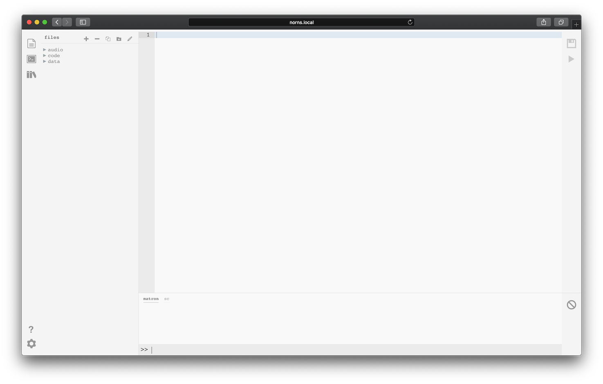
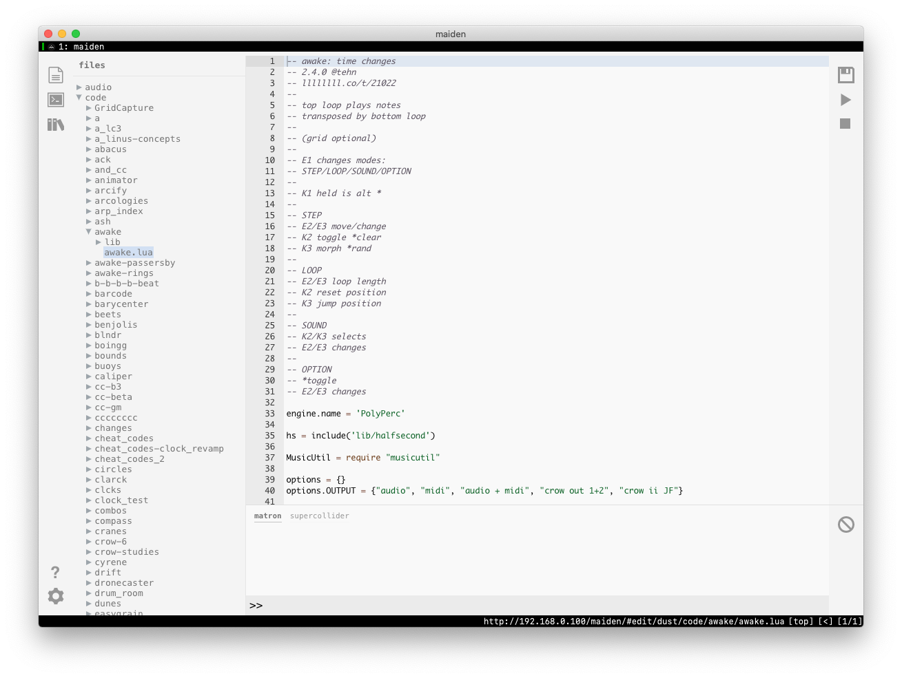
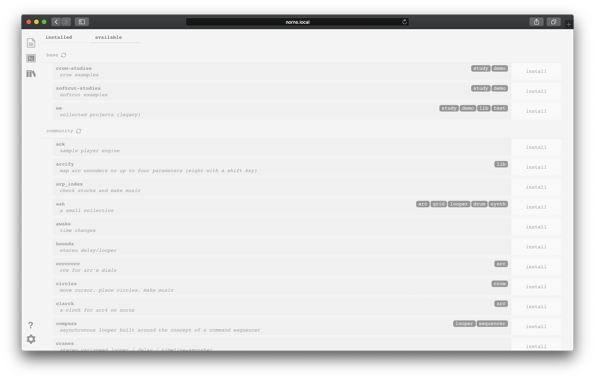
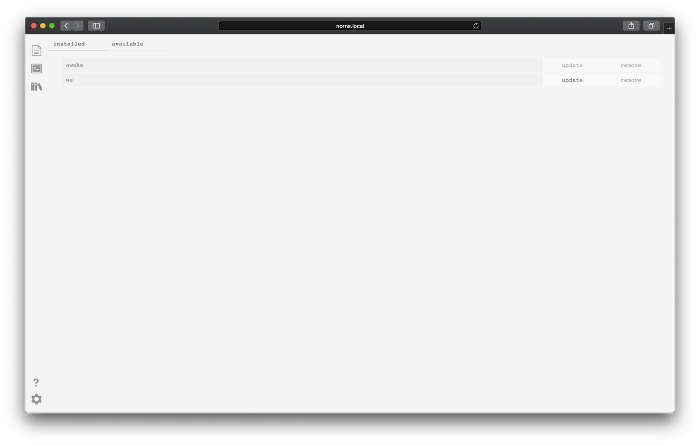
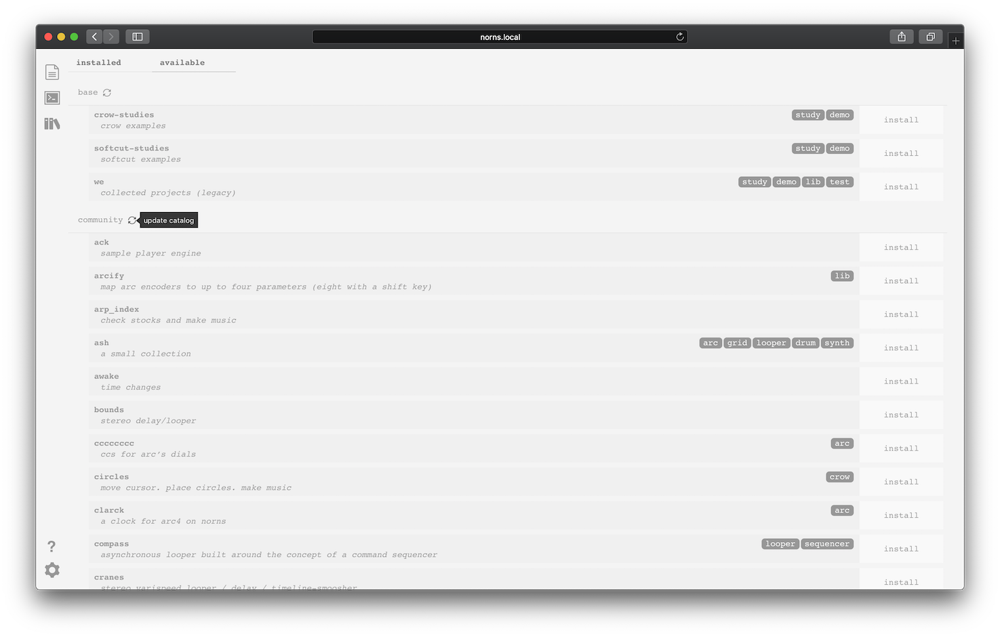

# maiden

sections: [file viewer](#file-viewer) &mdash; [editor](#editor) &mdash; [repl](#repl) &mdash; [project manager](#project-manager) &mdash; [programming reference](#programming-reference) &mdash;[other access](#other-access)

_maiden_ is the web-based editor for norns.

Point your web browser at `norns.local` to see the maiden interface. If the site is not found, try connecting directly to the IP address shown on the norns screen, for example: `192.168.1.30`.



The interface includes a meta-navigator in the far-left sidebar, which allows you to:

- toggle the *file viewer*, where you can view and select scripts to edit
- toggle the *repl* (read-eval-print-loop), where your scripts + the system both print useful information
- access the *project manager*, where you can manage the scripts that are installed on your norns

The bulk of the *file viewer* is dedicated to the EDITOR, where you can view and edit the code of a selected script.

### FILE VIEWER

This panel lets you select the text you're editing in EDITOR.

There are top bar icons for various actions: **New**, **Delete**, **Duplicate**, **New Folder**, and **Rename**.

The `>`'s can be expanded to reveal a file tree. When you select a file, it will show in the EDITOR:



### EDITOR

This is where you can edit the selected script.

To the right there is a bar with two icons: disk is **SAVE** and **PLAY** will run the current script.

The editor can be configured for various modes (default, vim, emacs) in addition to tab size and light/dark mode. Click the gear icon at the bottom left of the screen.

### REPL

Messages are printed in the bottom panel. There are two tabs: matron is the main lua environment, and sc is supercollider which is the engine environment.

You can use the bottom prompt to type commands which will be interpreted by the system. For example:

```
print("hello there")
```

will display the expected message in the window above.

The clear icon to the right will clear the current messages.

If you need to restart the matron/crone environment for any reason (ie, the menu system is not accessible), you can issue a command via the REPL:

```
;restart
```

This will disconnect maiden, but once matron has restarted you can reconnect.

### PROJECT MANAGER

As of 10.28.2019, maiden features a project manager to help you discover and download new projects. Projects contain both engines and scripts.

You can access both the *base* (projects from monome) and *community* (projects from other artists) repositories via the books icon in the left-sidebar:



#### INSTALLED

This tab shows which projects are currently installed on your norns.



Each entry has two actions: **UPDATE** and **REMOVE**.

If you choose to update a project that currently lives on your norns, please note that local modifications you have made will be overwritten. If you wish to retain multiple versions of a project, please reference the [SFTP](../sftp/) guide.

Once you update a project through the PROJECT MANAGER, you'll see a commit number listed on the right of the project's tile (like *34d225b*). Click a project's commit number to be brought to the project's GitHub page, where you can learn more about the project and verify that the version you have is the latest.

*nb. If you are updating a project through the PROJECT MANAGER that was not installed by using the PROJECT MANAGER, you will receive an error that the project cannot be found in the catalog. Please delete the previously installed version and reinstall through PROJECT MANAGER, which establishes the necessary git files for future updates.*

#### AVAILABLE

This tab shows which projects are available through the *base* and *community* repositories.

Use the refresh button next to each header to update the catalog and pull in the latest versions. Using the refresh action on each catalog is the only way to download them as they do not yet auto-update:



Many projects will have informational tags like **crow**, **drum**, **looper**, as well as a project description. Please note that the **lib** tag is specifically used to indicate that a project includes both a script *and* an engine, which will require a device restart.

Each entry has an **INSTALL** action, which can be used to install the selected script.

If you have already installed a project and attempt to install it again, you will receive an error message letting you know that the project is already installed in your `code` folder.

#### CONTRIBUTIONS

To add to the [community project repo](https://github.com/monome/norns-community/blob/master/community.json), please submit a pull request with the following information:

```
{
      "project_name": "NAME",
      "project_url": "URL",
      "author": "NAME",
      "description": "WORDS",
      "discussion_url": "LINES_LINK",
      "tags": ["TAG", "TAG", "TAG"],
      "origin": "IF_APPLICABLE: lines"
    },
```

#### GATHERING

While many projects are held in the community repository, it can be hard to engage with a project's creator through GitHub. To facilitate discussion, many projects are also shared through the [norns Library on lines](https://llllllll.co/search?expanded=true&q=%23library%20tags%3Anorns%20order%3Alatest).

These project pages have information and a download link (in addition to being available on the community repository). To install a project found through lines, download the .zip file, unpack into a folder, (IMPORTANT!) rename the folder by removing `-master` from its name, and then move this folder over to the `dust/code/` folder using [SFTP](../sftp/). It'll show up in the SELECT list.

#### SHARING

The norns ecosystem was created with community as a focus. The exchange of ideas leads to new ideas.

Create a new thread in the [Library](https://llllllll.co/c/library).

You'll be able to attach a .zip file containing your project folder, or if you wish to host your project on GitHub then link to a master download or most recent release.

Be sure you include information at the top of your script to help future users:

```
-- scriptname: short script description
-- v1.0.0 @author
-- llllllll.co/t/22222
```

That last line is a link back to the thread number. There's a chicken-egg situation with starting a thread and uploading the project, so you may want to edit and upload your project just after creating a thread.


### PROGRAMMING REFERENCE

The bottom left ? icon can be used to navigate to the onboard programming reference.

You can manually open the API reference at `norns.local/doc`.

Also see the [scripting reference](../script-reference/).

## OTHER ACCESS

### SSH

When connected via WIFI you can SSH into norns at the IP address shown in SYSTEM.

- user: `we`
- password: `sleep`

### SERIAL (NO WIFI)

Without WIFI, you can connect to norns via USB-UART by connecting the power cable to your computer. On Mac/linux, open a terminal and type:

- `screen /dev/tty.usb`
- then, press TAB to autocomplete your serial number
- then type `115200`

So, in total: `screen /dev/tty.usb[TAB KEY] 115200`

If you see a blank screen, press ENTER.

You'll be asked for login credentials. Login is the same as SSH above.