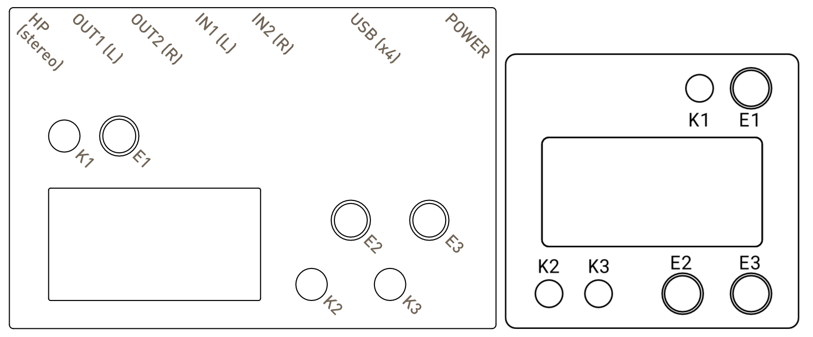
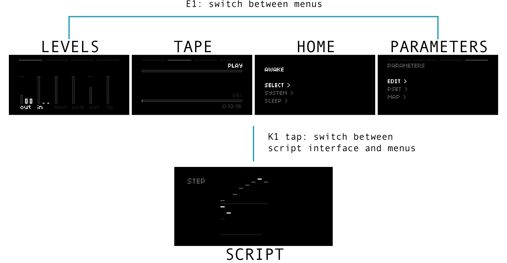
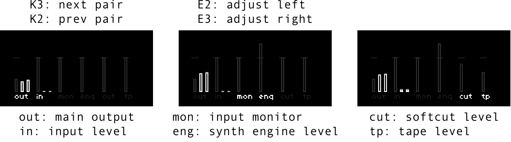
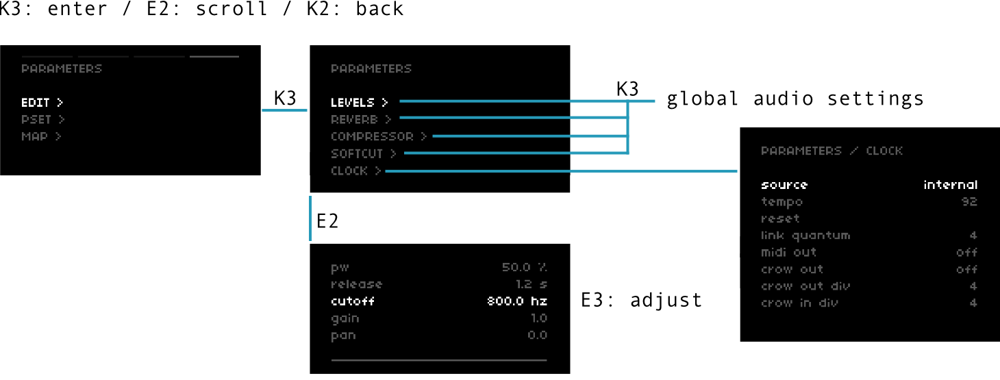
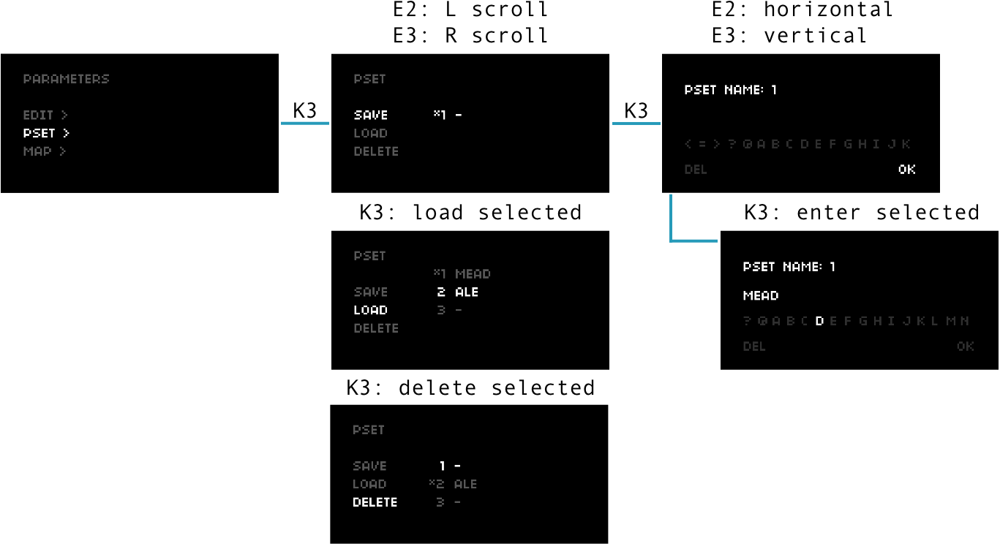
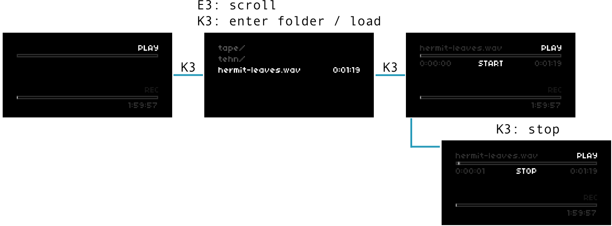
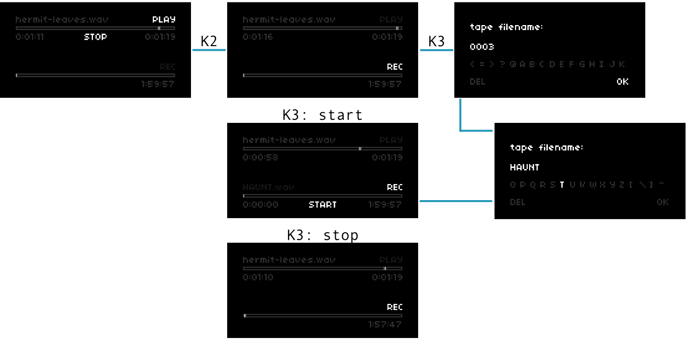
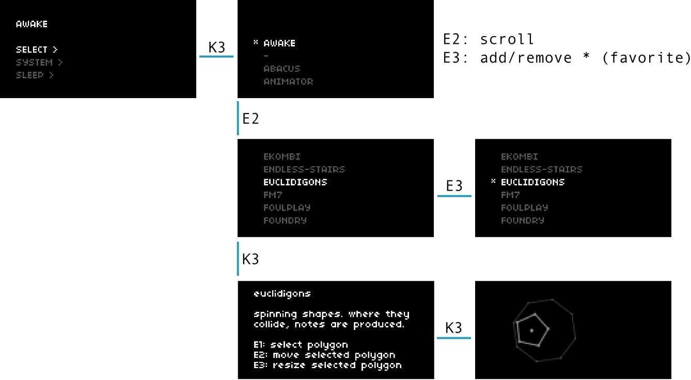

# play

sections: [start](#start) &mdash; [awake](#awake) &mdash; [levels](#levels) &mdash; [parameters](#parameters) &mdash; [tape](#tape) &mdash; [select](#select)

## start

To begin, let's get acquainted with the layouts of each iteration of norns -- stock and shield:

  
*[figure 1: stock norns and shield legend](image/play-images/norns-legends.png)*

### power on

**stock**

- Hold K1 for four seconds.
- Until you've performed this process a few times, it might help to look at the light next to the POWER jack. You'll see it transition from white, to peach, to amber -- you can let go of K1 at amber.
- In a few seconds, you'll see a sparkle animation on the screen. Some call it a dust. Either way, norns is on.

**shield**

- Attach a high quality Raspberry Pi power supply that provides at least 2A at 5V to the micro USB port on the Pi.
- The red light on the Pi will be steady, while the not-red light will flash.
- In a few seconds, you'll see a sparkle animation on the screen. Some call it a dust. Either way, norns is on.

After norns powers up, it will launch the last script that was loaded. On a fresh norns, this will be *awake*, a set of looping sequencers.

In any norns script, a quick tap of **K1** will toggle between the playable interface and the menus interface. If you get caught in the menus, just tap **K1** to get back to the script.

  
[*figure 2: interface layers*](image/play-images/menu-nav.png)

### power off

**stock**

- Press **K1** and navigate to HOME.
- Use **E2** to select SLEEP.
- Press **K3**. You'll be asked to confirm.
- Press **K3** again to go to SLEEP.
- After a few seconds, norns is off.

**shield**

- Press **K1** and navigate to HOME.
- Use **E2** to select SLEEP.
- Press **K3**. You'll be asked to confirm.
- Press **K3** again to go to SLEEP.
- *Wait* until you see the not-red light on the side of the Pi stop blinking and go out completely.
- *Only after the not-red light on the side of the Pi is no longer visible*, you can safely remove the power connector from the Pi.

## awake

Before we dive into exploring the system, here's a quick guide to exploring *awake*.

**E1** changes the mode: STEP, LOOP, SOUND, OPTION

### STEP

- **E2** navigates position, **E3** changes position
- **K2** toggles the sequence to edit. **K1+K2** clears all steps
- **K3** morphs the current sequence. **K1+K3** randomizes

### LOOP

- **E2 / E3** sets loop length
- **K2** resets to play to zero
- **K3** jumps to random position

### SOUND

- **E2 / E3** adjusts selected parameter
- **K2 / K3** moves selector

### OPTION

- **E2** adjusts BPM
- **K1+E2** change division
- **E3** changes root note
- **K1+E3** selects scale

(bonus: try plugging in a grid.)

Most norns scripts rely on these types of interactions — re-definable encoders, two-button presses in the form of hold-one-press-the-other, turning an encoder while a modifier button is held, etc.

## levels

To begin our menu dive, let's adjust the audio levels.

Tap **K1** to come up from the script layer to the menus layer and turn **E1** counter-clockwise until you see pairs of vertical sliders.

  
[*figure 3: setting levels*](image/play-images/menu-levels.png)

- **K2 / K3**: select previous pair / select next pair
- **E2 / E3**: adjust left level / adjust right level

The horizontal notch represents unity. All levels can go to +6dB.

- **out** controls the final output of the global mix
- **in** determines how much of an external input is fed into the script
  - DO NOT plug modular-level signals into norns (neither stock and shield) -- norns is designed for line levels only
- **mon** allows the input to be monitored as part of the global mix
- **eng** controls the output level of the script's synth engine
- **cut** determines the mix presence of softcut, a flexible sampling layer
- **tp** adjusts the level of a playing tape, which is fed into the global mix as well as softcut

## parameters

### changing the sounds

Use **E1** to navigate to PARAMETERS, and enter the EDIT menu with **K3**.

  
[*figure 4: editing parameters*](image/play-images/menu-params_edit.png)

At the top of this menu are controls for each component of the global audio chain:

- LEVELS features controls for output, input, monitoring, engine, softcut and tape levels
    - on stock norns, you can also adjust whether the headphone monitor is stereo or mono and add or remove headphone gain
    - again, DO NOT plug modular-level signals into norns (neither stock and shield)
- REVERB adjusts the system reverb and send levels for the currently loaded engine, softcut, monitor, and tape
- COMPRESSOR adjusts the system compressor, which is the final stage of the audio processing
- SOFTCUT adjusts the output and send levels for the six-voice system sampler

CLOCK reveals controls for the norns global clock. The clock can be synced to a number of sources, including MIDI, Ableton Link, and crow. We'll dig into specifics about clock later, but it's good to know about!

Scrolling down further, we find some of the script's parameters. These are chosen by the script's author and can be adjusted by using **E3**.

### saving the changes

To recall and build on the changes you've made in a future session, we can save all the parameters as a PSET (preset).

  
[*figure 5: saving parameters / PSET*](image/play-images/menu-params_pset.png)

Use **E2** to navigate down the left column of the PSET screen.  
Use **E3** to navigate down the right.  
The currently loaded PSET will have an asterisk `*` next to it

**save PSET**

- select `SAVE` and press **K3** to open the naming dialogue
- use **E3** to switch to the alphabet and **E2** to choose letters
- **K3** enters the selected letter
- use **E3** to navigate back to the controls (use **E2** and **K3** on `DEL` to delete a letter)
- press **K3** on `OK` to save

**load PSET**

- select `LOAD` and use **E3** to choose a saved PSET
- press **K3** to load the selected PSET

**delete PSET**

- select `DELETE` and use **E3** to choose a saved PSET
- press **K3** to delete the selected PSET

## tape

### play

These changing melodies are lovely, but they're a bit removed from the natural world. Let's load a field recording of hermits to loop underneath.

Jump to the menus interface and use **E1** to navigate to the tape screen.

  
[*figure 6: playing a tape*](image/play-images/menu-tape_play.png)

**select loop**

- with the PLAY lane selected, press **K3** to open the `audio` folder
- the `audio` folder contains both folders and single clips
  - folders will be prepended with `/`, without a duration
  - clips will be prepended with their filetype (eg. `.wav`) and a duration
  - want to import more clips into your norns? see [**wifi + files**](/docs/norns/wifi-files).

PLAY expects 48khz files (both stereo and mono supported). WAV, AIFF, FLAC and other uncompressed header / sample formats supported by [libsndfile](http://www.mega-nerd.com/libsndfile) will work (including raw).

**start/stop loop**

- when a clip is loaded, its name will be reflected on the PLAY lane
- press **K3** to START playback
- during playback, press **K3** to STOP and clear the sound

As of this writing, sounds always loop and there are no additional transport controls.

### rec

This all sounds rather lovely -- perhaps you'd like to record it?

On the tape screen, press **K2** to switch between the PLAY and REC lanes.

  
[*figure 7: recording a tape*](image/play-images/menu-tape_rec.png)

**record**

- with the REC lane selected, press **K3** to open the naming dialogue
- name your tape, or feel free to use the pre-populated counter
  - see [*figure 5*](image/play-images/menu-params_pset.png) for tips on navigating the naming dialogue
- when you arrive back at the tape menu, press K3 to record a stereo 48khz .wav file

**stop recording**

- with the REC lane selected, press **K3** stop an active recording
- the tape will be saved as a stereo 48khz .wav file with the name you gave it
  - want to export it from your norns? see [**wifi + files**](/docs/norns/wifi-files).

#### what gets recorded exactly?

In the simplest terms, everything you hear from the main output is committed to a recording tape. This includes the system reverb, compressor, and monitor audio. If you are recording for further processing in a DAW, you may want to turn off the system reverb and compressor for a more barebones sound.

## select

Now that we have a nice *awake* session under our belts, let's explore some of the other scripts on norns!

Tap **K1** and navigate to the *home* menu, then press **K3** on SELECT:

  
[*figure 8: selecting a script*](image/play-images/menu-sel.png)

- use **E2** to scroll through installed scripts
- press **K3** to open a description of the selected script
  - press **K3** again to load the selected script
  - press **K2** to return to the SELECT menu

### favorites

When you entered the SELECT menu, you might've noticed an asterisk next to *awake* -- this signifies a favorite script, which places it at the top of the scroll. This makes it easy to quickly access your go-to's!

To add a favorite, turn **E3** clockwise on any script in the SELECT menu.  
To remove a favorite, turn **E3** counter-clockwise on any already-favorited script.

## where to next?

Now that you know the basics of navigating the system, adjusting a script's parameters, and recording the results, you should feel free to explore the dozens of community scripts preloaded on your norns. To learn more about the default scripts, check out the [**app**](/docs/norns/app) page!

Want to connect to WIFI to download more scripts? Want to transfer TAPE files? Want to make sure norns is up to date? Check out [**wifi + files**](/docs/norns/wifi-files)!