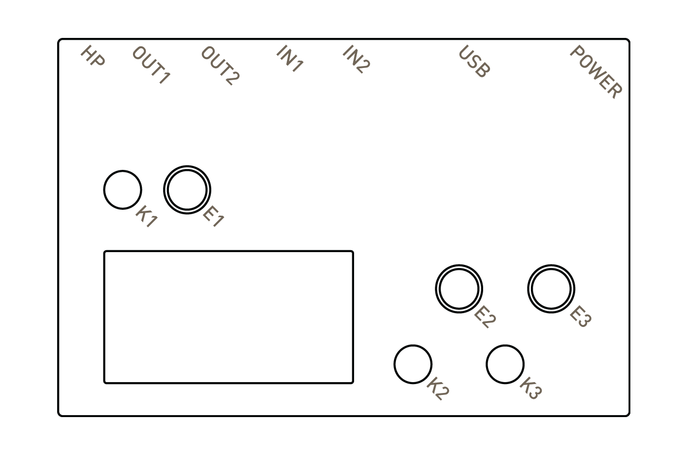
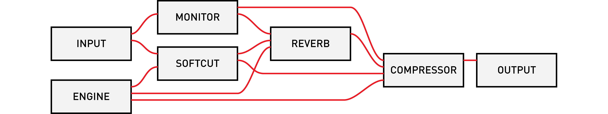

# play

sections: [begin](#begin) &mdash; [awake](#awake) &mdash; [pages](#pages) &mdash; [audio](#audio) &mdash; [connect](#connect) &mdash; [update](#update) &mdash; [help](#help)

## LEGEND

## BEGIN

The mini-USB plug provides power and charges the internal battery. Use the cable and power supply provided. (The included supply supplies 2A via USB connector.)

Hold **K1** for three seconds.

Be still, and norns will awaken.

There's a small light near the power plug.  ORANGE means power.  WHITE means disk access.

On the bottom of the norns there is a tiny push switch that will hard power-off the device. The _only_ time you should ever use the bottom button is if your norns UI is completely unresponsive and you cannot use the SLEEP or SYSTEM > RESET menu functions. SLEEP safely turns off the norns with a proper software shutdown, but the bottom switch is essentially like pulling the power cord on a desktop computer and runs the risk of disk corruption. Use it only as a last resort -- always instead use the menu to SLEEP or SYSTEM > RESET.

## AWAKE

A changing melody will play.

E1 changes the mode. K1+? means hold K1 then push ?.

### STEP

- E2 navigates position, E3 changes position.
- K2 toggles the sequence to edit. K1+K2 clears all steps.
- K3 morphs the current sequence. K1+K3 randomizes.

### LOOP

- E2/E3 set loop length.
- K2 resets to play to zero. K3 jumps to random position.

### SOUND

- E2/E3 adjust selected parameter. K2/K3 move selector.

### OPTION

- E2 adjusts BPM. K1+E2 change division.
- E3 changes root note. K1+E3 selects scale.

(bonus: try plugging in a grid.)

## PAGES

Tap K1 quickly to toggle between **PLAY** and **NOPLAY**.

You are now at **HOME**.

In **NOPLAY** mode:

- E1 moves between pages.
- E2 scrolls up/down.
- K2/K3 move back/forward.

Page layout:

### HOME

At **HOME** press K2 to toggle additional system information display:

From top-left:

- BAT: current battery %
- mA: battery's current power draw; negative values indicate discharging
- DISK: available disk storage
- CPU: current CPU utilization
- c: current internal temperature
- IP: current IP address if connected to a network

The installed software version will be listed under the script's name (eg. 191101). The format is YY-MM-DD.

#### SELECT

Explore the collection of scripts.  Selecting a script will show a description.  Forward again will run the script.  The play screen will return upon running.  Quickly tap K1 to toggle between **PLAY** and **NOPLAY**.

If you wish to clear a currently running script, highlight SELECT + hold K1. You'll see `CLEAR` in the middle of the screen -- press K3 to clear the currently running script.

#### SYSTEM

- DEVICES - This is a list of connected USB hardware with their associated port number. Most scripts address port 1. See [norns study 4](https://monome.org/docs/norns/study-4/) for a scripting guide to multiple ports. This section lets you re-assign connected devices to specific ports.
- WIFI - Networking settings. Requires USB WIFI interface. See [CONNECT](#connect).
- RESET - Quickly resets the audio system.
- UPDATE - Checks for updates. Internet connection required. See [UPDATE](#update).

#### SLEEP

Powers down cleanly, saving current state.

**If you are unable to SLEEP your norns due to a lockup situation, please DO NOT USE THE BOTTOM WHITE BUTTON.**

Instead, push-and-hold K3-K2-K1 (in this order) for 10 seconds and the system will safely reset.

### PARAMETERS

#### EDIT

Provides control over system audio levels, mix bus, and script parameters.

EDIT begins with a parameter list for the global audio settings. See [AUDIO](#audio) for details on the parameters available in each section.

- E2 scrolls
- E3 changes values. Hold K3 for fine tuning

Scroll past the global audio parameters to reveal the script-level parameters (*nb. some scripts may not have their own parameters*).

- K2 on a separator jumps to next section
- K1+E2 jumps between separators (plus top line)

#### PSET

Parameter set saving and loading:

- E2 navigates SAVE, LOAD, DELETE
- E3 scrolls PSET slots for each section
- K3 executes the command on the selected PSET slot

When you execute SAVE, you will have the option to name your PSET, with default text.

A `*` indicates the currently loaded PSET.

#### MAP

Enable MIDI mapping and control over parameters. If a parameter has a `-` to its right, it's mappable.

- E2 navigates
- K3 opens for mapping

To assign a MIDI control to a parameter, you can either LEARN or manually edit:

- E2 navigates
- E3 scrolls values
- K3 executes

### TAPE

On this page you can record and play directly to and from disk.

K2 toggles focus between PLAY and REC.

PLAY

- K3 loads file
- K3 again to start
- K3 again to stop

PLAY expects 48khz files (both stereo and mono supported). WAV, AIFF and other uncompressed header / sample formats supported by [libsndfile](http://www.mega-nerd.com/libsndfile) will work (including raw). FLAC also.

REC

- K3 to arm recording
- K3 again to start
- K3 again to stop

When you arm recording, you will have the option to name your file, with default auto-incrementing text.

REC writes 48khz stereo WAV.

To share / sync audio files between norns and your computer, you'll need to use a file-sharing client. Learn more in our [file management guides](/docs/norns/manage).

### LEVELS

Mixing and VU display happens here.

- K2/K3 to change selection, which is highlighted.
- E2/E3 modify the respective highlighted levels.

## AUDIO

Audio routing is shown below:

### AUDIO PARAMETERS

Control of various audio parameters happens in **SYSTEM > AUDIO**. Note that the topmost levels are also controlled via the **LEVELS** page.

param |range |description
---|---|---
output            |[-inf, 0] db     |output level
input             |[-inf, 0] db     |input level
monitor           |[-inf, 0] db     |monitor level (input mix to ouput)
engine            |[-inf, 0] db     |engine level (ie, supercollider)
softcut           |[-inf, 0] db     |multivoice sampler level
tape              |[-inf, 0] db     |tape playback level
monitor mode      |[MONO, STEREO]   |MONO = mix input 1 and 2 to both channels
headphone         |[0, 60]          |headphone gain
reverb            |[ON, OFF]        |reverb state
rev engine input  |[-inf, 12] db    |engine input to reverb
rev cut input     |[-inf, 12] db    |softcut input to reverb
rev monitor input |[-inf, 12] db    |monitor input to reverb
rev return level  |[-inf, 12] db    |reverb return level
rev pre delay     |[20, 100] ms     |delay before reverberation
rev lf fc         |[50, 1000] hz    |crossover frequency between low and middle bands
rev low time      |[1, 32] s        |time to decay by 60dB in low band
rev mid time      |[1, 32] s        |time to decay by 60dB in mid band
rev hf damping    |[1500, nyq] hz   |frequency at which high band decay time is 1/2 of mid band decay time
compressor        |[ON, OFF]        |compressor state
comp mix          |[0, 1.0]         |dry/wet mix. 0 = dry, 1 = wet
comp ratio        |[1, 20]          |compression ratio: for each N dB increase in input level above threshold, output level increases by 1dB
comp threshold    |[-100, 10] dB    |amplitutde above which the signal is compressed
comp attack       |[1, 1000] ms     |time constant (1/e smoothing time) for compression gain to exponentially approach a new _lower_ target level
comp release      |[1, 1000] ms     |time constant (1/e smoothing time) for compression gain to exponentially approach a new _higher_ target level
comp pre gain     |[-inf, 30] db    |gain pre compression
comp post gain    |[-inf, 30] db    |gain post compression

## CONNECT

Scripts can be created and edited using a web browser when norns is connected to a network. These scripts will appear in the **SELECT** list for later play.

### WIFI

The WIFI nub must be inserted before starting.

To connect to your local network router:

- Navigate to **SYSTEM > WIFI**.
- Select **ADD**.
- Choose your network from the list displayed.
- Enter the password. E2 toggle between top and bottom row, E3 scrolls character, K3 selects character. Select **OK** when complete.
- With success, you should be assigned an IP address shortly after.

If you do not have access to a router, you can turn the norns into a WIFI hotspot. This will create a new network which you can then connect to with your computer:

- SSID: `norns`
- password: `nnnnnnnn`

### SSH

When connected via WIFI you can SSH into norns at the IP address shown in SYSTEM.

- user: `we`
- password: `sleep`

### SERIAL (NO WIFI)

Without WIFI, you can connect to norns via USB-UART by connecting the power cable to your computer. On Mac/linux, open a terminal and type:

- `screen /dev/tty.usb`
- then, press TAB to autocomplete your serial number
- then type `115200`

So, in total: `screen /dev/tty.usb[TAB KEY] 115200`

If you see a blank screen, press ENTER.

You'll be asked for login credentials. Login is the same as SSH above.

## UPDATE

Updates to the core norns software can be installed easily via the SYSTEM menu. You must first be connected to the internet via wifi and have at least 400M free disk space. If a new version is available you will be prompted to continue installing. Audio will be disabled during this time. Note that the download time may be a few minutes, have patience. Upon completion you'll be notified of success or failure, then the unit will ask for your confirmation to shut down.

If for some reason you wish to re-run an update, hold K1 while selecting SYSTEM > UPDATE. norns will notify you that it has found the most recent update and you can follow the prompts to install.

**If you are running 181101 or earlier it's recommended to do a [fresh install](../help/#fresh-install).**

## HELP

See the dedicated [help page](../help/) for solutions to common problems.

The [community forum](https://llllllll.co/tag/norns) has various informative threads. Please join us!

Check the [known bugs](https://github.com/monome/norns/wiki/known-bugs) list for problems and solutions.

If you're experiencing hardware problems contact `help@monome.org` and we can help right away.
