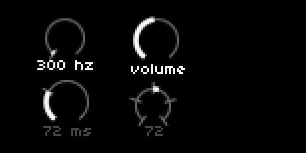

## Dial

### control

| Syntax                                                                                              | Description                                                                                                                                                                                                                                                                                                                                                                                                                                                                                                                                                                                                                                                                                              |
| --------------------------------------------------------------------------------------------------- | -------------------------------------------------------------------------------------------------------------------------------------------------------------------------------------------------------------------------------------------------------------------------------------------------------------------------------------------------------------------------------------------------------------------------------------------------------------------------------------------------------------------------------------------------------------------------------------------------------------------------------------------------------------------------------------------------------- |
| UI.Dial.new (x, y, size, value, min_value, max_value, rounding, start_value, markers, units, title) | Create a new dial.<br>`x` and `y` are the coordinates where the dial will be displayed: number<br>`size` is the size of the dial (default 22): number<br>`value` is the starting value: number<br>`min_value` and `max_value` and the minimum and maximum values: number<br>`rounding` specifies the increments, and defaults to `0.01`: number<br>`start_value` sets where the fill line is drawn from, and defaults to `0`: number<br>`markers` indicates where reference markers are to be placed on the dial: table of floats or integers<br>`units` will be displayed next to the `value` below the dial: string<br>`title` will be displayed instead of `value` and `units` below the dial: string |
| my_dial:set_value (number)                                                                          | Set value : number                                                                                                                                                                                                                                                                                                                                                                                                                                                                                                                                                                                                                                                                                       |
| my_dial:set_value_delta (delta)                                                                     | Set value using delta : number                                                                                                                                                                                                                                                                                                                                                                                                                                                                                                                                                                                                                                                                           |
| my_dial:set_marker_position (marker_id, position)                                                   | Set marker positions : number                                                                                                                                                                                                                                                                                                                                                                                                                                                                                                                                                                                                                                                                            |
| my_dial:redraw ()                                                                                   | Redraw dial                                                                                                                                                                                                                                                                                                                                                                                                                                                                                                                                                                                                                                                                                              |

### query

| Syntax              | Description                               |
| ------------------- | ----------------------------------------- |
| my_dial.x           | Returns originating x-coordinate : number |
| my_dial.y           | Returns originating y-coordinate : number |
| my_dial.size        | Returns size : number                     |
| my_dial.value       | Returns dial's current value : number     |
| my_dial.min_value   | Returns dial's minimum value : number     |
| my_dial.max_value   | Returns dial's maximum value : number     |
| my_dial.rounding    | Returns dial's rounding value : number    |
| my_dial.start_value | Returns dial's start value : number       |
| my_dial._markers    | Returns marker positions : table          |
| my_dial.units       | Returns dial's units : string             |
| my_dial.title       | Returns dial's title : string             |
| my_dial.active      | Returns dial's active state : boolean     |

### example



```lua
UI = require("ui")

dial = {}
active_row = 1 -- counter to indicate which row of dials is active

-- create 4 dials:
-- UI.Dial.new (x, y, size, value, min_value, max_value, rounding, start_value, markers, units, title)
dial[1] = UI.Dial.new(10, 3, 20, 300, 0, 12000, 100, 0, {0}, 'hz')
dial[2] = UI.Dial.new(55, 3, 22, 60, 0, 127, 1, 0, {},'','volume')
dial[3] = UI.Dial.new(10, 34, 22, 72, 0, 250, 1, 0, {72},'ms')
dial[4] = UI.Dial.new(55,38,18,72,0,127,1,64,{0,32,64,96,127})

-- set dial 3 and dial 4 to inactive
dial[3].active = false
dial[4].active = false

screen.aa(1) -- provides smoother screen drawing

function redraw()
  screen.clear()
  screen.fill()
  -- dials need to be redrawn to display:
  for i = 1,4 do
    dial[i]:redraw()
  end
  screen.update()
end

function enc(n,d)
  if n == 1 then
    active_row = util.clamp(active_row+d,1,2)
    -- select active row of dials
    if active_row == 1 then
      dial[1].active, dial[2].active = true,true
      dial[3].active, dial[4].active = false,false
    elseif active_row == 2 then
      dial[1].active, dial[2].active = false,false
      dial[3].active, dial[4].active = true,true
    end
  -- adjusting dial + marker values:
  elseif n == 2 then
    if dial[1].active then
      dial[1]:set_value_delta(d*100)
    else
      dial[3]:set_value_delta(d)
      dial[3]:set_marker_position(1,dial[3].value)
    end
  elseif n == 3 then
    if dial[2].active then
      dial[2]:set_value_delta(d)
    else
      dial[4]:set_value_delta(d)
    end
  end
redraw()
end
```

### description

Draws a dial on the screen from the specified (x, y) pair. Size is determined by a single variable `size` and defaults to `22`. Value is clamped to the dial's min and max values and can be changed by direct assignment or incremental adjustment.  The increments can be rounded by adjusting the float for `rounding`, which defaults to `0.01`. The `start_value` sets where the fill line is drawn from, and defaults to `0`. Reference markers can be added, in the form of a table of floats or integers. The dial can either display `units` next to the current value, or `title` instead of both value and units.
