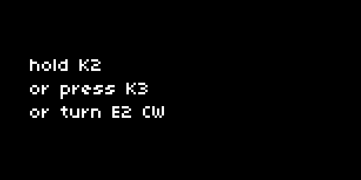

## Message

### control

| Syntax                      | Description                                                                                 |
| --------------------------- | ------------------------------------------------------------------------------------------- |
| UI.Message.new (text_array) | Create a new instance of message. Takes  `text_array` of multiple strings: table of strings |
| my_message:redraw()         | Displays the `text_array` with one line per string                                          |

### query

| Syntax            | Description                                         |
| ----------------- | --------------------------------------------------- |
| my_messsage.text  | Returns original text array : table                 |
| my_message.active | Returns message's active state : boolean            |

### example



```lua
UI = require("ui")

function init()
  -- create the various text arrays
  text_array = {}
  text_array[1] = {'the end', 'and the beginning', 'they are', 'the same'}
  text_array[2] = {'the relationship between', 'what we can see', 'and what we know'}
  text_array[3] = {'do you know', 'that icarus', 'flew too close to the sun?'}
  
  -- create instances of messages
  message ={}
  for i=1,3 do
    message[i] = UI.Message.new(text_array[i])
  end
  
  is_message_displayed = false -- track whether the UI is showing any of the messages
  displayed_message = nil -- track which message is being displayed
  icarus = 0 -- establish a var to track E2 turns
end

function redraw()
  screen.clear()
  screen.font_size(8)
  screen.level(15)
  if is_message_displayed == false then -- if we aren't displaying a message...
    local instructions = {'hold K2','or press K3','or turn E2 CW'}
    for i = 1,#instructions do
      screen.move(0,14+(i*10))
      screen.text(instructions[i]) -- then write the instructions on screen.
    end
  else -- otherwise, if we are displaying a message...
    screen.clear()
    message[displayed_message]:redraw() -- draw the message.
    print("redrawing message") -- debugging feedback, to prove only 1 message is drawing at a time.
  end
  screen.update()
end

function show_message(msg,dur) -- generic function to display message of number 'msg' and for duration (in seconds) 'dur'
  if not is_message_displayed then -- another way to say is_message_displayed == false
    if displayed_message ~= msg then
      displayed_message = msg
      is_message_displayed = true
      redraw()
      if dur ~= nil and dur > 0 then -- if a dur argument is provided...
        clock.run(function()
          clock.sleep(dur) -- wait for the duration to pass,
          hide_message(msg) -- and hide the message.
        end)
      end
    end
  end
end

function hide_message(msg)
  is_message_displayed = false
  icarus = 0
  displayed_message = nil
  redraw()
end

function key(n,z)
  if not is_message_displayed then -- if there's no message currently being displayed, then...
    if n == 2 and z == 1 then -- when key 2 is held...
      show_message(1) -- display message 1
    elseif n == 3 and z == 1 then -- otherwise, if key 3 is pressed
      show_message(2,2) -- display message 2 for 2 seconds
    end
  else -- if there is a message being displayed...
    if n == 2 and z == 0 and displayed_message == 1 then -- and if key 2 is released, and message 1 is being displayed, then...
      hide_message(displayed_message) -- hide it.
    end
  end
end

function enc(n,d) -- a message can be displayed upon a condition being met
  if n == 2 and not is_message_displayed then
    if d > 0 and displayed_message ~= 3 then -- only calculate icarus when message 3 is not yet active
      icarus = icarus + d
    end
    if icarus > 10 then
      show_message(3,5) -- display message 3 for 5 seconds
    end
  end
end
```

### description

Provides a way of displaying a message on the screen. `UI.Message.new` takes a table of strings, with each entry in the table (ie, each string) being displayed on a new line in the message. Messages are useful for indicating to the user that certain operations are finished, or for displaying error messages.

The message is drawn using the `redraw()` function, which needs to be called to display the message.

`UI.Message.new` returns a table which should be stored in a variable `my_message`. The `redraw` function can then be called using `my_message` in the manner described above.

In the example above, we show three possible ways messages can be used. `K2` displays a message for as long as `K2` is held. `K3` displays a message for two seconds. When `E2` is turned and reaches a certain value, a message is displayed for five seconds. We also define a generic function `show_message` which we can call whenever we want to display a certain message for a particular duration.


