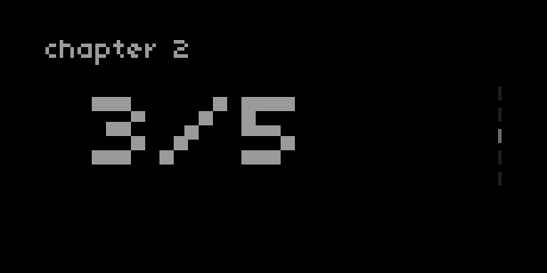

## Pages

### control

| Syntax                                 | Description                                                                                                                                                    |
| -------------------------------------- | -------------------------------------------------------------------------------------------------------------------------------------------------------------- |
| UI.Pages.new (index, total_pages)      | Create a new instance or set of pages <br> `index` is the page index (ie, the "open" page): number <br>`total_pages` is the number of pages in the set: number |
| my_pages:set_index (index)             | Set page index : number                                                                                                                                        |
| my_pages:set_index_delta (delta, wrap) | Set page index using delta, with wrapping : number, boolean                                                                                                    |
| my_pages:redraw ()                     | Redraw page with `Pages` elements                                                                                                                              |

### query

| Syntax             | Description                            |
| ------------------ | -------------------------------------- |
| my_pages.index     | Returns current index : number         |
| my_pages.num_pages | Returns total number of pages : number |

### example



```lua
UI = require("ui")

chapter = {}

-- create three sets of pages:
chapter[1] = UI.Pages.new(2,10)
chapter[2] = UI.Pages.new(3,5)
chapter[3] = UI.Pages.new(1,2)

id = 2

function redraw()
  screen.clear()
  chapter[id]:redraw()
  screen.level(8)
  screen.font_size(8)
  screen.move(0,10)
  screen.text("chapter "..id)
  screen.font_size(30)
  screen.move(40,40)
  screen.text_center(chapter[id].index.."/"..chapter[id].num_pages)
  screen.update()
end

function enc(n,d)
  if n == 1 then
    -- change chapter:
    id = util.clamp(id+d,1,#chapter)
  elseif n == 3 then
    -- change pages in current chapter:
    chapter[id]:set_index_delta(d,false)
  end
  redraw()
end
```

### description

Create a set of pages with a minimal on-screen UI. A "scrollbar" on the right side of the screen shows the number of pages, while a highlighted `index` indicates the active page. 

The UI is drawn using the `my_pages:redraw()` function, which needs to be called when there is a change in the instance of pages or the `index`. In the example above, `chapter[id]:redraw()` is included in the script's `redraw` function.

`UI.Pages.new` returns a table which should be passed to a variable in your script. The various other controls and queries can then be called using your variable in the manner described above. 

In the example above, our variable is the relevant `chapter` (ie, `chapter[1]`, `chapter[2]`, or `chapter[3]`) which stores each instance of `UI.Pages.new`.
