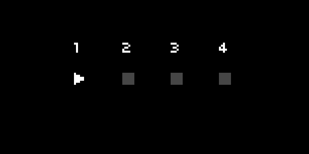

## Playback Icon

### control

| Syntax                                    | Description                                                                                                                            |
| ----------------------------------------- | -------------------------------------------------------------------------------------------------------------------------------------- |
| UI.PlaybackIcon.new (x, y, size, status)  | Create a new playback icon <br>`x` and `y` are the coordinates of the position of the icon, default to `0`: numbers<br>`size` is the size of the icon, defaults to `6`: number <br>`status` is the status of the playback icon. `1` is `play`, `2` is `reverse play`, `3` is `pause`, `4` is `stop`. Defaults to `1`: number |
| my_playbackicon:redraw ()                 | Redraw playback icon                                                                                                                    |

### query

| Syntax                 | Description                                 |
| ---------------------- | ------------------------------------------- |
| my_playbackicon.x      | Originating x-coordinate : number           |
| my_playbackicon.y      | Originating y-coordinate : number           |
| my_playbackicon.size   | Icon's size : number                        |
| my_playbackicon.status | Playback icon's status (see above) : number |
| my_playbackicon.active | Playback icon's active status : boolean     |

### example



```lua
UI = require("ui")

-- create our playback icons
my_icons = {}
for i=1,4 do
  my_icons[i] = UI.PlaybackIcon.new(24*i,30,6,4)
end

-- set all except my_icons[1] to inactive (ie, .active = false)
for i=2,4 do
  my_icons[i].active = false
end

-- set a counter for which track is active
active_track = 1

function redraw()
  screen.clear()
  for i=1,4 do
    screen.level(15)
    screen.move(24*i,20) -- label each icon
    screen.text(i)
    my_icons[i]:redraw() -- redraw all four icons
  end
  screen.update()
end

function key(n,z)
  if n == 1 then
    alt = z==1 
  elseif n == 2 and z == 1 then
    -- K2 plays active track, or pauses (if playing or reverse playing)
    if not alt then
      if my_icons[active_track].status == 1 or my_icons[active_track].status == 2 then my_icons[active_track].status = 3
      else my_icons[active_track].status = 1 end
    else 
      my_icons[active_track].status = 4 -- K1 + K2 stops the active track
    end
  elseif n == 3 and z == 1 then
    -- toggles between play and reverse play
    if my_icons[active_track].status == 1 then
      my_icons[active_track].status = 2
    elseif my_icons[active_track].status == 2 then
      my_icons[active_track].status = 1
    end
  end
redraw()
end

function enc(n,d)
  if n == 1 then
    active_track = util.clamp(active_track + d, 1, 4)
    for i=1,4 do
      my_icons[i].active = false -- we reset all active states to false
    end
    my_icons[active_track].active = true -- only the active track's icon is active
  end
redraw()
end
```

### description

Creates a playback icon at `x` and `y` coordinates, of size `size`. The icon will display one of four states: `play`, `reverse play`, `pause` and `stop`, corresponding to `1`, `2`, `3`, and `4` respectively. 

`UI.PlaybackIcon.new` returns a new instance of the playback icon which should be stored in a variable (eg. `my_icon[1]` to `my_icon[4]` in our example). The various other controls and queries can then be called using the assigned variable in the manner described above.

The UI is drawn using its `redraw()` function, which needs to be called when there is a change in the active status or status of the playback icon. 
