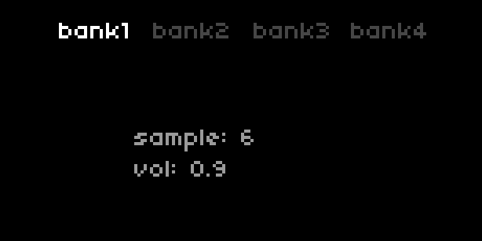

## Tabs

### control

| Syntax                                | Description                                                                                                                            |
| ------------------------------------- | -------------------------------------------------------------------------------------------------------------------------------------- |
| UI.Tabs.new (index, titles)           | Create a new instance or set of tabs <br> `index` is the open or active tab: number <br> `titles` is a list of each tab's title: table |
| my_tabs:set_index (index)             | Set tab index  : number                                                                                                                |
| my_tabs:set_index_delta (delta, wrap) | Set tab index using delta, with wrapping : number, boolean                                                                             |
| my_tabs:redraw ()                     | Redraw tab elements                                                                                                                    |

### query

| Syntax        | Description                    |
| ------------- | ------------------------------ |
| my_tabs.index | Returns current index : number |

### example



```lua
UI = require("ui")

-- create a list of titles

my_titles = {'bank1', 'bank2', 'bank3', 'bank4'}

-- create our banks 
banks = {}
for i=1,#my_titles do
  banks[i] = {sample = math.random(1,8), vol = math.random(0,100)/100}
end

my_tabs = UI.Tabs.new(1,my_titles) -- create a new instance of tabs 

function redraw()
  screen.clear()
  screen.font_size(8)
  my_tabs:redraw() -- redraw tabs
  screen.level(8)
  screen.move(30,40)
  screen.text('sample: '..banks[my_tabs.index].sample)
  screen.move(30,50)
  screen.text('vol: '..string.format("%.2g",banks[my_tabs.index].vol))
  screen.update()
end

function enc(n,d)
  if n == 1 then
    my_tabs:set_index_delta(d,false) -- change the index, ie the active tab
  elseif n == 2 then
    banks[my_tabs.index].sample = util.clamp(banks[my_tabs.index].sample + d,1,8)
  elseif n == 3 then
    banks[my_tabs.index].vol = util.clamp(banks[my_tabs.index].vol + d/100,0,1)
  end
  redraw()
end
```

### description

Creates a set of tabs with a minimal on-screen UI. The tab titles appear at the top of the screen, and the active tab is highlighted. Note that the length of the titles is limited depending on the number of titles, and *vice versa*.

`UI.Tabs.new` returns a table which should be stored in a variable (eg. `my_tabs`in our example). The various other controls and queries can then be called using the assigned variable in the manner described above.

The UI is drawn using its `redraw()` function, which needs to be called when there is a change in the instance of tabs or the `index`.
