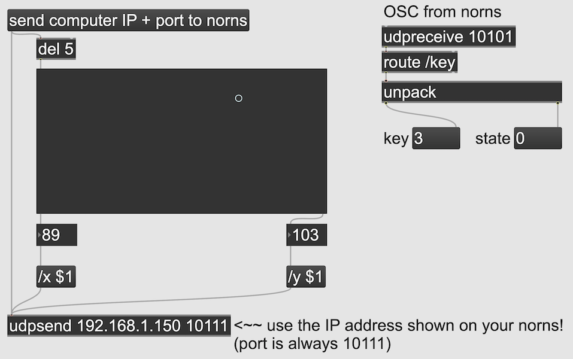
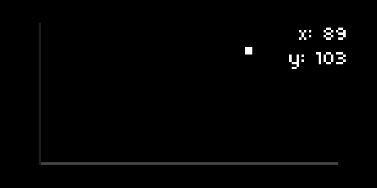

## osc

### functions

| Syntax                                  | Description                                                                                                                                                                                                                                                    |
| --------------------------------------- | -------------------------------------------------------------------------------------------------------------------------------------------------------------------------------------------------------------------------------------------------------------- |
| osc.event(path,{args},{host_IP,port})   | Action which is executed when OSC messages are received by norns. `path` is a string which prepends the incoming values. `{args}` are a table of incoming values. `{host_IP,port}` is a table which identifies the source address. Can be redefined by script. |
| osc.send({dest_IP, port}, path, {args}) | Send a table of OSC data from norns to another networked device. `{dest_IP,port}` is a table which identifies the destination address.`path` is a string which prepends the outgoing values. `{args}` are a table of outgoing values.                          |

### example

Use with [this Max patch](https://gist.github.com/dndrks/2dd205a11c2ae1237fadcc40bc13a89b) for bi-directional communication between a general-purpose computer and norns.




```lua
local Graph = require "graph" -- for on-screen visual

function init()
  external_osc_IP = nil -- to track the external device's IP
  screen_dirty = true
  
  demo_graph = Graph.new(0, 127, "lin", 0, 127, "lin", "point", true, true)
  demo_graph:set_position_and_size(3, 3, 122, 58)
  demo_graph:add_point(1, 0)
  
  params:add_number("x_axis","x axis",0,127,0)
  params:set_action("x_axis",
    function(x)
      demo_graph:edit_point(1, x, params:get("y_axis"))
      screen_dirty = true
    end
  )
  
  params:add_number("y_axis","y axis",0,127,0)
  params:set_action("y_axis",
    function(y)
      demo_graph:edit_point(1, params:get("x_axis"), y)
      screen_dirty = true
    end
  )
  
  redraw_clock = clock.run(
    function()
      while true do
        clock.sleep(1/15) -- 15fps
        if screen_dirty then
          redraw()
        end
      end
    end
  )
  
end

function osc.event(path,args,from)
  if path == "/x" then
    params:set("x_axis",args[1])
  elseif path == "/y" then
    params:set("y_axis",args[1])
  elseif path == "send" then
    print("external IP "..from[1])
    external_osc_IP = from[1]
  end
end

function key(n,z)
  local dest = {external_osc_IP,10101}
  if dest[1] ~= nil then
    osc.send(dest,"/key",{n,z})
  end
end

function enc(n,d)
  screen_dirty = true
end

function redraw()
  screen.clear()
  screen.move(128,10)
  screen.text_right("x: "..params:get("x_axis"))
  screen.move(128,20)
  screen.text_right("y: "..params:get("y_axis"))
  demo_graph:redraw()
  screen.update()
  screen_dirty = false
end
```

### description

Connect a script to other OSC-enabled devices across a network. Provides scaffolding for incoming and outgoing OSC functions.

`osc.event` is a static callback function which reflects incoming OSC events from an external source. These events are formatted as:

- `path`: a string that prepends a table of data, to add significance to the data, eg. "/x", "/y", "/cutoff", etc.
- `args`: a table of values which follow the path, which a script can separate by index and pass to other functions within the script
- `from`: a table which includes the source device's IP address and port, which help identify the device to norns

norns *only* listens to OSC events through port `10111`
{.label}

`osc.send` is a static method to send an OSC event from norns. These events are formatted as:

- `dest`: a table which includes the destination device's IP address and a port through which the destination device is expecting messages from norns
- `path`: a string that prepends a table of data, which reflects the significance of the data to the receiving device, eg. "/x", "/y", "/cutoff", etc.
- `args`: a table of values which follow the path, which a destination device can separate by index

norns can send to any OSC port which your destination device accepts
{.label}
