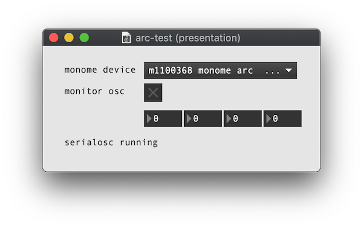

# grid and arc basic setup

### [&rarr; download serialosc](https://github.com/monome/serialosc/releases/latest)

serialosc runs in the background and converts serial communication (over USB) into [OSC](/docs/serialosc/osc). applications can query serialosc to connect to the grid and arc.

**linux: see the [linux setup guide](/docs/serialosc/linux)**

**raspberry pi: see the [raspbian setup guide](/docs/serialosc/raspbian)**

**technical: [grid serial references](/docs/serialosc/serial.txt) + [osc references](/docs/serialosc/osc/)**

## troubleshooting

### macOS
If your grid or arc is not being detected when you plug into your Mac (but it is showing the light burst indicating its receiving power over USB), here are a few things to try.

1. On your Mac, open Activity Monitor and search `serialosc`. you should see entries for both `serialosc-detector` and `serialoscd`. if you do not, then serialosc is not installed.

2. Once you confirm serialosc is installed, please connect your grid/arc and open Terminal.  
    - execute `ls -lrt /dev/tty.usb*`  
    - if you get `ls: /dev/tty.usb*: No such file or directory` back, then your grid/arc is not connecting and you should try a different USB cable.
    - an example successful response: `crw-rw-rw-  1 root  wheel   20,   6 Nov  8 08:08 /dev/tty.usbserial-m1100368`

3. In Terminal, confirm that you do not have any conflicting FTDI drivers installed:
    - execute `ls /System/Library/Extensions | grep FTDI`
    - you should only get `AppleUSBFTDI.kext` back.
    - if you get `FTDIKext.kext` back, it needs to be uninstalled:

	```
	cd /System/Library/Extensions
	rm -r FTDIUSBSerialDriver.kext
	cd /Library/Receipts
	rm -r FTDIUSBSerialDriver.kext
	```

4. Now, reboot and try step 2 again. if things are still not working, open Terminal and execute:

	```
	launchctl unload /Library/LaunchAgents/org.monome.serialosc.plist
	launchctl load /Library/LaunchAgents/org.monome.serialosc.plist
	```
	
	In Max, open either grid-test.maxpat or arc-test.maxpat (depending on the monome device). if you can't find the patchers, use CMD+B to open Max's file browser and search either `package:monome grid-test.maxpat` or `package:monome arc-test.maxpat`. plug in your grid/arc and you should see your grid/arc connect automatically!

	

#### still not working?

Do you have TouchOSC Bridge or TouchOSC Editor installed? Try removing them and installing [the latest versions](https://hexler.net/products/touchosc). You should be able to run both TouchOSC and serialosc, but we've found that reinstalling the TouchOSC software is necessary in some situations.

Do you have any Wacom drivers installed? Please follow [these removal steps](https://www.wacom.com/en-in/support?guideTitle=How-do-I-uninstall-(manually)-and-re-install-the-Wacom-driver-on-Mac-OS-for-a-Pen-Tablet%2C-Pen-Display%2C-or-Pen-Computer%3F&guideId=002-235), as we've found that these drivers can block serialosc.

Then (or first, if you don't have TouchOSC or Wacom drivers installed) try the "uninstalling d2xx drivers" steps from [page 18 of this guide](https://www.ftdichip.com/Support/Documents/AppNotes/AN_134_FTDI_Drivers_Installation_Guide_for_MAC_OSX.pdf) and try installing [the FTDI driver](https://www.ftdichip.com/Drivers/VCP/MacOSX/FTDIUSBSerialDriver_v2_4_2.dmg) manually.

If you've reached this point and things still aren't working, please contact [help@monome.org](mailto:help@monome.org) with screenshots of what you see in steps 1-4, what you see in the Max console (CMD+B), and your Mac's OS version.
