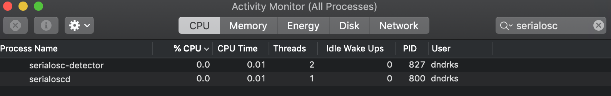

# grid and arc basic setup

### [&rarr; download serialosc](https://github.com/monome/serialosc/releases/latest)

serialosc runs in the background and converts serial communication (over USB) into [OSC](/docs/serialosc/osc). applications can query serialosc to connect to the grid and arc.

**linux: see the [linux setup guide](/docs/serialosc/linux)**

**raspberry pi: see the [raspbian setup guide](/docs/serialosc/raspbian)**

## getting started

the [max 7 monome package](/docs/grid/app/package) is a collection of applications and tools for Max 7 which can be used with the free runtime.

see the [applications list](/docs/grid/app) for several more.

## troubleshooting

### MacOS
If you have performed all the above steps and your grid or arc is not being detected when you plug into your Mac (but it is showing the light burst indicating its receiving power over USB), here are a few things to try.

1. On your Mac, open Activity Monitor and search `serialosc`. You should see entries for `serialosc-detector` and `serialoscd`. If you do not, then serialosc is not installed.

    <center>

2. Once you confirm serialosc is installed, please connect your grid/arc and open Terminal.  
    - Execute `ls -lrt /dev/tty.usb*`  
    - If you get `ls: /dev/tty.usb*: No such file or directory` back, then your grid/arc is not connecting and you should try a different USB cable.
    - An example successful response: `crw-rw-rw-  1 root  wheel   20,   6 Nov  8 08:08 /dev/tty.usbserial-m1100368`

3. In Terminal, confirm that you do not have any conflicting FTDI drivers installed:
    - Execute `ls /System/Library/Extensions | grep FTDI`
    - You should only get `AppleUSBFTDI.kext` back.
    - If you get `FTDIKext.kext` back, it needs to be uninstalled:

		```
	cd /System/Library/Extensions
	rm -r FTDIUSBSerialDriver.kext
	cd /Library/Receipts
	rm -r FTDIUSBSerialDriver.kext
		```

4. Now, reboot and try step 2 again. If things are still not working, open Terminal and execute:

	```
	launchctl unload /Library/LaunchAgents/	org.monome.serialosc.plist
	launchctl load /Library/LaunchAgents/	org.monome.serialosc.plist
	```
	
	In Max, open either grid-test.maxpat or arc-test.maxpat (depending on the monome device). If you can't find the patchers, use CMD+B to open Max's file browser and search either `package:monome grid-test.maxpat` or `package:monome arc-test.maxpat`. Plug in your grid/arc and you should see your grid/arc autoconnect!

	<center>

If you've reached this point and things still aren't working, please contact [help@monome.org](mailto:help@monome.org) with screenshots of what you see in steps 1-4, what you see in the Max console (CMD+B), and your Mac's OS version.