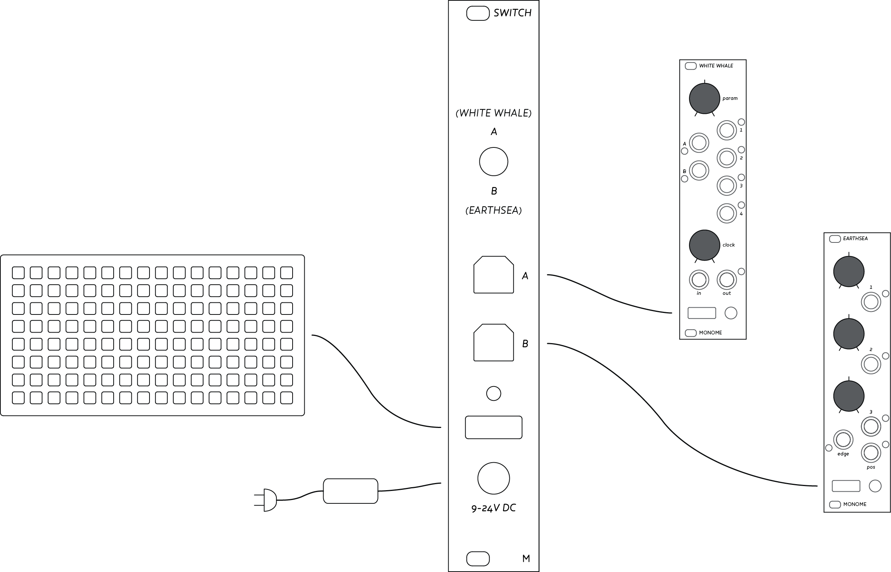

# Switch

*External power and context switch for grids.*

## Installation

Switch operates in isolation from your Eurorack power supply. Simply screw the module into your case and you're ready to power up.

Attach the included 9v power adapter to the input plug labeled '9-24V DC' at the base of the module. Alternative power supplies can be used provided they meet the following specifications:

- +9v to +24v DC output
- Tip-positive
- 1.2A (or greater)
- 2.1mm Barrel connector

Output power consumption to your USB device is limited to 1A to protect against short circuits.

##Power

Switch adds an additional 5v power supply to a Eurorack modular system specifically to power a monome grid, though any USB-compliant controller can be powered also.

**nb: Switch does not supply +5v to your Eurorack System. You will still need an internal +5v rail if you are using monome trilogy modules.**

The grid is protected against negative & over-voltage power supplies, while isolating the dynamic power requirements of the leds from the extant Eurorack power supply.

With the grids power supplied independently, issues of high frequency noise and the large dynamic power draw of the grid are removed. This will reduce strain on your Power Supply and can help to avoid unwanted side-effects in some modules.

## Connect

Attach a monome grid to the oblong USB-A port immediately above the DC power supply input. Power will be applied to the grid and the startup animation will play.

An included USB cable can then be used to connect output **A** to the USB input of your module to be controlled. Make certain the switch is in the upper position and the grid should now display the connected application.

## Switch

Using the second included USB cable attached to the **B** labeled USB jack on the switch module, you can rapidly shift context between two destination modules.

Flip the switch on the panel downward to **B** and you will see the grid update to the newly connected module. The update is very rapid for fluidly shifting between two modules.

### Switch with Computer

While designed for switching focus between modules, the switch can also be used to alternate between a grid-enabled module and computer. This can help avoid awkward hot-swapping when a computer is out of reach or inaccessible.

We have found much success using a computer for processing the audio output from a Eurorack synthesizer with a grid-based application like [mlrv](https://github.com/trentgill/mlrv2/releases/latest), while switching to monome modules in the case. With this setup it's usually easiest using Switch to change context between computer (**A**) and modular (**B**), and then hot-swapping the **B** cable to different modules.
