
<iframe src="https://player.vimeo.com/video/104881064?color=ff7700&title=0&byline=0&portrait=0" style="position:absolute;top:0;left:0;width:100%;height:100%;" frameborder="0" allow="autoplay; fullscreen" allowfullscreen></iframe>

# White Whale

*Grid-enabled Probabilistic Step Sequencer*

---

#### WARNING: White Whale requires high +5v current

Please make certain to check your case’s +5v power supply capacity. If it is underpowered (<600mA), or highly taxed, our [Switch](/docs/switch) is required.

## Introduction

White Whale is the culmination of methods and experiments based on a decade of step sequencer design for the grid.

A monome grid is plugged into the front panel of the module, becoming a complete interface. The sequencer continues running when the grid is disconnected, facilitating both live performance and precomposed playback of generative systems.

A 16-step loop is the foundation, where each column of the grid represents a step. Four triggers and two separate CV values are available per step. CV values range 0-10V which can be dialed in via the *param* knob, copied from other steps, and tuned up and down via the grid. A *map* mode is provided for creating quantized scales, with an array of preset scales available for recall.

Sixteen *patterns* (each containing 16 steps) are directly accessible, with instant pattern duplication. For longer sequences, these patterns can be strung together in any order, including chance possibilities between pattern selection.

*Presets* of patterns are storable to internal flash memory for instant recall on power-up.

Timing can be internal (controlled via *clock* knob) or externally triggered.

[Image of White Whale panel]

## Installation

**Align the ribbon cable so the red stripe corresponds to the white indicator on the rear of the module's circuit board.**

- Be careful not to misalign the connector left-to-right either as it can damage this module, and others in your case.
- Secure the module in your case with included screws, hiding under blue tape in the box.

As mentioned at top, monome modules require high +5v current. Before powering up your case, make sure the power supply can provide at least 600mA of current on the +5v line. Even if it appears to work in an underpowered case, it may degrade slowly over time until it fails and destroys the White Whale. These repairs are not warrantied.

Power consumption:

- 18mA @ +12V
- 17mA @ -12V
- 42mA @ +5V (no grid connected), **up to 600mA (with grid)**

## Panel details

- 1 *param* knob
- 2 continuous CV outputs (*A* and *B*, 0-10V, slew, sample & bit rate)
- 4 Trigger outputs (*1-4*, voltage range, slew rate, sample rate, bit rate?)
- 1 *clock* knob
- 1 clock CV *in*
- 1 clock CV *out*
- 1 USB-A port
- 1 *preset* button

## Getting Started

(Hint: video tutorials at the bottom).

Connect your monome grid (via SWITCH if used) to the White Whale panel. The main sequencer interface will appear with playback running left to right. Change the speed of playback with the *clock* knob to make steps advance faster or slower.

This is *trigger* mode in *pattern* 1 of *preset* 1.

With each clock pulse the current *step* is output, containing four triggers and two CV values. A sequence is created by changing the triggers and CV values per step.

Toggle on some triggers by pressing keys in the bottom four rows. These four rows correspond vertically to the panel, where the outputs are labelled *1, 2, 3 & 4*. A panel LED next to each jack indicates output.

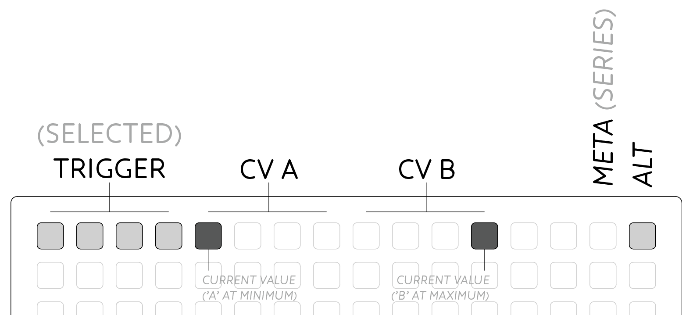

The top row of the grid shows the current edit mode that is selected. *Trigger mode* (the default) is accessed by pressing anywhere in the leftmost group of four keys, and is displayed with a low brightness backlight behind these keys.

When triggers occur, they are displayed on the first four leds with bright led flashes.

To access the *CV A* and *CV B* modes, press in the 2nd and 3rd group of 4 keys at top. Now the bottom four rows display the CV value per step as a bar rising from the bottom of the grid. To change a step's value, hold the bottom row and set the CV value with the *param* knob.

The current *CV* output values are displayed in the top row as a bright led in each CV's 4-key selection region. Higher CV values move the led to the right.

Two modal keys are also provided for advanced functions:

- *Alt* is the top-right key on the grid.
- *Meta* is to the left of *alt*.

## Position & Clock

By default the sequencer will play through all 16 steps from left to right, then loop back to the start at the rate set by the *clock* knob.

The current playback position is indicated in the second row with a bright led. Press any key in this row to cut to the given position on the next clock pulse.

Loop length can also be set from the second row. Press and hold your start position, then press the new loop end position. The loop range will be illuminated with a range of dim leds. Hold *meta* while selecting a loop to prevent cutting during selection.

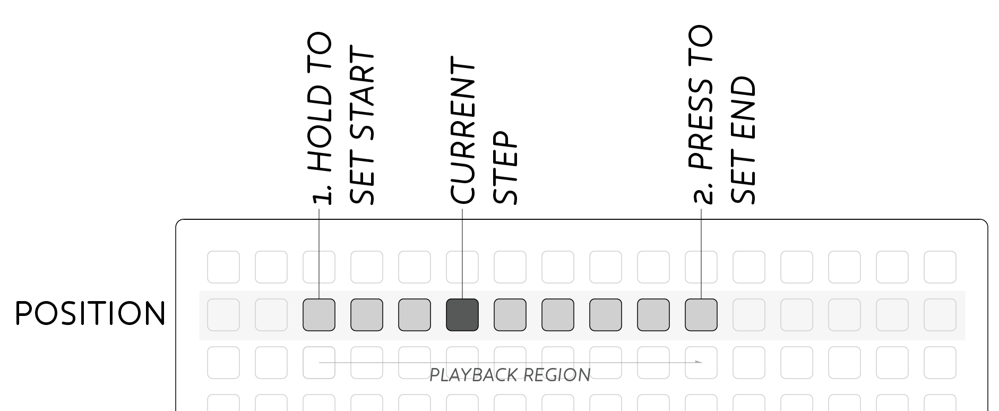

The overall rate for White Whale is controlled by the *Clock* section at the bottom of the module's panel. By default an internal clock is generated which drives the sequencer at a rate set by the *clock* knob. Rate can be very slow for slow chord changes, up to very fast for arpeggio like note flurries.

Attach a signal to clock *in* to disable the internal clock and follow the signal attached. This input could be a clock from another sequencer or LFO for a regular output. Non-regular input signals can also be used to manually move through steps, or create irregular rhythmic patterns, eg. being triggered by [Meadowphysics](/docs/meadowphysics). The pulsewidth of the clock *in* sets the trigger time for individual *trigger* outs. The sequencer can be stopped altogether by inserting an unconnected patch cable to clock *in*.

The clock *out* jack sends a gate signal out according to the current *clock* following the internal or external clock as appropriate. This output is ideal for linking multiple sequencers, or for a regular rhythmic pulse in your system.

## CV Curves

The default CV mode is called *Curves* and is designed around entering step values with the *param* knob as described above:

- Hold the *input* key (bottom row in the given step), and set the CV value with the *param* knob.

Input values are quantized to the nearest semitone for easier melodic tuning. If you wish to bypass the quantizer, hold the *center* key (Row 6) two keys above the *input key* before turning the *param* knob.

CV values can be fine tuned and harmonically shifted **per step** with key presses:

- Tune by **semitones**: Row 5 = up, Row 7 = down.
- Hold Row 6 (center) while pressing up/down for **fine-tuning**.
- Hold *alt* while pressing up/down for **octave** shifts.

CV values can be **copied** between steps:

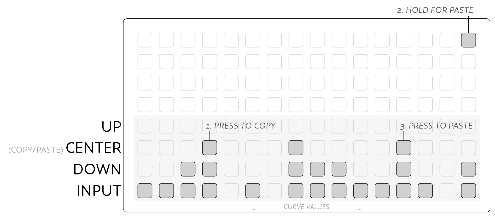

- Press the *center* key (Row 6) to copy that step's value.
- Hold *alt* and push the paste location's *center* key.

Values can also be **randomized** per step:

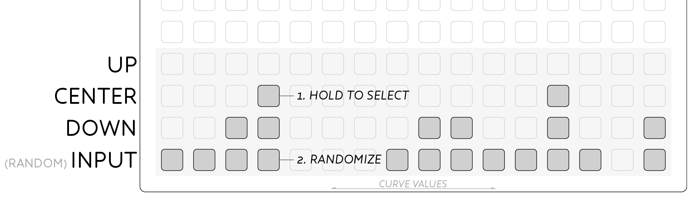

- Hold the step's *center* key.
- Press the bottom row (Row 8) to assign a random value to that step.
- The maximum random value is set by the *param* knob, for a restricted range.
- Random values are always semi-tone quantized.

### Channel Transpose

In addition to the above *per step* modifications all of the transpose and randomize functions can be applied to the entire CV Curve, using the *meta* key.

- Hold *meta* while adjusting transpose to shift all 16 steps.

The entire CV Curve can be randomized to spur your creativity:

- Hold *meta* key.
- Hold any *center* key (Row 6).
- Press any bottom row key (Row 8).

As above, the range of the randomization is set by the *param* knob. The *param* knob defines the maximum value of the randomizer. Set *param* to a small value to create subtly shifting sequences. Random values are always semi-tone quantized.

## Step Mutes

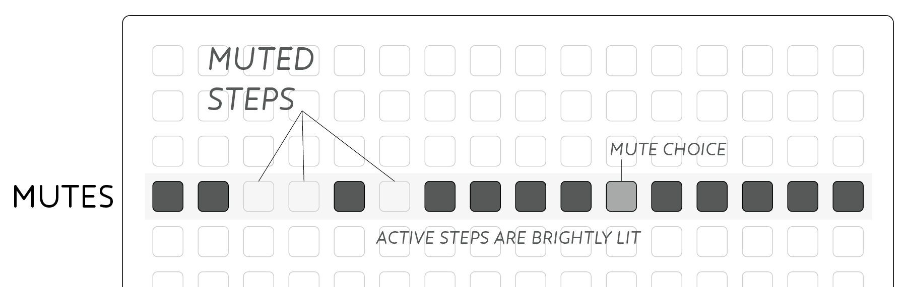

Row four display per-step mutes. *Triggers* and both *CV* channels have independent mutes. *Trigger* mutes affect all four trigger outputs, and can be used to selectively mute certain rhythmic elements in a patch. When muted, a step will not send a trigger out.

*CV* mutes cause the output value not to change when a muted step is reached, instead the previously held voltage is maintained. This CV mute behaviour is particularly useful when sustaining notes in a sequence, rather than having to copy the same CV value to subsequent steps.

### Mute Choice

In addition to *muting* steps, it is possible to add a chance probability or *choice* to a given step. Setting a *choice* defines the likelihood that an event will occur. Where *step mutes* above set either a 100% (active) or 0% (muted) chance of an event, *choice* allows events to occur *sometimes*. The function is available for both *triggers* and *CV* outputs.

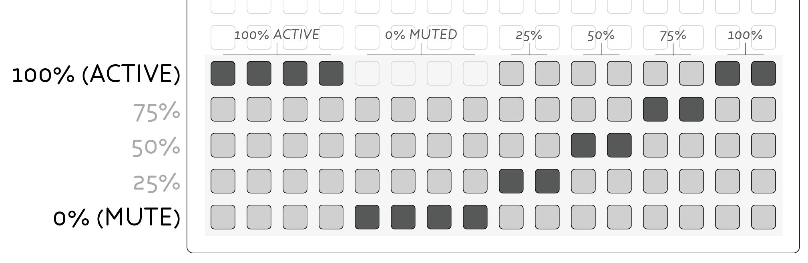

Enter *mute choice* mode by holding the *Alt* key, and pressing any key in *mute* row. The bottom five rows now display the *choice* level for each step in the given mode (eg. *Trigger* mode will still light the four top-left keys for trigger choice).

Choice is set from the bottom row (0%, muted) upward through 25%, 50%, 75% and 100% (active). The *mute* row displays the state of each mute as normal, with a dimly lit led displaying a *choice* is being applied.

Exit *mute choice* mode by changing to a different mode from the top-row of the grid.

### Channel Mutes

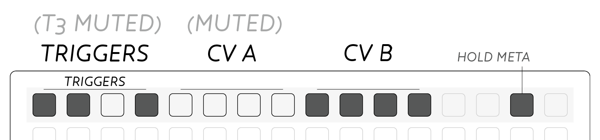

Mutes can also be applied to individual trigger & cv channels:

- Hold *meta* and the top-row now displays bright leds indicating active channels.
- Press the first four keys to mute individual triggers.
- Press the CV groups to mute each CV channel.
- Press triggers or CV groups again to unmute.

## Pattern

Row three indicates the current *pattern*. Sixteen patterns are available, which store trigger, CV, mute and loop data. Any changes made to these parameters are stored in the current *pattern*.

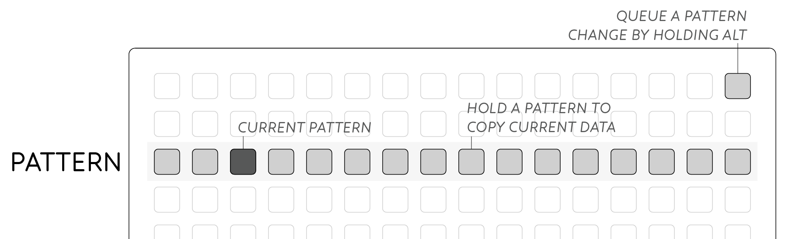

To change pattern press a key in row three. To copy the current data to another pattern, hold the location where you wish to paste the pattern.

### Queued Pattern Change

When pressing a pattern in row three as above, playback will immediately change to the new pattern. The playhead will continue at the same position even if it's out of range of the new pattern until it loops around.

Alternatively, pattern changes can be queued, waiting until the end of the current pattern before switching.

- Hold *alt* and press the queued pattern.

When switching to the queued pattern, playback jumps immediately to the loop-start of the new pattern, rather than playing from step 1.

## Preset

Entire collections of sixteen patterns can be saved to internal flash. On power-up the most recently saved set will be recalled and will play instantly.

To access the memory system, push the key next to the USB port on the module's panel. The display on the grid will change to display the *Preset* system. Either storage locations are accessed from the left most column. The current Preset is indicated with a bright led.

- Press a key in the left column to select a *Preset*.
- Press again to **load** the selected Preset.
- Hold a key to **save** the current state to the given Preset.
- Press the panel key again to escape Preset mode (ie *cancel*).

To quick-save the current memory slot, push and hold the panel key. The grid will display the *Preset* system, then return to the current pattern after quick-save is complete. This is handy to quickly save your work before powering down the synthesizer.

Each *Preset* has an associated *glyph* available on the right 8x8 quadrant. Press keys here to draw a visual cue to associate with your *Preset*. It is saved with the current data when holding a preset slot.

It is possible to backup all your presets as part of the module's firmware; see [modular firmware updates](/docs/modular/update/).

## Live Input

Triggers & CV data can be captured in realtime.

For *triggers*:

- Hold the *alt* key.
- Perform your rhythm on the bottom four rows.

Each row represents the corresponding trigger, and any key in the row will enter a trigger at the current playback position.

CV *Curves* can be entered in real-time via the *param* knob for both CV A or B.

- Hold the *alt* key.
- Hold the bottom-right key.
- Perform your *curve* with the *param* knob.
- Release the bottom-right key, to stop recording.

Note again that input values are quantized to the nearest semitone. If you wish to bypass the quantizer, hold the *center* key above the bottom-right key while recording CV data.

## Series Mode

Series mode allows the 16 *patterns* to be played back in any order. Sequences longer than 16 steps can be created, or compositional structures realized with this method.

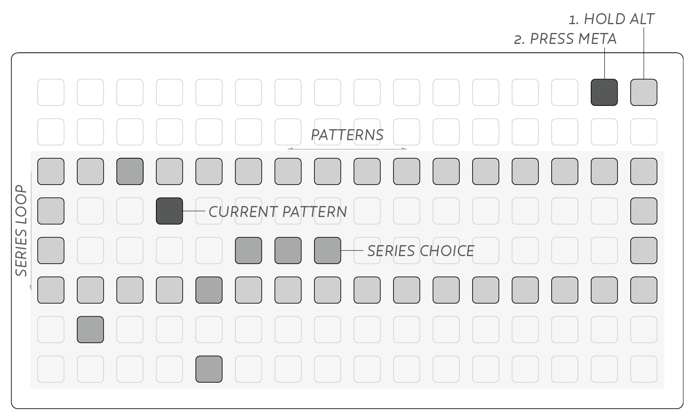

To enter *Series Mode*, hold *alt* and push *meta*. The *meta* key will brightly light to indicate the mode. Escape *series* mode by choosing another mode from the top-row (this will return to the currently playing back pattern).

The lower six rows represent the *series* sequence, where playback progresses from top to bottom. Each column represents the corresponding *pattern*, 1-16 from left to right.

A dim-lit box is drawn around the sequence from start-to-end (inclusive), defaulting to 4 patterns long. The series can be set up to 64 patterns long.

- **Scroll** the view by holding *meta* and turning the *param* knob.
- Hold *alt* and press rightmost column to set sequence **end**.
- Hold *alt* and press next-to-rightmost column to set sequence **start**.
- Hold *alt* and press leftmost column to **cut** to this sequence position.

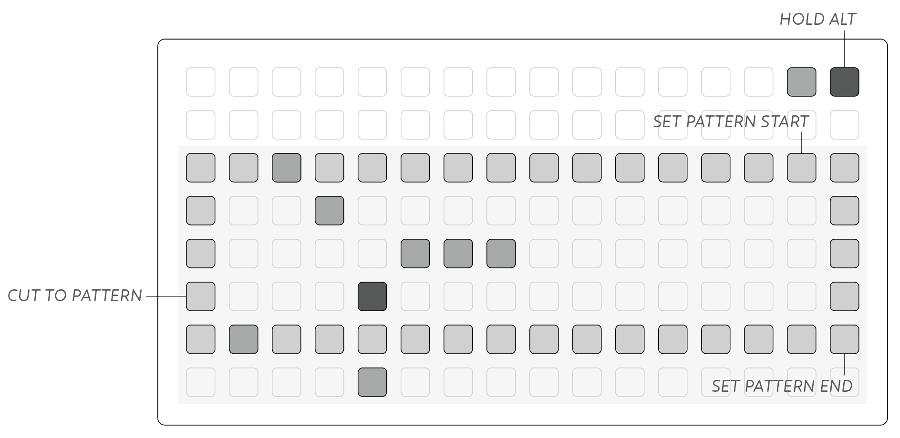

A faint diagonal line is drawn across series mode from top-left to bottom-right. This provides a visual cue to the current view position within the 64 series stages.

Note that *cutting* to a stage outside of the series range will jump to that position and play through all remaining sequences until it returns to the loop brace. This allows 'pickup' patterns or longer phrases before entering a repeating progression.

### Series Choice

Multiple options can be set per series stage to add uncertainty to the sequence. One of the selected options will be chosen at random. This can create quite wild and unruly series when the pattern choices have differing step lengths!

- Hold the first pattern choice.
- Press a second pattern choice.
- Now you can toggle additional choices on/off.
- Deactivate choice by toggling off all but one option.

## Trigger Choice
All discussion of *Triggers* so far refers to each trigger output independent of one another. *Trigger choice* on the other hand allows the different rows of triggers to interact. When enabled at a given step, only one of the selected triggers will be executed.

- Hold *meta* and touch a trigger step.
- When *choice* is active, current steps are shown with a dim led.
- As the playhead reaches the step, notice how only one of the steps lights & triggers.

## Step Modes

Default sequencer behaviour advances the playhead from left to right across the grid, then wraps back to the left edge (or within a set loop brace). This playback behaviour can be modified for resequencing any given Pattern.

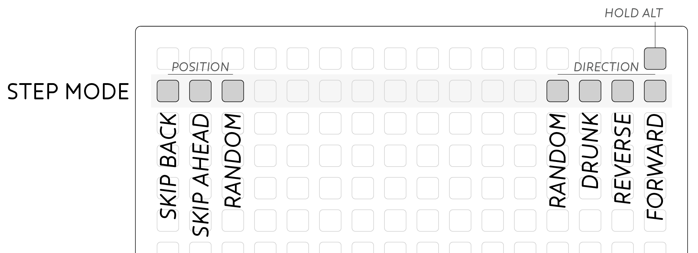

### Direction
While holding *alt* press keys in the *Position* row to choose a new playback style. From the **right** edge:

- Forward: Normal playback behaviour.
- Reverse: Playback from right to left.
- Drunk: Randomly move one step left or right, or stay still.
- Random: Jump to any position in the current loop.

### Position

Instantaneous position jumps can also be performed without changing the playback direction. Here the playback position will be changed only once, useful for nudging a sequence into time, or desynchronizing for polyrhythmic effects. From the **left** edge:

- Skip back: Feels like a 'repeat' in Forward mode.
- Skip ahead: Jumps over the next step to push the sequence forward.
- Random: Jumps to a random point in the sequence.

## Gate Mode

The *Trigger* outputs are also able to output gates for long sustained pulses rather than short triggers.

- Hold *alt*.
- Press the *trigger mode* section of the top-row (left-most 4 keys).
- Gate output is indicated with mid-level brightness leds in the top-row.
- Repeat to turn off *gate* mode.

The only indication of this mode on the grid is a subtle dimming of the triggers in the top-row, so you may need to inspect the module's panel to confirm your mode.

## CV Map

While CV *Curves* are able to sequence any given output, you can also create sequences from a scale map. CV *Map* mode uses a "scale" of 16 values. There are 24 preset scales, plus you can modify these or create arbitrary values. Either one, or both of the CV channels can use *Map* mode, and if both active, they will share the same scale map.

- Press the CV channel region in the top-row.
- Hold *alt*.
- Press the CV channel region again.

The display will update showing the *Map* mode for that CV channel.

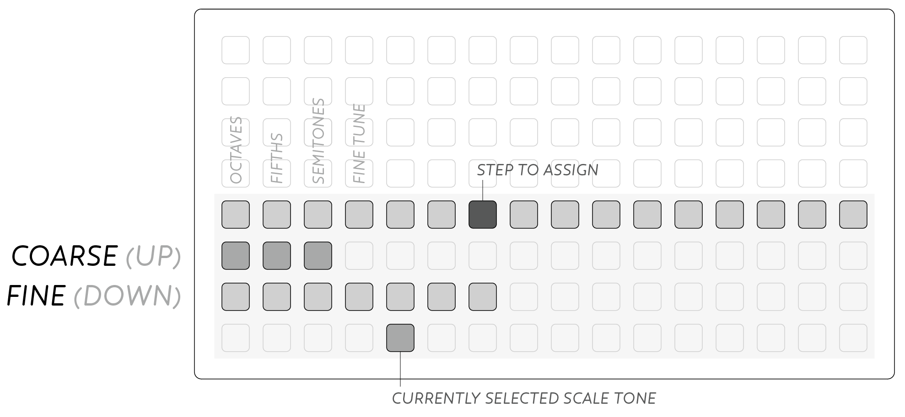

- Select a **step** in Row 5.
- Assign a *scale tone* in Row 8.

The value of a selection is displayed on Rows 6 (coarse) & 7 (fine).

### Modifying Scale Maps

All 16 *scale tones* can be modified to customize your own *map*.

- Select the *scale tone* you wish to edit (Bottom Row).
- Hold *alt*
- Hold the bottom-right key.
- Set the value with the *param* knob.

The leftmost keys on Rows 6 & 7 can adjust the current value up and down. From the left, by octaves, 5ths, semitones, and fine control.

### Tone Choice

Multiple tones can be entered by step causing the sequencer to choose one of your selected options at random:

- Hold your first choice.
- Press a second choice.
- Add more options with a simple press.
- To return to normal mode, deselect all but one option.

### Map Scales

Preset *Maps* can be recalled, overwriting the current map:

- Hold *alt*
- Press the bottom-left key.
- A dimlit box will appear in the lower-left section.
- Select one of the dim keys to load the given preset.
- Press the bottom-left key again to cancel.

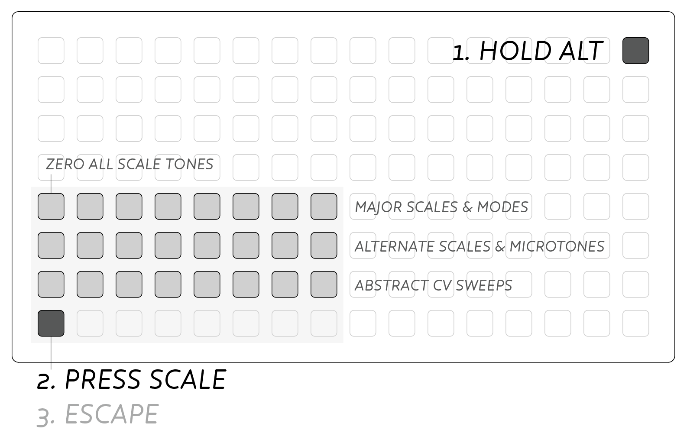

The three rows of scale options are grouped into functional rows, allowing quick access to useful note arrangements. The upper row represents the major scale and its modes. Each scale has the intervalic structure shown, demonstrating semitonal steps in each scale:

- ZERO
- Ionian [2, 2, 1, 2, 2, 2, 1]
- Dorian [2, 1, 2, 2, 2, 1, 2]
- Phrygian [1, 2, 2, 2, 1, 2, 2]
- Lydian [2, 2, 2, 1, 2, 2, 1]
- Mixolydian [2, 2, 1, 2, 2, 1, 2]
- Aeolian [2, 1, 2, 2, 1, 2, 2]
- Locrian [1, 2, 2, 1, 2, 2, 2]

The second row holds alternative scales for more abstract melodies, and exploring alternative tuning systems including microtones & just intonation:

- Chromatic
- Whole
- Fourths
- Fifths
- Quarter (two microtones per semitone)
- Eighth (four microtones per semitone)
- [Just](https://en.wikipedia.org/wiki/Just_intonation)
- [Pythagorean](https://en.wikipedia.org/wiki/Pythagorean_tuning)

The bottom row is intended for use with standard CV inputs rather than tuned oscillators like the above. The voltage reference is the highest voltage level output in that scale mode, with 16 divisions of that range:

- equal 10v
- equal 5v
- equal 2.5v
- equal 1.25v
- log 10v
- log 5v
- exp 10v
- exp 5v

## Video Tutorials

<iframe src="https://player.vimeo.com/video/105368808?color=ff7700&title=0&byline=0&portrait=0" style="position:absolute;top:0;left:0;width:100%;height:100%;" frameborder="0" allow="autoplay; fullscreen" allowfullscreen></iframe>

<iframe src="https://player.vimeo.com/video/105368874?color=ff7700&title=0&byline=0&portrait=0" style="position:absolute;top:0;left:0;width:100%;height:100%;" frameborder="0" allow="autoplay; fullscreen" allowfullscreen></iframe>

<iframe src="https://player.vimeo.com/video/105408057?color=ff7700&title=0&byline=0&portrait=0" style="position:absolute;top:0;left:0;width:100%;height:100%;" frameborder="0" allow="autoplay; fullscreen" allowfullscreen></iframe>

<iframe src="https://player.vimeo.com/video/105408747?color=ff7700&title=0&byline=0&portrait=0" style="position:absolute;top:0;left:0;width:100%;height:100%;" frameborder="0" allow="autoplay; fullscreen" allowfullscreen></iframe>

